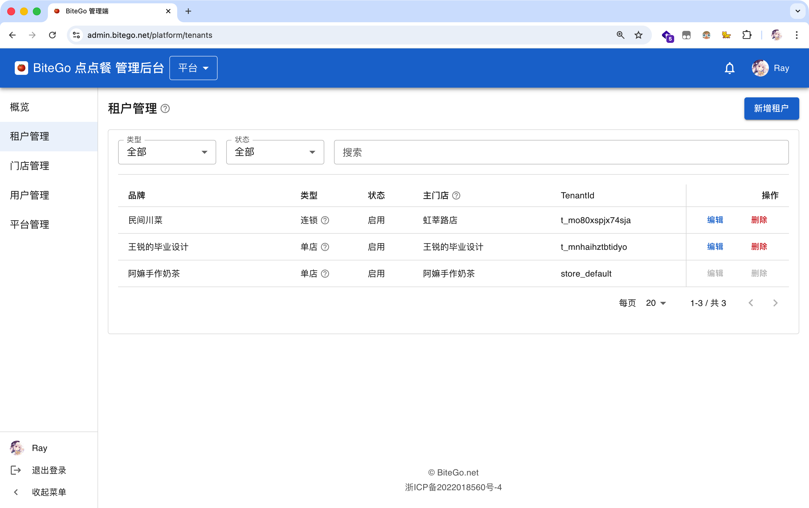

<h1 align="center">BiteGo · 点点餐</h1>

<p align="center">
  面向中小餐饮商户的<strong>堂食扫码自助点餐系统</strong> · 上海大学 2026 届毕业设计
</p>

<p align="center">
  🌐 <a href="https://bitego.net"><strong>bitego.net</strong></a> · 项目总览、四大创新点、实机截图、技术架构、18 篇文档站内直读
</p>

<p align="center">
  <a href="#-亮点速览">亮点速览</a> ·
  <a href="#-界面一览">界面一览</a> ·
  <a href="#-系统架构">系统架构</a> ·
  <a href="#-快速开始">快速开始</a> ·
  <a href="#-子项目">子项目</a> ·
  <a href="#-文档导引">文档导引</a>
</p>

<p align="center">
  
  
  
  
  
  
  
</p>

> BiteGo 在一套部署、一套数据库之上同时承载平台、租户、门店三级运营，前后端分离地交付**微信小程序 / H5 顾客端** 与 **Web 管理后台**：顾客扫码即可入桌、同桌多人协同点单、订单与上菜进度实时同步；商户在后台一屏掌握桌台状态、订单与菜品配置；平台运营则可跨租户做数据搬家与维护态切换。

> **本仓库为代码快照**，仅含源代码、技术文档与 CI/CD 配置。直接 clone 即可本地启动（见下方「快速开始」）；GitHub Actions 工作流需在 Settings → Secrets 配置部署密钥后才能跑通。

---

## ✨ 亮点速览

- **多人协同点餐**：基于 WebSocket 的桌台共享购物车，配合 `cart.version` 乐观并发与 `opId` 幂等键，弱网与同桌并发写入不会重复扣减或丢失变更。
- **三层规格 — 价格 — 库存模型**：库存规格组笛卡尔积自动生成 SKU，非库存规格通过 `priceItemKey` 在购物车与订单中独立计费、合并同款，支持电商类目的复杂规格。
- **三层并发兜底的下单事务**：「请求级幂等中间件 → 桌台级 Redis 分布式锁 → SKU 行级悲观写锁」三段式串联，跨桌、跨店并发也不会超卖。
- **平台 / 租户 / 门店三层多租户模型**：以 `AdminScope` 多对多授权 + 角色 rank 比较 + `canManageSharedCatalog` 计算位实现「角色层级 + 共享菜单写权限」语义；连锁租户共享菜单、分店独立维护库存。
- **数据搬家三层一体**：平台级「完全还原」与租户/门店级「克隆式恢复」共用同一套 `applyStoreConfigClone`，迁移期间通过分层维护态广播暂停写入，保证数据一致性。
- **分层缓存与梯度实时性**：浏览器 → CDN → 进程内存 → Redis → WebSocket 五层缓存逐级铺开，`Cache-Control` / `ETag` / Pub/Sub 分别覆盖不同陈旧容忍度的资源。
- **后端集成测试为主的质量门禁**：Node 原生 `node --test` + 真实 MySQL/Redis 起 HTTP+WS Server，189 个用例全过、行/语句覆盖率 90.66%，CI 同步把 Web/小程序的 Vitest 与 Playwright 套件串起来。
- **完整 CI/CD**：GitHub Actions 并行构建 → Docker 镜像推 TCR → SSH 远程拉镜像重启 + 前端产物推 COS + CDN 刷新，三端一次主干合并即上线。

## 📸 界面一览

### 小程序端 / H5 顾客端

> 下列每张图均为左前右后两屏拼接，便于在一图之内呈现一段交互。

<table>
  <tr>
    <td align="center" width="33%">
      
      <sub>首页 + 跨桌台历史订单</sub>
    </td>
    <td align="center" width="33%">
      
      <sub>入桌二次确认 + 点餐主页</sub>
    </td>
    <td align="center" width="33%">
      
      <sub>菜品详情 + 规格选择</sub>
    </td>
  </tr>
  <tr>
    <td align="center" width="33%">
      
      <sub>桌台协同购物车 + 提单确认</sub>
    </td>
    <td align="center" width="33%">
      
      <sub>本桌订单 + 订单详情</sub>
    </td>
    <td align="center" width="33%">&nbsp;</td>
  </tr>
</table>

### Web 管理端：平台 / 租户 / 门店三视角

<table>
  <tr>
    <td align="center" width="50%">
      
      <sub><b>平台概览</b> · 全平台门店实时运营卡片</sub>
    </td>
    <td align="center" width="50%">
      
      <sub><b>门店概览</b> · 桌台总览 + 活跃订单 + 全量订单</sub>
    </td>
  </tr>
  <tr>
    <td align="center" width="50%">
      
      <sub><b>菜品管理</b> · 列表 + SKU 行展开</sub>
    </td>
    <td align="center" width="50%">
      
      <sub><b>编辑菜品</b> · 基础信息 + Markdown 详情双栏</sub>
    </td>
  </tr>
  <tr>
    <td align="center" width="50%">
      
      <sub><b>桌台管理</b> · 小程序码 + H5 二维码 + 强制清台</sub>
    </td>
    <td align="center" width="50%">
      
      <sub><b>租户管理</b> · 单店 / 连锁两类租户</sub>
    </td>
  </tr>
</table>

## 🏛 系统架构

<p align="center">
  
</p>

四层逻辑架构：

| 层 | 组成 | 主要职责 |
| --- | --- | --- |
| 客户端层 | 微信小程序 / H5 + Web 管理端 | Taro 4 + React 双端编译；MUI + Vite 后台 |
| 接口层 | Express REST + 两路 WebSocket | 公共中间件链统一收口鉴权、幂等、维护态、价格转换 |
| 业务逻辑层 | 目录 / 订单 / 桌台 / 同步 / 维护 / 微信 / 搬家 | 以「能力」聚合，通过 TypeORM 事务 + Redis 总线解耦 |
| 数据持久层 | MySQL 8 + Redis 6.2 + COS | MySQL 是业务真相源；Redis 仅承载可重建状态；COS 承载图片与导出快照 |

四条信任边界：客户端 ↔ CDN（不可信输入）→ CDN ↔ 服务端（基础设施）→ 服务端 ↔ 数据库（数据信任）→ HTTP 处理 ↔ 异步 Worker（进程隔离）。客户端声明的 `X-Tenant-Id` / `X-Store-Id` / `X-Board` 仅作为「意图」，真正授权依赖服务端实时核对的 `AdminScope` 记录。

部署拓扑见 [`figures/deploy-topology.png`](figures/deploy-topology.png)，CI/CD 流水线见 [`figures/cicd-pipeline.png`](figures/cicd-pipeline.png)。

## 🧰 技术栈

| 子项目 | 语言 / 框架 | 关键依赖 |
| --- | --- | --- |
| `projects/backend` | Node.js 20 + TypeScript 5 + Express 4 | TypeORM + MySQL 8 + Redis 6.2 + `ws` + `jsonwebtoken` |
| `projects/web-admin` | React 18 + TypeScript 5 + Vite 5 | Material UI + React Router 6 + TanStack Query + Zustand + Axios |
| `projects/miniprogram` | Taro 4 + React 18 + TypeScript 5 | Sass + Zustand + Vitest + Playwright（H5 端到端） |
| 测试 | `node --test` + `c8` · Vitest · Playwright | 后端 189 用例 / Web 40 / 小程序 21；行覆盖率 90.66% |
| 部署 | Docker Compose · GitHub Actions · 腾讯云 Lighthouse + COS + CDN + TCR | 单机镜像化部署 + 静态资源 CDN |

## 🚀 快速开始

### 前置条件

- macOS / Linux，Node.js v20.18.2（推荐 fnm/asdf）
- Yarn 4（Corepack 管理，首次执行 `corepack enable`）
- Docker（含 Docker Compose v2 插件）
- 微信开发者工具（仅在调试小程序端时需要）

### 1. 克隆仓库

```bash
git clone https://github.com/BH4HPA/bitego-codes.git
cd bitego-codes
```

### 2. 准备环境变量

`docker compose` 会从仓库根目录的 `.env` 加载后端配置，仓库内不会提交真实 `.env`。第一次运行先复制模板：

```bash
cp .env.template .env
```

模板里 `WEBADMIN_DOMAIN`、`H5APP_DOMAIN` 已经填好本地 Vite / Taro H5 默认端口，开箱即可通过后端 CORS 白名单；机密项（腾讯云密钥、微信小程序密钥、容器仓库密码）按注释自行填入，仅做本地开发的可以留空。

### 3. 一键起后端 + MySQL + Redis

```bash
docker compose up -d
# 健康检查
curl http://localhost:3000/health
```

> Docker Compose 默认开启 `TYPEORM_SYNC=true`，由实体定义即时同步表结构，无需手动跑迁移。

### 4. 取一枚 ADMIN 开发令牌

```bash
curl -X POST http://localhost:3000/api/v1/auth/dev-token \
  -H "Content-Type: application/json" \
  -d '{"role":"ADMIN"}'
```

### 5. 启动 Web 管理端

```bash
cd projects/web-admin
yarn install
VITE_API_BASE_URL=http://127.0.0.1:3000/api/v1 yarn dev
# → http://127.0.0.1:5173/
```

### 6. 启动小程序端

```bash
cd projects/miniprogram
yarn install
yarn dev:weapp   # 微信小程序：编译后用微信开发者工具打开本目录
yarn dev:h5      # 浏览器 H5：默认 http://127.0.0.1:10086/
```

### 常用维护命令

```bash
# 重置数据库 + 重建后端镜像
docker compose down -v --remove-orphans && docker compose build backend && docker compose up -d

# 仅重建后端
docker compose down backend && docker compose build backend && docker compose up backend
```

更多命令、环境变量与故障排查详见各子项目 `README.md`。

## 🧭 子项目

| 路径 | 说明 | README |
| --- | --- | --- |
| [`projects/backend`](projects/backend) | Node.js + Express + TypeORM 服务端，提供 REST API、两路 WebSocket、退款 / 同步 Worker | [→](projects/backend/README.md) |
| [`projects/web-admin`](projects/web-admin) | React + MUI + Vite 后台管理端，平台 / 租户 / 门店三视角动态切换 | [→](projects/web-admin/README.md) |
| [`projects/miniprogram`](projects/miniprogram) | Taro 4 顾客端，一套代码同出微信小程序与 H5 | [→](projects/miniprogram/README.md) |

## 📂 仓库结构

```
bitego-codes/
├── projects/                       # 业务代码 + 入口站点
│   ├── backend/                    # Node.js 服务端
│   ├── web-admin/                  # 管理后台 SPA
│   └── miniprogram/                # Taro 顾客端
├── docs/                           # 设计与实现文档
│   ├── 1-毕业设计任务书.md / 2-开题报告.md / 9-中期报告.md
│   ├── 3.x – 6                     # PRD / 服务端 / 前端 / 接口规范
│   ├── 7.x-核心实现-*.md           # 核心模块技术细节
│   └── 8-CI-CD与容器镜像发布.md
├── figures/                        # README 引用的架构图与实机截图
├── ci/                             # CI/CD 脚本（COS 上传 / SSH 部署 / 镜像发布）
├── docker-compose.yml              # 本地开发一键编排
├── .env.template                   # 环境变量模板，本地用 `cp .env.template .env`
└── .github/workflows/              # GitHub Actions：后端 / Web / 小程序 / Landing
```

## 📚 文档导引

> 想要在网页里阅读所有文档（含 mermaid 渲染、TOC、上一篇/下一篇导航），直接访问 [bitego.net/docs](https://bitego.net/docs)。下表保留 GitHub 内的原始路径，方便 PR / blame 视角查看。

| 主题 | 入口 |
| --- | --- |
| 项目全景 / 任务书 / 开题报告 | [`docs/1-毕业设计任务书.md`](docs/1-毕业设计任务书.md) · [`docs/2-开题报告.md`](docs/2-开题报告.md) |
| Web 管理端 PRD | [`docs/3.1-Web管理端产品需求文档.md`](docs/3.1-Web管理端产品需求文档.md) |
| 小程序端 PRD | [`docs/3.2-小程序端产品需求文档.md`](docs/3.2-小程序端产品需求文档.md) |
| 服务端技术文档 | [`docs/4-服务端技术文档.md`](docs/4-服务端技术文档.md) |
| Web 管理端前端技术文档 | [`docs/5.1-Web管理端前端技术文档.md`](docs/5.1-Web管理端前端技术文档.md) |
| 小程序端前端技术文档 | [`docs/5.2-小程序端前端技术文档.md`](docs/5.2-小程序端前端技术文档.md) |
| 接口与数据库设计规范 | [`docs/6-接口与数据库设计规范.md`](docs/6-接口与数据库设计规范.md) |
| 核心实现：桌台协同会话 | [`docs/7.1-核心实现-桌台协同会话.md`](docs/7.1-核心实现-桌台协同会话.md) |
| 核心实现：规格、价格和库存模型 | [`docs/7.2-核心实现-规格、价格和库存模型.md`](docs/7.2-核心实现-规格、价格和库存模型.md) |
| 核心实现：小程序端路由管理 | [`docs/7.3-核心实现-小程序端路由管理.md`](docs/7.3-核心实现-小程序端路由管理.md) |
| 核心实现：分类渲染与电梯锚定 | [`docs/7.4-核心实现-小程序端点餐页分类渲染.md`](docs/7.4-核心实现-小程序端点餐页分类渲染.md) |
| 核心实现：鉴权与安全 | [`docs/7.5-核心实现-鉴权与安全.md`](docs/7.5-核心实现-鉴权与安全.md) |
| 核心实现：平台多租户 | [`docs/7.6-核心实现-平台多租户.md`](docs/7.6-核心实现-平台多租户.md) |
| 核心实现：数据导出与恢复 | [`docs/7.7-核心实现-数据导出与恢复.md`](docs/7.7-核心实现-数据导出与恢复.md) |
| 核心实现：缓存策略与实时性 | [`docs/7.8-核心实现-缓存策略与实时性.md`](docs/7.8-核心实现-缓存策略与实时性.md) |
| CI/CD 与容器镜像发布 | [`docs/8-CI-CD与容器镜像发布.md`](docs/8-CI-CD与容器镜像发布.md) |

## 🤝 致谢

- 上海大学计算机工程与科学学院 · 指导教师 许东
- 论文使用 [`shuosc-shu-bachelor-thesis`](https://github.com/shuosc/SHU-Bachelor-Thesis-Typst) Typst 模板

## 📄 版权

本仓库为毕业设计项目，业务代码默认采用 MIT 许可；论文与图表中包含的引用文献版权归原作者所有。
