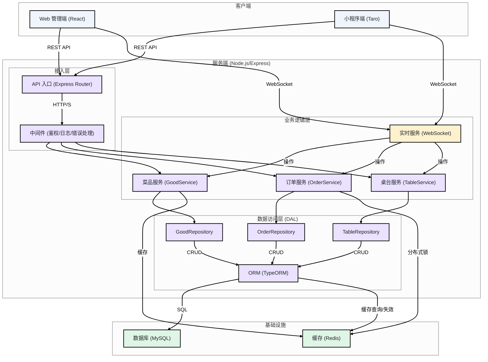
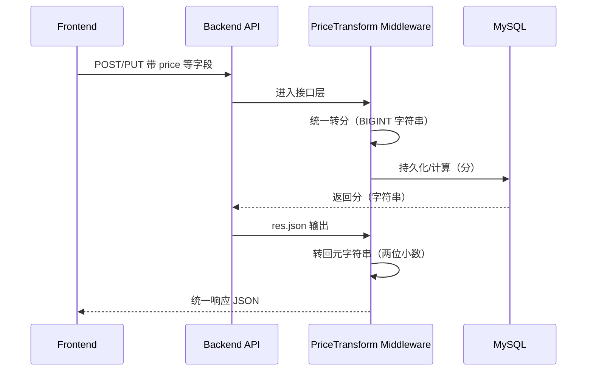
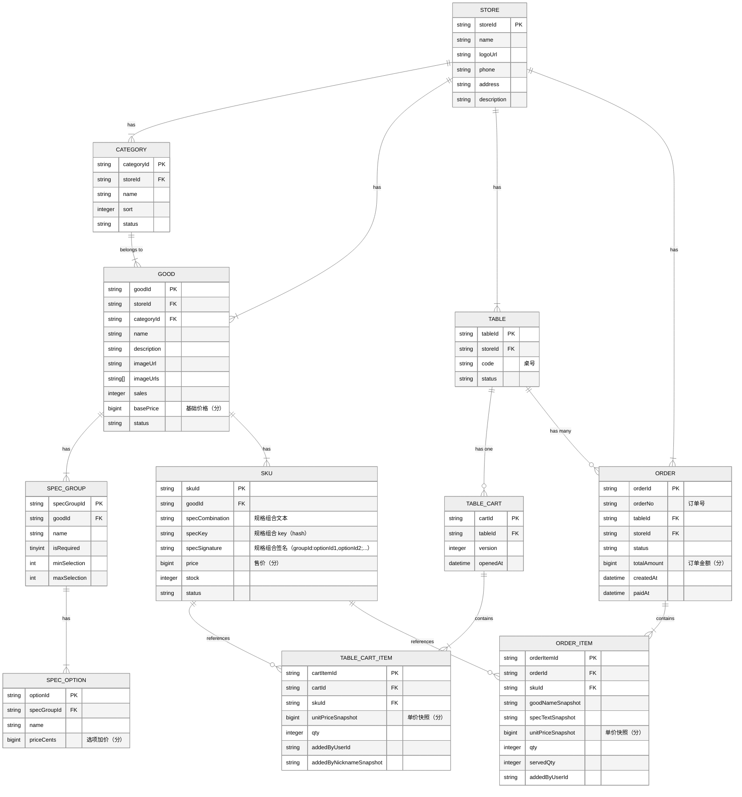

# BiteGo 点点餐：服务端技术文档

版本：当前实现
作者：王锐 (wangrui.1696)
最后更新：2026-03-25

---

## 1. 范围与目标

本文档旨在为 BiteGo 点点餐项目的服务端提供全面的技术设计与实现规范。其核心目标是确保后端服务的**可实施性、可维护性与可扩展性**，并为前后端协同开发、测试及未来迭代提供统一的技术蓝图。

本文档覆盖了从系统架构、API 接口、数据库设计到安全、性能、部署等全方位的技术方案，确保与产品需求文档（PRD）中定义的功能、流程和数据模型保持严格一致。

### 1.1 参考资料

- [《Web 管理端产品需求文档》](3.1-Web管理端产品需求文档.md)
- [《小程序端产品需求文档》](3.2-小程序端产品需求文档.md)
- [《接口与数据库设计规范》](6-接口与数据库设计规范.md)

## 2. 统一术语表

为确保三端（服务端、Web 管理端、小程序端）沟通与实现的一致性，特定义以下核心术语：

| 术语 (中文)      | 术语 (英文)                 | 定义                                                                                    |
| :--------------- | :-------------------------- | :-------------------------------------------------------------------------------------- |
| 菜品             | Good                        | 顾客可见的“菜”或“饮品”，如“奶茶”。包含描述、图片、分类等信息。                          |
| 规格组           | SpecGroup                   | 菜品的可选项集合，如“杯型”、“甜度”；分为“库存规格组/非库存规格组”。                     |
| 共享非库存规格组 | SharedSpecGroup             | 可被多个菜品复用的“非库存规格组”，由共享规格管理接口维护，通过关联表与菜品绑定。        |
| 共享规格组描述   | SharedSpecGroup.description | 仅用于管理端选择共享规格组时提示，不透出至小程序端。                                    |
| 规格值           | SpecOption                  | 规格组内的具体选项，如“大杯”、“不加糖”。                                                |
| 商品 / SKU       | SKU                         | Stock Keeping Unit，仅由“库存规格组”组合生成的可售单元，是库存与状态的管理核心。        |
| 价格项 / PI      | Price Item                  | 订单/购物车中的最终计价单元，关联 SKU + 非库存规格选择 + 营销优惠等，用于记录最终单价。 |
| 桌台             | Table                       | 堂食场景下的点餐上下文实体，具有唯一编号和状态。                                        |
| 桌台购物车       | TableCart                   | 与桌台绑定的、支持多人协同编辑的共享购物车草稿。                                        |
| 上菜             | Serving                     | 将订单明细标记为“已提供给顾客”的过程，通过 `servedQty` 字段体现。                       |
| 清台             | Clear Table                 | 将桌台重置为空闲状态，并清理关联的购物车等会话数据的操作。                              |

## 3. 系统架构设计

BiteGo 服务端采用基于 Node.js 的单体应用架构，技术栈以 **TypeScript、Express.js、TypeORM** 为核心。通过分层组织（路由/中间件/服务/数据访问）保证代码可维护性，并通过 WebSocket 支撑关键实时能力。

### 3.1 整体架构图



### 3.2 架构解读

1.  **接入层 (Access Layer)**:
    - **API 入口**: 使用 `Express.js` 的路由系统 (`express.Router`) 定义所有 RESTful API 端点，负责请求的统一分发。
    - **中间件 (Middleware)**: 在请求到达具体业务逻辑前，执行一系列通用处理，包括：
      - **认证与鉴权**: 校验 JWT，解析用户信息，并进行初步的角色权限判断。
      - **请求日志**: 记录请求的入口、参数、耗时等信息，便于追踪与排障。
      - **请求体解析**: 解析 `JSON` 或 `form-data` 格式的请求体。
      - **全局错误处理**: 捕获业务逻辑中抛出的异常，并将其格式化为标准的错误响应返回给客户端。
      - **跨域处理 (CORS)**: 使用 `cors` 中间件并开启 `credentials: true`，以回显请求 `Origin` 替代通配符 `*`——Taro H5 的 `uploadFile` / `downloadFile` 默认 `withCredentials: true`，浏览器会拒绝 `Access-Control-Allow-Origin: *` 与凭证同时出现的响应。`NODE_ENV=production` 时仅回显 `.env` 中 `H5APP_DOMAIN` 与 `WEBADMIN_DOMAIN` 两个浏览器域名（对应 `app.bitego.net` / `admin.bitego.net`），其他来源不返回 `ACAO`；开发环境下放开全量 `Origin`，便于本地跨机测试。微信小程序原生 `wx.request` 不走浏览器 CORS，其域名校验由微信公众平台的「服务器域名」白名单承担，与此处策略无关。

2.  **业务逻辑层 (Service Layer)**:
    - 此层是业务逻辑的核心，负责处理 PRD 中定义的各项功能。每个 Service 专注于一个独立的业务领域（如菜品、订单），封装了复杂的业务规则、状态流转和数据校验逻辑。
    - **实时服务 (Realtime Service)**: 采用 `WebSocket`（推荐使用 `ws` 或 `Socket.IO` 库）实现多人协同点餐的实时通信。它负责处理桌台购物车的实时更新、订单状态变更的推送等。

3.  **数据访问层 (Data Access Layer - DAL)**:
    - 此层负责与数据存储进行交互，将上层业务逻辑与底层数据实现解耦。
    - **ORM (Object-Relational Mapping)**: 采用 `TypeORM`，通过实体（Entity）操作数据库表，减少手写 SQL，并配合参数化查询降低注入风险。
    - **仓库 (Repository)**: 为每个核心实体（如 `Good`, `Order`）创建一个 Repository，封装具体的数据库查询操作（增删改查）。Service 层通过调用 Repository 的方法来存取数据，而不是直接依赖 ORM。

4.  **基础设施 (Infrastructure)**:
    - **数据库 (MySQL)**: 作为主数据存储，持久化所有业务数据。采用 `MySQL 8.0+` 版本以支持更丰富的 JSON 函数和窗口函数。
    - **缓存 (Redis)**: 用于提升性能和处理并发场景。
      - **数据缓存**: 缓存不经常变化的“热点”数据，如门店信息、菜品分类、已上架的菜品详情等。
      - **分布式锁**: 在高并发场景下（如扣减 SKU 库存）使用 Redis 实现分布式锁，确保数据一致性。
      - **会话管理**: 可用于存储 JWT 的黑名单或管理 WebSocket 的会话信息。

### 3.3 技术选型

| 领域         | 技术栈                     | 选型理由                                                                               |
| :----------- | :------------------------- | :------------------------------------------------------------------------------------- |
| **运行时**   | Node.js (LTS, v18+)        | 成熟稳定，拥有庞大的生态系统。其异步 I/O 模型非常适合构建高并发的 Web 服务。           |
| **Web 框架** | Express.js                 | 简洁、灵活，中间件机制强大，社区成熟，是构建 RESTful API 的事实标准之一。              |
| **语言**     | TypeScript                 | 为 JavaScript 提供了静态类型检查，显著提升了代码的可读性、健壮性和大型项目的可维护性。 |
| **数据库**   | MySQL (8.0+)               | 成熟可靠的关系型数据库，功能强大，社区支持广泛。                                       |
| **缓存**     | Redis                      | 高性能的内存数据结构存储，常用于缓存、消息队列和分布式锁等场景。                       |
| **ORM**      | TypeORM                    | 与 TypeScript 深度集成，通过 Entity/Repository 模式简化数据库操作。                    |
| **实时通信** | WebSocket (ws / Socket.IO) | `ws` 轻量原生，`Socket.IO` 封装良好，支持自动重连和降级，适用于实现实时协同功能。      |
| **认证**     | JWT (JSON Web Tokens)      | 无状态认证机制，易于水平扩展，适用于前后端分离的架构。                                 |
| **包管理器** | Yarn                       | 与仓库整体约定保持一致，便于统一脚本与依赖管理。                                       |
| **代码规范** | ESLint + Prettier          | 自动化代码风格检查和格式化，保证团队代码风格一致。                                     |

---

## 4. API 接口规范

服务端的所有接口都遵循 RESTful 设计风格，采用统一的版本化、数据结构、错误码和分页约定。

_说明：本文档描述服务端的总体规范与关键实现要点；完整的接口清单、示例、WebSocket 协议与数据库 DDL 以 [《接口与数据库设计规范》](6-接口与数据库设计规范.md) 为准。_

### 4.1 通用约定

- **协议**: 所有接口均使用 `HTTPS` 协议。
- **域名**: `api.bitego.net`
- **根路径与版本**: 所有接口都以 `/api/v1` 作为根路径，例如 `https://api.bitego.net/api/v1/goods`。
- **数据格式**: 请求体和响应体均采用 `application/json` 格式。
- **认证**: 除特定公共接口（如登录）外，所有接口都必须在 HTTP Header 中携带 `Authorization: Bearer <token>` 进行身份认证。
- **幂等性**:
  - `GET`, `HEAD`, `OPTIONS`, `PUT`, `DELETE` 请求必须是幂等的。
  - `POST` 请求可通过在请求头中传递 `X-Request-Id` (客户端生成的唯一 ID) 来实现服务端幂等性校验，防止因网络重试导致重复创建资源。

#### 4.1.1 身份模型与登录

为同时满足 Web 管理端与小程序端需求，服务端需要支持两类身份：

- 管理端用户（ADMIN）：通过账号密码（或其他方式）登录，获取 token，用于管理菜品/SKU、订单、桌台、门店信息、概览/后厨工作台等能力。
- 小程序用户（CUSTOMER）：通过微信登录获取 openid（或等价标识）后，由服务端签发 token，用于桌台点餐、购物车协同、提交订单、查看桌台订单/历史订单与申请退款。
- H5 用户（CUSTOMER）：为支持“未安装微信时的浏览器扫码”，H5 端使用本地持久化的随机 `userId` 调用 `POST /api/v1/auth/h5/login` 换取 token；若浏览器存储被清空则视为新用户重新登录即可。

同时，桌台二维码参数需具备防篡改能力（例如包含签名 token 或一次性会话标识），避免用户伪造 `tableId` 访问他人桌台。

鉴权、桌台会话（sessionToken）、订单“同桌共享”访问控制以及 token version（gtv）机制的完整实现说明详见 [7.5-核心实现-鉴权与安全.md](./7.5-核心实现-鉴权与安全.md)。

#### 4.1.2 多租户上下文与数据隔离

为将系统从“单店模型”平滑升级为“多租户 SaaS 平台”，服务端需要引入 tenant（租户）层抽象，并在共享基础设施（单数据库）的前提下实现 tenant/store 维度的数据隔离。

角色扩展：

- `SUPER_ADMIN`：平台管理员，可跨租户访问与管理 tenant/store/user
- `TENANT_ADMIN`：连锁主账号，仅可管理本 tenant 下的多个 store，并维护共享基础数据（分类/菜品/规格）
- `STORE_ADMIN`：门店管理员，仅可管理当前 store（桌台/订单/SKU 库存/上下架等）
- `CUSTOMER`：小程序顾客用户

请求上下文（tenant/store）约定：

- Web 管理端请求需显式携带 `X-Tenant-Id` 与（必要时）`X-Store-Id`，服务端在鉴权后注入 `req.adminCtx = { adminRole, tenantId, storeId, board, tenantType, storeIsPrimary, canManageSharedCatalog }` 并作为所有查询/写入的过滤条件，禁止跨租户隐式访问。
- `store_default` 仅作为系统初始化阶段的默认租户/门店实体存在，用于承载单门店初始数据；它不是管理端接口的隐式回落目标。
- 对所有需要管理上下文的接口：
  - **store 视角**：`X-Store-Id` 必填；`X-Tenant-Id` 可选（若提供则必须与门店归属一致）；`X-Board` 可省略或为 `store`
  - **tenant 视角**：`X-Tenant-Id` 必填；`X-Store-Id` 不应提供；`X-Board` 可省略或为 `tenant`
  - **platform 视角**：仅允许 `SUPER_ADMIN` 访问；允许不带 `X-Tenant-Id/X-Store-Id`；`X-Board` 可省略或为 `platform`
- 若调用方缺少必需的 AdminContext，服务端返回 `400 Missing admin context` 或 `400 Invalid admin context`；租户/门店不存在返回 `404`；越权返回 `403`。

多租户总体设计（数据模型、共享数据策略、兼容性约束与测试建议）详见 [7.6-核心实现-平台多租户.md](./7.6-核心实现-平台多租户.md)。

##### 4.1.2.1 连锁共享数据同步与脏状态

为兼顾连锁主店（总部）频繁编辑共享基础数据与子门店稳定运营，共享复制同步采用“手动批量触发 + 异步执行”的模式（非每次变更自动触发）。

- 触发方式：由连锁主门店（Primary Store）在 Web 管理端发起“立即同步”批量动作。
- 执行方式：服务端写入同步任务并由后台 Worker 异步执行，同步完成后对主门店与子门店分别发送通知（通知中心 + WS 推送）。
- 目的：避免每次编辑保存都触发跨门店数据复制，降低峰值写入与同步冲突风险，同时仍保证最终一致性。

为支持 Web 管理端 App Bar 展示“是否存在未同步变更”，服务端需要维护“共享数据脏状态（dirty）”与“变更详情”：

- 脏状态定义：当主门店对共享基础数据（分类/菜品/规格等）产生新增/更新/删除后，若尚未同步到全部子门店，则视为 `dirty=true`。
- 变更记录（建议新增表/事件日志）：
  - `store_sync_changes`：记录 `tenantId/sourceStoreId/entityType/entityTemplateId/action/summary/changedAt/changedByUserId`
  - 批次同步完成后，将对应变更标记为已同步或写入“同步水位”（例如 `sharedCatalogVersion`/`lastSyncedVersion`）
- 任务表：沿用 `store_sync_jobs`（一门店一任务），并以 `batchId` 聚合一次“全量同步”。

推荐接口（供 Web 管理端状态提示使用）：

- `GET /api/v1/tenant/sync-shared-catalog/status`
  - 权限：`TENANT_ADMIN`（或 `SUPER_ADMIN` 以 tenant 视角）
  - 入参：`X-Tenant-Id`（tenant 看板，服务端按 `tenantId` 自动定位主门店）；或 `X-Tenant-Id` + `X-Store-Id`（store 看板，且 `X-Store-Id` 必须为主门店）
  - 返回：
    - `dirty`：是否存在未同步变更
    - `summary`：按模块统计的未同步数量（categories/goods/specGroups...）
    - `recentChanges`：最近 N 条变更摘要（用于 hover 详情）
    - `jobSummary`：本批次/最近一次批次的任务统计（PENDING/RUNNING/SUCCEEDED/FAILED、lastSyncAt）
- `POST /api/v1/tenant/sync-shared-catalog`
  - 现有接口：连锁主门店触发一次同步批次，返回 `batchId/enqueued` 并异步执行

##### 4.1.2.2 AdminScope 授权模型与管理接口

为将“平台/租户/门店”权限从“硬编码管理员账号”升级为可运营配置，引入 `admin_scopes` 作为管理员授权范围表：

- 一条 scope 表示：某 `userId` 在某 `tenantId` 下拥有 `role`；当 `role=STORE_ADMIN` 时还需要绑定到具体 `storeId`（门店级授权）。
- 服务端通过 `admin_scopes` + 请求头 `X-Tenant-Id/X-Store-Id/X-Board` 解析出当前请求的 admin 上下文（`req.adminCtx`），并作为后续鉴权与数据过滤依据。
- 权限校验基于**角色层级（rank）** 与**按场景计算的能力位 `canManageSharedCatalog`**：
  - 角色 rank：`SUPER_ADMIN(3) > TENANT_ADMIN(2) > STORE_ADMIN(1)`，高阶角色自动覆盖低阶操作。
  - `canManageSharedCatalog` 由 `role + tenantType + storeIsPrimary` 推导：CHAIN 分店上下文恒为假；其它情况下 SUPER_ADMIN/TENANT_ADMIN 为真，STORE_ADMIN 在 SINGLE 租户或 CHAIN 主店为真。
- 中间件 `requireAdminRole(minRole)` 做角色层级校验，`requireCatalogWrite()` 做共享菜单写权限校验，避免前后端混用 `/users/me.userType` 或 `scope.role` 造成口径漂移。

接口（仅管理端使用）：

- `GET /api/v1/admin/me/scopes`
  - 返回当前登录管理员的 ACTIVE scopes 列表（含 `tenantType/storeIsPrimary/canManageSharedCatalog`）、`platform`（是否具备平台角色）与按租户/门店维度聚合的 `tenants[]`（含 `effectiveRole` 与 `canManageSharedCatalog`），便于前端展示账号的全部权限。
  - 校验规则：前后端按上下文（tenantId/storeId）解析出 `effectiveRole`，再与接口所需的 `minRole` 做 rank 比较；涉及共享菜单写入的操作额外检查 `canManageSharedCatalog`。角色层级天然包含继承关系：
    - `SUPER_ADMIN` 自动具备所有租户/门店管理权限；
    - `TENANT_ADMIN` 自动具备该租户下所有门店管理权限。
- `GET /api/v1/admin/scopes?userId=...`
  - `SUPER_ADMIN`：可查询任意用户 scopes
  - `TENANT_ADMIN`：仅可查询当前 tenant 下的 `STORE_ADMIN` scopes（便于连锁为门店管理员授权）
- `POST /api/v1/admin/scopes`
  - `SUPER_ADMIN`：可授予任意 scope（含 `TENANT_ADMIN/SUPER_ADMIN/STORE_ADMIN`）
  - `TENANT_ADMIN`：仅允许授予本 tenant 下的 `STORE_ADMIN` scope
  - `STORE_ADMIN`：允许授予本 store 的 `STORE_ADMIN` scope（用于门店视角绑定已有账号）
  - 关键校验：`role=STORE_ADMIN` 时 `storeId` 必须存在且属于 `tenantId`
- `DELETE /api/v1/admin/scopes/{scopeId}`
  - `SUPER_ADMIN`：可回收任意 scope
  - `TENANT_ADMIN`：仅可回收本 tenant 下的 `STORE_ADMIN` scope

##### 4.1.2.3 平台/租户管理接口（Tenant/Store）

为满足 Web 管理端“平台板块/连锁板块”的租户与门店管理能力，服务端提供以下管理接口：

- 平台租户（仅 `SUPER_ADMIN`）
  - `GET /api/v1/platform/tenants`：租户列表（分页/筛选）
  - `GET /api/v1/platform/tenants/{tenantId}`：租户详情
  - `POST /api/v1/platform/tenants`：创建租户，并自动创建一个主门店（写入 `tenants.primaryStoreId`）
    - 不再自动创建任何管理员账号/初始密码；账号与权限由“用户管理”显式创建/绑定，避免账号膨胀
  - `PUT /api/v1/platform/tenants/{tenantId}`：更新租户品牌信息/状态（`type/primaryStoreId` 只读）
  - `DELETE /api/v1/platform/tenants/{tenantId}`：删除租户（软删）；同时软删该租户下 `stores/admin_scopes`
- 平台用户管理（仅 `SUPER_ADMIN`）
  - `GET /api/v1/platform/users`：用户列表（默认 `userType=ADMIN`，支持筛选 CUSTOMER）
  - `GET /api/v1/platform/users/{userId}`：用户详情 + scopes
  - `POST /api/v1/platform/users`：创建管理员账号，可选同时授予 scopes
  - `DELETE /api/v1/platform/users/{userId}`：删除管理员账号，并级联删除 scopes
- 平台门店（仅 `SUPER_ADMIN`）
  - `GET /api/v1/platform/stores`：门店列表（支持 tenantId 筛选）
  - `GET /api/v1/platform/stores/{storeId}`：门店详情
  - `POST /api/v1/platform/stores`：创建门店并绑定 tenant；可通过 `isPrimary=1` 设为主门店
  - `PUT /api/v1/platform/stores/{storeId}`：更新门店信息；支持切换 `isPrimary`
  - `DELETE /api/v1/platform/stores/{storeId}`：软删除门店；若删除的是 `tenants.primaryStoreId`，则会将其置空
- 平台/租户概览聚合（用于平台/连锁板块门店列表的“桌台占用”展示）
  - `GET /api/v1/platform/overview/stores`：平台视角聚合（`SUPER_ADMIN`）
  - `GET /api/v1/tenant/overview/stores`：租户视角聚合（`TENANT_ADMIN`；`SUPER_ADMIN` 需显式 `X-Tenant-Id`）
- 租户门店（`TENANT_ADMIN`；`SUPER_ADMIN` 可通过 tenant 上下文访问）
  - `GET /api/v1/tenant/stores`：租户下门店列表
  - `GET /api/v1/tenant/stores/{storeId}`：租户下门店详情
  - `POST /api/v1/tenant/stores`：创建子门店（禁止 `isPrimary=1`）；不再自动创建管理员账号
  - `DELETE /api/v1/tenant/stores/{storeId}`：删除子门店（禁止删除主门店）
- 租户/门店用户管理（用于连锁主账号/门店管理员视角的“管理员/下单用户”列表）
  - `GET /api/v1/tenant/users`：租户视角用户列表（`userType=ADMIN|CUSTOMER`）
  - `POST /api/v1/tenant/admin-users`：创建门店管理员账号（连锁管理员）
  - `GET /api/v1/store/users`：门店视角用户列表（`userType=ADMIN|CUSTOMER`）
  - `POST /api/v1/store/admin-users`：创建当前门店管理员账号（门店管理员）
- 租户品牌设置（`TENANT_ADMIN`）
  - `GET /api/v1/tenant/branding`：查询本租户品牌信息
  - `PUT /api/v1/tenant/branding`：更新本租户品牌名/Logo（供小程序首页/门店页展示）；对 `CHAIN` 租户，更新 `brandLogoUrl` 时会在同一事务内级联覆盖其下全部未删除门店的 `stores.logoUrl`，作为连锁门店 Logo 的唯一来源。对应地，`PUT /api/v1/stores/current` 与 `POST/PUT /api/v1/platform/stores[/:id]` 在 `CHAIN` 租户下禁止单独修改门店 `logoUrl`（提交与当前值不同的 Logo 会返回 403；新建连锁子门店时强制采用当前 `brandLogoUrl`）。
  - 对 `SINGLE` 租户，`tenants.brandName` 与主门店 `stores.name` 是同一概念，门店名为权威来源。四条写入接口——`PUT /api/v1/stores/current`、`PUT /api/v1/platform/stores/:storeId`、`PUT /api/v1/tenant/branding`、`PUT /api/v1/platform/tenants/:tenantId`——在修改任一侧时都会在同一事务内把另一侧更新为相同值，确保两字段始终一致（历史漂移数据由 migration 0024 一次性以门店名回填）。
- 门店展示名（后端统一拼装）
  - 所有门店相关响应（`/stores/current`、`/tables/:id` 的 `store`、`/platform/stores`、`/tenant/stores`、`/overview/stores` 以及订单接口的 `storeDisplayName`）统一返回 `displayName`，由 `src/utils/storeName.ts` 的 `buildStoreDisplayName` 计算：存在品牌名且（`CHAIN` 或 `subName` 非空）时拼装为「品牌名(门店名)」，否则返回 `name`。各端直接消费该字段，避免前端重复实现拼装规则。

##### 4.1.2.4 订单导出与状态流转审计

为满足管理端“订单导出”与“状态流转记录”需求，服务端补齐：

- 订单导出
  - `GET /api/v1/orders/export`：导出订单列表（支持 `format=csv|xls`；`xls` 为 Excel 可打开的制表符格式）
  - `GET /api/v1/orders/{orderId}/export`：导出订单明细
  - 管理端导出为门店级能力：请求需携带 `X-Tenant-Id/X-Store-Id`，服务端按 store 维度过滤
- 状态流转审计
  - 新增 `order_status_logs`：记录 `fromStatus/toStatus/reason/remark/操作者/时间`
  - `PUT /api/v1/orders/{orderId}/status`、上菜自动流转、退款相关流转等都会写入日志
  - `GET /api/v1/orders/{orderId}/status-logs`：用于订单详情页展示流转历史

##### 4.1.1.1 微信小程序登录实现（CUSTOMER）

**环境变量**

- `WX_MINIPROGRAM_APPID`：小程序 AppID
- `WX_MINIPROGRAM_SECRET`：小程序 AppSecret
- `WX_SESSION_KEY_TTL_SECONDS`：服务端缓存 `session_key` 的 TTL（秒），默认 86400

**接口**

- `POST /api/v1/auth/wechat/login`
  - 入参：`code`（必填），可选 `nickname/avatarUrl`
  - 服务端调用微信 `https://api.weixin.qq.com/sns/jscode2session` 换取 `openid/session_key`
  - 以 `openid` 查找或创建 `users` 记录（`userType=CUSTOMER`），签发业务 JWT（payload 至少包含 `role/userId`）
  - `session_key` 仅在服务端保存，不下发给客户端
- `PUT /api/v1/users/me/profile`
  - 入参：`nickname/avatarUrl`
  - 更新用户资料，用于桌台协同“添加人”展示（昵称 + 头像）
  - 成功后返回最新用户资料与新的 JWT（确保后续 WebSocket 连接写入快照字段使用最新昵称/头像）
- `POST /api/v1/users/me/phone`
  - 入参：`encryptedData/iv`
  - 从 Redis 读取 `session_key`，完成 AES-128-CBC 解密并校验 `watermark.appid`
  - 解密成功后回写用户手机号（`users.phoneNumber`）

**Redis 约定（服务端内部）**

- `wxsk:<userId>`：保存微信 `session_key`（用于手机号解密等），TTL = `WX_SESSION_KEY_TTL_SECONDS`
- `wxcode:<code>`：已使用 `code` 去重（防重复处理），TTL = 300 秒

**安全与日志**

- 严禁在任何响应中返回 `session_key`
- 日志中不输出 `WX_MINIPROGRAM_SECRET` 与 `session_key`；仅记录必要的错误码与摘要信息，便于审计与排障

##### 4.1.1.2 COS 图片上传（Web 管理端）

为支持 Web 管理端上传菜品图片、门店照片等静态资源，当前实现采用“服务端直传 COS”模式：前端以 `multipart/form-data` 上传到业务后端，后端完成文件校验与 COS 上传，并返回 CDN 访问 URL。

**环境变量**

- `QCLOUD_SECRET_ID` / `QCLOUD_SECRET_KEY`：腾讯云访问密钥
- `QCLOUD_COS_BUCKET`：COS 存储桶（含 appid 后缀）
- `QCLOUD_COS_REGION`：地域（如 `ap-guangzhou`）
- `QCLOUD_COS_CDN_DOMAIN`：CDN 域名（可选，建议带 `https://`）
- `COS_MAX_IMAGE_SIZE_BYTES`：最大图片大小（默认 10MB）

**接口**

- `POST /api/v1/files`
  - 认证：`Authorization: Bearer <token>`
  - Content-Type：`multipart/form-data`
  - 表单字段：
    - `file`：图片文件
    - `path`：业务目录（可选，例如 `goods`、`stores`；用于对象 key 前缀；CUSTOMER 仅用于头像上传，服务端固定写入 `avatars`）
  - 对象 key 规则：
    - ADMIN：`images/{path}/{YYYYMMDD}/{uuid}.{ext}`
    - CUSTOMER：`images/avatars/{YYYYMMDD}/{userId}_{uuid}.{ext}`
  - 校验口径：
    - 文件大小限制（默认 10MB）
    - 仅允许图片类型（JPG/PNG/GIF/WEBP），服务端基于文件内容识别类型，不信任前端 MIME
  - 成功响应：返回 `key/publicUrl/etag/mime/size`

**安全与日志**

- 不在日志中输出 `QCLOUD_SECRET_KEY`
- 后端只返回可公开访问 URL（优先 CDN），不返回临时密钥与签名信息

##### 4.1.1.2.1 数据搬家（平台 / 租户 / 门店）

多租户架构下，数据搬家统一为三层能力（均仅管理员可用），用于“导出/清空/恢复”与测试环境回滚：

**平台级（全库逻辑快照，保留 ID）**

- `GET /api/v1/platform/snapshot/export`
- `POST /api/v1/platform/snapshot/import`（multipart，字段 `file`）
- `POST /api/v1/platform/snapshot/reset`
- 恢复/清空期间启用平台维护态：HTTP 全拦截 + 断开 WS + 全局 token version bump（强制所有 token 失效）

**租户级（连锁，克隆式恢复，重建配置类 ID 与关联）**

- `GET /api/v1/tenant/snapshot/export?includeInactive=1`
- `POST /api/v1/tenant/snapshot/import`
- `POST /api/v1/tenant/snapshot/import-from-store`（从独立门店导出导入到连锁主店）
- `POST /api/v1/tenant/snapshot/reset`
- 恢复/清空期间启用租户维护态：禁写、断开连接、阻止新连接；不强制 token 失效

**门店级（独立门店，克隆式恢复，重建配置类 ID 与关联）**

- `GET /api/v1/stores/export`
- `POST /api/v1/stores/import`
- `POST /api/v1/stores/reset`
- 导入/清空会清理该门店的业务数据与配置数据（不影响平台顾客用户与管理员账号）
- 恢复/清空期间启用门店维护态：禁写、断开连接、阻止新连接；不强制 token 失效
- 桌台二维码重建按 1 次/秒节流（配置了微信凭证时）

更完整的范围、格式与机制说明见：

- [7.7-核心实现-数据导出与恢复.md](./7.7-核心实现-数据导出与恢复.md)

##### 4.1.1.3 桌台二维码生成（小程序码 + H5 二维码 + COS）

为支持“扫码入桌”，服务端在桌台创建后会生成两类二维码图片，并上传至 COS，最终在桌台表中保存可长期访问的 HTTPS 链接（≥ 1 年）：

- **微信小程序码**：用于用户已安装微信的主路径（微信扫一扫/长按识别进入小程序）。
- **H5 二维码**：用于用户未安装微信时，用系统相机/浏览器扫码直接打开 H5 点餐页（`app.bitego.net`）。

**环境变量**

- `WX_MINIPROGRAM_APPID` / `WX_MINIPROGRAM_SECRET`：用于获取稳定版 `access_token`
- `WX_MINIPROGRAM_QRCODE_PAGE_PATH`：二维码跳转页面路径，默认 `pages/order-meal/index`
- `WX_MINIPROGRAM_ENV_VERSION`：`release` / `trial` / `develop`（默认 `release`）
- `H5APP_DOMAIN`：H5 点餐页域名，例如 `https://app.bitego.net`（用于生成 H5 二维码内容 URL）
- COS 相关配置同 4.1.1.2（必须能生成公开 HTTPS 链接）

**参数口径（与小程序路由规范一致）**

- 微信接口：`getwxacodeunlimit`
- `page = pages/order-meal/index`
- `scene = tableId=<TableId>`（长度 ≤ 32，仅业务标识，禁止敏感信息）

**上传与落库**

- COS key：`qrcode/table/${TableId}_${timestamp}.png`
- Cache-Control：`public, max-age=31536000`
- 落库字段：`tables.qrcode_url`（完整 HTTPS URL）
- 管理端可通过 `POST /api/v1/tables/{tableId}/qrcode` 重新生成二维码，并可指定 `envVersion=release|trial|develop`

**H5 二维码内容与落库**

- 二维码内容 URL：`${H5APP_DOMAIN}/#/pages/order-meal/index?tableId=<TableId>`
- COS key：`table-h5-qrcodes/${TableId}_${timestamp}.png`
- 落库字段：`tables.h5_qrcode_url`（完整 HTTPS URL）
- 管理端可通过 `POST /api/v1/tables/{tableId}/h5-qrcode` 重新生成 H5 二维码

**导出/恢复与二维码重建**

- 门店/租户级搬家的导出文件会将桌台 `qrcodeUrl` 与 `h5QrcodeUrl` 一并持久化；克隆式恢复将新插入桌台的两类二维码字段一并置空，导入流程随后按“每秒 1 次”节流分别调用小程序码与 H5 二维码生成器重建（各自受 `WX_MINIPROGRAM_APPID/SECRET` 与 `H5APP_DOMAIN + COS_*` 凭证约束，缺失时单独跳过并保留为 `null`，便于后续补配后再次触发重建）。

#### 4.1.2 关键业务口径（模拟支付/退款 + 强制清台）

- 模拟支付：
  - 小程序端提交订单后，服务端创建订单并立即模拟支付成功，订单状态更新为 `Paid`
  - 即使为模拟支付，也必须写入支付流水表，便于审计与后续接入真实支付
- 模拟退款：
  - 用户发起退款后，订单状态更新为 `Refunding`，服务端创建退款流水进入 `REVIEWING`
  - Web 管理端审核通过后：退款流水进入 `PENDING`，10 秒后自动完成退款：退款流水更新为 `SUCCESS`，订单状态流转为 `Refunded`
  - Web 管理端审核不通过：退款流水进入 `REJECTED`，订单状态回退为 `Paid`，并记录驳回原因供追溯
  - 退款完成（订单进入 `Refunded`）后会回退库存占用：按订单明细将对应 `SKU.stock` 加回，并同步回滚 `Good.sales`
- 强制清台：
  - 管理端允许强制清台：清空桌台购物车并结束桌台会话
  - 服务端通过“桌台会话版本/会话 token”让旧会话失效，并通过实时事件通知客户端退出桌台并回到主页重新扫码

- Web 管理端概览统计：
  - `GET /api/v1/dashboard/overview` 返回桌台总览所需的基础数据与统计字段，包括 `totalOrderCount` 与 `totalAmountExRefunded`（分，不含已退款订单）。

- 关台（正常清台）：
  - 当桌台不存在活跃订单（Created/Paid/Making）时，允许执行关台：清空购物车并结束桌台会话
  - 若存在活跃订单，禁止关台并提示改用强制清台（门店兜底场景）

- 桌台有效性与安全：
  - `GET /api/v1/tables/{tableId}` 仅用于获取既有桌台会话信息，禁止通过该接口创建新桌台；桌台不存在返回 404
  - 用户成功获取桌台会话（sessionToken）即视为“有人入桌”，服务端会将桌台状态从 `FREE` 自动置为 `OCCUPIED`（便于后台实时可见与后续清台判断）
  - 桌台会话（WebSocket/购物车/下单/本桌订单）详细机制见 [7.1-核心实现-桌台协同会话.md](./7.1-核心实现-桌台协同会话.md)

### 4.2 标准响应结构

所有接口的响应都应遵循以下结构，以便客户端进行统一处理。

- **成功响应 (HTTP Status `200 OK`)**:

  ```json
  {
    "success": true,
    "code": 0,
    "message": "Success",
    "data": {
      // 业务数据，可以是对象或数组
    }
  }
  ```

- **分页列表响应**:

  ```json
  {
    "success": true,
    "code": 0,
    "message": "Success",
    "data": {
      "list": [
        // 列表数据
      ],
      "pagination": {
        "page": 1,
        "pageSize": 20,
        "total": 150
      }
    }
  }
  ```

- **失败响应 (HTTP Status `4xx` 或 `5xx`)**:

  ```json
  {
    "success": false,
    "code": 40001,
    "message": "SKU inventory is not enough.",
    "data": null
  }
  ```

### 4.3 统一错误码

错误码 `code` 用于前端精确判断错误类型，以便进行针对性的提示或处理。

| 错误码  | HTTP 状态码 | 含义                                 | 建议前端处理                       |
| :------ | :---------- | :----------------------------------- | :--------------------------------- |
| `0`     | 200         | 请求成功                             | -                                  |
| `40000` | 400         | 无效请求参数                         | 提示用户“输入有误”，并高亮错误字段 |
| `40001` | 400         | 业务逻辑错误（如库存不足、状态非法） | 提示具体错误信息 `message`         |
| `40100` | 401         | 未认证或 Token 无效                  | 跳转到登录页                       |
| `40101` | 401         | Token 已过期                         | 尝试刷新 Token，失败则跳转登录页   |
| `40300` | 403         | 无权限访问                           | 提示“无权操作”                     |
| `40400` | 404         | 资源未找到                           | 提示“内容不存在”                   |
| `42900` | 429         | 请求过于频繁                         | 提示“操作太快，请稍后再试”         |
| `50000` | 500         | 服务器内部错误                       | 提示“系统开小差了，请稍后再试”     |

### 4.4 分页、排序与筛选

- **分页参数**:
  - `page` (可选, `number`): 当前页码，从 1 开始，默认 `1`。
  - `pageSize` (可选, `number`): 每页数量，默认 `20`，最大 `100`。
- **排序参数**:
  - 当前实现由服务端固定排序（例如按自增主键 `id DESC`），不暴露 `sortBy/sortOrder` 给客户端，避免滥用与歧义。
- **筛选参数**:
  - 筛选参数直接作为 Query String 的一部分，如 `GET /api/v1/orders?status=Paid,Making`。
  - 对于多值筛选，使用逗号分隔。

**示例**: 获取已支付和制作中的订单列表的第一页，每页 10 条。
`GET /api/v1/orders?status=Paid,Making&page=1&pageSize=10`

#### 4.4.1 价格字段与单位（分 cents）

服务端对所有金额/价格字段采用“分（cents）”作为内部标准单位，避免浮点误差；数据库字段使用 `BIGINT` 存储。

接口层提供自动转换能力：

- 请求：支持前端传入 `10.23` / `"10.23"`（元）或 `1023` / `"1023"`（分）；服务端统一转换为“分”的字符串入库/计算
- 响应：若字段值为纯数字字符串（分），则自动转换为 `"10.23"`（元，两位小数）返回给前端
- 兼容策略：关键金额字段会同时提供 `xxxCents`（分整数，推荐）与 `xxx`（元字符串，兼容展示）

数据流示意：



#### 4.4.2 类型安全最佳实践（TypeScript）

- 业务代码禁止使用 `as any`，统一用 `unknown` + 类型守卫（运行时校验后再收窄类型）
- 为跨库扩展字段使用模块声明合并（例如 Express `req.user`），避免 `req as unknown as ...`
- 为请求/响应定义 DTO 类型并在入口做校验（金额字段用分整数，拒绝 NaN/负数/非整数）
- TypeORM 查询使用显式类型（`FindOptionsWhere/Order`、`getRawMany<T>()`），避免 `where/order as ...`

### 4.5 关键 API 示例

以下列出核心业务资源的 API 设计示例。

#### 4.5.1 菜品管理 (Goods)

- **`POST /api/v1/goods`**: 新增菜品
- **`GET /api/v1/goods`**: 获取菜品列表 (分页)
- **`GET /api/v1/goods/{goodId}`**: 获取菜品详情 (包含规格与 SKU)
- **`PUT /api/v1/goods/{goodId}`**: 更新菜品基础信息
- **`DELETE /api/v1/goods/{goodId}`**: 删除菜品 (软删除)

**菜品多分类（活动分类）**

- `POST/PUT /api/v1/goods` 支持 `categoryIds: string[]`，同一菜品可属于多个分类（如“本店甄选”）。
- `GET /api/v1/goods` 与 `GET /api/v1/goods/{goodId}` 响应会返回 `categoryIds`；保留 `categoryId` 作为兼容字段（取 `categoryIds[0]`）。

**SKU 自动生成（OptionGroups -> SKUs）**

规格、价格与库存模型的更完整说明（含 PI/快照、共享规格组、库存扣减/回补与端到端流程）详见 [7.2-核心实现-规格、价格和库存模型.md](./7.2-核心实现-规格、价格和库存模型.md)。

- 当 `POST/PUT /api/v1/goods` 携带 `optionGroups` 时，服务端仅基于“库存规格组”做笛卡尔积生成 SKU（非库存规格组不参与 SKU 组合生成）。
- 共享非库存规格组通过 `sharedSpecGroupId`/`groupType=shared` 绑定，不落入菜品的自定义规格组表；加价与默认选项由共享规格组自身配置决定。
- 菜品关联共享非库存规格组支持配置：
  - `disabledOptionIds`：该菜品内禁用的共享规格项（过滤展示与下单选择）
  - `defaultOptionIds`：关联默认规格覆盖；优先级高于共享规格组自身默认值；若覆盖项被删除则回退到共享规格组自身默认值
- 当 `optionGroups` 缺失或为空数组时，服务端会生成 1 个默认 SKU（`specCombination="默认"`），价格=基础价（分）。
- 规格组选择规则（支持多选）：
  - `isRequired=true`：`minSelection >= 1`
  - `isRequired=false`：`minSelection = 0`
  - `minSelection <= maxSelection <= options.length`
- 每个规格组支持配置默认选项 `defaultOptionIds: string[]`（可不配置）。设置时必须满足 `defaultOptionIds.length <= maxSelection`，且所有 optionId 必须属于该组；前台默认选中逻辑以此字段为准。
- `good.defaultSkuId` 为历史兼容字段，不再作为“默认选择”来源。
- SKU 价格 = Good.basePrice（基础价格，分）+ “库存规格组”选项加价之和（内部单位：分）。
- PI 单价 = SKU 价格 + “非库存规格组”选项加价之和（内部单位：分）。
- 菜品起售价 `minPrice/minPriceCents` = `MIN(SKU.price)` + “必选非库存规格组”的最小加价之和（每组取 `minSelection` 个最小加价）。
- 列表项返回 `soldOut` 字段：当该菜品不存在任何 `status=ON_SHELF` 且 `stock>0` 的 SKU 时为 `true`，用于小程序端将此菜品置灰并排到分类末尾；详情接口无需此字段（详情已包含完整 SKU 状态/库存，由前端直接判断）。

```mermaid
flowchart TD
    A[optionGroups 入参] --> B{校验选择规则}
    B -->|不通过| X[返回 400]
    B -->|通过| C[为每个规格组生成候选组合\n组合大小: k ∈ [minSelection,maxSelection]]
    C --> D[对各组候选组合做笛卡尔积]
    D --> E[为每个组合计算 priceCents\nsum(option.priceCents)+base]
    E --> F[生成 specText/specKey/specSignature]
    F --> G{规格组是否发生变更?}
    G -->|否| H[保持 SKU 不变]
    G -->|是| I[事务内执行 SKU 全量重建\n硬删除历史 SKU\n重建新 SKU(库存/状态重置)]
    I --> J[写入规格变更日志\n操作人 + 前后快照]
    style B fill:#fff3e0,color:#e65100
    style D fill:#bbdefb,color:#0d47a1
    style G fill:#c8e6c9,color:#1a5e20
```

**获取菜品详情响应示例**: `GET /api/v1/goods/good_abcde`

```json
{
  "success": true,
  "code": 0,
  "message": "Success",
  "data": {
    "goodId": "good_abcde",
    "name": "招牌珍珠奶茶",
    "description": "精选茶叶，Q弹珍珠",
    "imageUrl": "https://img.bitego.com/xxxx.png",
    "imageUrls": ["https://img.bitego.com/xxxx.png"],
    "categoryId": "cat_123",
    "categoryIds": ["cat_123", "cat_featured"],
    "sales": 1200,
    "status": "ON_SHELF",
    "minPrice": "18.00",
    "optionGroups": [
      {
        "id": "og_1",
        "name": "杯型",
        "isRequired": true,
        "minSelection": 1,
        "maxSelection": 1,
        "defaultOptionIds": ["op_11"],
        "options": [
          { "id": "op_11", "name": "中杯", "price": "0.00" },
          { "id": "op_12", "name": "大杯", "price": "2.00" }
        ]
      },
      {
        "id": "og_2",
        "name": "加料",
        "isRequired": false,
        "minSelection": 0,
        "maxSelection": 2,
        "defaultOptionIds": [],
        "options": [
          { "id": "op_21", "name": "珍珠", "price": "1.00" },
          { "id": "op_22", "name": "椰果", "price": "1.00" },
          { "id": "op_23", "name": "布丁", "price": "2.00" }
        ]
      }
    ],
    "skus": [
      {
        "skuId": "sku_1121",
        "specCombination": "中杯 / 不加糖",
        "price": "18.00",
        "stock": 100,
        "status": "ON_SHELF"
      },
      {
        "skuId": "sku_1122",
        "specCombination": "中杯 / 半糖",
        "price": "18.00",
        "stock": 80,
        "status": "ON_SHELF"
      }
      // ... 其他 SKU
    ]
  }
}
```

#### 4.5.2 订单管理 (Orders)

- **`POST /api/v1/orders`**: 创建订单 (小程序端)
- **`GET /api/v1/orders`**: 获取订单列表 (Web 管理端)
- **`GET /api/v1/orders/{orderId}`**: 获取订单详情
- **`PUT /api/v1/orders/{orderId}/status`**: 修改订单状态 (Web 管理端)

订单创建与销量口径：

- 下单成功（Paid）会把购物车明细落库为订单明细，并累加对应菜品销量（Good.sales += qty）。
- 若订单后续被取消（Canceled）或退款（Refunded），会回滚扣减对应销量（Good.sales -= qty，最低为 0）。

**修改订单状态请求示例**: `PUT /api/v1/orders/ord_fghij/status`

```json
{
  "status": "Making",
  "operatorId": "user_xyz",
  "reason": "开始制作"
}
```

#### 4.5.3 桌台购物车 (Table Carts) - WebSocket

桌台购物车的实时同步通过 WebSocket 实现，而非传统的 REST API。

- **连接地址**: `wss://api.bitego.net/ws/table-session`
- **认证**: 连接时通过 URL 参数或首个消息帧传递 `token` 和 `tableId`。
- **消息格式**:
  - **客户端操作 (Client Operation)**:

    ```json
    {
      "opId": "client_unique_id_12345", // 客户端生成，用于幂等
      "opType": "ADD_ITEM", // ADD_ITEM, REMOVE_ITEM, UPDATE_QTY
      "baseVersion": 5, // 客户端当前已知的购物车版本
      "payload": {
        "skuId": "sku_1121",
        "qty": 1
      }
    }
    ```

    `baseVersion` 的校验必须基于“当前权威的 cartVersion 视图”。服务端在每次写入成功并广播 `CART_UPDATED` 后，会同步所有在线连接的 cartVersion 认知，避免并发场景下不同连接的版本视图不一致导致误判 `Version mismatch`。

  - **心跳 (Heartbeat)**:

    ```json
    { "type": "PING", "ts": 1710000000000 }
    ```

    服务端收到后返回：

    ```json
    { "type": "PONG", "ts": 1710000000000 }
    ```

  - **服务端广播 (Server Broadcast)**:
    ```json
    {
      "type": "CART_UPDATED", // 或 ERROR
      "version": 6,
      "data": {
        // 最新的完整购物车对象
      }
    }
    ```

库存与可售校验（桌台购物车 WS）：

- `ADD_ITEM`：
  - SKU 不存在或 `status!=ON_SHELF`：返回 `ERROR`（`SKU not available`）
  - SKU `stock<=0`：返回 `ERROR`（`Out of stock`）
  - 若加购后数量超过库存：服务端会把数量 clamp 到库存上限并广播 `CART_UPDATED`（避免超售）
- `UPDATE_QTY`：
  - 若设置数量超过库存：服务端同样会 clamp 到库存上限并广播 `CART_UPDATED`

订单提交的最终库存校验仍在 `POST /api/v1/orders` 完成（聚合 SKU 购买量校验库存并扣减），以防并发导致的竞态超售。
订单创建成功后，服务端会在同一桌台会话中额外广播一次“空购物车”的 `CART_UPDATED`（items 为空、version 自增），用于清空其他在线用户的购物车视图并推进版本。

---

## 5. 数据库设计

数据库是系统的核心基石，其设计直接影响到系统的性能、可靠性和扩展性。我们选择 MySQL 8.0+ 作为主数据库。

### 5.1 概念数据模型 (E-R 图)

根据 PRD 附录中的统一数据模型，绘制实体关系图如下：



### 5.2 核心表结构 (SQL DDL 示例)

以下是核心表的 SQL 定义示例，包含了字段类型、约束和初步的索引策略。

#### 5.2.1 `goods` - 菜品表

```sql
CREATE TABLE `goods` (
  `id` BIGINT UNSIGNED NOT NULL AUTO_INCREMENT COMMENT '自增主键',
  `good_id` VARCHAR(32) NOT NULL COMMENT '菜品业务ID',
  `store_id` VARCHAR(32) NOT NULL COMMENT '门店ID',
  `category_id` VARCHAR(32) NOT NULL COMMENT '分类ID',
  `name` VARCHAR(100) NOT NULL COMMENT '菜品名称',
  `description` VARCHAR(500) DEFAULT NULL COMMENT '菜品描述',
  `detail_markdown` LONGTEXT DEFAULT NULL COMMENT '菜品详情（Markdown）',
  `image_url` VARCHAR(500) DEFAULT NULL COMMENT '菜品图片URL',
  `sales` INT UNSIGNED NOT NULL DEFAULT 0 COMMENT '销量',
  `status` VARCHAR(20) NOT NULL DEFAULT 'INACTIVE' COMMENT '状态 (ACTIVE, INACTIVE)',
  `created_at` DATETIME(3) NOT NULL DEFAULT CURRENT_TIMESTAMP(3),
  `updated_at` DATETIME(3) NOT NULL DEFAULT CURRENT_TIMESTAMP(3) ON UPDATE CURRENT_TIMESTAMP(3),
  `deleted_at` DATETIME(3) DEFAULT NULL,
  PRIMARY KEY (`id`),
  UNIQUE KEY `uk_good_id` (`good_id`),
  KEY `idx_store_category` (`store_id`, `category_id`)
) ENGINE=InnoDB DEFAULT CHARSET=utf8mb4 COLLATE=utf8mb4_unicode_ci COMMENT='菜品表';
```

#### 5.2.2 `skus` - 商品(SKU)表

```sql
CREATE TABLE `skus` (
  `id` BIGINT UNSIGNED NOT NULL AUTO_INCREMENT,
  `sku_id` VARCHAR(32) NOT NULL COMMENT 'SKU业务ID',
  `good_id` VARCHAR(32) NOT NULL COMMENT '菜品ID',
  `spec_combination` VARCHAR(255) NOT NULL COMMENT '规格组合文本, e.g., "中杯/不加糖"',
  `price` DECIMAL(10, 2) NOT NULL COMMENT '售价',
  `stock` INT NOT NULL DEFAULT 0 COMMENT '库存',
  `status` VARCHAR(20) NOT NULL DEFAULT 'OFF_SHELF' COMMENT '状态 (ON_SHELF, OFF_SHELF)',
  `created_at` DATETIME(3) NOT NULL DEFAULT CURRENT_TIMESTAMP(3),
  `updated_at` DATETIME(3) NOT NULL DEFAULT CURRENT_TIMESTAMP(3) ON UPDATE CURRENT_TIMESTAMP(3),
  `deleted_at` DATETIME(3) DEFAULT NULL,
  PRIMARY KEY (`id`),
  UNIQUE KEY `uk_sku_id` (`sku_id`),
  KEY `idx_good_id` (`good_id`)
) ENGINE=InnoDB DEFAULT CHARSET=utf8mb4 COLLATE=utf8mb4_unicode_ci COMMENT='商品SKU表';
```

#### 5.2.3 `orders` - 订单表

```sql
CREATE TABLE `orders` (
  `id` BIGINT UNSIGNED NOT NULL AUTO_INCREMENT,
  `order_id` VARCHAR(32) NOT NULL COMMENT '订单业务ID',
  `order_no` VARCHAR(40) NOT NULL COMMENT '用于展示的订单号',
  `store_id` VARCHAR(32) NOT NULL,
  `table_id` VARCHAR(32) DEFAULT NULL COMMENT '桌台ID',
  `user_id` VARCHAR(32) NOT NULL COMMENT '下单用户ID',
  `status` VARCHAR(20) NOT NULL COMMENT '状态 (Created, Paid, Making, Completed, Canceled, Refunding, Refunded)',
  `total_amount` DECIMAL(10, 2) NOT NULL COMMENT '订单总金额',
  `paid_amount` DECIMAL(10, 2) DEFAULT NULL COMMENT '实付金额',
  `remark` VARCHAR(255) DEFAULT NULL COMMENT '订单备注',
  `created_at` DATETIME(3) NOT NULL DEFAULT CURRENT_TIMESTAMP(3),
  `paid_at` DATETIME(3) DEFAULT NULL,
  `completed_at` DATETIME(3) DEFAULT NULL,
  `updated_at` DATETIME(3) NOT NULL DEFAULT CURRENT_TIMESTAMP(3) ON UPDATE CURRENT_TIMESTAMP(3),
  PRIMARY KEY (`id`),
  UNIQUE KEY `uk_order_id` (`order_id`),
  UNIQUE KEY `uk_order_no` (`order_no`),
  KEY `idx_store_table_status` (`store_id`, `table_id`, `status`),
  KEY `idx_user_id` (`user_id`)
) ENGINE=InnoDB DEFAULT CHARSET=utf8mb4 COLLATE=utf8mb4_unicode_ci COMMENT='订单表';
```

#### 5.2.4 `order_items` - 订单明细表

```sql
CREATE TABLE `order_items` (
  `id` BIGINT UNSIGNED NOT NULL AUTO_INCREMENT,
  `order_item_id` VARCHAR(32) NOT NULL,
  `order_id` VARCHAR(32) NOT NULL,
  `sku_id` VARCHAR(32) NOT NULL,
  `good_id` VARCHAR(32) NOT NULL,
  `good_name_snapshot` VARCHAR(100) NOT NULL COMMENT '菜品名称快照',
  `spec_text_snapshot` VARCHAR(255) NOT NULL COMMENT '规格文本快照',
  `unit_price_snapshot` DECIMAL(10, 2) NOT NULL COMMENT '单价快照',
  `qty` INT UNSIGNED NOT NULL COMMENT '数量',
  `served_qty` INT UNSIGNED NOT NULL DEFAULT 0 COMMENT '已上菜数量',
  `added_by_user_id` VARCHAR(32) DEFAULT NULL COMMENT '添加人用户ID',
  PRIMARY KEY (`id`),
  UNIQUE KEY `uk_order_item_id` (`order_item_id`),
  KEY `idx_order_id` (`order_id`)
) ENGINE=InnoDB DEFAULT CHARSET=utf8mb4 COLLATE=utf8mb4_unicode_ci COMMENT='订单明细表';
```

### 5.3 索引策略

- **主键与唯一键**: 所有业务 ID (`xxx_id`) 均建立唯一索引 (`UK`)，确保业务层面的唯一性。自增 `id` 作为主键 (`PK`)。
- **外键与关联查询**: 为经常用于 `JOIN` 操作的字段（如 `store_id`, `category_id`, `good_id`, `order_id`）建立普通索引 (`KEY`)。
- **查询与筛选**: 为高频查询条件的组合字段建立联合索引。例如，订单列表经常按 `(store_id, table_id, status)` 查询，因此建立联合索引以提升性能。
- **软删除**: 所有核心表均包含 `deleted_at` 字段，用于支持软删除。查询时需默认带上 `WHERE deleted_at IS NULL` 条件。

---

## 6. 缓存设计 (Redis)

为提升系统性能和应对高并发场景，我们引入 Redis 作为缓存和分布式协调组件。

### 6.1 缓存策略

- **读缓存 (Cache-Aside Pattern)**:
  1.  业务代码在读取数据时，首先尝试从 Redis 获取。
  2.  若缓存命中，则直接返回数据。
  3.  若缓存未命中，则从 MySQL 查询数据，然后将查询结果写入 Redis，并设置合理的过期时间（TTL），最后返回数据。

- **缓存更新策略**: 采用**数据变更时失效缓存 (Cache Invalidation)** 的策略。当数据发生变更（如更新菜品信息、修改门店地址）时，直接删除 Redis 中对应的缓存 Key，而不是更新它。这样可以保证下次读取时能从数据库加载到最新的数据，避免了更新缓存时的复杂逻辑和潜在的数据不一致问题。

### 6.2 缓存应用场景

| 场景           | 缓存 Key 示例                | 数据类型      | TTL (建议)          | 说明                                                        |
| :------------- | :--------------------------- | :------------ | :------------------ | :---------------------------------------------------------- |
| **门店信息**   | `store:info:{storeId}`       | Hash          | 24 小时             | 门店信息不常变动，缓存可大幅减少数据库查询。                |
| **菜品分类**   | `store:categories:{storeId}` | String (JSON) | 1 小时              | 缓存整个门店的分类列表。                                    |
| **菜品详情**   | `good:detail:{goodId}`       | String (JSON) | 30 分钟             | 缓存菜品及其规格和 SKU 列表，是小程序点餐页的核心数据。     |
| **SKU 库存**   | `sku:stock:{skuId}`          | String        | 较短或不设          | SKU 库存信息变更频繁，可采用更短的 TTL 或在扣减时直接更新。 |
| **用户 Token** | `user:token:{userId}`        | String        | 与 Token 有效期一致 | 用于支持单点登录或强制下线等功能。                          |

### 6.3 分布式锁

在多人同时点餐并提交订单的场景下，对 SKU 库存的扣减操作存在并发竞争。为保证库存数据的一致性，我们使用 Redis 实现分布式锁。

- **锁的粒度**: 以 `skuId` 为锁的粒度。
- **锁的实现**: 使用 `SET key value NX PX milliseconds` 命令（即 `SETNX` + `EXPIRE` 的原子操作）来获取锁。
- **锁的应用流程**:
  1.  **获取锁**: 在执行库存扣减前，尝试获取该 SKU 的锁，如 `SET lock:stock:{skuId} <requestId> NX PX 3000`。
  2.  **执行业务**: 获取锁成功后，从数据库读取当前库存，校验是否充足，然后执行扣减操作。
  3.  **释放锁**: 业务执行完毕后，通过 `DEL` 命令释放锁。为防止误删其他线程的锁，释放前需校验锁的值是否为当前请求的 `requestId`（可通过 Lua 脚本保证原子性）。
  4.  **获取锁失败**: 如果获取锁失败，意味着有其他请求正在处理该 SKU，当前请求可以选择**快速失败**并提示用户“系统繁忙，请重试”，或进入短暂的**自旋等待**。

### 6.4 实时协同 (WebSocket)

桌台购物车的实时同步也依赖 Redis 的 Pub/Sub 功能进行横向扩展。

- **流程**:
  1.  当一个服务端实例（Node.js 进程）处理完一个购物车操作后，它会将最新的购物车数据发布到一个与 `tableId` 相关的 Redis Channel 上，例如 `pubsub:cart:{tableId}`。
  2.  所有服务端实例都订阅了相关的 Channel。
  3.  当一个实例收到发布的消息后，它会找到连接到该实例且属于对应 `tableId` 的所有 WebSocket 客户端，并将新数据推送给它们。
- **优势**: 这种方式解耦了 WebSocket 连接管理和业务逻辑处理，使得服务端可以进行水平扩展，而不会因为客户端连接到不同实例而导致消息丢失。

### 6.5 管理端通知 (WebSocket)

Web 管理端使用 `/ws/admin-dashboard` 建立 WebSocket 连接（URL query 携带 JWT token）。除桌台在线人数外，服务端也会推送通知事件，用于通知中心与概览播报。

- 消息类型（Server → Client）：
  - `MAINTENANCE_SNAPSHOT` / `MAINTENANCE_CHANGED`：管理端维护态快照/变更（platform/tenant/store 三级）。当进入维护态时，服务端会额外发送 `ERROR(50300)` 并断开连接。
  - `TABLE_CONN_COUNTS_SNAPSHOT` / `TABLE_CONN_COUNTS`：桌台连接数（用于概览页“在线人数”）。
  - `TABLE_STATUS_CHANGED`：桌台状态变更事件（`FREE/OCCUPIED`）。用于平台/租户概览页及时刷新“占用桌台数”，避免占用变化但在线人数未变化时前端不刷新。
  - `NOTIFICATION`：通知事件（新下单、退款申请、同步任务等）。服务端在写入 `notifications` 表后按 admin context（平台/租户/门店）过滤并推送给在线管理员。
  - `DASHBOARD_OVERVIEW_SNAPSHOT`：概览页全量快照（桌台/活跃订单/购物车汇总）。仅在客户端订阅后下发（见下方订阅机制）。
  - `TENANT_SYNC_STATUS_SNAPSHOT`：共享数据同步状态快照（dirty/summary/recentChanges/jobSummary）。仅在客户端订阅后下发（见下方订阅机制）。
  - `ERROR`：错误事件（如 `40300/50300`），一般用于提示并触发客户端断开/降级。

- 订阅机制（Client → Server）：
  - `{"type":"SUBSCRIBE_DASHBOARD_OVERVIEW"}` / `{"type":"UNSUBSCRIBE_DASHBOARD_OVERVIEW"}`：用于控制概览页快照推送，避免在用户不在概览页时仍持续推送高频全量数据。
  - `{"type":"SUBSCRIBE_TENANT_SYNC_STATUS","storeId":"<primaryStoreId>"}` / `{"type":"UNSUBSCRIBE_TENANT_SYNC_STATUS"}`：用于控制共享同步状态推送（要求 primary store 上下文，且调用者具备 `TENANT_ADMIN` 角色）。
  - `SUBSCRIBE_RESULT`：订阅结果回执（`ok=true/false`）。
- 心跳与超时：
  - 若 WebSocket 经过 CDN 且存在 10 秒空闲超时限制，需确保连接上行/下行在 ≤ 10 秒内有数据帧以避免断开
  - 管理端客户端会按 ≤ 5 秒发送 `{"type":"PING","ts":<ms>}`，服务端返回 `{"type":"PONG","ts":<ms>}`；同时服务端也会定时发送 WebSocket ping 帧用于 keepalive

## 7. 安全与合规

### 7.1 认证与授权

- **登录认证**: Web 管理端管理员通过用户名和密码登录。服务端验证成功后，生成一个包含 `userId` 和 `role` 的 JWT，并设置合理的过期时间。此后，客户端所有请求均需在 `Authorization` 头中携带此 Token。
  - 多管理员：管理员账号存储在 `users` 表（`userType=ADMIN`，包含 `username/passwordHash/nickname/avatarUrl`），允许创建多个管理员。
  - 初始化兜底：环境变量 `ADMIN_USERNAME/ADMIN_PASSWORD` 仅用于**首次引导**——只有当 `admin_1` 不存在、或其 `passwordHash` 为空/格式无效时，使用这对凭据登录才会创建/修复账号并赋予 `SUPER_ADMIN` scope，便于进入平台板块完成初始化。一旦该账号设定了真实密码，env 凭据即失效：登录校验仅依赖 `verifyPassword(输入, 存储哈希)`，不再回写密码哈希，避免"知道默认密码即可静默重置真实密码"的后门。
- **接口鉴权**: 服务端设置中间件，在每个受保护的接口请求到达时，解析 JWT，验证其有效性（签名、是否过期）。
- **权限控制 (RBAC)**:
  - 基于 `admin_scopes`（授权范围）与"角色层级 + `canManageSharedCatalog` 能力位"进行鉴权与授权：HTTP 中间件会解析 `Authorization` 与 `X-Tenant-Id/X-Store-Id/X-Board` 推导管理上下文，`requireAdminRole(minRole)` / `requireCatalogWrite()` 按需校验；服务端同时对 tenant/store 做强制数据过滤，避免跨租户/跨门店越权访问。

### 7.2 数据安全

- **密码存储**: 用户密码必须经过加盐哈希处理（例如 `scrypt/bcrypt`）后才能存入数据库，绝不允许明文存储。
- **敏感信息**: 对 PRD 中未明确提及但可能涉及的敏感信息（如用户手机号），在存储和传输时需进行脱敏处理。
- **防 SQL 注入**: 严格使用 ORM 进行所有数据库操作，禁止拼接原生 SQL 字符串，从根本上杜绝 SQL 注入风险。
- **防 XSS/CSRF**:
  - **XSS**: 服务端接口返回 `Content-Type: application/json`，由前端框架（React）负责对渲染到页面的数据进行转义。
  - **CSRF**: 由于采用 JWT Bearer Token 认证，且 Token 不存储在 Cookie 中，因此天然对传统的 CSRF 攻击具备较好的防御能力。

### 7.3 接口安全

- **速率限制**: 对关键接口（如登录、发送验证码）和所有需认证的接口设置速率限制（Rate Limiting）。可使用 `express-rate-limit` 中间件配合 Redis 实现，例如限制同一 IP 每分钟最多请求 100 次。
- **输入验证**: 使用 `class-validator` 或类似库，对所有请求的输入参数（Query, Body, Params）进行严格的类型、格式和值范围校验，防止恶意输入。

### 7.4 操作审计

- 对所有关键的写操作（如修改订单状态、调整库存、删除菜品）记录详细的审计日志。
- 审计日志应包含：操作人 ID、操作时间、操作 IP、操作对象 ID、操作类型、操作前后的数据快照（可选但推荐），以便于问题追溯和责任认定。

---

## 8. 性能与扩展

为了保证系统在高并发下的稳定性和未来的扩展能力，我们采用以下设计。

### 8.1 高并发设计

- **Node.js 集群**: 利用 Node.js 的 `cluster` 模块，在部署时启动多个工作进程，充分利用多核 CPU 的处理能力。通过 `PM2` 等进程管理工具可以轻松实现集群模式的部署与管理。
- **异步处理**: Node.js 的核心优势是其基于事件循环的非阻塞 I/O。所有数据库查询、文件读写、网络请求等耗时操作都必须采用异步方式（`async/await`），避免阻塞事件循环，从而提升系统的并发处理能力。
- **数据库连接池**: 使用 ORM 自带的连接池功能，复用数据库连接，减少因频繁创建和销毁连接带来的开销。需合理配置连接池的大小。

### 8.2 高可用设计

- **水平扩展**: 服务端设计为无状态服务（JWT 认证），这使得应用可以轻松地进行水平扩展。当负载增加时，只需简单地增加服务实例（容器/虚拟机）数量即可。
- **数据库读写分离**:
  - 对于读多写少的场景（如小程序点餐页），可以考虑配置数据库主从复制，并将所有读请求路由到从库，写请求路由到主库。ORM 框架通常支持读写分离的配置。
  - 该能力未在当前实现中启用，作为可扩展方案保留。
- **缓存高可用**: Redis 可通过哨兵（Sentinel）模式或集群（Cluster）模式实现高可用，避免单点故障。

### 8.3 观测性 (Observability)

- **日志 (Logging)**:
  - **日志分级**: 使用 `winston` 或 `pino` 等日志库，将日志分为 `DEBUG`, `INFO`, `WARN`, `ERROR` 等不同级别。
  - **结构化日志**: 日志输出为 JSON 格式，包含时间戳、级别、TraceID、日志内容等字段，便于后续的日志采集和分析系统（如 ELK、Loki）进行解析。
  - **TraceID**: 为每个进入系统的请求生成一个唯一的 TraceID，并在后续的所有日志和跨服务调用中传递它，便于追踪完整的请求链路。
- **监控 (Monitoring)**:
  - **基础指标**: 监控 CPU 使用率、内存占用、磁盘空间、网络 I/O 等系统级指标。
  - **应用指标**: 通过 `prom-client` 等库暴露应用的性能指标（Metrics），如 API 响应时间（P95/P99）、QPS、错误率等，并由 Prometheus 采集。
- **告警 (Alerting)**: 基于 Prometheus 的监控数据，配置告警规则。当关键指标超过阈值时（如 API 错误率连续 5 分钟高于 1%、响应时间过长），通过 Grafana Alerting 或 Alertmanager 发送告警通知到飞书群或短信。

## 9. 部署与环境

### 9.1 交付流程 (CI/CD)

1.  **代码提交**: 开发者将代码推送到 Git 仓库的特性分支。
2.  **合并请求 (MR)**: 创建 MR 到主干分支（如 `main`），触发自动化流程。
3.  **静态检查与单元测试**: CI 流水线自动执行 `lint`（代码规范检查）和 `test`（单元测试）。
    - **覆盖率门禁**: 服务端覆盖率命令为 `projects/backend/yarn test:coverage`（使用 `c8` 对 dist 产物统计并做阈值校验），以 `lines/statements/functions` 达标为准。
    - **测试卡住排查（经验总结）**:
      - **症状 1：用例之间稳定间隔 ~5s，整体卡住/超时**：常见于测试中 `await server.close()` 等待 keep-alive 连接自然关闭。Node.js 内置 `fetch`（Undici）默认会复用连接，导致 `server.close` 需要等待空闲连接超时。
        - **处理**：在关闭 server 之前调用 `server.closeIdleConnections()` / `server.closeAllConnections()`（Node 18+），强制断开空闲/全部连接，避免稳定 5s 等待。
      - **症状 2：单测打印“最后一条请求日志”后不退出**：常见于异常路径未释放资源（例如断言失败后未关闭 WebSocket、未 destroy TypeORM DataSource、未关闭 Redis），导致 event loop 仍有活跃句柄。
        - **处理**：所有测试中的资源必须写入 `try/finally`，并在 `finally` 里做幂等清理（WebSocket 建议 `terminate()`，server 关闭前先 closeAllConnections）。
      - **症状 3：订单创建返回 400 导致后续链路异常**：`POST /api/v1/orders` 由幂等中间件保护，必须携带 `X-Request-Id`，否则直接返回 400。
        - **处理**：测试与客户端请求均需补齐 `X-Request-Id`（如 `req_${Date.now()}`），并确保失败时同样会清理 WebSocket 等资源。
4.  **构建镜像**: 测试通过后，使用 `Dockerfile` 构建应用的 Docker 镜像，并推送到镜像仓库（如 Harbor）。
5.  **部署到测试环境**: 自动将新镜像部署到测试环境，并执行集成测试。
6.  **部署到生产环境**: 测试验证通过后，手动触发或自动（基于特定分支策略）将镜像部署到生产环境。部署过程采用滚动更新（Rolling Update）策略，保证服务不中断。
7.  **回滚**: 若部署后发现严重问题，可一键回滚到上一个稳定版本的镜像。

### 9.2 Dockerfile 示例

```dockerfile
# Stage 1: Build the application
FROM node:18-alpine AS builder

WORKDIR /app

# 使用 Yarn 作为包管理器
COPY package.json yarn.lock ./
RUN yarn install --frozen-lockfile

COPY . .

# 编译 TypeScript
RUN yarn build

# Stage 2: Create the production image
FROM node:18-alpine

WORKDIR /app

# 仅复制生产依赖和编译后的代码
COPY --from=builder /app/node_modules ./node_modules
COPY --from=builder /app/package.json .
COPY --from=builder /app/dist ./dist

# 暴露端口
EXPOSE 3000

# 启动命令
CMD ["node", "dist/main.js"]
```

### 9.3 环境划分

| 环境                     | 用途             | 数据库/缓存                              | 说明                                           |
| :----------------------- | :--------------- | :--------------------------------------- | :--------------------------------------------- |
| **开发 (dev)**           | 开发者本地开发   | 本地 Docker 实例                         | 开发者用于日常开发和调试。                     |
| **测试 (test)**          | CI/CD 自动化测试 | 独立的测试数据库                         | 用于运行单元测试、集成测试。                   |
| **预发布 (staging/ppe)** | 仿真环境         | 独立的预发布数据库，数据可从生产定期同步 | 在上线前进行最终验证，功能与生产环境完全一致。 |
| **生产 (prod)**          | 正式对外服务     | 生产数据库                               | 最终用户访问的环境。                           |

### 9.4 配置管理

- **环境变量**: 数据库地址、Redis 地址、JWT 密钥等所有环境相关的配置，都必须通过**环境变量**注入，而不是硬编码在代码中。
- **配置文件**: 可使用 `.env` 文件配合 `dotenv` 库来管理本地开发环境的变量。在生产环境中，这些变量由部署平台（如 K8s ConfigMap/Secret）注入。

---
