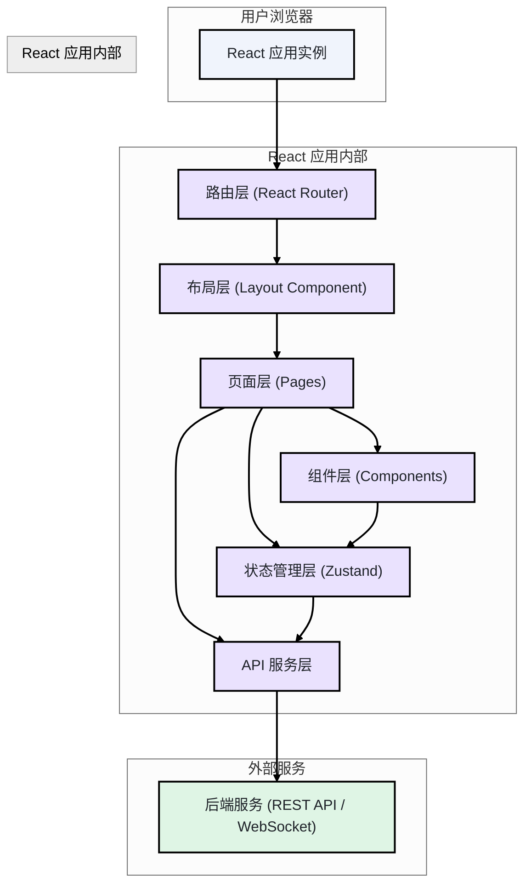
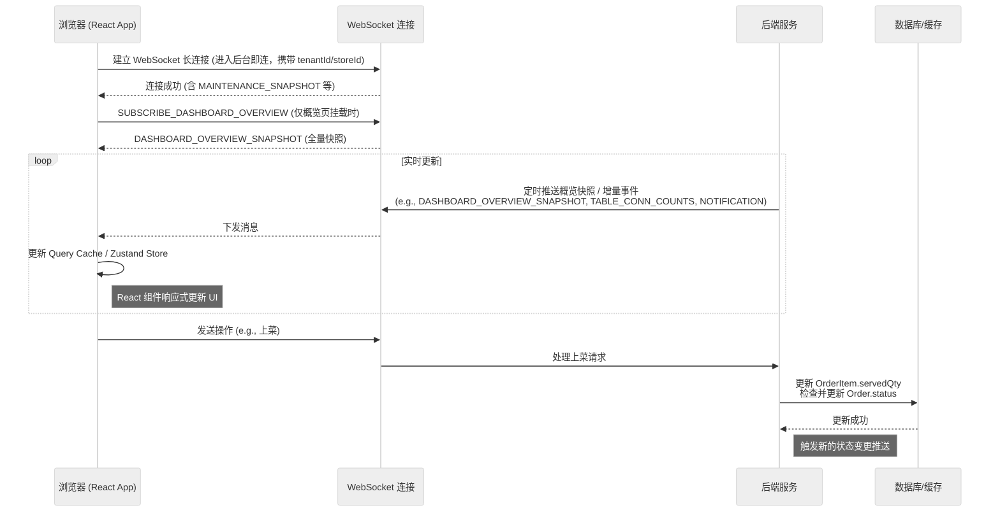

# BiteGo 点点餐：Web 管理端前端技术文档

版本：当前实现
作者：王锐 (wangrui.1696)
最后更新：2026-03-25

---

## 1. 范围与目标

本技术文档旨在为 BiteGo 点点餐项目的 **Web 管理端** 提供清晰、全面的前端技术实现方案。其主要目标是指导前端开发、确保代码质量与技术栈统一，并为后续的功能迭代和维护提供坚实的基础。

本文档详细阐述了前端的架构设计、技术选型、组件化策略、状态管理、路由设计、权限控制及构建部署流程，确保与产品需求和后端接口规范保持一致。

### 1.1 参考资料

- [《Web 管理端产品需求文档》](3.1-Web管理端产品需求文档.md)
- [《服务端技术文档》](4-服务端技术文档.md)
- [《接口与数据库设计规范》](6-接口与数据库设计规范.md)

## 2. 技术选型

Web 管理端旨在提供稳定、高效、易于维护的后台管理体验。基于此，我们选择业界成熟、生态完善的技术栈。

| 领域          | 技术/库                | 版本 | 选型理由                                                                                            |
| :------------ | :--------------------- | :--- | :-------------------------------------------------------------------------------------------------- |
| **核心框架**  | React                  | 18+  | 强大的组件化能力和庞大的生态系统，是构建复杂单页应用（SPA）的首选。                                 |
| **语言**      | TypeScript             | 5+   | 提供静态类型检查，增强代码健壮性与可维护性。                                                        |
| **构建工具**  | Vite                   | 最新 | 提供极速的开发服务器与稳定的构建体验，满足后台管理端工程化需要。                                    |
| **UI 组件库** | Material-UI (MUI)      | 5+   | 遵循 Material Design，提供丰富、美观且高度可定制的 React 组件，与 PRD 风格契合。                    |
| **路由管理**  | React Router           | 6+   | React 官方推荐的路由解决方案，API 简洁，功能强大。                                                  |
| **状态管理**  | Zustand                | 最新 | 负责少量全局 UI 状态（登录态、主题、全局筛选等），保持实现简洁可控。                                |
| **数据请求**  | Axios + TanStack Query | 最新 | Axios 负责统一请求封装；TanStack Query 负责服务端数据缓存、失效与重试，降低重复请求与状态同步成本。 |
| **代码规范**  | ESLint + Prettier      | 最新 | 保证代码风格统一，自动格式化代码。                                                                  |
| **包管理器**  | Yarn                   | 最新 | 与仓库整体约定保持一致，便于统一脚本与依赖管理。                                                    |

## 3. 架构设计

前端采用经典的**单页应用 (SPA)** 架构，通过组件化、模块化和分层设计来组织代码，确保高内聚、低耦合。

### 3.1 整体架构图



### 3.2 架构解读与目录结构

代码的物理结构将严格遵循逻辑分层，建议的 `src` 目录结构如下：

```
src/
├── api/             # API 服务层：封装所有与后端交互的请求
├── assets/          # 静态资源：图片、SVG、字体等
├── components/      # 通用组件层：可复用的 UI 组件
│   ├── common/      # 基础原子组件 (如: ProTable, Icon)
│   └── business/    # 业务组件 (如: GoodSelector)
├── config/          # 全局配置：常量、枚举、主题配置
├── hooks/           # 自定义 Hooks
├── layouts/         # 布局组件层：定义页面的整体结构 (如: 侧边栏、头部)
├── pages/           # 页面层：组织各个业务模块的页面
│   ├── good/
│   │   ├── GoodList.tsx
│   │   └── GoodDetail.tsx
│   ├── order/
│   └── ...
├── router/          # 路由层：定义应用的路由表和路由守卫
├── store/           # 状态管理层：定义全局状态 (Redux Slices 或 Zustand Stores)
├── styles/          # 全局样式
├── types/           # TypeScript 类型定义
└── utils/           # 工具函数
```

## 4. 组件设计规范

遵循**原子设计 (Atomic Design)** 的思想，构建一个可复用、可组合的组件系统。

- **原子 (Atoms)**: 最基础的 UI 元素，不可再分。例如，一个封装了 MUI 的 `Button`、一个 `Icon`、一个 `Input`。这些组件位于 `src/components/common/` 下，通常是无状态的。
- **分子 (Molecules)**: 由多个原子组成的简单 UI 结构。例如，一个包含输入框、搜索图标和清除按钮的 `SearchInput` 组件。
- **有机体 (Organisms)**: 由原子和分子组成的更复杂的 UI 模块，代表了页面的一部分。例如，一个包含分页、筛选、操作按钮的 `ProTable`（高级表格）组件，或者一个完整的 `GoodForm`（菜品表单）。这些通常是业务强相关的，位于 `src/components/business/` 下。
- **模板 (Templates)**: 定义了页面的整体布局结构，是组件的容器。对应于 `src/layouts/` 中的布局组件。
- **页面 (Pages)**: 模板的具体实例，将真实的业务数据和状态与组件连接起来，形成最终的用户界面。位于 `src/pages/` 下。

## 5. 状态管理方案

当前实现选用 **Zustand** 管理少量全局状态（例如：管理员上下文、WebSocket 连接态、页面级 UI 状态），并结合 TanStack Query 管理服务端数据缓存与失效。

### 5.1 全局状态 (Global Store)

用于管理跨页面的共享状态，如：

- 用户信息（`user`）
- 全局加载状态（`loading`）
- 应用的全局配置（如门店信息 `storeInfo`）

**示例 (`src/store/user.ts`)**:

```typescript
import { create } from "zustand";

interface UserState {
  userInfo: { id: string; name: string; role: string } | null;
  token: string | null;
  login: (data: { userInfo: UserState["userInfo"]; token: string }) => void;
  logout: () => void;
}

export const useUserStore = create<UserState>((set) => ({
  userInfo: null,
  token: localStorage.getItem("token"),
  login: (data) => {
    set({ userInfo: data.userInfo, token: data.token });
    localStorage.setItem("token", data.token);
  },
  logout: () => {
    set({ userInfo: null, token: null });
    localStorage.removeItem("token");
  },
}));
```

### 5.2 业务模块状态 (Feature Store)

对于复杂的业务模块（如订单管理），可以为其创建独立的 Store，以隔离状态，避免全局 Store 过于臃肿。

### 5.3 服务端数据缓存 (Server Cache)

对于从后端获取的数据（如菜品列表、订单列表），强烈推荐使用 **TanStack Query** 进行管理。它自动处理了数据的**获取、缓存、后台更新、状态同步**等复杂逻辑，极大地简化了异步数据处理。

**示例**:

```typescript
import { useQuery } from '@tanstack/react-query';
import { getGoods } from '@/api/good';

function GoodListPage() {
  const { data, isLoading, error } = useQuery({
    queryKey: ['goods', { page: 1, pageSize: 20 }],
    queryFn: () => getGoods({ page: 1, pageSize: 20 }),
  });

  if (isLoading) return <div>Loading...</div>;
  if (error) return <div>An error occurred: {error.message}</div>;

  // ... 渲染表格
}
```

### 5.4 文件上传（商品图片/门店照片）

Web 管理端在编辑菜品、门店信息时需要上传图片。当前实现使用后端直传 COS 的接口：

- `POST /api/v1/files`（仅管理员）
- `Content-Type: multipart/form-data`
- 表单字段：`file`（必填），`path`（可选：`goods`/`stores` 等）
- 成功返回：`data.publicUrl`（优先 CDN 域名），前端将该 URL 追加写入 `Good.imageUrls[]`（多图，首图用于列表封面），或写入 `Store.logoUrl`/门店照片字段中
- 交互规范：上传成功后在表单内展示图片缩略图，支持点击预览大图（避免仅展示 URL）

示例（Axios）：

```ts
import axios from "axios";

export async function uploadImage(file: File, path?: string) {
  const form = new FormData();
  form.append("file", file);
  if (path) form.append("path", path);
  const resp = await axios.post("/api/v1/files", form, {
    headers: { "Content-Type": "multipart/form-data" },
  });
  if (!resp.data?.success)
    throw new Error(resp.data?.message || "upload failed");
  return resp.data.data.publicUrl as string;
}
```

### 5.4.1 数据搬家（平台 / 租户 / 门店）

Web 管理端提供三层“数据搬家”入口，用于导出/清空/恢复，以及测试环境回滚。

门店级（独立门店）：

- 导出：`GET /api/v1/stores/export`（仅管理员），返回 CDN 链接 `data.publicUrl`；前端通过 fetch 获取 blob 并触发浏览器下载（若下载失败则降级为新标签页打开）。
  - 导出选项：前端可提供“包含停用配置项（includeInactive）”，勾选时调用 `GET /api/v1/stores/export?includeInactive=1`。
- 恢复：`POST /api/v1/stores/import`（仅管理员），`multipart/form-data` 上传 JSON 文件字段 `file`。
- 清空：`POST /api/v1/stores/reset`（仅管理员），等价于导入空 JSON。
- 交互：恢复/清空为高风险操作，前端需二次确认并提示“会覆盖配置并清理该门店业务数据（不影响平台顾客用户与管理员账号）”。

平台级与租户级：

- 平台：`/api/v1/platform/snapshot/export|import|reset`
- 租户：`/api/v1/tenant/snapshot/export|import|reset`

维护态处理（统一）：

- 恢复/清空期间，其他接口可能返回 `503`（`code=50300`），前端提示“恢复中/维护中，请稍后重试”，并禁用高风险按钮。
- 仅平台级恢复/清空会触发 token 全部失效（401，需要引导重新登录）；租户/门店级维护态不强制 token 失效（读请求仍可用）。

当前实现中，“维护态”相关的全局提示由布局层统一承接，参考：

- [BasicLayout.tsx](../projects/web-admin/src/layouts/BasicLayout.tsx)

### 5.5 GoodForm（选项组配置与价格）

管理端在创建/编辑菜品时，需要支持配置选项组（OptionGroups），并由后端按“库存规格组”自动生成 SKU：

- 规格、价格与库存的整体模型与端到端流程（含 PI/快照口径）详见 [7.2-核心实现-规格、价格和库存模型.md](./7.2-核心实现-规格、价格和库存模型.md)。
- 保存菜品：`POST/PUT /api/v1/goods`，Body 里带 `optionGroups`
- 分类选择：支持为同一菜品选择多个分类（`categoryIds`），用于“本店甄选”等活动分类复用同一菜品；响应中 `categoryId` 取 `categoryIds[0]`，便于列表场景快速取首个分类。
- 菜品详情：新增 `detailMarkdown` 字段用于七分屏详情展示；管理端编辑时使用 Markdown 编辑器（支持实时预览），列表页仍使用 `description` 作为一句话描述
- 金额规范：前端统一以“元（两位小数）”输入；提交接口时转换为“分（cents）整数”传 `basePriceCents` 与 `options[].priceCents`
- 金额展示：优先使用后端返回的 `xxxCents` 字段进行格式化展示（如 `123456` → `￥1,234.56`）
- 规格组字段展示：`minSelection/maxSelection/isRequired` 等参数在 UI 中使用中文表达（如“最少选择数/最多选择数/必选”）
- 规格组类型与排序：规格组支持选择“库存规格组/非库存规格组/共享非库存规格组”，并支持调整规格组顺序（影响前台展示顺序）；仅库存规格组参与 SKU 组合生成与 SKU 数量预估
- 共享非库存规格组：当类型为“共享非库存规格组”时，“规格组名称”改为下拉选择器，支持在下拉项内通过 Tooltip 展示共享规格组描述（仅提示用，不下发到小程序）；菜品侧可额外配置“禁用规格项”“默认规格覆盖”（不设置则使用共享规格组自身默认规格）
- 规则约束：规格组为必选时 `minSelection >= 1`；为可选时 `minSelection = 0`
- SKU 管理：SKU 价格为只读展示；当 SKU 数量较多时使用分页提升性能（每页 10），并支持按“规格组合/skuId”搜索筛选；选择能力需支持跨页：
  - 行内按钮：上架/下架、`+1` 快捷增加库存、编辑库存
  - 默认规格：在规格组编辑区支持配置 `defaultOptionIds`（可不配置），用于前台默认选中
  - 批量操作：批量上架/下架、批量设置库存（全选/勾选支持跨页）
  - 接口：批量操作通过 `PUT /api/v1/skus/bulk` 一次性提交，避免逐条请求
- 规格组变更保护：当编辑“已有菜品”且“库存规格组”发生结构变更（影响 SKU 组合集合，如增删库存规格组/规格值、调整必选与选择数量约束、切换规格组类型等）时，保存前弹出确认对话框提示“将删除所有历史 SKU 并清空库存/价格/上下架设置”；提交后展示“正在重建 SKU”进度提示直到接口返回。仅修改加价/名称/排序不触发破坏性确认与重建。
- 菜品图片编辑：使用正方形网格展示图片列表，支持拖拽排序与删除（基于 `@dnd-kit`，拖拽时元素跟随指针并带过渡动画）；列表封面取 `imageUrls[0]`；“设为封面”即将目标图片移动到数组第 1 位；新增图片支持点击上传与拖拽图片文件到网格区域上传（上传中禁用拖拽与新增）
- 菜品分类：分类列表支持编辑副标题与小标签（均可为空）；支持拖拽变更顺序（基于 `@dnd-kit`，DragIndicator 手柄常驻显示；拖拽进行中仅显示被拖拽行的手柄；拖拽时整行跟随并带过渡动画）；拖拽后前端按“sort 数字越大越靠前”的规则重算所有分类的 `category.sort` 并批量更新到服务端。

### 5.5.1 GoodList（菜品列表）增强

- 支持多选菜品并批量执行：上架/下架、调整分类（通过 `PUT /api/v1/goods/{goodId}`）
- 支持在列表行内展开展示 SKU 列表（只读：规格组合/价格/库存/状态），并提供分页（每页 5）避免展开过多导致卡顿；SKU 编辑入口仍在菜品详情页
- 当筛选了具体分类时，进入“分类内排序模式”：列表行展示 DragIndicator 与排序值列，支持拖拽调整该分类下菜品顺序；提交接口 `PUT /api/v1/categories/{categoryId}/goods/reorder`

示例数据结构（与服务端对齐）：

```ts
export interface OptionGroup {
  id: string;
  name: string;
  options: Array<{ id: string; name: string; price: number }>;
  isRequired: boolean;
  minSelection: number;
  maxSelection: number;
  groupType?: "custom" | "shared";
  sharedSpecGroupId?: string;
  disabledOptionIds?: string[];
}
```

### 5.6 PriceDisplay（最低价展示）

菜品列表/详情页展示“起步价”时，使用后端返回的 `minPrice` 字段：

```ts
export function PriceDisplay({ minPrice }: { minPrice: string }) {
  return <span>{minPrice === '0.00' ? '-' : `¥${minPrice}`}</span>
}
```

- `minPrice` 已包含“必选非库存规格组”的最低加价（每组取 `minSelection` 个最小加价），无需前端额外叠加计算。

## 6. 路由与权限设计

### 6.1 路由定义

在 `src/router/index.tsx` 中集中定义应用的路由表。

```typescript
import { createBrowserRouter } from 'react-router-dom';
import { RequireAuth } from './RequireAuth';
import { BasicLayout } from '@/layouts/BasicLayout';
import { LoginPage } from '@/pages/login/LoginPage';
import { GoodsListPage } from '@/pages/goods/GoodsListPage';
// ... 其他页面

export const router = createBrowserRouter([
  {
    path: '/login',
    element: <LoginPage />,
  },
  {
    element: <RequireAuth />,
    children: [
      {
        element: <BasicLayout />,
        children: [
          { path: '/store/goods', element: <GoodsListPage /> },
          // ... 其他受保护路由
        ],
      },
    ],
  },
]);
```

路由守卫通过 `<RequireAuth />` 组件实现：该组件检查 token 是否存在，未登录则重定向到 `/login`，已登录则渲染 `<Outlet />`。所有需要认证的路由都包裹在 `<RequireAuth />` 的 `children` 下。

核心路由与参数规范（建议）：

- `/spec-groups`：共享非库存规格组管理列表，支持新增/编辑/删除与查看关联菜品
- `/tables`：桌台列表页；支持按 `status/page/pageSize` 查询并展示 `qrcodeUrl`，支持“重新生成二维码”（可选择 `envVersion=release|trial|develop`）。
- `/tables/:tableId`（可选）：桌台详情页；路由参数 `tableId` 必填，用于展示桌号、状态、会话版本与二维码。
- 管理端各“列表页”统一采用组件库的 `TablePagination` 进行分页交互（页码切换 + 每页条数选择），并把 `page/pageSize` 透传给服务端分页接口；筛选条件变化时重置为第 1 页。

#### 6.1.1 多租户路由与上下文

平台多租户要求 Web 管理端在“同一套前端工程”中支持三类管理板块（平台/租户/门店），并将 `tenantId/storeId` 上下文显式传递给服务端，以保证数据隔离与权限边界。

推荐路由组织方式：

- `/platform/*`：平台管理（SUPER_ADMIN）
  - `/platform/overview`：平台门店概览（门店 block 列表）
  - `/platform/tenants`：租户管理
  - `/platform/stores`：门店管理
  - `/platform/users`：平台用户管理
  - `/platform/branding`：平台名称/Logo 配置
- `/tenant/*`：连锁管理（TENANT_ADMIN）
  - `/tenant/overview`：连锁门店概览（tenant 下门店 block 列表）
  - `/tenant/stores`：门店管理（新增/删除/查询）
  - `/tenant/users`：用户管理（管理员/下单用户）
  - `/tenant/shared-data/*`：共享基础数据管理（分类/菜品/规格/共享非库存规格组）
  - `/tenant/brand`：品牌名称/Logo 与子门店命名规则
- `/store/*`：门店管理（STORE_ADMIN）
  - `/store/overview`、`/store/orders`、`/store/tables` 等门店板块能力与单门店模型一致，但共享数据页面只读或直接隐藏
  - `/store/users`：用户管理（管理员/下单用户）

登录后的默认板块（多权限用户）：

- 登录成功后前端请求 `GET /api/v1/admin/me/scopes`，并按优先级自动进入最高层级板块：
  - `SUPER_ADMIN` → `/platform/overview`
  - `TENANT_ADMIN` → `CHAIN` 租户进入 `/tenant/overview`；`SINGLE` 租户直接进入 `/store/overview`，并自动绑定该租户的主门店
  - `STORE_ADMIN` → `/store/overview`
- 默认选择结果持久化到 `localStorage`，并作为后续 API 请求的默认上下文；在“退出登录/切换账号/401/上下文切换”场景会同步清理 Query 缓存与 WebSocket 状态，避免跨账号残留。
- 租户类型约束：
  - `CHAIN`：提供“租户视角（tenant）+ 门店视角（store）”
  - `SINGLE`：不提供“租户视角（tenant）”，仅提供“门店视角（store）”；在门店视角选择到单店租户时，门店选择器会隐藏并自动锁定到该租户的唯一门店
- 顶栏提供“上下文切换器”（对有权限的用户可切换平台/租户/门店；租户视角仅可选择连锁租户；门店视角会自动选择一个可用门店，避免出现未选择租户/门店的状态；下拉选项默认不展示 id，hover 可查看租户/门店 id）。
- 通知中心按当前上下文严格隔离：平台视角仅显示平台通知；租户视角仅显示该租户通知；门店视角仅显示该门店通知（避免租户管理员因门店级批量任务导致消息轰炸）。

概览页展示规范：

- 平台/连锁概览页统一采用“卡片”展示门店信息；每张卡片展示 `tenantId/品牌名/品牌Logo/storeId/门店名/门店Logo/占用桌台/总桌台/在线人数`（在线人数按桌台会话连接数聚合）。
- 平台概览页对“独立门店”的标识以 `tenantType='SINGLE'` 为准（仅当缺失 tenantType 时才做兼容性兜底判断）。

平台门店管理展示规范：

- 支持按租户筛选，且可按租户分组展示当前查询结果。
- 列表字段中的“主店”改为“类型”，枚举为：`独立店/连锁主店/连锁子店`（由租户类型 + 门店 isPrimary 派生）。

门店展示名与 Logo 约定：

- 门店接口响应统一返回 `displayName`（由服务端 `utils/storeName.ts` 拼装；连锁租户输出「品牌名(门店名)」，其他场景为 `name`）。Web 管理端列表、概览、扫码落地页应直接消费该字段，避免端侧重复拼装。
- 连锁租户的门店 Logo 由租户“品牌 Logo”统一同步，不在门店编辑页单独可写：`StorePage` 根据 `tenantType==='CHAIN'` 禁用 Logo URL 输入与上传按钮并给出引导；新增/编辑门店时，在门店名称输入框下方展示「品牌(___)」实时预览，提示终端用户看到的展示名。

接口上下文透传（关键约束）：

- Axios 拦截器统一在每个请求上附加：
  - `X-Tenant-Id: activeTenantId`
  - `X-Store-Id: activeStoreId`（store 视角必带）
  - `X-Board: platform|tenant|store`（可选；若携带需与上下文匹配）
- 前端必须在“上下文完整”后再发起对应板块请求：
  - `tenant` 板块必须先拿到 `tenantId`
  - `store` 板块必须先拿到 `storeId`（`tenantId` 建议携带用于显式性；服务端在 store 视角下允许不携带 tenantId，并会从门店记录推导）
- TanStack Query 的缓存键必须与 `board/tenantId/storeId` 绑定；上下文切换时统一清空缓存，避免旧上下文数据命中新上下文页面。
- 对于 `store` 视角，若 `storeId` 尚未解析完成（例如 `TENANT_ADMIN + SINGLE` 首次登录），页面应等待上下文完成后再请求，禁止带着不完整上下文访问接口。

多租户总体设计与共享数据策略详见 [7.6-核心实现-平台多租户.md](./7.6-核心实现-平台多租户.md)。

## 6.4 全局提示（Snackbar）

为提升交互一致性，管理端对“保存成功/上传成功/操作成功”等结果使用全局提示（Snackbar）统一反馈，避免每个页面重复实现提示逻辑。

### 6.2 路由守卫 (Auth Guard)

通过 `<RequireAuth />` 组件（位于 `src/router/RequireAuth.tsx`）包裹需要认证的路由子树。该组件从 `useAuthStore` 读取 `token`，若不存在则 `<Navigate to="/login" />`，否则渲染 `<Outlet />`。

路由守卫关注两件事：

- 是否已登录（token 是否存在）
- 是否具备访问该路由所需的角色与能力（effectiveRole / canManageSharedCatalog）——由页面/组件内基于 scopes 判断，不在路由表的 meta 中声明

### 6.3 权限控制实现

权限控制分为三个层级：

1.  **菜单/路由权限**:
    - 登录后，从后端获取管理员 scopes：`GET /api/v1/admin/me/scopes`。
    - 通过 `getAdminCapabilities({ scopes, tenantId, storeId, tenantType, storeIsPrimary })` 解析出当前上下文的 `role / canAccessPlatform / canAccessTenant / canAccessStore / canManageSharedCatalog` 等能力，再据此生成菜单与路由可见性。
    - 禁止使用 `GET /api/v1/users/me` 返回的字段做任何管理端权限判断（该接口仅返回登录主体类型 `userType=ADMIN/CUSTOMER` 与基础资料）。

2.  **按钮/操作权限**:
    - 对于页面内的操作按钮（如“删除”、“编辑”），统一基于 `getAdminCapabilities(...)` 返回的能力位控制展示/禁用，例如共享菜单写入按 `caps.canManageSharedCatalog` 判断。

3.  **接口权限**:
    - 最终的权限校验由**后端接口**完成。前端的权限控制主要为了提升用户体验，避免用户看到并点击无权操作的按钮。

## 7. 构建与部署

### 7.1 环境变量

通过 `.env` 文件系列管理不同环境的配置。

- `.env`: 所有环境共享的变量。
- `.env.development`: 开发环境配置。
- `.env.production`: 生产环境配置。

**示例 (`.env.production`)**:

```
VITE_APP_TITLE=BiteGo 点点餐
VITE_API_BASE_URL=https://api.bitego.net/api/v1
```

在代码中通过 `import.meta.env.VITE_API_BASE_URL` 访问。

### 7.2 CI/CD 流程

1.  **代码提交**: 开发者推送代码到 Git 仓库。
2.  **自动化构建**: CI/CD 平台（如 Jenkins, GitLab CI）监听到提交后，自动执行以下步骤：
    - 安装依赖 (`yarn install`)
    - 代码检查 (`yarn lint`)
    - 执行测试 (`yarn test`)
    - 打包构建 (`yarn build`)
3.  **静态资源部署**: 将构建产物（`dist` 目录下的静态文件）上传到 CDN 或静态文件服务器（如 Nginx, COS, S3）。
4.  **通知与验证**: 部署成功后通知相关人员进行验证。

---

### 7.3 核心页面数据流

#### 概览页 (Dashboard) 数据流

概览页是 Web 管理端的核心，集成了“桌台总览”和“后厨工作台”两大实时模块。其数据流严重依赖 WebSocket 进行实时更新。

交互补充：

- 右侧“活跃订单”区域支持后厨快捷上菜操作：`+1`、`全部上齐`，调用订单上菜接口后刷新概览数据并通过 Snackbar 提示结果。
- 当选中某个桌台后，右侧在“活跃订单”下方展示“所有订单”板块：拉取该桌台当前会话（`tableId + sessionVersion`）的全部关联订单，展示序号/下单时间/数量/金额/状态/备注（限宽省略，hover 完整展示），并以主子表格形式展开订单内菜品明细；汇总区计算总数量与总金额（排除已退款订单）。
- 左侧“桌台总览”支持展示“在线人数”（按桌台 WebSocket 活跃连接数统计）与“桌台/订单/购物车概览”：
  - WebSocket 优先：通过 `WS /ws/admin-dashboard` 订阅 `DASHBOARD_OVERVIEW_SNAPSHOT`（概览页挂载时发送 `SUBSCRIBE_DASHBOARD_OVERVIEW`，卸载时发送 `UNSUBSCRIBE_DASHBOARD_OVERVIEW`），并通过 `TABLE_CONN_COUNTS*` 获取在线人数增量更新；前端对高频消息做 200ms 合并更新（确保响应延迟 ≤ 500ms 且避免频繁重渲染），并在断线后自动重连；当 WebSocket 经过 CDN 且存在 10 秒空闲超时限制时，前端需按 ≤ 5 秒发送心跳（PING）保持连接。
  - 降级策略：当 WebSocket 不可用或断开时，降级使用 `GET /api/v1/dashboard/overview` + 3 秒轮询刷新。
- 概览页播报：管理员可开启“播报”开关；当前端收到 `NOTIFICATION`（新下单/退款申请）时进入播报队列，使用 Web Speech API 逐条语音播报，并在页面展示字幕（subtitle）。
- 左侧“桌台总览”表格增强：
  - 点击桌号：复制 `tableId` 到剪贴板，并通过 Snackbar 反馈“已复制桌台ID”。
  - 点击整行：切换“选中桌台”；右侧“活跃订单”按桌号过滤（再次点击或点击筛选标签的关闭按钮可取消选中，恢复全量）。
  - 排序：仅支持按一种方式排序；基础顺序为桌号；支持按桌号/在线/待完成订单/总订单/总金额切换排序方向。
  - 表头吸附：表格表头使用 `position: sticky` 固定在顶部，避免桌台过多时滚动看不到表头。
  - 布局约束：概览页需限制内容区高度并让桌台表格在容器内滚动（`overflow: auto`），以确保表头吸附在容器顶部而非随窗口滚动失效。
- 左侧“桌台总览”支持桌台操作入口：
  - 关台：调用 `POST /api/v1/tables/{tableId}/clear`，仅在桌台无活跃订单时可用
  - 强制清台：调用 `POST /api/v1/tables/{tableId}/force-clear`，用于兜底清理；两者均需二次确认弹窗防误触
- 左侧“桌台总览”支持展示桌台关联统计：
  - 总订单数 `totalOrderCount`
  - 总金额（不含已退款订单）`totalAmountExRefunded`

#### 顶部栏（通知与用户菜单）

- 通知中心：顶部右侧铃铛按钮展示通知列表与未读数。
  - WebSocket 优先：通过 `WS /ws/admin-dashboard` 接收 `NOTIFICATION` 事件触发通知列表刷新。
  - 降级策略：当 WebSocket 不可用或断开时，未读数降级为 `GET /api/v1/admin/notifications?status=UNREAD` 每 5 秒轮询刷新；通知列表仍按用户显式打开弹窗触发拉取。
  - 支持标记已读/已处理；支持“一键已读”调用 `PUT /api/v1/admin/notifications/read-all` 批量标记未读为已读。
- 用户菜单：顶部右侧展示头像+昵称，点击弹出菜单（个人信息/退出登录）；个人信息页支持修改头像昵称与修改密码。

#### 用户管理页

- 用户列表：调用 `/api/v1/admin/users` 支持按 `userType`（CUSTOMER/ADMIN）与关键字筛选；列表分页统一使用 `TablePagination`，并透传 `page/pageSize` 给后端（筛选条件变化时回到第 1 页）。
- 字段展示：
  - 管理员（ADMIN）：展示头像、昵称、账号、用户ID；隐藏"类型"列；支持删除（禁止删除当前登录账号）。
  - 小程序用户（CUSTOMER）：隐藏"类型/操作/账号"列；展示头像、昵称、微信ID（openid/unionid）、用户ID、注册时间、上次登录时间（使用 `lastLoginAt`，精确记录登录时间）。
- 三个视角（platform/tenant/store）共用同一对组件 `AddMemberDialog` 与 `UserDetailDrawer`：
  - `AddMemberDialog`：顶部单一入口「添加成员」，内含「新建账号」与「从已有账号选择」双 Tab。`PlatformUsersPage` / `TenantUsersPage` / `StoreUsersPage` 通过 props 注入默认角色与可编辑的作用域范围（platform 视角支持一次性多条 scope 勾选；tenant/store 视角默认角色固定）。新建账号路径走 `POST /api/v1/platform/users`（带可选 `scopes`），已有账号路径调用 `GET /api/v1/admin/users/search` + 当前作用域对应的 scope 创建接口。
  - `UserDetailDrawer`：点击列表行打开右侧 Drawer。通过 `GET /api/v1/platform/users/:userId` / `GET /api/v1/tenant/users/:userId` / `GET /api/v1/store/users/:userId` 拉取对应视角下的详情与 scope；内含两个操作按钮："编辑资料"（`PUT /api/v1/admin/users/:userId/profile`）与"重置密码"（`POST /api/v1/admin/users/:userId/reset-password`）。作用域列表以只读 Chip + Tooltip 展示，不提供删除按钮以防高频操作下误删。



#### 订单管理页（含退款审核）数据流

- 默认拉取订单列表：`GET /api/v1/orders`（按时间倒序，支持按状态/桌台等筛选）。
- 订单详情页：
  - 基础信息回源：`GET /api/v1/orders/{orderId}`
  - 退款流水回源：`GET /api/v1/orders/{orderId}/refunds`（用于展示退款历史与驳回原因）
- 退款审核（ADMIN）：
  - 用户/门店发起退款申请后，订单进入 `Refunding`，退款单进入 `REVIEWING`
  - 管理端在订单详情页对 `REVIEWING` 退款单执行审核：
    - 通过：`PUT /api/v1/orders/{orderId}/refunds/{refundId}/review`（`decision=APPROVE`），退款单进入 `PENDING`，后续由服务端 worker 模拟退款完成
    - 驳回：同接口（`decision=REJECT` + `reason`），退款单进入 `REJECTED`，订单状态回退为 `Paid`，并在退款记录中可追溯驳回原因
