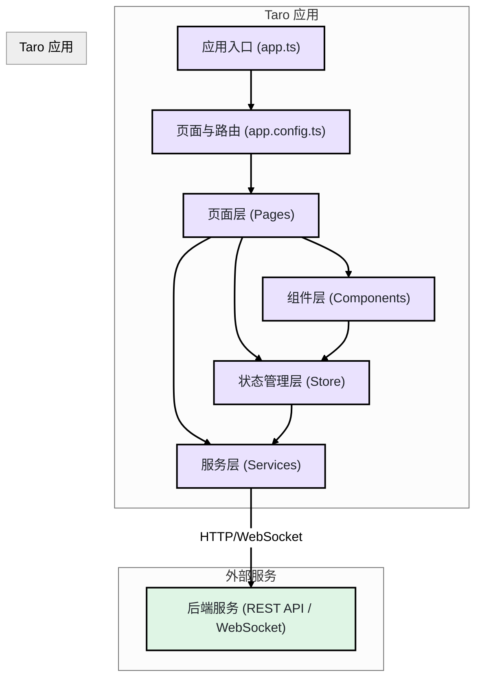
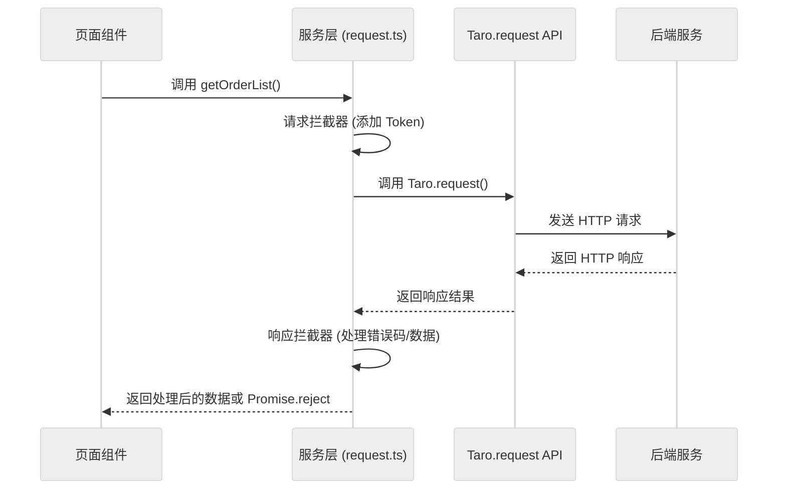
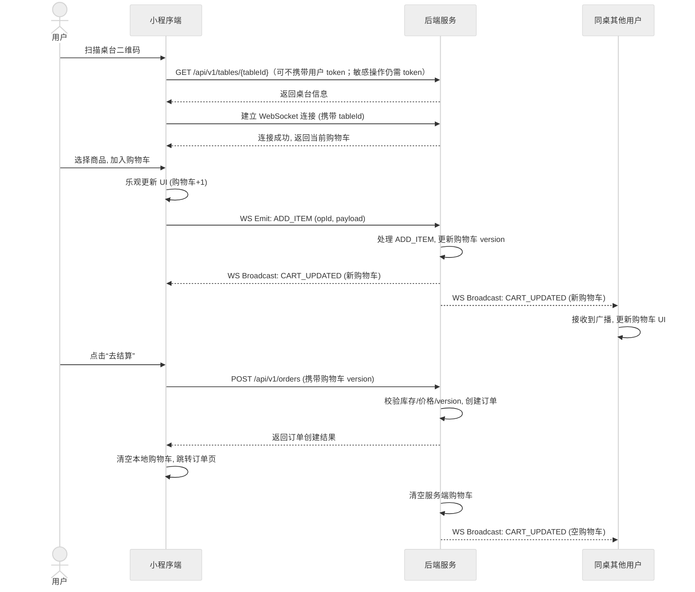

# BiteGo 点点餐：小程序端前端技术文档

版本：当前实现
作者：王锐 (wangrui.1696)
最后更新：2026-03-25

---

## 1. 范围与目标

本技术文档为 BiteGo 点点餐项目的**小程序端**提供详细的前端技术实现方案与开发规范。文档的核心目标是确保小程序端的开发效率、代码质量、性能体验以及与后端、Web 管理端的高度一致性。

本文档覆盖了技术选型、架构设计、页面与路由、状态管理、性能优化及发布流程等关键环节，旨在成为小程序开发团队的核心指导文档。

### 1.1 参考资料

-   [《小程序端产品需求文档》](3.2-小程序端产品需求文档.md)
-   [《服务端技术文档》](4-服务端技术文档.md)
-   [《接口与数据库设计规范》](6-接口与数据库设计规范.md)
-   [《Taro 开发指南》](guides/Taro开发指南.md)

## 2. 技术选型

根据 PRD 的明确要求以及对开发效率和跨端潜力的考量，小程序端采用 **Taro** 框架进行开发。

| 领域 | 技术/库 | 版本 | 选型理由 |
| :--- | :--- | :--- | :--- |
| **核心框架** | Taro | 4.1.11 | 支持使用 React 语法进行多端开发，生态成熟，社区活跃。能够最大化地复用 React 生态。 |
| **UI 框架** | React | 18+ | 与 Taro 深度集成，提供现代化的函数式组件和 Hooks 开发体验。 |
| **语言** | TypeScript | 5+ | 为项目提供静态类型检查，提升代码健壮性和可维护性。 |
| **UI 组件库** | Taro UI / 自主封装 | 最新 | Taro UI 提供了一套基础的跨端组件。对于定制化需求高的场景，将基于原生组件进行封装。 |
| **状态管理** | Zustand | 最新 | 负责少量全局状态（桌台会话、购物车、登录态等），实现简洁且包体积可控。 |
| **数据请求** | Taro.request + 自封装 | - | Taro 内置的请求 API 已满足基本需求。将对其进行封装，加入拦截器、统一错误处理等功能。 |
| **代码规范** | ESLint + Stylelint | 最新 | 统一代码风格，保证团队协作效率和代码质量。 |
| **测试** | Vitest + Playwright | 最新 | 单元测试覆盖核心工具与状态逻辑；端到端测试覆盖关键页面跳转与基础交互。 |
| **包管理器** | Yarn | 4.13.0 | 与仓库整体约定保持一致，便于统一脚本与依赖管理。 |

## 3. 架构设计

小程序前端架构以 Taro 为核心，围绕页面、组件、状态和服务进行分层，实现清晰的关注点分离。

### 3.1 架构图与目录结构



**建议的 `src` 目录结构**:

```
src/
├── api/              # API 接口定义
├── assets/           # 静态资源 (图片、图标)
├── components/       # 可复用组件
│   ├── common/       # 通用基础组件 (如: Price, EmptyState)
│   └── business/     # 业务组件 (如: GoodItem, CartControl)
├── config/           # 全局配置 (常量)
├── hooks/            # 自定义 Hooks
├── models/           # 数据模型 (TypeScript Interfaces/Types)
├── pages/            # 页面
│   ├── index/        # 主页
│   ├── order-meal/   # 点餐页
│   └── ...
├── services/         # 服务层 (封装数据请求、WebSocket)
├── store/            # 状态管理 (Zustand stores)
├── styles/           # 全局与主题样式
├── subpackages/      # 分包目录
│   ├── profile/      # "我的" 模块 (如历史订单：展示桌台号与订单时间节点)
│   └── ...
├── utils/            # 工具函数
├── app.config.ts     # 全局配置
├── app.scss          # 全局样式
└── app.ts            # 应用入口
```

### 3.2 样式与适配（小程序规范）

- 样式建议使用 Sass（`*.scss`），并按“全局样式（`app.scss`）+ 页面样式（`index.scss`）+ 组件局部样式”的层次管理。
- 尺寸单位推荐在样式中直接写 `px`，交给 Taro 在编译期进行 `px -> rpx` 自动转换；如不希望转换，可用 `PX/Px`。
- 避免依赖浏览器特性（例如复杂选择器、DOM 相关伪类），以小程序样式能力为准；如需适配差异，优先通过组件拆分或条件编译处理。

## 4. 页面结构与路由

### 4.1 页面注册

所有页面都在 `app.config.ts` 中进行集中注册，包括主包页面和分包页面。

补充说明（对齐 Taro 规范）：

- 页面必须在 `src/app.config.ts` 的 `pages` / `subpackages` 中注册后才能访问；不需要也不应该使用 `react-router-dom` 等 Web 路由库。
- 页面路径写法为相对 `src` 的路径（不带文件后缀），如 `pages/order-meal/index`。
- 若使用分包，需在 `subpackages` 中配置 `root + pages`；分包内页面跳转时 URL 需要带上 `/${root}/${page}` 的完整路径。
- 如页面需要定制导航栏/下拉刷新等能力，应在页面级配置 `src/pages/**/index.config.ts` 中配置（对齐原生 `page.json` 语义）。

**示例 (`app.config.ts`)**:
```typescript
export default defineAppConfig({
  pages: [
    'pages/index/index',
    'pages/order-meal/index',
    'pages/checkout/index',
    'pages/table-orders/index',
  ],
  subpackages: [
    {
      root: 'subpackages/profile',
      pages: [
        'pages/history-orders/index',
        'pages/order-detail/index',
        'pages/profile-edit/index',
      ],
    },
  ],
  window: {
    backgroundTextStyle: 'light',
    navigationBarBackgroundColor: '#fff',
    navigationBarTitleText: 'BiteGo 点点餐',
    navigationBarTextStyle: 'black',
  },
});
```

### 4.2 路由跳转

统一使用集中式路由工具与 Hook：

- 路由管理的完整设计（集中式封装、安全回退、扫码入口参数解析、边界处理与测试）详见 [7.3-核心实现-小程序端路由管理.md](./7.3-核心实现-小程序端路由管理.md)。
- `src/utils/router.ts`：封装 `navigateTo/redirectTo/reLaunch/navigateBack` 与 Query 序列化，并提供统一的页面路径常量。
- `src/hooks/useAppRouter.ts`：页面组件内通过 Hook 获取 router，避免到处散落 `Taro.navigateTo/redirectTo`。

跳转规范（本项目约定）：

- **默认跳转**：新页面默认使用 `navigateTo`；返回使用 `router.back()`。
- **安全返回**：`router.back({ expect, fallback })` 支持校验“上一页是否为预期路径”；若不符合（例如扫码直达导致无上一页），自动走 `fallback` 的 `redirectTo/reLaunch/navigateTo`。
- **扫码进入特殊场景**：允许使用 `reLaunch` 直接打开点餐页（用于从二维码/scene 启动时强制重置栈）。
- **替换跳转（少量场景）**：提交订单成功等“不可回退到上一步”的流程可用 `redirectTo`（如 `replaceToTableOrders`）。

示例（实际代码请以项目实现为准）：

```ts
const router = useAppRouter()

router.toCheckout({ tableId })

router.back({
  expect: '/pages/index/index',
  fallback: { url: '/pages/index/index', mode: 'redirectTo' }
})
```

示例：页面内获取路由参数（对齐 Taro 规范）：

```ts
import { getCurrentInstance, useLoad } from '@tarojs/taro'

export default function OrderMealPage() {
  useLoad(() => {
    const { router } = getCurrentInstance()
    const tableId = router?.params?.tableId || ''
    if (!tableId) {
      // 参数缺失时可用 redirect/reLaunch 回退到安全页
    }
  })
  return null
}
```

### 4.3 扫码开台流程

1.  **用户扫码**: 用户扫描桌台二维码。
2.  **解析参数**: 在 `app.ts` 的启动/展示生命周期中，通过 `Taro.getLaunchOptionsSync()` 获取场景值和启动参数（Query）。
3.  **参数校验**: 校验二维码参数的合法性（如 `tableId` 非空），并在点餐页初始化时向后端校验桌台是否存在。
4.  **跳转点餐页**: 校验通过后，携带 `tableId` 跳转到点餐页 `pages/order-meal/index`。
5.  **初始化桌台会话**: 在点餐页的页面生命周期中（推荐 `useLoad`），使用 `tableId` 初始化桌台会话，包括获取桌台信息、连接 WebSocket 等。

补充：二次扫码入桌体验优化（与当前实现一致）：

- 当桌台已处于占用态（非本次扫码从 FREE 变为 OCCUPIED）时，会弹窗提示“桌台已被占用”。
- 若存在同桌在线用户（connCount>0）：用户可选择“继续入桌”或“返回首页”。
- 若无同桌在线用户且无进行中订单（activeOrderCount=0）：用户可选择“继续入桌”或“重置桌台后入桌”（重置会进行二次确认，调用 `POST /api/v1/tables/:tableId/reset-session`）。
- 新用户成功加入桌台会话后，同桌其他用户会收到 `USER_JOINED` 的全局提示（本人不提示）。

二维码参数约定（与服务端生成一致）：

- 使用微信 `getwxacodeunlimit` 生成：`page = pages/order-meal/index`。
- `scene = tableId=<TableId>`，小程序端通过 `decodeURIComponent(options.scene)` 解析得到 `tableId`。

鉴权与安全（JWT、sessionToken、订单同桌共享、gtv 全局失效等）详见 [7.5-核心实现-鉴权与安全.md](./7.5-核心实现-鉴权与安全.md)。

### 4.4 生命周期使用规范（推荐）

- 应用级：在 `src/app.ts` 中使用 `useDidShow/useDidHide` 对齐原生 `onShow/onHide`。
- 页面级：在页面组件中使用 `useLoad/useReady/useDidShow/useDidHide/useUnload`。
- 数据请求最佳实践：
  - 首次请求放在 `useLoad`（只触发一次）
  - 需要每次回到页面刷新时放在 `useDidShow`
  - 清理定时器/订阅放在 `useUnload`

补充说明（与当前实现一致）：

- 点餐页“分类渲染 + 电梯锚定（左侧菜单与右侧分区双向联动）”的完整实现原理与稳定性兜底方案详见 [7.4-核心实现-小程序端点餐页分类渲染.md](./7.4-核心实现-小程序端点餐页分类渲染.md)。
- 点餐页菜品列表采用“一次性拉取全量菜品 + 前端按分类分组（电梯锚点）”策略，不使用触底懒加载，避免在小数据量场景出现反复触底导致的连锁请求。
- 菜品支持多分类：服务端返回 `categoryIds` 时，前端按 `categoryIds` 将同一菜品渲染到多个分类下，用于“本店甄选”等活动分类高亮。
- 点餐页顶部信息区（门店 Logo/门店名/桌号/搜索/本桌订单入口）采用吸顶布局；分类与菜品列表均使用 `ScrollView` 且需设置明确高度：
  - 分类点击：菜品列表通过 `scrollIntoView` 锚定到对应分组。
  - 菜品滚动触发自动锚定分类：左侧分类菜单也需同步使用 `scrollIntoView` 将当前锚定分类滚动到可视区域，避免分类过多时高亮项不在视图内。
  - 性能与稳定性：左侧分类菜单的 `scrollIntoView` 更新建议做“尾部节流/防抖”（例如 80ms），以避免快速滚动时高频更新导致无法正确命中最终分类。
  - 兼容性：部分机型/基础库在 ScrollView 惯性滚动阶段可能不持续触发 `onScroll`；可在 `touchend/touchcancel` 后通过 selectorQuery 的 `scrollOffset()` 轮询到滚动停止，以最终 `scrollTop` 再做一次锚定与菜单滚动同步。
- 分类过滤：按分类分组后，无菜品的分类需要过滤（无论是否处于搜索模式），不渲染左侧分类导航项，也不渲染右侧分类标题，避免出现“空分类”占位。
- 分类顺序按分类 `sort` 字段降序（数字越大越靠前），由后端返回顺序为准（前端不应再做相反方向排序）。
- 售罄菜品处理：列表项 `soldOut=true` 的菜品表示商品仍在架上、但全部 SKU 已下架或库存为 0。`GoodItem` 将其置灰、隐藏一句话描述、在菜品名右侧以灰色标签标注“已售罄”并拦截点击；分类内排序先按 `soldOut` 升序（可售在前），再按原有 `sort/createdAt/goodId` 规则。

## 5. 组件封装策略

-   **展示型组件 (Presentational Components)**:
    -   位于 `src/components/common/`。
    -   只负责 UI 的展示，不包含复杂的业务逻辑。
    -   通过 `props` 接收数据和回调函数。
    -   例如：价格显示组件 `Price.tsx`，空状态提示 `EmptyState.tsx`。
-   **容器型/业务组件 (Container/Business Components)**:
    -   位于 `src/components/business/` 或页面内部。
    -   负责业务逻辑，通常会包含自己的状态或与全局状态/服务端数据交互。
    -   例如：`GoodItem.tsx`（菜品项，包含加入购物车逻辑），`CartControl.tsx`（购物车加减控件）。
-   **Hooks 封装**:
    -   将可复用的逻辑（如倒计时、页面滚动监听、WebSocket 连接管理）抽离成自定义 Hooks，位于 `src/hooks/`。
    -   桌台会话逻辑建议统一收敛在一个模块中（Hook 或 Store 均可）。本项目实现为 `Zustand Store`，并提供 `acquire/release` 以在页面切换时复用同一 WebSocket 连接，避免重复 init/重连与连接抖动。

组件规范补充（小程序端）：

- UI 组件优先使用 `@tarojs/components` 提供的跨端组件（如 `View/Text/Image/Button/ScrollView`），不要在 JSX 中直接使用 `div/span` 等 HTML 标签。
- 避免直接使用 DOM/BOM（如 `window/document/location/history`）；如需平台能力，应通过 `@tarojs/taro` 提供的 API（或 `process.env.TARO_ENV` 做条件编译）。
- 事件绑定使用驼峰形式（如 `onClick/onChange`），并遵循小程序事件模型（必要时用 `catchMove` 等属性处理滚动穿透问题）。

## 6. 接口调用规范 (服务层)

在 `src/services/` 目录下创建服务，用于封装所有与后端的交互。

### 6.1 HTTP 请求封装

创建一个 `request.ts` 模块，对 `Taro.request` 进行封装，实现以下功能：
-   **统一配置**: 自动添加 `baseUrl` 和 `timeout`。
-   **请求拦截器**: 在请求发送前，统一添加 `Authorization` 头（如果已登录）。
-   **响应拦截器**:
    -   对响应数据进行预处理，直接返回 `data` 部分。
    -   统一处理业务错误码（如 `40100` 表示未登录，自动跳转登录页）。
    -   统一处理维护态（HTTP `503` / `code=50300`），提示“系统维护中，请稍后重试”，并避免重复重试造成额外压力。
    -   统一处理网络异常，并给出友好提示。
    -   维护态结束后可能触发 token 失效（401），需要重新走登录流程（`ensureLogin`）。

规范补充：

- 所有 HTTP 请求必须基于 `Taro.request`（或其二次封装），不建议直接使用 `fetch/axios`。
- 返回值处理建议优先使用 `async/await`，并在 service 层完成“解包/错误码转换/重试”等通用逻辑。

#### 6.1.1 小程序登录接入（微信登录）

小程序端使用 `Taro.login()` 获取 `code`，调用后端 `POST /api/v1/auth/wechat/login` 换取业务 JWT，并将 token 存入本地存储；后续所有接口通过 `Authorization: Bearer <token>` 访问。

示例（伪代码，按项目实际目录调整）：

```ts
import Taro from '@tarojs/taro'

const TOKEN_KEY = 'businessToken'

export async function doWechatLogin() {
  const { code } = await Taro.login()
  const resp = await Taro.request({
    url: `${BASE_URL}/api/v1/auth/wechat/login`,
    method: 'POST',
    data: { code }
  })
  if (resp.statusCode !== 200 || !resp.data?.success) throw new Error(resp.data?.message || 'login failed')
  const token = resp.data.data.token
  Taro.setStorageSync(TOKEN_KEY, token)
  return token
}

export function getToken() {
  return Taro.getStorageSync(TOKEN_KEY)
}
```

手机号授权解密（可选能力）：

- 小程序端通过按钮获取 `encryptedData/iv`（必须用户主动触发）
- 调用后端 `POST /api/v1/users/me/phone`，后端基于服务端缓存的 `session_key` 解密并返回手机号
- 若返回 `40101`，需要重新执行微信登录流程（重新 `wx.login` 获取新 `code`）

#### 6.1.2 H5 登录接入（浏览器扫码）

为支持“用户未安装微信时，通过系统相机/浏览器扫码进入点餐页”，H5 端不走微信 `Taro.login()`，而是采用“匿名用户 ID + 本地持久化”的登录方式：

- H5 端在 `localStorage`（Taro H5 下对应 `Taro.setStorageSync/getStorageSync`）中保存一个随机生成的 `userId`（例如 `usr_<timestamp>_<rand>`）。
- 每次启动若本地存在 `userId`，则调用后端 `POST /api/v1/auth/h5/login` 换取 JWT；若不存在则先生成 `userId` 再登录。
- 若用户清理了浏览器存储，则视为新用户，重新生成 `userId` 并重新登录即可。

#### 6.1.3 H5 构建与发布（CI/CD）

H5 端基于小程序项目的 H5 构建产物发布（`taro build --type h5`，输出目录为 `projects/miniprogram/dist`）。发布到生产环境时，CI/CD 会在构建完成后将 `dist` 目录上传至腾讯云 COS，并对 `H5APP_DOMAIN` 对应路径进行 CDN 刷新。H5 端 API 地址通过构建时注入 `TARO_APP_API_BASE_URL` 指定（通常由 `BACKEND_DOMAIN` 计算得到）。

**数据流图**:


### 6.2 WebSocket 封装

建议将 WebSocket 连接管理收敛到单一模块中（Hook 或 Store 均可），避免在多个页面/组件中各自创建连接导致重复 init 与连接抖动。本项目实现为 `Zustand Store`（`tableSessionStore`），核心能力包括：

-   **连接与认证**: 通过 `token + tableId + sessionToken` 生成连接 URL。
-   **心跳机制**: 定时发送 `{ "type": "PING", "ts": <ms> }`，服务端返回 `{ "type": "PONG", "ts": <ms> }`，用于维持连接活跃与断线检测。
-   **弱网恢复**: 基于 `PONG` 回包时间做丢包检测（例如超过 7 秒无回包），触发一次 `SYNC` 请求服务端下发 `CART_SNAPSHOT`；长时间无回包会自动重连。
-   **前台恢复**: 页面 `onShow/useDidShow` 时主动触发一次心跳探测，减少“切后台后返回页面但连接假活”的概率。
-   **发送保护**: 在发送 WS 消息（加购/改数量/删除）前检查 `SocketTask.readyState`；若非 OPEN，则先自动重连并等待连接恢复，再自动重试发送；必要时展示无文案 Loading（仅转圈），并确保在 Toast 展示前先关闭 Loading，避免控制台报错 `SocketTask.send: fail SocketTask.readyState is not OPEN` 与“提示成功但实际未生效”的体验问题。
-   **会话复用与回收**: 提供 `acquire/release`，页面间复用同一桌台会话连接；无页面持有时延迟断开。
-   **消息处理**: 处理 `CART_SNAPSHOT/CART_UPDATED/ORDER_CREATED/ORDER_STATUS_CHANGED/ORDER_ITEM_SERVED/TABLE_CLOSED/ERROR` 等消息并更新 Store。
-   **用户提示**: 点餐页会对 `CART_UPDATED/ORDER_CREATED` 触发轻量气泡提示（页面内渲染 `GlobalToast`），帮助用户感知“他人加菜/他人下单”等状态变化；自己的操作不提示。

## 7. 多人协同与状态同步

多人协同是小程序端的核心功能，其技术实现依赖于 WebSocket 和一套严谨的状态同步机制。
桌台协同会话的完整机制（会话 token/版本、WS 协议、并发与幂等、下单后的同步、订单可见性策略）见 [7.1-核心实现-桌台协同会话.md](./7.1-核心实现-桌台协同会话.md)。

-   **服务端权威**: 所有状态变更（如购物车修改）的最终决策权在服务端。客户端的操作仅为“意图”的表达。
-   **乐观更新**:
    1.  客户端（如点击“+”号）立即在本地 UI 上反映出变更结果（数量+1）。
    2.  同时，将此操作发送到 WebSocket。
    3.  等待服务端广播最新的、权威的购物车状态。
    4.  收到广播后，用服务端的数据覆盖本地状态。
-   **版本号/操作 ID**:
    -   客户端每次提交操作时，携带当前购物车的 `baseVersion`。如果服务端发现版本不匹配，则拒绝操作，强制客户端同步最新数据。
    -   为每个操作生成 `opId`，用于服务端实现幂等，防止网络重试导致重复操作。
-   **并发一致性（关键实现要点）**:
    -   服务端会在“每次广播 `CART_UPDATED`”后同步所有在线连接的“当前 cartVersion 认知”，确保不同用户后续提交的 `baseVersion` 都能在服务端被一致校验。
    -   该机制用于避免多端并发时出现“某端重进后恢复、另一端开始报 `version mismatch`”的交替失效问题。
-   **状态管理**: 使用 `Zustand` 创建一个 `tableCartStore`，专门用于存储和管理从 WebSocket 接收到的桌台购物车数据。页面组件订阅此 Store 的变化来更新 UI。
-   **订单回源与补齐**: 桌台订单页进入时通过 HTTP 拉取“本次开台”的订单列表/详情（`tableId + tableSessionVersion + sessionToken`），并结合 WebSocket 推送补齐新订单/状态变更/上菜进度更新，确保断线重连后仍可恢复正确视图。

## 7.1 平台多租户与多门店展示

在平台多租户（SaaS）场景下，小程序端需要在“不改变扫码入桌链路”的前提下支持多门店展示与跨门店历史订单：

- 首页首次进入：展示平台 Branding（平台名称 + Logo，可由 Web 管理端配置），不依赖门店上下文。
- H5 端：`app.ts` 启动时拉取 `GET /platform/branding`，将 `platformLogoUrl` 动态写入 `<link rel="icon">`，使浏览器标签页 favicon 与当前平台 Logo 保持一致；未配置 Logo 时保留浏览器默认图标。
- 扫码入桌后：服务端通过 `tableId` 反查 `storeId`，并在桌台/门店相关接口中以扩展字段返回门店信息；小程序将“最近一次扫码进入的门店信息”缓存并用于后续首页展示。
- 历史订单：按用户维度跨门店查询，列表额外展示 `storeName/storeLogoUrl` 等字段用于区分不同门店。
- 连锁门店展示名：服务端在所有门店相关响应中统一返回 `displayName`（`CHAIN` 租户为「品牌名(门店名)」，其他场景等同 `name`）。小程序端通过 `getStoreDisplayName(store)` 读取，优先使用 `store.displayName`，仅当字段缺失时回退到本地按 `tenantBrandName + name/subName` 的降级拼装。点餐页顶部、首页门店卡片、历史订单、订单详情均消费该字段。

首页门店展示刷新策略（关键）：
- 首页的门店信息必须在 `onShow/useDidShow` 生命周期中读取“最近门店缓存”并刷新 UI，避免从点餐页返回时仍展示旧门店（无需强制重启小程序）。

多租户总体设计与数据隔离口径详见 [7.6-核心实现-平台多租户.md](./7.6-核心实现-平台多租户.md)。

## 8. 性能优化

-   **首屏加载**:
    -   **分包加载**: 将非核心页面（如“历史订单”、“我的客服”）放入分包，减小主包体积，加快启动速度。
    -   **接口预请求**:
        -   单门店场景：可在 `app.ts` 或首页 `onLoad` 中预请求门店信息 `GET /api/v1/stores/current` 用于首页展示。
        -   平台多租户：优先预请求平台 Branding（平台名称/Logo），并在本地存在“最近门店”缓存时再回源补齐门店信息（避免首次进入无扫码历史时误展示某门店）。
-   **渲染性能**:
    -   **虚拟列表**: 对于菜品列表，如果数量可能非常多，应考虑使用虚拟列表组件，只渲染视口内的列表项。
    -   **`CustomWrapper`**: 对于频繁更新的独立区域（如桌台浮窗），可以使用 Taro 的 `CustomWrapper` 组件将其包裹，创建独立的原生组件实例，隔离 `setData` 的影响范围。
    -   **避免不必要的 `setData`**: 不将与视图无关的数据放入组件的 `state` 中。
-   **图片优化**:
    -   所有图片都应上传到 CDN。
    -   根据展示区域的大小，使用 CDN 的图片处理服务裁剪和压缩图片，加载适当尺寸的图片。
    -   开启图片的懒加载（`lazy-load` 属性）。
-   **缓存策略**:
    -   对于不常变化的配置型数据（如门店信息），在首次获取后使用 `Taro.setStorageSync` 进行本地缓存，并设置合理的过期逻辑。
    -   缓存“最近一次扫码进入的门店信息”（storeId + name/logo 等快照），用于首页展示门店区域与历史订单门店筛选默认值。

## 9. 发布流程

1.  **质量检查**:
    -   执行 `yarn lint && yarn lint:style && yarn test && yarn test:e2e`，确保在提交体验版前完成静态检查与自动化测试。
2.  **代码构建**:
    -   开发完成后，执行 `yarn build:weapp` 命令，构建出用于生产环境的小程序代码。
3.  **上传代码**:
    -   在微信开发者工具中，点击“上传”，填写版本号和项目备注。
    -   推荐使用 Taro 的 `mini-ci` 插件，通过命令行 `yarn upload:weapp` 自动完成构建和上传，便于集成到 CI/CD 流程中。
4.  **设为体验版**:
    -   代码上传成功后，登录微信小程序后台，将刚上传的版本设置为“体验版”。
5.  **测试验证**:
    -   测试人员和产品经理扫描体验版二维码，在真机上进行全面的功能和兼容性测试。
6.  **提交审核**:
    -   测试通过后，在小程序后台提交审核。
7.  **发布上线**:
    -   审核通过后，选择“全量发布”或“灰度发布”（分阶段放量），正式上线。

---

### 4.4 核心流程图

#### 扫码点餐与协同流程



库存校验策略（推荐与当前实现一致）：

规格、价格与库存的整体模型与端到端流程（含 PI/快照口径、共享规格组、SKU 生成与库存扣减/回补）详见 [7.2-核心实现-规格、价格和库存模型.md](./7.2-核心实现-规格、价格和库存模型.md)。

- 规格选择阶段：基于 `GET /api/v1/goods/{goodId}` 返回的 SKU `stock/status`，禁用已售罄/不可售的规格组合，避免用户选到缺货 SKU。
- 加购阶段（二次校验）：加入购物车前校验 `selectedSku.stock` 与当前购物车内同 SKU 数量，超出则直接提示“库存不足”。
- 提单阶段（三次校验）：提交订单前回源拉取涉及商品的最新 SKU 库存并逐项校验；若不足提示具体 SKU，并引导用户返回调整。
- WS 错误展示：服务端 WS `ERROR` 结构为 `{ type:'ERROR', data:{ code, message } }`，前端需读取 `data.message` 并以 Toast 明确提示（例如 `Out of stock`）。

退款申请策略（当前实现）：

- 仅 `Paid` 订单允许发起退款申请（敏感操作需登录鉴权）。
- 发起后订单状态进入 `Refunding`，前端应禁用“申请退款”按钮，避免重复提交（接口仍通过幂等保证不生成多条进行中退款单）。
- 审核与结果：退款中需要 Web 管理端审核；审核驳回会把订单状态回退为 `Paid`，用户可在状态回退后重新申请；审核通过后进入模拟退款处理，最终状态为 `Refunded`。

用户头像昵称策略（当前实现）：

- 用户资料回源：通过 `GET /api/v1/users/me` 获取 `nickname/avatarUrl`，用于首页展示与桌台协同“添加人”展示。
- 用户资料更新：通过 `PUT /api/v1/users/me/profile` 更新 `nickname/avatarUrl`，成功后使用返回的最新 token（后续 WebSocket 连接写入快照字段使用最新昵称/头像）。
- 合规交互：头像使用 `button open-type="chooseAvatar"` 选择；昵称使用 `input type="nickname"` 填写（参考项目内《微信小程序头像昵称获取开发指南》）。
- 头像上传：选择到的临时头像路径需先 `POST /api/v1/files` 上传得到静态链接，再回传保存到用户资料。
- 加购引导：当用户昵称或头像未设置时，“加入购物车”弹窗提示去设置；允许继续使用默认“匿名”。
- 半屏状态保留：若用户选择“去设置”并跳转到资料页，点餐页会在跳转前保存当前半屏上下文（菜品/规格选择/数量），用户返回后自动恢复，避免重新选规格影响体验。
- 添加人展示：购物车列表与本桌订单页按 `addedByNicknameSnapshot/addedByAvatarSnapshot` 展示“由谁添加”（为空则兜底为“匿名”）。
- 支付方展示：本桌订单页展示“支付方头像 + 昵称”（使用 `payerAvatarUrl + payerNickname`，为空则兜底为匿名）；并将顶部区域改为“第 N 次下单”（N 按本次会话下单时间从早到晚递增），在支付方信息下方展示下单时间（订单号在详情页查看）。
- 购物车七分屏：合计金额需固定（sticky）在七分屏底部，避免长列表时需要滚动到底部才能查看合计。
- 七分屏动画：七分屏（BottomSheet）展示时采用上滑进入动画，关闭时采用下滑退出动画；为规避部分机型对 `transform` 的兼容问题，动画使用 `bottom` 过渡实现；组件在 `open=false` 后会延迟卸载以完成退出动画（建议设置略大于动画时长的延迟，避免低端机丢帧导致提前卸载出现“坍缩/跳变”）。
- 菜品七分屏详情：列表页继续展示 `description` 作为一句话描述；七分屏展示 `detailMarkdown`（Markdown）作为详细说明，前端用 `RichText` 渲染（建议对 HTML 做基础净化，避免脚本注入）。

提单页展示策略（当前实现）：

- 提单页展示“将要下单”的菜品清单，字段包含：菜品名称、规格明细、数量、添加人、单价、小计；总金额以服务端回传/前端计算为准并在页面展示。
- “备注”输入与“提交订单”操作区使用底部吸附布局，避免长列表场景下需要滚动到底部才能提交。

桌台订单页底部汇总（当前实现）：

- 桌台订单页底部使用吸附栏展示“返回点餐/加菜”按钮，并展示本桌下单汇总：菜品总数与总价。
- 汇总口径：退款订单不计入（建议同时排除取消订单口径以与顶部汇总一致）。
