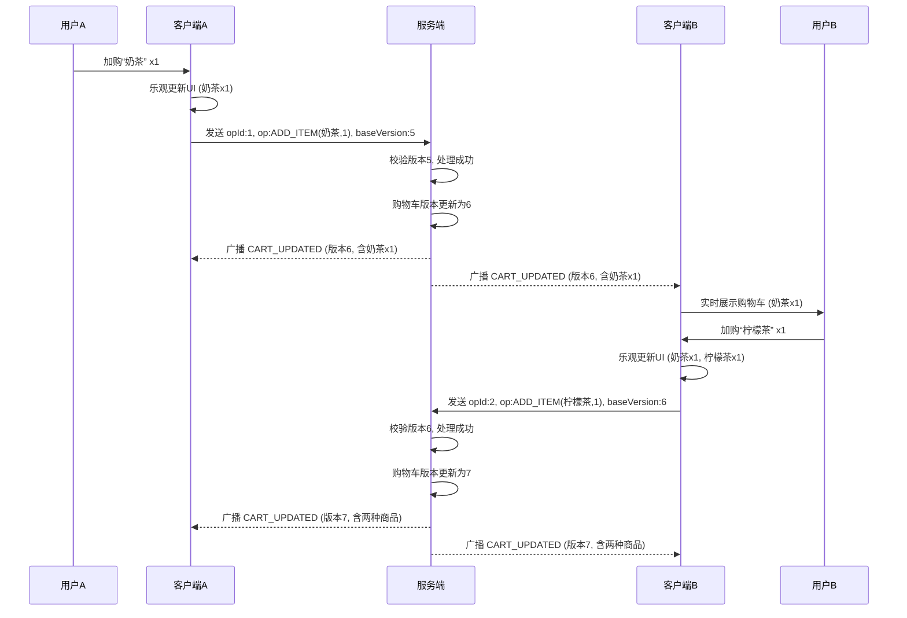
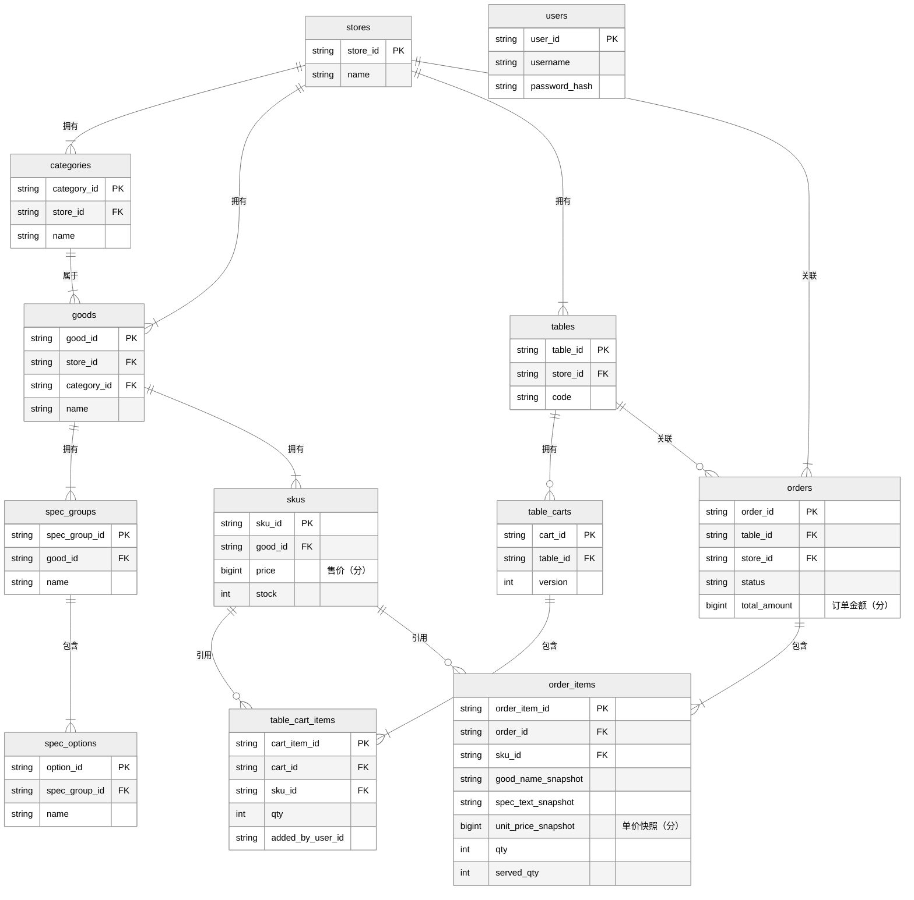
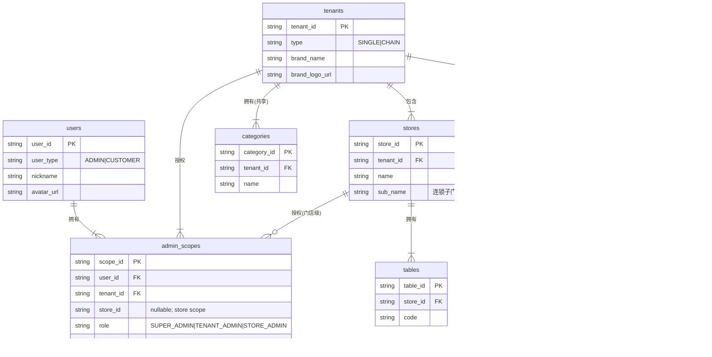

# BiteGo 点点餐：接口与数据库设计规范

版本：当前实现
作者：王锐 (wangrui.1696)
最后更新：2026-03-25

---

## 1. 文档目标与范围

本文档是 BiteGo 点点餐项目的核心技术规范，旨在为前后端（Web 管理端、小程序端）的接口交互与数据库设计提供统一、明确的指导蓝图。其核心目标是定义一套**稳健、一致且可扩展**的数据模型与通信协议，确保项目各模块之间能够高效、可靠地协同工作。

本文档详细定义了以下内容：

1.  **API 总体规范**：涵盖 RESTful API 的设计原则、版本策略、认证授权、通用响应结构、错误码体系及公共约定。
2.  **资源与端点清单**：逐一列出所有核心业务资源（如菜品、订单、桌台等）的 API 端点、请求/响应格式及完整示例。
3.  **WebSocket 协议**：详细说明用于实时协同（如多人共享购物车）的 WebSocket 消息格式、事件类型与版本控制机制。
4.  **数据库设计**：提供基于 MySQL 8.0 的完整数据库表结构、字段定义、索引策略、表间关系 ER 图及示例 DDL。

本规范是所有服务端与客户端开发工作的强制性依据，旨在减少沟通成本、避免实现歧义，并为未来的功能迭代与系统维护奠定坚实基础。

### 1.1. 参考资料

- [《服务端技术文档》](4-服务端技术文档.md)
- [《Web 管理端前端技术文档》](5.1-Web管理端前端技术文档.md)
- [《小程序端前端技术文档》](5.2-小程序端前端技术文档.md)
- [《Web 管理端产品需求文档》](3.1-Web管理端产品需求文档.md)
- [《小程序端产品需求文档》](3.2-小程序端产品需求文档.md)

---

## 2. API 总体规范

所有 API 设计均遵循 RESTful 风格，并与现有服务端技术文档保持一致。

### 2.1. 资源命名与版本

- **资源命名**：URI 中的资源名应为**复数**名词，并采用**小写字母**和**kebab-case**（短横线分隔）命名法。
  - 正确：`/api/v1/goods`, `/api/v1/order-items`
  - 错误：`/api/v1/Good`, `/api/v1/order_items`
- **版本策略**：所有 API 均通过路径进行版本控制，统一使用 `/api/v1` 前缀。
  - 示例：`https://api.bitego.net/api/v1/orders`

### 2.2. 认证与授权

- **认证机制**：除少数公开接口（如登录）外，所有需要认证的 API 必须在 HTTP 请求头的 `Authorization` 字段中携带 `Bearer <JWT>`。
- **授权模型**：采用"角色层级（SUPER_ADMIN > TENANT_ADMIN > STORE_ADMIN）+ 按场景计算能力位（`canManageSharedCatalog`）"的访问控制模型，配合 `CUSTOMER` 登录主体类型，并通过 `tenant/store` 上下文实现数据隔离。

补充：鉴权实现细节（JWT payload、gtv 全局失效、桌台 sessionToken、订单“同桌共享”访问控制、WS 鉴权）详见 [7.5-核心实现-鉴权与安全.md](./7.5-核心实现-鉴权与安全.md)。

补充：多租户（SaaS）总体设计、角色边界、共享数据策略与兼容性约束详见 [7.6-核心实现-平台多租户.md](./7.6-核心实现-平台多租户.md)。

#### 2.2.1 租户/门店上下文约定（强制显式访问）

为满足“单数据库 + tenantId/storeId 的隔离方案”，所有管理端（Web Admin）写入/查询接口都必须显式携带上下文，并由服务端强校验：

- `X-Tenant-Id: <tenantId>`：当前租户/连锁品牌
- `X-Store-Id: <storeId>`：当前门店（门店级数据写入必带；共享数据写入仅带 tenantId）
- `X-Board: platform|tenant|store`：当前管理板块语义；服务端会校验其与 `tenantId/storeId` 是否匹配

约束规则：

- `store_default` 只表示系统初始化生成的默认租户/门店实体；管理端接口不会把“缺失上下文”隐式回落为默认门店。
- 对需要管理上下文的接口（与当前服务端实现一致）：
  - **store 视角**：`X-Store-Id` 必填；`X-Tenant-Id` 可选（若提供则必须等于该门店归属的 tenantId；未提供时服务端会从 store 记录推导 tenantId）；若提供 `X-Board`，必须为 `store`
  - **tenant 视角**：`X-Tenant-Id` 必填；`X-Store-Id` 不应提供；若提供 `X-Board`，必须为 `tenant`
  - **platform 视角**：仅允许 `SUPER_ADMIN` 访问；允许不带 `X-Tenant-Id/X-Store-Id`；`X-Board` 可省略或为 `platform`
- 缺失或错配上下文时，服务端返回 `400 Missing admin context` 或 `400 Invalid admin context`；租户/门店不存在则返回 `404`；越权返回 `403`。
- Web 管理端切换账号或上下文时，必须同步清理 Query 缓存与 WebSocket 状态，避免跨账号/跨租户/跨门店串数据。

### 2.3. 通用约定

#### 2.3.1. 分页、排序与筛选

- **分页**：通过 `page` 和 `pageSize` Query 参数控制。
  - `page` (可选, `number`): 当前页码，从 1 开始，默认 `1`。
  - `pageSize` (可选, `number`): 每页数量，默认 `20`，最大 `100`。
- **排序**：通过 `sortBy` 和 `sortOrder` Query 参数控制。
  - `sortBy` (可选, `string`): 排序字段，如 `createdAt`。
  - `sortOrder` (可选, `string`): 排序顺序，`asc` (升序) 或 `desc` (降序)，默认 `desc`。
- **筛选**：筛选参数直接作为 Query 参数。对于多值筛选，使用逗号 `,` 分隔。
  - 示例：`GET /api/v1/orders?status=Paid,Making`

#### 2.3.2. 幂等与重试

- `GET`, `HEAD`, `OPTIONS`, `PUT`, `DELETE` 方法必须实现幂等性。
- 对于 `POST` 请求（如创建订单），客户端应在请求头中附带一个唯一的 `X-Request-Id` (UUID/GUID)。服务端需利用此 ID 实现幂等性控制，在指定时间窗口内（如 5 分钟）拒绝处理重复的请求 ID，防止因网络重试导致重复创建资源。

### 2.4. 响应结构与 HTTP 状态码

#### 2.4.1. 标准响应结构

所有 API 响应体均遵循统一的 JSON 结构，以便客户端进行标准化处理。

- **成功响应**:

  ```json
  {
    "success": true,
    "code": 0,
    "message": "Success",
    "data": {
      // 业务数据对象或数组
    }
  }
  ```

- **分页列表响应**:

  ```json
  {
    "success": true,
    "code": 0,
    "message": "Success",
    "data": {
      "list": [
        // 列表数据
      ],
      "pagination": {
        "page": 1,
        "pageSize": 20,
        "total": 150
      }
    }
  }
  ```

- **失败响应**:

  ```json
  {
    "success": false,
    "code": 40001,
    "message": "SKU inventory is not enough.",
    "data": null
  }
  ```

#### 2.4.2. HTTP 状态码使用指引

- `200 OK`: 请求成功，适用于 `GET`、`PUT` 等操作。
- `201 Created`: 资源创建成功，适用于 `POST` 操作。
- `204 No Content`: 操作成功，但响应体为空，适用于 `DELETE` 操作。
- `400 Bad Request`: 请求参数无效，如格式错误、缺少必填项。
- `401 Unauthorized`: 未认证或认证凭证（JWT）无效/过期。
- `403 Forbidden`: 已认证，但无权访问该资源。
- `404 Not Found`: 请求的资源不存在。
- `429 Too Many Requests`: 请求过于频繁，触发速率限制。
- `500 Internal Server Error`: 服务端内部发生未知错误。

#### 2.4.3. 标准错误码表

业务错误码 `code` 用于客户端进行精细化的错误处理。

| 错误码  | HTTP 状态码 | 含义                                              |
| :------ | :---------- | :------------------------------------------------ |
| `0`     | 200         | 请求成功                                          |
| `40000` | 400         | 无效请求参数                                      |
| `40001` | 400         | 业务逻辑错误（如库存不足、状态非法）              |
| `40002` | 400         | 桌台会话已关闭或会话 token 无效（需重新扫码入桌） |
| `40003` | 400         | 退款不可用或退款处理中（需等待结果）              |
| `40100` | 401         | 未认证或 Token 无效                               |
| `40101` | 401         | Token 已过期                                      |
| `40300` | 403         | 无权限访问                                        |
| `40400` | 404         | 资源未找到                                        |
| `42900` | 429         | 请求过于频繁                                      |
| `50000` | 500         | 服务器内部错误                                    |

### 2.5. 输入校验与安全

- **字段约束**：所有接收输入的接口（Body, Query, Params）必须对字段进行严格校验，包括**必填性、数据类型、格式（如 email, phone）、长度和数值范围**。
- **安全说明**：服务端必须将所有输入视为不可信，并采取措施防范常见的 Web 攻击，包括但不限于：
  - **SQL 注入**：使用 ORM 或参数化查询。
  - **XSS (跨站脚本)**：对输出到 HTML 的内容进行转义（前端责任），服务端接口应确保返回正确的 `Content-Type: application/json`。
  - **CSRF (跨站请求伪造)**：使用 JWT Bearer Token 机制可有效防范。

---

## 3. 资源与端点清单

本章节逐一列出核心业务资源的 RESTful API 端点定义，包括方法、路径、参数、约束及请求/响应示例。

### 3.1. `Stores` (门店)

门店基础信息需支持在 Web 管理端由管理员维护更新；在多门店场景下，管理端通过显式上下文（`X-Tenant-Id/X-Store-Id`）访问目标门店数据。

#### `GET /api/v1/stores/current`

- **描述**: 获取当前上下文的门店信息（基于域名或用户归属）。
- **认证**: 可选（小程序首页可公开访问；管理端可带 token）
- **响应 (200 OK)**:

  ```json
  {
    "success": true,
    "code": 0,
    "message": "Success",
    "data": {
      "storeId": "store_b7c2f8d9",
      "tenantId": "t_xxx 或 null",
      "tenantType": "SINGLE | CHAIN | null",
      "tenantBrandName": "品牌名 或 null",
      "subName": "子门店子名称 或 null",
      "name": "BiteGo 未来店",
      "displayName": "一点点(南京西路店)",
      "logoUrl": "https://img.bitego.com/logo.png",
      "phone": "18812345678",
      "address": "未来科技城A座101",
      "description": "门店简介（可选）"
    }
  }
  ```

  - `tenantId/tenantType/tenantBrandName/subName`：多租户扩展字段。
  - `displayName`：门店展示名，由服务端按「品牌名(门店名)」拼装（仅 `CHAIN` 租户或存在 `subName` 时拼接品牌名，否则返回 `name`）。前端直接使用该字段即可，无需再本地拼装。

#### `PUT /api/v1/stores/current`

- **描述**: 更新当前门店信息（Web 管理端配置）。
- **认证**: 需要（ADMIN）
- **Body 参数**:
  - `name` (可选, `string`)：`SINGLE` 租户下修改 `name` 时，服务端在同一事务内把该租户的 `brandName` 同步为相同值（门店名为权威来源）。
  - `logoUrl` (可选, `string`)：`CHAIN` 租户下不可修改（由租户品牌 Logo 统一同步），若传入的值与当前 `logoUrl` 不一致将返回 `403` 拒绝写入。
  - `phone` (可选, `string`)
  - `address` (可选, `string`)
  - `description` (可选, `string`)
- **响应 (200 OK)**:
  ```json
  {
    "success": true,
    "code": 0,
    "message": "Updated",
    "data": {
      "storeId": "store_b7c2f8d9"
    }
  }
  ```

#### `GET /api/v1/stores/export`

- **描述**: 全店配置导出（门店搬家/测试环境回滚），服务端生成 JSON 并上传至 CDN。
- **认证**: 需要（ADMIN）
- **导出范围**: `Store/Category/Good/SpecGroup/SpecOption/SharedSpecGroup/SharedSpecOption/GoodSharedSpecGroup/SKU/Table`；不包含订单/用户等业务数据，销量等统计字段清零；默认不导出已删除/停用（`status=INACTIVE`）的配置项（管理端无恢复入口），可通过参数选择是否保留。
- **Query 参数**:
  - `includeInactive` (可选, `0|1|true|false`): 是否包含已删除/停用（`status=INACTIVE`）的配置项；默认 `0`
- **导出格式**: JSON `version=2`，`goods` 内包含 `categoryIds`（多分类映射）。
- **响应 (200 OK)**:
  ```json
  {
    "success": true,
    "code": 0,
    "message": "Exported",
    "data": {
      "key": "exports/store/20260317/store_export_....json",
      "publicUrl": "https://cdn.example.com/exports/store/20260317/store_export_....json",
      "size": 12345
    }
  }
  ```

#### `POST /api/v1/stores/import`

- **描述**: 门店级配置恢复（克隆式）。上传之前导出的 JSON 文件，校验通过后执行“重建 ID + 重建关联”的恢复，避免多租户下 ID 冲突。
- **认证**: 需要（ADMIN）
- **兼容**: 支持导入旧版 `version=1`（会自动将 `goods.categoryId` 转换为单元素 `categoryIds`）。
- **Content-Type**: `multipart/form-data`
- **表单字段**:
  - `file` (必填): 导出的 JSON 文件
- **恢复行为**:
  - 重建配置类 ID：分类/菜品/SKU/规格/共享规格/桌台等，并重建关联关系
  - 清理该门店下的业务数据与配置数据（不影响平台顾客用户与管理员账号）
  - 如配置了微信凭证，恢复后会按 1 次/秒节流重建桌台二维码
- **响应 (200 OK)**:
  ```json
  {
    "success": true,
    "code": 0,
    "message": "Imported",
    "data": {
      "storeId": "store_default",
      "counts": {
        "categories": 10,
        "goods": 50,
        "skus": 120,
        "specGroups": 40,
        "specOptions": 200,
        "tables": 30
      }
    }
  }
  ```

#### `POST /api/v1/stores/reset`

- **描述**: 全店数据清空（等价于导入空 JSON），用于测试环境回滚或门店初始化。
- **认证**: 需要（ADMIN）
- **行为**:
  - 清空分类/菜品/规格/SKU/桌台等配置
  - 清理该门店业务数据
  - 不影响平台顾客用户与管理员账号
- **响应 (200 OK)**:
  ```json
  {
    "success": true,
    "code": 0,
    "message": "Reset",
    "data": {
      "storeId": "store_default",
      "counts": {
        "categories": 0,
        "goods": 0,
        "skus": 0,
        "specGroups": 0,
        "specOptions": 0,
        "tables": 0
      }
    }
  }
  ```

#### `GET /api/v1/platform/snapshot/export`

- **描述**: 平台级快照导出（全库逻辑快照），用于平台备份与测试环境回滚。导出会遍历 TypeORM 已注册的数据表，跳过 `migrations` 与 `store_default_migration_log` 两张基础设施表。
- **认证**: 需要（`SUPER_ADMIN`，平台上下文）
- **响应 (200 OK)**: 返回快照对象在 COS 的 `key/url/bytes`。

#### `POST /api/v1/platform/snapshot/import`

- **描述**: 平台级快照恢复（完全还原，保留所有 ID）。采用“先 DELETE 全部已知表、再按列集合求交集 INSERT”的两阶段逻辑，整条恢复运行在单个事务内（含 `SET FOREIGN_KEY_CHECKS = 0/1`），部分失败会整体回滚。
- **认证**: 需要（`SUPER_ADMIN`，平台上下文）
- **Content-Type**: `multipart/form-data`，字段 `file`
- **行为**:
  - 恢复期间进入平台维护态，并 bump 全局 token version（强制 token 失效）
  - 快照列若在本地模式中不存在则自动丢弃并在响应 `warnings` 中上报（`DROPPED_COLUMNS`），容忍生产侧残留的僵尸列
  - 快照表若在本地模式中不存在则整表跳过并在 `warnings` 中上报（`UNKNOWN_TABLE`）
  - 本地已注册但快照未覆盖的表会在 Phase 1 被清空、Phase 2 无数据可回填，随响应 `warnings` 上报（`MISSING_TABLE`）提醒运维
  - 恢复完成（成功或失败）都会写入一条平台作用域通知（`tenantId=null, storeId=null`），`type` 为 `PLATFORM_RESTORE_SUCCEEDED` 或 `PLATFORM_RESTORE_FAILED`；调用方的 JWT 已因 GTV 递增失效，`warnings`/错误信息通过下次登录拉取 `GET /api/v1/admin/notifications` 看到
- **响应 (200 OK)**:
  ```json
  {
    "success": true,
    "code": 0,
    "message": "Restored",
    "data": {
      "restoredAt": "2026-04-22T04:10:10.393Z",
      "warnings": [
        { "kind": "DROPPED_COLUMNS", "table": "goods", "columns": ["imageUrl"] },
        { "kind": "UNKNOWN_TABLE", "table": "legacy_xxx", "rowCount": 12 },
        { "kind": "MISSING_TABLE", "table": "notifications" }
      ]
    }
  }
  ```

#### `POST /api/v1/platform/snapshot/reset`

- **描述**: 平台级清空（用于恢复前清库或测试环境复位）。清空 TypeORM 已注册的数据表，但保留 `admin_scopes` 与 `users`（管理员与顾客用户账号不受影响）。
- **认证**: 需要（`SUPER_ADMIN`，平台上下文）
- **行为**: 清空期间进入平台维护态，并 bump 全局 token version（强制 token 失效）。

#### `GET /api/v1/tenant/snapshot/export`

- **描述**: 租户级快照导出（连锁），输出为多个门店配置导出组合。
- **认证**: 需要（`TENANT_ADMIN` 及以上，租户上下文）
- **Query 参数**:
  - `includeInactive` (可选, `0|1|true|false`)

#### `POST /api/v1/tenant/snapshot/import`

- **描述**: 租户级快照恢复（克隆式，重建配置类 ID 与关联）。
- **认证**: 需要（`TENANT_ADMIN` 及以上，租户上下文）
- **Content-Type**: `multipart/form-data`，字段 `file`

#### `POST /api/v1/tenant/snapshot/reset`

- **描述**: 租户级清空（克隆式导入空配置到该租户下所有门店）。
- **认证**: 需要（`TENANT_ADMIN` 及以上，租户上下文）

#### `POST /api/v1/tenant/snapshot/import-from-store`

- **描述**: 从独立门店导出恢复到连锁租户的主门店（用于“独立店升级为连锁”）。
- **认证**: 需要（`TENANT_ADMIN` 及以上，租户上下文，且 tenant.type=CHAIN）
- **Content-Type**: `multipart/form-data`，字段 `file`（门店导出 JSON，支持 `StoreExportV2`/兼容 V1）
- **恢复行为**:
  - 清空并软删当前租户下所有门店（含旧主店与子店）
  - 新建一个干净的主门店（生成新 `storeId`，并更新 `tenants.primaryStoreId`）
  - 将独立门店导出数据克隆式导入到新主门店（重建配置类 ID、重建关联；二维码按 1 次/秒节流重建）
- **响应 (200 OK)**:
  ```json
  {
    "success": true,
    "code": 0,
    "message": "Imported",
    "data": {
      "tenantId": "t_xxx",
      "newPrimaryStoreId": "store_xxx",
      "counts": {}
    }
  }
  ```

#### 维护态（Maintenance Mode）

- **触发**: 执行平台/租户/门店的恢复或清空期间，进入对应 scope 的维护态。
- **效果**:
  - 平台维护态：除白名单接口外，对所有请求返回 HTTP `503`（`code=50300`），并断开/拒绝 WS；同时全局 token 失效（gtv bump）
  - 租户/门店维护态：仅拦截写请求（POST/PUT/DELETE…），返回 HTTP `503`（`code=50300`），并断开/拒绝 WS；读请求放行

### 3.2. `Categories` (分类)

#### `GET /api/v1/categories`

- **描述**: 获取门店下的所有菜品分类列表。
- **认证**: 可选（小程序端可公开访问）
- **Query 参数**:
  - `status` (可选, `string`): 按状态筛选，如 `ACTIVE`。
- **排序**: 按 `sort` 字段降序（数字越大越靠前）。
- **响应 (200 OK)**:
  ```json
  {
    "success": true,
    "code": 0,
    "message": "Success",
    "data": {
      "list": [
        {
          "categoryId": "cat_a1b2c3d4",
          "name": "主食",
          "subtitle": "推荐",
          "badgeText": "热",
          "sort": 100
        },
        {
          "categoryId": "cat_e5f6g7h8",
          "name": "饮品",
          "subtitle": null,
          "badgeText": null,
          "sort": 90
        }
      ],
      "pagination": {
        "page": 1,
        "pageSize": 20,
        "total": 2
      }
    }
  }
  ```

#### `POST /api/v1/categories`

- **描述**: 新增分类（Web 管理端）。
- **认证**: 需要（ADMIN）
- **Body 参数**:
  - `name` (必填, `string`)
  - `subtitle` (可选, `string`): 副标题（可为空）
  - `badgeText` (可选, `string`): 小标签（可为空）
  - `sort` (可选, `number`)
  - `status` (可选, `string`): `ACTIVE`/`INACTIVE`
- **响应**: `201 Created` + `{ categoryId }`

#### `PUT /api/v1/categories/{categoryId}`

- **描述**: 更新分类（Web 管理端）。
- **认证**: 需要（ADMIN）
- **Body 参数**:
  - `name` (可选, `string`)
  - `subtitle` (可选, `string`): 副标题（可为空）
  - `badgeText` (可选, `string`): 小标签（可为空）
  - `sort` (可选, `number`)
  - `status` (可选, `string`)
- **响应**: `200 OK` + `{ categoryId }`

#### `DELETE /api/v1/categories/{categoryId}`

- **描述**: 删除分类（逻辑删除：将 status 置为 `INACTIVE`）（Web 管理端）。
- **认证**: 需要（ADMIN）
- **响应**: `200 OK` + `{ categoryId }`

#### `PUT /api/v1/categories/{categoryId}/goods/reorder`

- **描述**: 调整“该分类下菜品展示顺序”（仅在当前分类内生效）。Web 管理端拖拽排序使用。
- **认证**: 需要（ADMIN）
- **Body 参数**:
  - `goodIds` (必填, `string[]`): 排序后的 goodId 列表（从上到下）
- **响应**: `200 OK` + `{ categoryId, goodIdsCount }`

### 3.3. `Goods` & `SKUs` (菜品与商品)

#### `GET /api/v1/goods`

- **描述**: 获取菜品列表，用于小程序点餐页展示。
- **认证**: 可选
- **Query 参数**:
  - `categoryId` (可选, `string`): 按分类筛选。
  - `name` (可选, `string`): 按名称模糊搜索。
  - `status` (可选, `string`): 默认 `ON_SHELF`（小程序侧仅展示可售菜品）。
- **起售价说明**:
  - `minPrice/minPriceCents` = `MIN(SKU.price)` + “必选非库存规格组”的最小加价之和（每组取 `minSelection` 个最小加价）
- **售罄标记**:
  - `soldOut` (`boolean`): 当该菜品下不存在任一 `status=ON_SHELF` 且 `stock>0` 的 SKU 时为 `true`；前端据此将此菜品置灰并排到分类末尾
- **排序**:
  - 指定 `categoryId` 时：按 `good_categories.sort` 降序（数值越大越靠前），再按 `createdAt` 升序兜底
  - 未指定 `categoryId` 时：不保证全局顺序；前端按分类分组后再按分类内排序规则展示
- **响应 (200 OK)**:
  ```json
  {
    "success": true,
    "code": 0,
    "message": "Success",
    "data": {
      "list": [
        {
          "goodId": "good_abcde",
          "name": "招牌珍珠奶茶",
          "description": "精选茶叶，Q弹珍珠",
          "imageUrl": "https://img.bitego.com/xxxx.png",
          "imageUrls": ["https://img.bitego.com/xxxx.png"],
          "categoryId": "cat_e5f6g7h8",
          "categoryIds": ["cat_e5f6g7h8", "cat_featured"],
          "categorySortById": { "cat_e5f6g7h8": 100, "cat_featured": 80 },
          "defaultSkuId": "sku_default_1",
          "sales": 1200,
          "minPrice": "18.00",
          "soldOut": false
        }
      ],
      "pagination": {
        "page": 1,
        "pageSize": 20,
        "total": 1
      }
    }
  }
  ```
  _说明：金额字段标准单位为“分（cents）整数”。为兼容存量调用方，部分字段同时返回 `xxx`（元字符串，两位小数）与 `xxxCents`（分整数）。新开发优先使用 `xxxCents`。_

#### `GET /api/v1/goods/{goodId}`

- **描述**: 获取单个菜品详情，包含其所有规格组、规格项和关联的 SKU 列表。
- **认证**: 可选
- **Path 参数**:
  - `goodId` (必填, `string`): 菜品 ID。
- **响应 (200 OK)**:
  ```json
  {
    "success": true,
    "code": 0,
    "message": "Success",
    "data": {
      "goodId": "good_abcde",
      "name": "招牌珍珠奶茶",
      "description": "精选茶叶，Q弹珍珠",
      "detailMarkdown": "## 口味说明\n\n- 甜度可选\n- 支持加料\n",
      "imageUrl": "https://img.bitego.com/xxxx.png",
      "imageUrls": ["https://img.bitego.com/xxxx.png"],
      "categoryId": "cat_e5f6g7h8",
      "categoryIds": ["cat_e5f6g7h8", "cat_featured"],
      "defaultSkuId": "sku_default_1",
      "sales": 1200,
      "basePrice": "5.00",
      "basePriceCents": 500,
      "status": "ON_SHELF",
      "minPrice": "18.00",
      "minPriceCents": 1800,
      "optionGroups": [
        {
          "id": "og_1",
          "name": "杯型",
          "isRequired": true,
          "minSelection": 1,
          "maxSelection": 1,
          "options": [
            { "id": "op_11", "name": "中杯", "price": "0.00", "priceCents": 0 },
            {
              "id": "op_12",
              "name": "大杯",
              "price": "2.00",
              "priceCents": 200
            }
          ]
        },
        {
          "id": "og_2",
          "name": "甜度",
          "isRequired": true,
          "minSelection": 1,
          "maxSelection": 1,
          "options": [
            {
              "id": "op_21",
              "name": "不加糖",
              "price": "0.00",
              "priceCents": 0
            },
            {
              "id": "op_22",
              "name": "半糖",
              "price": "1.00",
              "priceCents": 100
            }
          ]
        }
      ],
      "skus": [
        {
          "skuId": "sku_1121",
          "specCombination": "中杯 / 不加糖",
          "price": "18.00",
          "priceCents": 1800,
          "stock": 100,
          "status": "ON_SHELF"
        }
        // ... 其他 SKU
      ]
    }
  }
  ```

#### `POST /api/v1/goods`

- **描述**: 新增菜品（Web 管理端）。
- **认证**: 需要（ADMIN）
- **Body 参数**:
  - `categoryIds` (可选, `string[]`): 多分类（至少 1 个）；用于“本店甄选”等活动分类复用同一菜品
  - `categoryId` (可选, `string`): 兼容字段；未传 `categoryIds` 时使用
  - `name` (必填, `string`)
  - `description` (可选, `string`)
  - `detailMarkdown` (可选, `string`): 菜品详情（Markdown），用于小程序端菜品七分屏展示；列表页仍使用 `description` 作为一句话摘要
  - `imageUrls` (可选, `string[]`): 菜品图片列表（多图）；可通过 `POST /api/v1/files` 上传获取 URL
  - `imageUrl` (可选, `string`): 兼容字段（单图），服务端会自动映射为 `imageUrls=[imageUrl]`；响应中 `imageUrl` 为首图
  - `status` (可选, `string`): `ON_SHELF`/`OFF_SHELF`
  - `basePriceCents` (可选, `number`): 基础价格（分，>=0，整数）
  - `basePrice` (可选, `string|number`): 兼容入参（可传元字符串如 `"5.00"` 或分整数如 `500`）
  - `optionGroups` (可选, `array`): 选项组配置；支持“库存规格组/非库存规格组/共享非库存规格组”，仅库存规格组参与 SKU 组合生成；非库存规格组用于下单/加购时叠加加价（PI）。规格/价格/库存与 PI（快照）口径详见 [7.2-核心实现-规格、价格和库存模型.md](./7.2-核心实现-规格、价格和库存模型.md)。
    - 选择规则（支持多选）：
      - `isRequired=true`：`minSelection >= 1`
      - `isRequired=false`：`minSelection = 0`
      - `minSelection <= maxSelection <= options.length`
    - `isStock` (可选, `boolean`): 是否库存规格组；缺省视为 `true`
    - `groupType` (可选, `"custom" | "shared"`): 规格组类型，`shared` 表示共享非库存规格组
    - `sharedSpecGroupId` (可选, `string`): 共享规格组 ID；`groupType=shared` 时必填
    - `disabledOptionIds` (可选, `string[]`): 仅 `groupType=shared` 时有效；禁用的共享规格项（该菜品内不可选）
    - `defaultOptionIds` (可选, `string[]`): 仅 `groupType=shared` 时表示“关联默认规格覆盖”；优先级高于共享规格组自身默认值；若关联默认项被删除，则回退到共享规格组自身默认值
    - `defaultOptionIds` (可选, `string[]`): 该规格组的默认选项（用于前台默认选中）。不设置表示无默认；设置时必须满足：
      - 所有 optionId 必须属于该组 `options`
      - `defaultOptionIds.length <= maxSelection`
      - 若设置了默认（length>0），则必须满足 `defaultOptionIds.length >= minSelection`（必选组一般为 1）
    - `sort` (可选, `number`): 排序值（数字越大越靠前），影响前台展示顺序
    - `options[].priceCents`：推荐，分整数（例如 `200` 表示 `2.00` 元）
    - `options[].price`：兼容入参（可传元字符串或分整数）；响应会同时返回 `price`（元字符串）与 `priceCents`（分）

示例（可选多选“加料”，最多选 2 个）：

```json
{
  "optionGroups": [
    {
      "id": "og_topping",
      "name": "加料",
      "isStock": false,
      "isRequired": false,
      "minSelection": 0,
      "maxSelection": 2,
      "options": [
        { "id": "op_pearl", "name": "珍珠", "priceCents": 100 },
        { "id": "op_coconut", "name": "椰果", "priceCents": 100 },
        { "id": "op_pudding", "name": "布丁", "priceCents": 200 }
      ]
    }
  ]
}
```

- **响应**: `201 Created` + `{ goodId, skuRebuild? }`
  - 服务端会生成 SKU：
    - `optionGroups` 缺失或为空数组时：自动生成 1 个默认 SKU（`specCombination="默认"`），价格=基础价
    - `optionGroups` 非空时：仅按“库存规格组”生成 SKU；SKU 价格按“基础价 + 库存规格加价”计算
  - `good.defaultSkuId` 为历史兼容字段（已废弃为“默认选择”来源），前台默认选择改为按 `optionGroups[].defaultOptionIds` 控制
  - 若发生“结构变更”会触发 SKU 重建；若仅变更加价/名称则只做 SKU 派生字段同步（主要是价格），不会删除历史 SKU（见下方 PUT 说明）。

#### `PUT /api/v1/goods/{goodId}`

- **描述**: 更新菜品（Web 管理端）。
- **认证**: 需要（ADMIN）
- **Body 参数**: `categoryIds/categoryId/name/description/detailMarkdown/imageUrls/imageUrl/status/basePriceCents/basePrice/optionGroups`（均可选）
  - `imageUrls[0]` 约定为封面图（列表默认展示），前端如需“设为封面”只需将目标图片移动到数组第 1 位即可
- **结构变更（会触发破坏性重建）**（当 Body 里包含 `optionGroups` 且影响“库存规格组”的 SKU 组合集合时，例如新增/删除库存规格组、增删库存规格值、调整必选与选择数量约束、切换规格组类型等）：
  - 删除该菜品下所有历史 SKU（硬删除）
  - 基于新规则重新生成完整 SKU 集合
  - 库存/价格/上下架状态等 SKU 级配置将被清空并重置（新 SKU 默认 `stock=0,status=OFF_SHELF`，价格按规则计算）
  - 整体在事务中执行，确保原子性；同时写入变更日志（操作人 + 变更前后快照）
- **非结构变更（不会重建）**（仅修改规格加价/规格名称/规格组名称时）：
  - 保留原 SKU（skuId/库存/上下架不变），仅同步派生字段（主要是价格；显示用规格串也会随名称变化更新）
- **响应**: `200 OK` + `{ goodId, skuRebuild? }`
  - `skuRebuild`：`{ skuRebuilt: boolean, skuDeletedCount: number, skuCreatedCount: number, skuPriceUpdatedCount: number }`

#### `GET /api/v1/shared-spec-groups`

- **描述**: 获取共享非库存规格组列表（Web 管理端）。
- **认证**: 需要（ADMIN）
- **Query 参数**:
  - `status` (可选, `string`): 默认 `ACTIVE`
- **响应**: `200 OK` + `{ list: SharedSpecGroup[] }`，每项包含 `options` 与 `goodsCount`

#### `GET /api/v1/shared-spec-groups/{sharedSpecGroupId}`

- **描述**: 获取共享规格组详情（含关联菜品列表）。
- **认证**: 需要（ADMIN）
- **响应**: `200 OK` + `SharedSpecGroupDetail`（含 `goods: [{ goodId, name }]`）

#### `POST /api/v1/shared-spec-groups`

- **描述**: 新增共享非库存规格组。
- **认证**: 需要（ADMIN）
- **Body 参数**:
  - `name` (必填, `string`)
  - `isRequired/minSelection/maxSelection/defaultOptionIds/options`：与 `optionGroups` 规则一致
- **响应**: `201 Created` + `{ sharedSpecGroupId }`

#### `PUT /api/v1/shared-spec-groups/{sharedSpecGroupId}`

- **描述**: 更新共享非库存规格组。
- **认证**: 需要（ADMIN）
- **Body 参数**: 同 `POST /api/v1/shared-spec-groups`
- **响应**: `200 OK` + `{ sharedSpecGroupId }`

#### `DELETE /api/v1/shared-spec-groups/{sharedSpecGroupId}`

- **描述**: 删除共享非库存规格组（仅在无关联菜品时允许）。
- **认证**: 需要（ADMIN）
- **响应**: `200 OK` + `{ sharedSpecGroupId }`

#### `DELETE /api/v1/goods/{goodId}`

- **描述**: 删除菜品（逻辑删除：将 status 置为 `OFF_SHELF`）（Web 管理端）。
- **认证**: 需要（ADMIN）
- **响应**: `200 OK` + `{ goodId }`

#### `GET /api/v1/skus`

- **描述**: 获取 SKU 列表（Web 管理端）。
- **认证**: 需要（ADMIN）
- **多租户上下文（管理端）**: 必须显式携带 `X-Tenant-Id/X-Store-Id`，服务端仅返回当前门店菜品下的 SKU。
- **Query 参数**:
  - `goodId` (可选, `string`)
  - `keyword` (可选, `string`): 按 `skuId/specCombination` 模糊搜索
  - `page/pageSize` (可选)
- **响应**: `200 OK` + `list/pagination`

#### `POST /api/v1/skus`

- **描述**: 新增 SKU（Web 管理端）。
- **认证**: 需要（ADMIN）
- **多租户上下文（管理端）**: 必须显式携带 `X-Tenant-Id/X-Store-Id`，且 `goodId` 必须属于当前门店。
- **Body 参数**:
  - `goodId` (必填, `string`)
  - `specCombination` (可选, `string`)
  - `priceCents` (可选, `number`): 价格（分，>=0，整数）
  - `price` (可选, `string|number`): 兼容入参（可传元字符串或分整数）
  - `stock` (可选, `number`)
  - `status` (可选, `string`): `ON_SHELF`/`OFF_SHELF`
- **响应**: `201 Created` + `{ skuId }`

#### `PUT /api/v1/skus/bulk`

- **描述**: 批量更新 SKU（Web 管理端）。用于批量上下架/批量设置库存/库存快捷增量，避免前端对大量 SKU 逐条发请求。
- **认证**: 需要（ADMIN）
- **多租户上下文（管理端）**: 必须显式携带 `X-Tenant-Id/X-Store-Id`，仅允许操作当前门店菜品下的 SKU。
- **Body 参数**:
  - `skuIds` (必填, `string[]`): 需要更新的 skuId 列表
  - `status` (可选, `string`): `ON_SHELF`/`OFF_SHELF`
  - `stock` (可选, `number`): 设置库存（>=0 整数）
  - `stockDelta` (可选, `number`): 库存增量（整数，非 0；与 `stock` 互斥；最终库存不会低于 0）
- **响应**: `200 OK` + `{ affected, skuIdsCount }`

#### `PUT /api/v1/skus/{skuId}`

- **描述**: 更新 SKU（Web 管理端）。
- **认证**: 需要（ADMIN）
- **多租户上下文（管理端）**: 必须显式携带 `X-Tenant-Id/X-Store-Id`，仅允许操作当前门店菜品下的 SKU。
- **Body 参数**: `specCombination/priceCents/price/stock/status`（均可选）
- **响应**: `200 OK` + `{ skuId }`

#### `DELETE /api/v1/skus/{skuId}`

- **描述**: 删除 SKU（逻辑删除：将 status 置为 `OFF_SHELF`）（Web 管理端）。
- **认证**: 需要（ADMIN）
- **多租户上下文（管理端）**: 必须显式携带 `X-Tenant-Id/X-Store-Id`，仅允许操作当前门店菜品下的 SKU。
- **响应**: `200 OK` + `{ skuId }`

### 3.4. `Tables` (桌台)

#### `GET /api/v1/tables`

- **描述**: 获取桌台列表（Web 管理端）。
- **认证**: 需要（ADMIN）
- **Query 参数**:
  - `status` (可选, `string`): 逗号分隔筛选，如 `FREE,OCCUPIED`
  - `page/pageSize` (可选)
- **响应**: `200 OK` + `list/pagination`（list 每项包含 `tableId/code/status/sessionVersion/qrcodeUrl`）

#### `POST /api/v1/tables`

- **描述**: 新增桌台（Web 管理端）。
- **认证**: 需要（ADMIN）
- **Body 参数**:
  - `code` (必填, `string`): 桌号（门店内唯一）
  - `status` (可选, `string`): 默认 `FREE`
- **响应**: `201 Created` + `{ tableId, qrcodeUrl }`

#### `POST /api/v1/tables/{tableId}/qrcode`

- **描述**: 重新生成桌台二维码（Web 管理端）。
- **认证**: 需要（ADMIN）
- **Body 参数**:
  - `envVersion` (可选, `string`): 小程序二维码环境版本，枚举 `release|trial|develop`
- **响应**: `200 OK` + `{ tableId, qrcodeUrl, envVersion }`

#### `PUT /api/v1/tables/{tableId}`

- **描述**: 更新桌台（Web 管理端）。
- **认证**: 需要（ADMIN）
- **Body 参数**: `code/status`（可选）
- **响应**: `200 OK` + `{ tableId }`

#### `GET /api/v1/tables/{tableId}`

- **描述**: 获取桌台信息，通常在小程序扫码后调用。
- **认证**: 可选（桌台会话初始化可匿名访问；敏感操作仍需用户 token）
- **Path 参数**:
  - `tableId` (必填, `string`): 桌台 ID。
- **错误响应**:
  - `404 Not Found`: 桌台不存在（禁止通过该接口创建新桌台）。
- **响应 (200 OK)**:

  ```json
  {
    "success": true,
    "code": 0,
    "message": "Success",
    "data": {
      "tableId": "tbl_9f8e7d6c",
      "code": "A01",
      "status": "OCCUPIED",
      "sessionVersion": 12,
      "sessionToken": "tsess_xxx",
      "qrcodeUrl": "https://cdn.example.com/qrcode/table/tbl_xxx_1710000000000.png",
      "storeId": "store_xxx",
      "store": {
        "storeId": "store_xxx",
        "tenantId": "t_xxx 或 null",
        "tenantType": "SINGLE | CHAIN | null",
        "tenantBrandName": "品牌名 或 null",
        "subName": "子门店子名称 或 null",
        "name": "门店名称",
        "displayName": "品牌名(门店名称) 或 门店名称",
        "logoUrl": "https://... 或 null",
        "phone": "18812345678",
        "address": "门店地址",
        "description": "门店简介 或 null"
      },
      "wasFree": true,
      "connCount": 1,
      "activeOrderCount": 0
    }
  }
  ```

  - `store.displayName`：由服务端统一拼装的门店展示名（`CHAIN` 租户为「品牌名(门店名)」，其他情况为 `name`），小程序端直接使用。
  - `wasFree`：本次请求前桌台是否处于 `FREE`（若为 true，服务端会在本次请求中将桌台状态更新为 `OCCUPIED`）。
  - `connCount`：该桌台当前小程序会话 WebSocket 活跃连接数。
  - `activeOrderCount`：该桌台当前活跃订单数（用于小程序端“占用提示/关台提示”等轻量判断）。

_说明：服务端通过递增 `sessionVersion` 并更换 `sessionToken` 来强制结束当前桌台会话；小程序端必须使用 `sessionToken` 建立桌台会话连接与提交协同操作，避免强制清台后继续操作旧会话。_
桌台协同会话的完整机制说明（WS 协议、并发与幂等、下单同步、订单可见性）见 [7.1-核心实现-桌台协同会话.md](./7.1-核心实现-桌台协同会话.md)。

#### `POST /api/v1/tables/{tableId}/clear`

- **描述**: 关台/清台（Web 管理端操作）。仅允许在无活跃订单（Created/Paid/Making）时执行，结束当前桌台会话并踢出所有在线用户端。
- **认证**: 需要（ADMIN）
- **错误响应**:
  - `409 Conflict`: 存在活跃订单，禁止关台（需改用强制清台）。
- **响应 (200 OK)**: 同 `force-clear`

#### `POST /api/v1/tables/{tableId}/force-clear`

- **描述**: 强制清台（Web 管理端操作）。结束当前桌台会话并踢出所有在线用户端。
- **认证**: 需要（ADMIN）
- **Body 参数**:
  - `reason` (可选, `string`): 强制清台原因。
- **响应 (200 OK)**:
  ```json
  {
    "success": true,
    "code": 0,
    "message": "Cleared",
    "data": {
      "tableId": "tbl_9f8e7d6c",
      "status": "FREE",
      "sessionVersion": 13
    }
  }
  ```

### 3.5. `TableCarts` (桌台购物车) - WebSocket

桌台购物车的实时同步通过 WebSocket 实现。

- **连接地址**: `wss://api.bitego.net/ws/table-session`
- **连接参数**: `?token=<jwt>&tableId=<tableId>&sessionToken=<sessionToken>`
- **见 4. 接口文档说明**

### 3.6. `Orders` (订单)

#### `POST /api/v1/orders`

- **描述**: 创建订单（小程序端提交购物车）。
- **认证**: 需要
- **请求头**: `X-Request-Id: <unique-client-id>` (幂等性保证)
- **Body 参数**:
  - `tableId` (必填, `string`): 桌台 ID。
  - `cartVersion` (必填, `number`): 提交时购物车的版本号，用于乐观锁。
  - `remark` (可选, `string`): 订单备注。
  - `paymentMethod` (可选, `string`): 支付方式，枚举 `WECHAT`、`ALIPAY`、`OTHER`。

_说明：为保证“添加人提示”和价格/库存校验的一致性，订单明细应以服务端保存的桌台购物车（TableCart）为准。客户端仅提交 `tableId + cartVersion`，服务端读取该版本对应的购物车快照生成订单与订单明细（含 `addedBy` 快照字段、商品名称/规格/单价快照）。当前实现采用模拟支付：创建订单后立即生成支付流水并将订单状态更新为 `Paid`。_
_协同会话同步：创建订单成功后，服务端会通过桌台会话 WebSocket（`/ws/table-session`）广播 `ORDER_CREATED` 与一次 `CART_UPDATED`（空 items + 新 version），用于清空同桌其他用户的购物车视图并推进版本。_

- **响应 (201 Created)**:
  ```json
  {
    "success": true,
    "code": 0,
    "message": "Order created successfully.",
    "data": {
      "orderId": "ord_fghij",
      "orderNo": "202603101030001",
      "status": "Paid",
      "paidAt": "2026-03-10T10:30:15.456Z",
      "paymentId": "pay_123"
    }
  }
  ```

#### `GET /api/v1/orders`

- **描述**: 获取订单列表（Web 管理端 / 小程序端）。
- **认证**: 需要
- **多租户上下文（管理端）**: ADMIN 场景下必须显式携带 `X-Tenant-Id/X-Store-Id`，服务端按 store 维度过滤订单，禁止跨门店隐式访问。
- **Query 参数**:
  - `status` (可选, `string`): 多个状态用 `,` 分隔。
  - `tableId` (可选, `string`)
  - `createdAtFrom` (可选, `string`): 下单时间起（ISO 8601）。
  - `createdAtTo` (可选, `string`): 下单时间止（ISO 8601）。
  - `tableSessionVersion` (可选, `number`): 桌台会话版本过滤（用于“本次开台”范围内的订单）。
  - `sessionToken` (可选, `string`): 桌台会话 token（小程序端“本桌订单”使用）。当携带 `tableId + tableSessionVersion + sessionToken` 且校验通过时，CUSTOMER 可查看该桌本次会话内的全部订单；否则 CUSTOMER 仅能查看自己下的订单。
  - `page`, `pageSize`, `sortBy`, `sortOrder`
- **响应 (200 OK)**: 分页结构（此处省略）；
  - 列表项包含 `tableId/tableCode` 与时间字段 `createdAt/paidAt/completedAt/canceledAt/refundedAt`，便于前端展示桌台信息与订单时间轴。
  - 列表项包含支付方信息：`payerUserId/payerNickname/payerAvatarUrl`（其中 nickname/avatarUrl 可能为 null）。
  - 列表项包含汇总字段：`totalQty`（订单内商品总数量）与 `remark`（备注，可为空）。
  - CUSTOMER 场景列表项额外包含门店与连锁品牌信息（历史订单跨门店展示）：
    - `storeId/storeName/storeLogoUrl`：下单门店 ID/门店名称/门店 Logo。
    - `storeDisplayName`：服务端拼装的门店展示名（`CHAIN` 租户为「品牌名(门店名)」，其他情况为 `storeName`），前端直接使用。
    - `tenantId/tenantBrandName/storeSubName`：连锁租户（品牌）ID/品牌名/子门店子名称（保留以兼容旧端）。

#### `GET /api/v1/orders/export`

- **描述**: 订单列表导出（CSV/Excel）。
- **认证**: 需要（ADMIN）
- **多租户上下文（管理端）**: 必须显式携带 `X-Tenant-Id/X-Store-Id`，仅导出当前门店订单。
- **Query 参数**: 复用 `GET /api/v1/orders` 的筛选参数，额外支持：
  - `format` (可选, `string`): `csv|xls`，默认 `csv`（`xls` 为可被 Excel 打开的制表符格式）。

#### `GET /api/v1/orders/{orderId}/export`

- **描述**: 导出订单明细（CSV/Excel）。
- **认证**: 需要（ADMIN）
- **多租户上下文（管理端）**: 必须显式携带 `X-Tenant-Id/X-Store-Id`，仅允许导出当前门店订单。
- **Query 参数**:
  - `format` (可选, `string`): `csv|xls`，默认 `csv`。
  - 字段至少包含：订单号、菜品名称、规格、SKU 标识（可选）、单价、数量、小计。

#### `GET /api/v1/orders/{orderId}`

- **描述**: 获取订单详情。
- **认证**: 需要
- **Query 参数**:
  - `sessionToken` (可选, `string`): 桌台会话 token（小程序端查看同桌他人订单详情时使用）。
- **响应 (200 OK)**:
  ```json
  {
    "success": true,
    "code": 0,
    "message": "Success",
    "data": {
      "orderId": "ord_fghij",
      "orderNo": "202603101030001",
      "status": "Paid",
      "storeId": "store_xxx",
      "tenantId": "t_xxx",
      "tenantBrandName": "一点点",
      "storeSubName": "点点餐店",
      "storeName": "主门店",
      "storeDisplayName": "一点点(主门店)",
      "storeLogoUrl": "https://... 或 null",
      "tableId": "tbl_9f8e7d6c",
      "tableCode": "B01",
      "payerUserId": "usr_1",
      "payerNickname": "小明",
      "payerAvatarUrl": "https://...",
      "totalAmount": "36.00",
      "remark": "少冰",
      "createdAt": "2026-03-10T10:30:00.123Z",
      "paidAt": "2026-03-10T10:30:15.456Z",
      "completedAt": null,
      "canceledAt": null,
      "refundedAt": null,
      "items": [
        {
          "orderItemId": "oi_klmno",
          "goodNameSnapshot": "招牌珍珠奶茶",
          "specTextSnapshot": "中杯 / 半糖",
          "unitPriceSnapshot": "18.00",
          "qty": 2,
          "servedQty": 0,
          "addedByNicknameSnapshot": "小明",
          "addedByAvatarSnapshot": "https://..."
        }
      ]
    }
  }
  ```

#### `PUT /api/v1/orders/{orderId}/status`

- **描述**: 修改订单状态（Web 管理端操作）。
- **认证**: 需要
- **多租户上下文（管理端）**: 必须显式携带 `X-Tenant-Id/X-Store-Id`，仅允许操作当前门店订单。
- **Body 参数**:
  - `status` (必填, `string`): 目标状态，如 `Making`, `Completed`, `Canceled`。
  - `reason` (可选, `string`): 操作原因。
  - `remark` (可选, `string`): 备注（用于审计记录与详情页展示）。
- **响应 (200 OK)**:
  ```json
  {
    "success": true,
    "code": 0,
    "message": "Status updated.",
    "data": {
      "orderId": "ord_fghij",
      "status": "Making"
    }
  }
  ```

#### `POST /api/v1/orders/{orderId}/items/{orderItemId}/serve`

- **描述**: 上菜（后厨工作台快捷操作）。用于将订单明细的 `servedQty` 增加或直接置为已上齐。
- **认证**: 需要（ADMIN）
- **请求头**: `X-Request-Id: <unique-client-id>` (建议，幂等性保证)
- **Body 参数**:
  - `mode` (可选, `string`): `INCREMENT`（默认）或 `SET_ALL`。
  - `qty` (可选, `number`): 当 `mode=INCREMENT` 时表示增量，默认 `1`。
- **约束**:
  - `0 <= servedQty <= qty`，不允许超量上菜。
  - 对 `Canceled/Refunded/Completed` 的订单禁止上菜。
  - 自动流转（若启用）：首次上菜且订单为 `Paid` 时自动流转为 `Making`；当订单内所有明细均满足 `servedQty == qty` 时自动流转为 `Completed`。
- **响应 (200 OK)**:
  ```json
  {
    "success": true,
    "code": 0,
    "message": "Served.",
    "data": {
      "orderId": "ord_fghij",
      "orderItemId": "oi_klmno",
      "servedQty": 1,
      "orderStatus": "Making"
    }
  }
  ```

#### `GET /api/v1/orders/{orderId}/status-logs`

- **描述**: 获取订单状态流转记录（用于详情页“状态流转记录”展示）。
- **认证**: 需要（ADMIN 或 CUSTOMER；非 ADMIN 仅允许访问本人订单）
- **多租户上下文（管理端）**: ADMIN 场景必须显式携带 `X-Tenant-Id/X-Store-Id`。

#### `POST /api/v1/orders/{orderId}/refunds`

- **描述**: 申请退款（小程序端/管理端均可触发）。当前实现为“模拟退款 + 审核”：申请后进入退款中，需 Web 管理端审核通过后才进入退款处理。
- **认证**: 需要（CUSTOMER 或 ADMIN）
- **请求头**: `X-Request-Id: <unique-client-id>` (建议，幂等性保证)
- **Body 参数**:
  - `reason` (可选, `string`): 退款原因。
- **约束**:
  - 仅允许对 `Paid` 状态订单申请退款。
  - 申请成功后订单状态进入 `Refunding`，退款流水进入 `REVIEWING`（待审核）。
  - 重复申请需幂等：同一订单存在进行中的退款流水（`REVIEWING/PENDING`）时，返回当前退款单结果，避免生成多条进行中记录。
- **响应 (202 Accepted)**:
  ```json
  {
    "success": true,
    "code": 0,
    "message": "Refund requested.",
    "data": {
      "orderId": "ord_fghij",
      "refundId": "ref_456",
      "status": "REVIEWING"
    }
  }
  ```

#### `GET /api/v1/orders/{orderId}/refunds`

- **描述**: 获取订单的退款流水列表（用于管理端审核与查看驳回历史）。
- **认证**: 需要（CUSTOMER 或 ADMIN；非 ADMIN 仅可查询本人订单）
- **响应 (200 OK)**:
  ```json
  {
    "success": true,
    "code": 0,
    "message": "Success",
    "data": {
      "list": [
        {
          "refundId": "ref_456",
          "orderId": "ord_fghij",
          "amount": "12.34",
          "status": "REJECTED",
          "reason": "申请原因",
          "reviewRejectReason": "驳回原因",
          "requestedAt": "2026-01-01T00:00:00.000Z"
        }
      ]
    }
  }
  ```

#### `PUT /api/v1/orders/{orderId}/refunds/{refundId}/review`

- **描述**: Web 管理端审核退款申请。
- **认证**: 需要（ADMIN）
- **Body 参数**:
  - `decision` (必填, `string`): `APPROVE` 或 `REJECT`
  - `reason` (可选, `string`): 审核驳回原因（`decision=REJECT` 时建议必填）
- **规则**:
  - 仅允许对 `status=REVIEWING` 的退款单进行审核。
  - 审核通过：退款单状态更新为 `PENDING`，进入模拟退款处理（10 秒后由 worker 更新为 `SUCCESS` 并将订单状态流转为 `Refunded`）。
  - 审核不通过：退款单状态更新为 `REJECTED`，订单状态回退为 `Paid`，并记录驳回原因供后续查询。
  - 退款完成（订单进入 `Refunded`）后需回退库存占用：按订单明细将对应 `SKU.stock` 加回，确保退款后可再次购买。

### 3.7. 用户、角色与权限

_说明：为支持 RBAC 最小闭环，提供以下基础接口，具体实现细节可根据认证库（如 Passport.js）调整。_

#### `POST /api/v1/auth/login`

- **描述**: 用户登录。
- **认证**: 不需要
- **Body**: `username`, `password`
- **响应**: 返回 JWT。
  - 多管理员：校验 `users.userType=ADMIN` 的账号密码（`verifyPassword` 对存储哈希做定时安全比较）。`ADMIN_USERNAME/ADMIN_PASSWORD` 仅在 `admin_1` 不存在或其 `passwordHash` 为空/格式无效时作为首次引导凭据使用；一旦设定了真实密码，env 凭据即失效，不会再被用于登录或覆盖已有哈希。

#### `POST /api/v1/auth/wechat/login`

- **描述**: 微信小程序登录。小程序端通过 `wx.login()` 获取 `code` 后调用该接口，服务端调用微信 `jscode2session` 换取 `openid/session_key`，并签发业务 JWT（`role=CUSTOMER`）。
- **认证**: 不需要
- **Body**:
  ```json
  {
    "code": "wx.login code",
    "nickname": "可选，用户昵称",
    "avatarUrl": "可选，用户头像 URL"
  }
  ```
- **响应 (200 OK)**:
  ```json
  {
    "success": true,
    "code": 0,
    "message": "Login successful.",
    "data": {
      "token": "jwt-token",
      "user": {
        "userId": "usr_xxx",
        "nickname": "小明",
        "avatarUrl": "https://..."
      }
    }
  }
  ```
- **错误码约定**:
  - `40000`：入参非法（缺少/非法 `code`）
  - `40001`：微信登录失败（如 code 过期/已使用、微信返回错误码）
  - `50000`：服务端配置/网络错误（如未配置 `WX_MINIPROGRAM_APPID/SECRET`）
- **实现要点**:
  - `session_key` **不下发**；服务端将 `session_key` 写入 Redis（key：`wxsk:<userId>`），用于后续解密手机号等能力。
  - `code` 为一次性凭证；服务端会对已使用 code 做短期去重（Redis key：`wxcode:<code>`，TTL 5 分钟）。

#### `GET /api/v1/users/me`

- **描述**: 获取当前登录用户信息。
- **认证**: 需要
- **响应**: 返回 `userId`, `userType`, `nickname`, `avatarUrl` 等（以服务端用户资料为准）。`role` 字段已废弃且禁止用于权限判断。

#### `PUT /api/v1/users/me/profile`

- **描述**: 更新当前用户的昵称与头像（小程序端用于完善“添加人”展示）。
- **认证**: 需要（Bearer Token，CUSTOMER）
- **Body**:
  ```json
  {
    "nickname": "张三",
    "avatarUrl": "https://cdn.example.com/images/avatars/20260316/usr_xxx_uuid.webp"
  }
  ```
- **响应 (200 OK)**:
  ```json
  {
    "success": true,
    "code": 0,
    "message": "Updated",
    "data": {
      "token": "jwt_token",
      "user": {
        "userId": "usr_1",
        "role": "CUSTOMER",
        "nickname": "张三",
        "avatarUrl": "https://..."
      }
    }
  }
  ```

#### `PUT /api/v1/admin/me/password`

- **描述**: Web 管理端管理员修改密码。
- **认证**: 需要（Bearer Token，ADMIN）
- **Body**:
  ```json
  { "oldPassword": "old", "newPassword": "new_password" }
  ```
- **响应**: `200 OK`

#### `GET /api/v1/admin/users`

- **描述**: 管理端用户管理列表（可筛选 CUSTOMER/ADMIN）。
- **认证**: 需要（Bearer Token，ADMIN，`SUPER_ADMIN`）
- **多租户上下文（管理端）**: 必须显式携带 `X-Tenant-Id/X-Store-Id`（用于解析 admin 上下文；该接口本身为平台能力，不按 store 过滤数据）。
- **Query**: `userType`（可选：`CUSTOMER|ADMIN`）、`keyword`（可选）、`page/pageSize`
- **响应**: 列表 + 分页信息（不返回 `passwordHash`）
  - CUSTOMER 场景：建议返回 `wechatOpenid/unionid` 便于在管理端展示“微信ID”；“上次登录时间”使用 `lastLoginAt`（精确记录登录时间）。

#### `POST /api/v1/admin/users`

- **描述**: 新增管理员账号。
- **认证**: 需要（Bearer Token，ADMIN，`SUPER_ADMIN`）
- **Body**:
  ```json
  {
    "username": "admin2",
    "password": "******",
    "nickname": "张三",
    "avatarUrl": "https://..."
  }
  ```

#### `DELETE /api/v1/admin/users/{userId}`

- **描述**: 删除管理员账号（禁止删除当前登录账号；仅允许删除 `userType=ADMIN`）。
- **认证**: 需要（Bearer Token，ADMIN，`SUPER_ADMIN`）

#### `GET /api/v1/admin/users/search`

- **描述**: 搜索已有账号（用于租户/门店视角“绑定已有账号”）。
- **认证**: 需要（Bearer Token，ADMIN）
- **权限**: 任一 `ACTIVE` 作用域（`SUPER_ADMIN` / `TENANT_ADMIN` / `STORE_ADMIN`）。
- **Query**: `keyword`（可选）、`page/pageSize`

#### `GET /api/v1/admin/users/username-available`

- **描述**: 校验用户名是否可用（用于创建管理员前置校验）。
- **认证**: 需要（Bearer Token，ADMIN）
- **权限**: 任一 `ACTIVE` 作用域（`SUPER_ADMIN` / `TENANT_ADMIN` / `STORE_ADMIN`）。
- **Query**: `username`（必填）

#### `PUT /api/v1/admin/users/{userId}/profile`

- **描述**: 编辑其它管理员的 `nickname`/`avatarUrl`（自己的资料应走 `PUT /api/v1/users/me/profile`，此接口在 `userId = 当前登录用户` 时返回 400）。
- **认证**: 需要（Bearer Token，ADMIN）
- **权限**: 调用者需具备 `STORE_ADMIN` 及以上角色，且目标用户在调用者作用域内至少存在一条 `ACTIVE` 的 AdminScope——
  - `SUPER_ADMIN`：免作用域校验；
  - `TENANT_ADMIN`：目标需在 `X-Tenant-Id` 租户下存在 scope；
  - `STORE_ADMIN`：目标需在 `X-Tenant-Id` + `X-Store-Id` 门店下存在 scope。
- **Body**（`nickname` / `avatarUrl` 至少传一个；传空串等价于清空）:
  ```json
  { "nickname": "新昵称", "avatarUrl": "https://..." }
  ```
- **错误**: `400 Invalid nickname`（> 20 字符）、`400 Invalid avatarUrl`（> 500 字符）、`403 Forbidden`（目标不在调用者授权范围内）、`404 User not found`。

#### `POST /api/v1/admin/users/{userId}/reset-password`

- **描述**: 为其它管理员重置密码（自己的密码应走 `PUT /api/v1/admin/me/password`）。
- **认证**: 需要（Bearer Token，ADMIN）
- **权限**: 同 `PUT /api/v1/admin/users/{userId}/profile`。
- **Body**:
  ```json
  { "newPassword": "new_password" }
  ```
- **错误**: `400 Invalid newPassword`（< 6 字符）、`403 Forbidden`、`404 User not found`。

#### `GET /api/v1/tenant/users/{userId}`

- **描述**: 租户视角下查看某个管理员的详情与其在当前租户下的全部 `ACTIVE` AdminScope 列表。
- **认证**: 需要（Bearer Token，ADMIN，`TENANT_ADMIN` 及以上）
- **多租户上下文**: 必填 `X-Tenant-Id`。
- **响应**: `{ user, scopes[] }`；`scopes[]` 含 `scopeId/tenantId/storeId/storeName/role/status/createdAt/updatedAt`，便于 UI 直接展示"在哪家门店担任何种角色"。
- **错误**: `403 Forbidden`（目标在该租户下没有任何 scope）、`404 User not found`。

#### `GET /api/v1/store/users/{userId}`

- **描述**: 门店视角下查看某个管理员在本店的详情与 AdminScope 列表。
- **认证**: 需要（Bearer Token，ADMIN，`STORE_ADMIN` 及以上）
- **多租户上下文**: 必填 `X-Tenant-Id` + `X-Store-Id`。
- **响应**: 同 `GET /api/v1/tenant/users/{userId}`，但 `scopes` 限制在当前门店范围内。

#### `GET /api/v1/platform/users`

- **描述**: 平台用户管理列表（默认 `userType=ADMIN`；可筛选 CUSTOMER/ADMIN）。
- **认证**: 需要（Bearer Token，ADMIN，`SUPER_ADMIN`）
- **Query**: `userType`（可选：`CUSTOMER|ADMIN`）、`keyword`（可选）、`page/pageSize`

#### `GET /api/v1/platform/users/{userId}`

- **描述**: 获取平台用户详情，并返回该用户 ACTIVE scopes（便于平台配置授权范围）。
- **认证**: 需要（Bearer Token，ADMIN，`SUPER_ADMIN`）

#### `POST /api/v1/platform/users`

- **描述**: 新增管理员账号，可选同时授予 scopes（租户/门店范围）。
- **认证**: 需要（Bearer Token，ADMIN，`SUPER_ADMIN`）
- **Body**:
  ```json
  {
    "username": "admin2",
    "password": "******",
    "nickname": "张三",
    "avatarUrl": "https://...",
    "scopes": [
      { "tenantId": "t_xxx", "role": "TENANT_ADMIN" },
      { "tenantId": "t_xxx", "storeId": "store_xxx", "role": "STORE_ADMIN" }
    ]
  }
  ```

#### `DELETE /api/v1/platform/users/{userId}`

- **描述**: 删除管理员账号（软删），并级联软删该用户 admin_scopes（禁止删除当前登录账号）。
- **认证**: 需要（Bearer Token，ADMIN，`SUPER_ADMIN`）

#### `GET /api/v1/admin/notifications`

- **描述**: 获取通知列表（用于通知中心与播报）。
- **认证**: 需要（Bearer Token，ADMIN）
- **Query**: `status`（可选：`UNREAD|READ|HANDLED`）、`page/pageSize`

#### `PUT /api/v1/admin/notifications/{notificationId}/read`

- **描述**: 标记通知已读。
- **认证**: 需要（Bearer Token，ADMIN）

#### `PUT /api/v1/admin/notifications/read-all`

- **描述**: 一键已读（将所有未读通知批量标记为已读）。
- **认证**: 需要（Bearer Token，ADMIN）
- **响应 (200 OK)**:
  ```json
  {
    "success": true,
    "code": 0,
    "message": "Updated",
    "data": { "updated": 12 }
  }
  ```

#### `PUT /api/v1/admin/notifications/{notificationId}/handled`

- **描述**: 标记通知已处理（例如退款申请已进入审核流程）。
- **认证**: 需要（Bearer Token，ADMIN）

#### `GET /api/v1/admin/me/scopes`

- **描述**: 获取当前登录管理员的授权范围列表（仅返回 `status=ACTIVE`），并返回按“平台/租户/门店”维度聚合的权限信息。
- **认证**: 需要（Bearer Token，ADMIN）
- **响应 (200 OK)**:

  ```json
  {
    "success": true,
    "code": 0,
    "message": "Success",
    "data": {
      "list": [
        {
          "scopeId": "sc_xxx",
          "userId": "usr_admin_xxx",
          "tenantId": "t_xxx",
          "storeId": "store_xxx",
          "tenantType": "SINGLE|CHAIN",
          "storeIsPrimary": true,
          "role": "STORE_ADMIN",
          "scopeLevel": "PLATFORM|TENANT|STORE",
          "canManageSharedCatalog": true,
          "status": "ACTIVE",
          "createdAt": "2026-03-23T00:00:00.000Z",
          "updatedAt": "2026-03-23T00:00:00.000Z"
        }
      ],
      "platform": { "role": "SUPER_ADMIN" },
      "tenants": [
        {
          "tenantId": "t_xxx",
          "tenantType": "SINGLE|CHAIN",
          "effectiveRole": "TENANT_ADMIN",
          "canManageSharedCatalog": true,
          "stores": [
            {
              "storeId": "store_xxx",
              "storeIsPrimary": true,
              "effectiveRole": "STORE_ADMIN",
              "canManageSharedCatalog": true
            }
          ]
        }
      ]
    }
  }
  ```

  - 说明：`tenantType/storeIsPrimary/scopeLevel/canManageSharedCatalog` 均为服务端派生字段；权限校验基于角色 rank 与 `canManageSharedCatalog` 能力位。`platform` 为 `null` 时表示该账号不具备平台角色。

#### `GET /api/v1/admin/scopes`

- **描述**: 查询某个管理员账号的授权范围列表（仅返回 `status=ACTIVE`）。
- **认证**: 需要（Bearer Token，ADMIN）
- **Query**: `userId`（必填）
- **权限**:
  - `SUPER_ADMIN`: 可查询任意管理员 scopes。
  - `TENANT_ADMIN`: 仅允许查询目标用户在“当前 tenant”下的 `STORE_ADMIN` scopes（用于门店管理员授权管理）。
  - `STORE_ADMIN`: 禁止访问（403）。

#### `POST /api/v1/admin/scopes`

- **描述**: 授予管理员账号一个授权范围（scope）。
- **认证**: 需要（Bearer Token，ADMIN）
- **Body**:
  ```json
  {
    "userId": "usr_admin_xxx",
    "tenantId": "t_xxx",
    "storeId": "store_xxx",
    "role": "STORE_ADMIN"
  }
  ```
- **规则**:
  - `role=STORE_ADMIN` 时 `storeId` 必填，且必须属于 `tenantId`。
  - `role=TENANT_ADMIN|SUPER_ADMIN` 时 `storeId` 必须为空。
- **权限**:
  - `SUPER_ADMIN`: 可授予任意 scope。
  - `TENANT_ADMIN`: 仅允许授予本 tenant 下 `STORE_ADMIN` scope。
  - `STORE_ADMIN`: 仅允许授予本 store 的 `STORE_ADMIN` scope（用于门店视角绑定已有账号）。
- **错误码约定**:
  - `40000`: 入参非法
  - `40300`: 越权
  - `40400`: tenant/store 不存在

#### `DELETE /api/v1/admin/scopes/{scopeId}`

- **描述**: 回收一个 scope（软删除）。
- **认证**: 需要（Bearer Token，ADMIN）
- **权限**:
  - `SUPER_ADMIN`: 可回收任意 scope。
  - `TENANT_ADMIN`: 仅允许回收本 tenant 下的 `STORE_ADMIN` scope。

#### `GET /api/v1/platform/branding`

- **描述**: 获取平台 branding（平台名称/Logo，供小程序首页展示）。
- **认证**: 不需要

#### `PUT /api/v1/platform/branding`

- **描述**: 更新平台 branding。
- **认证**: 需要（Bearer Token，ADMIN，`SUPER_ADMIN`）

#### `GET /api/v1/platform/tenants`

- **描述**: 平台租户列表（平台管理员使用）。
- **认证**: 需要（Bearer Token，ADMIN，`SUPER_ADMIN`）
- **Query**: `type`（可选）、`status`（可选）、`keyword`（可选）、`page/pageSize`
- **响应字段**: 列表项除 `tenantId/type/brandName/brandLogoUrl/primaryStoreId/status/lastSyncedChangeId/lastSyncedAt/createdAt/updatedAt` 外，附加 `primaryStoreName`（由 `primaryStoreId` 关联门店的 `name` 解析得到，未关联则为 `null`），便于前端在主门店列直接展示门店名。

#### `GET /api/v1/platform/tenants/{tenantId}`

- **描述**: 获取租户详情（平台管理员使用）。
- **认证**: 需要（Bearer Token，ADMIN，`SUPER_ADMIN`）

#### `POST /api/v1/platform/tenants`

- **描述**: 创建租户，并自动创建一个主门店（Primary Store）。
- **账号规则**: 不再自动创建任何管理员账号；账号与权限由“用户管理”显式创建/绑定。
- **认证**: 需要（Bearer Token，ADMIN，`SUPER_ADMIN`）
- **Body**:
  ```json
  {
    "tenantId": "可选，t_xxx",
    "type": "SINGLE|CHAIN",
    "brandName": "品牌名（SINGLE 时等于店铺名）",
    "brandLogoUrl": "创建阶段不需要（建议省略）；品牌/平台 Logo 请在 Branding 页面单独配置",
    "storeId": "可选，store_xxx",
    "storeName": "可选，主门店名称（SINGLE 时建议传店铺名称）"
  }
  ```
- **响应 (200 OK)**:

  ```json
  {
    "success": true,
    "code": 0,
    "message": "Created",
    "data": {
      "tenantId": "t_xxx",
      "primaryStoreId": "store_xxx"
    }
  }
  ```

  - 说明：不再自动创建管理员账号；账号与权限由“用户管理”显式创建/绑定。

#### `PUT /api/v1/platform/tenants/{tenantId}`

- **描述**: 更新租户品牌信息与状态。
- **认证**: 需要（Bearer Token，ADMIN，`SUPER_ADMIN`）
- **Body**: `brandName`（可选）、`brandLogoUrl`（可选）、`status`（可选：`ACTIVE|DISABLED`）
- **限制**: `type/primaryStoreId` 为只读字段（修改会返回 400）。
- **SINGLE 同步**: 对 `SINGLE` 租户修改 `brandName` 时，服务端在同事务内把 `primaryStoreId` 所指门店的 `name` 同步为相同值（保证两字段一致；门店名为权威来源）。

#### `DELETE /api/v1/platform/tenants/{tenantId}`

- **描述**: 删除租户（软删除）；同时软删除该租户下的 stores 与 admin_scopes。
- **认证**: 需要（Bearer Token，ADMIN，`SUPER_ADMIN`）
- **限制**: 禁止删除 `tenantId=store_default`。

#### `GET /api/v1/platform/stores`

- **描述**: 平台门店列表（支持按 tenantId 筛选）。
- **认证**: 需要（Bearer Token，ADMIN，`SUPER_ADMIN`）
- **Query**: `tenantId`（可选）、`keyword`（可选）、`page/pageSize`
- **说明**:
  - `storeType`：门店类型枚举：
    - `SINGLE_STORE`：独立店（单店租户）
    - `CHAIN_PRIMARY`：连锁主店
    - `CHAIN_BRANCH`：连锁子店

#### `GET /api/v1/platform/stores/{storeId}`

- **描述**: 获取门店详情（平台管理员使用）。
- **认证**: 需要（Bearer Token，ADMIN，`SUPER_ADMIN`）

#### `POST /api/v1/platform/stores`

- **描述**: 创建门店并绑定 tenant。
- **认证**: 需要（Bearer Token，ADMIN，`SUPER_ADMIN`）
- **Body**:
  ```json
  {
    "tenantId": "t_xxx",
    "storeId": "store_optional",
    "name": "门店名",
    "subName": "可选，子店别名",
    "isPrimary": 0
  }
  ```
- **规则**: `isPrimary=1` 时会自动将同 tenant 下其它门店 `isPrimary` 置 0，并更新 `tenants.primaryStoreId`。

#### `PUT /api/v1/platform/stores/{storeId}`

- **描述**: 更新门店信息（可用于设置/切换主店标记）。
- **认证**: 需要（Bearer Token，ADMIN，`SUPER_ADMIN`）
- **SINGLE 同步**: `SINGLE` 租户下修改 `name` 时，服务端在同一事务内把所属租户的 `brandName` 同步为相同值（门店名为权威来源）。

#### `DELETE /api/v1/platform/stores/{storeId}`

- **描述**: 删除门店（软删除）；若删除的是 `tenants.primaryStoreId` 指向的门店，会将 `primaryStoreId` 清空。
- **认证**: 需要（Bearer Token，ADMIN，`SUPER_ADMIN`）

#### `GET /api/v1/tenant/stores`

- **描述**: 租户下门店列表（连锁管理员使用）。
- **认证**: 需要（Bearer Token，ADMIN，`TENANT_ADMIN`）
- **Header**: `X-Tenant-Id` 必填

#### `GET /api/v1/tenant/stores/{storeId}`

- **描述**: 租户下门店详情（连锁管理员使用）。
- **认证**: 需要（Bearer Token，ADMIN，`TENANT_ADMIN`）
- **Header**: `X-Tenant-Id` 必填

#### `POST /api/v1/tenant/stores`

- **描述**: 在当前 tenant 下创建子门店（连锁管理员使用）。
- **认证**: 需要（Bearer Token，ADMIN，`TENANT_ADMIN`）
- **Header**: `X-Tenant-Id` 必填
- **规则**:
  - 仅允许创建 `isPrimary=0` 的子门店。
  - `CHAIN` 租户下请求体中的 `logoUrl` 将被忽略，服务端强制使用当前租户的 `brandLogoUrl` 作为新门店 Logo。
- **响应 (200 OK)**:
  ```json
  {
    "success": true,
    "code": 0,
    "message": "Created",
    "data": {
      "storeId": "store_xxx"
    }
  }
  ```

#### `DELETE /api/v1/tenant/stores/{storeId}`

- **描述**: 删除子门店（连锁管理员使用；禁止删除主店）。
- **认证**: 需要（Bearer Token，ADMIN，`TENANT_ADMIN`）
- **Header**: `X-Tenant-Id` 必填

#### `GET /api/v1/tenant/branding`

- **描述**: 获取租户品牌信息（连锁管理员用于品牌设置页面）。
- **认证**: 需要（Bearer Token，ADMIN，`TENANT_ADMIN`）
- **Header**: `X-Tenant-Id` 必填

#### `PUT /api/v1/tenant/branding`

- **描述**: 更新租户品牌信息（品牌名/Logo）。
- **认证**: 需要（Bearer Token，ADMIN，`TENANT_ADMIN`）
- **Header**: `X-Tenant-Id` 必填
- **Body**: `brandName`（可选）、`brandLogoUrl`（可选，URL 或 null）
- **副作用**:
  - `CHAIN` 租户下修改 `brandLogoUrl` 后，会在同一请求内级联更新该租户所有未删除门店的 `stores.logoUrl`，保持连锁门店 Logo 与品牌 Logo 一致。
  - `SINGLE` 租户下修改 `brandName` 时，会在同一事务内把 `primaryStoreId` 所指门店的 `name` 同步为相同值（反过来通过 `PUT /api/v1/stores/current` 或 `PUT /api/v1/platform/stores/:storeId` 修改门店名，服务端也会把 `brandName` 同步更新；门店名为权威来源）。

#### `GET /api/v1/tenant/sync-shared-catalog/status`

- **描述**: 连锁共享数据同步状态（主店 App Bar 状态提示依赖）。
- **认证**: 需要（Bearer Token，ADMIN，`TENANT_ADMIN`）。tenant 看板按 `X-Tenant-Id` 自动解析主店；store 看板下 `X-Store-Id` 必须指向主店。

#### `POST /api/v1/tenant/sync-shared-catalog`

- **描述**: 手动批量触发“共享数据同步到子店”（异步任务）。
- **认证**: 需要（Bearer Token，ADMIN，`TENANT_ADMIN`）。tenant 看板按 `X-Tenant-Id` 自动解析主店；store 看板下 `X-Store-Id` 必须指向主店。

#### `POST /api/v1/users/me/phone`

- **描述**: 解密并绑定用户手机号（小程序端通过按钮获取 `encryptedData` 与 `iv`）。
- **认证**: 需要（Bearer Token）
- **Body**:
  ```json
  {
    "encryptedData": "base64",
    "iv": "base64"
  }
  ```
- **响应 (200 OK)**:
  ```json
  {
    "success": true,
    "code": 0,
    "message": "Success",
    "data": {
      "phoneNumber": "13800138000",
      "purePhoneNumber": "13800138000",
      "countryCode": "86"
    }
  }
  ```
- **错误码约定**:
  - `40000`：入参非法
  - `40101`：`session_key` 过期或不存在（需要重新执行微信登录）
  - `40001`：解密失败或 watermark 校验失败

#### `POST /api/v1/files`

- **描述**: 上传图片文件到腾讯云 COS（Web 管理端用于上传菜品图片、门店照片等）。
- **认证**: 需要（Bearer Token）
- **Content-Type**: `multipart/form-data`
- **Form 字段**:
  - `file` (必填): 图片文件
  - `path` (可选): 业务路径前缀（如 `goods`、`stores`）；CUSTOMER 角色仅允许上传头像（服务端固定写入 `avatars`）
- **限制**:
  - 文件大小：默认 ≤ 10MB（可通过 `COS_MAX_IMAGE_SIZE_BYTES` 调整）
  - 文件类型：仅允许图片（JPG/PNG/GIF/WEBP），服务端基于文件内容识别类型
- **响应 (200 OK)**:
  ```json
  {
    "success": true,
    "code": 0,
    "message": "Upload success",
    "data": {
      "key": "images/goods/20260310/uuid.png",
      "etag": "\"etag\"",
      "size": 12345,
      "mime": "image/png",
      "publicUrl": "https://cdn.example.com/images/goods/20260310/uuid.png"
    }
  }
  ```
- **错误码约定**:
  - `41301`：文件过大（HTTP 413）
  - `41501`：不支持的媒体类型（HTTP 415）
  - `40301`：COS 权限不足（HTTP 403）
  - `40401`：Bucket/Region 配置错误（HTTP 404）
  - `50301`：COS 服务不可用（HTTP 503）

_说明：平台/租户管理接口与 AdminScope 授权接口仅供管理端使用，必须配合 `X-Tenant-Id/X-Store-Id/X-Board` 与严格鉴权。_

### 3.8. `Dashboard` (概览)

#### `GET /api/v1/dashboard/overview`

- **描述**: 获取 Web 管理端概览页初始数据（桌台总览 + 活跃订单/未上菜商品）。
- **认证**: 需要
- **Query 参数**:
  - `storeId` (可选, `string`): 多门店场景下指定门店；单门店场景可省略。
- **响应 (200 OK)**:
  ```json
  {
    "success": true,
    "code": 0,
    "message": "Success",
    "data": {
      "tables": [
        {
          "tableId": "tbl_9f8e7d6c",
          "code": "A01",
          "status": "OCCUPIED",
          "openedAt": "2026-03-10T10:12:00.000Z",
          "totalOrderCount": 12,
          "totalAmountExRefunded": "12800",
          "cart": {
            "cartId": "cart_xxx",
            "version": 6,
            "updatedAt": "2026-03-10T10:22:00.000Z",
            "items": [
              {
                "cartItemId": "ci_1",
                "skuId": "sku_1121",
                "goodNameSnapshot": "招牌珍珠奶茶",
                "specTextSnapshot": "中杯 / 半糖",
                "unitPriceSnapshot": "18.00",
                "qty": 1,
                "addedByNicknameSnapshot": "小明",
                "addedByAvatarSnapshot": "https://..."
              }
            ]
          },
          "activeOrders": [
            {
              "orderId": "ord_fghij",
              "orderNo": "202603101030001",
              "status": "Paid",
              "totalAmount": "36.00",
              "createdAt": "2026-03-10T10:30:00.123Z"
            }
          ]
        }
      ],
      "activeOrders": [
        {
          "orderId": "ord_fghij",
          "orderNo": "202603101030001",
          "tableCode": "A01",
          "status": "Paid",
          "pendingItems": [
            {
              "orderItemId": "oi_klmno",
              "goodNameSnapshot": "招牌珍珠奶茶",
              "specTextSnapshot": "中杯 / 半糖",
              "qty": 2,
              "servedQty": 0
            }
          ]
        }
      ]
    }
  }
  ```

说明：

- `totalOrderCount`：桌台关联订单总数（用于门店侧快速判断该桌台累计出单情况）。
- `totalAmountExRefunded`：桌台关联订单的总金额（分），不包含已退款订单（`Refunded`）。

#### `GET /api/v1/platform/overview/stores`

- **描述**: 平台视角的门店概览聚合（门店列表 + 桌台占用统计）。
- **认证**: 需要（Bearer Token，ADMIN，`SUPER_ADMIN`）
- **Query**: `tenantId`（可选）、`keyword`（可选）、`page/pageSize`
- **响应 (200 OK)**:
  ```json
  {
    "success": true,
    "code": 0,
    "message": "Success",
    "data": {
      "list": [
        {
          "storeId": "store_xxx",
          "tenantId": "t_xxx",
          "tenantType": "SINGLE | CHAIN",
          "tenantBrandName": "品牌名",
          "tenantBrandLogoUrl": "https://... 或 null",
          "isPrimary": 1,
          "subName": null,
          "name": "主门店",
          "displayName": "品牌名(主门店) 或 主门店",
          "logoUrl": "https://... 或 null",
          "totalTableCount": 12,
          "occupiedTableCount": 3,
          "onlineUserCount": 0,
          "createdAt": "2026-03-23T00:00:00.000Z",
          "updatedAt": "2026-03-23T00:00:00.000Z"
        }
      ],
      "pagination": { "page": 1, "pageSize": 20, "total": 1 }
    }
  }
  ```

#### `GET /api/v1/tenant/overview/stores`

- **描述**: 租户视角的门店概览聚合（本 tenant 下门店列表 + 桌台占用统计）。
- **认证**: 需要（Bearer Token，ADMIN，`TENANT_ADMIN`；`SUPER_ADMIN` 可通过显式 tenant 上下文访问）
- **Header**: `X-Tenant-Id` 必填
- **Query**: `keyword`（可选）、`page/pageSize`
- **说明**:
  - `totalTableCount`: 该门店 `tables` 总数
  - `occupiedTableCount`: 该门店 `tables.status='OCCUPIED'` 的数量
  - `onlineUserCount`: 该门店小程序会话在线人数（按桌台连接数聚合）

#### `GET /api/v1/tenant/users`

- **描述**: 租户视角用户列表（管理员/下单用户）。
- **认证**: 需要（Bearer Token，ADMIN，`TENANT_ADMIN`；`SUPER_ADMIN` 可通过显式 tenant 上下文访问）
- **Header**: `X-Tenant-Id` 必填
- **Query**: `userType=ADMIN|CUSTOMER`（默认 `ADMIN`）、`keyword`（可选）、`page/pageSize`
- **响应**:
  - `userType=ADMIN` 时每行包含 `scopes`（`TENANT_ADMIN/STORE_ADMIN`）。
  - `userType=CUSTOMER` 时包含 `lastOrderAt`（最近下单时间）。

#### `POST /api/v1/tenant/admin-users`

- **描述**: 创建门店管理员账号（连锁管理员使用）。
- **认证**: 需要（Bearer Token，ADMIN，`TENANT_ADMIN`）
- **Header**: `X-Tenant-Id` 必填
- **Body**:
  ```json
  {
    "username": "账号",
    "password": "初始密码（>=6）",
    "nickname": "可选",
    "avatarUrl": "可选",
    "storeId": "要授权的门店 storeId"
  }
  ```
- **响应**: `{ userId, scopeId }`

#### `GET /api/v1/store/users`

- **描述**: 门店视角用户列表（管理员/下单用户）。
- **认证**: 需要（Bearer Token，ADMIN，`STORE_ADMIN`；`TENANT_ADMIN/SUPER_ADMIN` 也可通过显式 store 上下文访问）
- **Header**: `X-Tenant-Id`、`X-Store-Id` 必填
- **Query**: `userType=ADMIN|CUSTOMER`（默认 `ADMIN`）、`keyword`（可选）、`page/pageSize`

#### `POST /api/v1/store/admin-users`

- **描述**: 创建当前门店管理员账号（门店管理员使用）。
- **认证**: 需要（Bearer Token，ADMIN，`STORE_ADMIN`）
- **Header**: `X-Tenant-Id`、`X-Store-Id` 必填
- **Body**: `username/password`（必填），`nickname/avatarUrl`（可选）
- **响应**: `{ userId, scopeId }`

---

## 4. 接口文档说明

本节对 API 设计中的特定约定、数据格式及 WebSocket 通信协议进行详细说明。

### 4.1. 编写规范与约定

- **字段命名**: 所有 JSON 字段均采用**小驼峰命名法 (camelCase)**。
- **ID 格式**: 所有业务 ID（如 `goodId`, `orderId`）统一为字符串类型，推荐使用 UUID 或雪花算法生成，以保证全局唯一性。
- **时间格式**: 所有时间字段均采用 **ISO 8601** 格式的 UTC 时间字符串，例如 `2026-03-10T10:30:00.123Z`。
- **金额格式**: 金额字段标准单位为“分（cents）整数”，优先使用 `xxxCents: number` 形态；数据库使用 `BIGINT` 存储。为兼容存量调用方，部分字段会同时返回 `xxx`（元字符串，两位小数）与 `xxxCents`。
- **空值策略**:
  - 对于可选的字段，如果值不存在，应**省略该字段**或将其值设为 `null`。
  - 空的数组应返回 `[]`。

### 4.2. 错误处理约定

- 客户端应根据响应的 **HTTP 状态码** 进行宏观的错误分类处理（如 401 跳转登录，500 显示系统异常）。
- 在 `4xx` 错误中，客户端可进一步依据响应体中的业务错误码 `code` 和 `message` 字段，向用户展示更具体、友好的错误提示。

### 4.3. 版本演进策略

- 当未来需要对 API 进行不兼容的重大变更时（如修改响应结构、移除字段），将通过提升版本号来实现。例如，引入 `/api/v2`。
- 在 v1 版本生命周期内，只进行兼容性变更，如增加新的可选参数或在响应中增加新字段。

### 4.4. WebSocket 事件与广播结构

用于多人协同点餐的 WebSocket 通信协议，旨在实现低延迟、高可靠的数据同步。

#### 4.4.1. 核心流程

1.  **连接**: 客户端携带 `token`、`tableId` 和 `sessionToken` 建立 WebSocket 连接。
2.  **初始化**: 服务端验证身份和桌台有效性后，将当前桌台购物车的最新状态（`CART_SNAPSHOT` 事件）发送给该客户端。
3.  **客户端操作**: 用户进行加购、减购等操作时，客户端向服务端发送**操作指令 (Operation)**。
4.  **服务端处理**: 服务端处理操作指令，更新数据库，并生成新的购物车状态。
5.  **服务端广播**: 服务端将最新的购物车状态（`CART_UPDATED` 事件）广播给所有连接到该桌台会话的客户端。
6.  **心跳**: 客户端与服务端之间定时发送心跳消息（如 `ping`/`pong`）以维持连接并检测断线。

#### 4.4.2. 消息格式

所有消息均为 JSON 格式。

- **客户端操作指令 (Client Operation)**:

  ```json
  {
    "opId": "client-uuid-12345",
    "opType": "ADD_ITEM",
    "baseVersion": 5,
    "payload": {
      "skuId": "sku_1121",
      "qty": 1
    }
  }
  ```

  - `opId` (`string`): 客户端生成的唯一操作 ID，用于服务端实现幂等。
  - `opType` (`string`): 操作类型，枚举值包括：
    - `ADD_ITEM`: 添加商品
    - `REMOVE_ITEM`: 移除商品
    - `UPDATE_QTY`: 更新商品数量
  - `baseVersion` (`number`): 客户端当前已知的购物车版本号。用于乐观并发控制，若与服务端版本不匹配，操作将被拒绝。
  - `payload` (`object`): 操作的具体内容。
    - `ADD_ITEM`: `{ "skuId": "sku_xxx", "qty": 1, "nonStockSelectionsByGroupId"?: { "og_xxx": ["op_a","op_b"] } }`（`nonStockSelectionsByGroupId` 仅包含“非库存规格组”的已选 optionId；若为共享非库存规格组，key 为 `sharedSpecGroupId`；服务端根据 token 识别 addedBy，并按 `cartId + skuId + addedByUserId + priceItemKey` 聚合，其中 `priceItemKey` 由 SKU 与非库存规格选择共同确定；详见 [7.2-核心实现-规格、价格和库存模型.md](./7.2-核心实现-规格、价格和库存模型.md)）
    - `UPDATE_QTY`: `{ "cartItemId": "ci_xxx", "qty": 2 }`
    - `REMOVE_ITEM`: `{ "cartItemId": "ci_xxx" }`

- **心跳消息 (Heartbeat)**:

  ```json
  { "type": "PING", "ts": 1710000000000 }
  ```

  - 服务端收到后返回：
    ```json
    { "type": "PONG", "ts": 1710000000000 }
    ```
  - 心跳不参与 `opId` 幂等与版本校验，不会触发 `CART_UPDATED`。

- **服务端广播/推送 (Server Broadcast)**:

  ```json
  {
    "type": "CART_UPDATED",
    "version": 6,
    "data": {
      "cartId": "cart_xxx",
      "tableId": "tbl_9f8e7d6c",
      "openedAt": "2026-03-10T10:12:00.000Z",
      "updatedAt": "2026-03-10T10:22:00.000Z",
      "items": [
        {
          "cartItemId": "ci_1",
          "skuId": "sku_1121",
          "goodId": "good_1",
          "goodNameSnapshot": "招牌珍珠奶茶",
          "specTextSnapshot": "中杯 / 半糖",
          "unitPriceSnapshot": "18.00",
          "qty": 1,
          "addedByUserId": "usr_1",
          "addedByNicknameSnapshot": "小明",
          "addedByAvatarSnapshot": "https://..."
        }
      ]
    }
  }
  ```

  - `type` (`string`): 事件类型，枚举值包括：
    - `CART_SNAPSHOT`: 连接初始化时发送的购物车全量快照。
    - `CART_UPDATED`: 购物车内容变更后的全量数据。
    - `ORDER_CREATED`: 桌台内新订单创建（供 Web 管理端与同桌用户更新视图）。
    - `ORDER_STATUS_CHANGED`: 桌台内订单状态变更（含自动流转与后台操作）。
    - `ORDER_ITEM_SERVED`: 订单明细上菜数量变更（供桌台订单页展示进度与自动刷新）。
    - `TABLE_CLOSED`: 桌台会话被清台/强制清台而关闭，客户端应退出桌台并回到主页重新扫码。
    - `ERROR`: 操作失败时的错误通知。
  - `version` (`number`): 数据的新版本号。
  - `data`: 事件的载荷。对于 `CART_UPDATED`，`data` 是完整的购物车对象；对于 `ERROR`，`data` 包含错误信息。

补充说明：

- 当收到 `TABLE_CLOSED` 时，客户端应主动关闭当前 WebSocket 连接并清理本地桌台会话状态，避免出现“页面已跳转但连接未释放导致后台在线人数残留”的情况。

#### 4.4.3. 协同流程时序图



#### 4.4.4. Web 管理端实时订阅（概览/后厨工作台）

Web 管理端需要实时展示桌台购物车与活跃订单（未上菜商品），建议提供独立订阅通道或复用桌台会话事件的“门店广播”能力。

- **推荐连接**: `wss://{host}/ws/admin-dashboard?token={adminJwt}&tenantId={tenantId?}&storeId={storeId?}`
- **鉴权**: `token` 为管理员 JWT（`role=ADMIN`），服务端校验不通过会发送 `ERROR` 并关闭连接
- **维护态**:
  - `MAINTENANCE_SNAPSHOT`：连接建立后下发一次快照，包含 platform/tenant/store 三级维护态
  - `MAINTENANCE_CHANGED`：维护态变更事件；若进入维护态服务端会额外发送 `ERROR(50300)` 并关闭连接
- **桌台状态变更（占用统计刷新触发）**:
  - `TABLE_STATUS_CHANGED`：桌台状态变更事件（`FREE/OCCUPIED`），`data: { tableId, storeId, tenantId, status }`。用于平台/租户概览页及时刷新占用桌台数（避免占用变化但在线人数未变化时前端不刷新）。
- **在线人数推送**（桌台 WebSocket 连接数）:
  - `TABLE_CONN_COUNTS_SNAPSHOT`：连接建立后下发一次全量快照，`data: Record<tableId, connCount>`
  - `TABLE_CONN_COUNTS`：后续增量更新（仅包含变化的 tableId），`data: Record<tableId, connCount>`
  - **频率约束**：服务端与前端均做合并更新，更新间隔不超过 500ms（当前实现为 200ms 合并）
  - **计数口径**：按 `/ws/table-session` 的活跃连接数统计（同一用户多开会多计；断线/关闭会实时减计，避免重复计数）
- **通知推送**（通知中心/概览播报）:
  - `NOTIFICATION`：服务端写入通知后推送，`data` 为通知对象（含 `notificationId/type/title/message/orderId/tableCode/status/createdAt/payload` 等）
- **订阅（按需推送，避免全局高频广播）**:
  - 概览页快照：
    - Client → Server：`{"type":"SUBSCRIBE_DASHBOARD_OVERVIEW"}`
    - Server → Client：`DASHBOARD_OVERVIEW_SNAPSHOT`（桌台/活跃订单/购物车汇总）
    - Client → Server：`{"type":"UNSUBSCRIBE_DASHBOARD_OVERVIEW"}`
  - 共享数据同步状态（仅 primary store 上下文，且调用者需具备 `TENANT_ADMIN` 角色）：
    - Client → Server：`{"type":"SUBSCRIBE_TENANT_SYNC_STATUS","storeId":"<primaryStoreId>"}`
    - Server → Client：`TENANT_SYNC_STATUS_SNAPSHOT`（dirty/summary/recentChanges/jobSummary）
    - Client → Server：`{"type":"UNSUBSCRIBE_TENANT_SYNC_STATUS"}`
  - 订阅回执：`SUBSCRIBE_RESULT`（`ok=true/false`）
- **心跳与超时**:
  - 若 WebSocket 经过 CDN 且存在 10 秒空闲超时限制，客户端应按 ≤ 5 秒发送 `PING`（`{"type":"PING","ts":<ms>}`），服务端返回 `PONG`（`{"type":"PONG","ts":<ms>}`），确保连接不断开

_说明：Web 管理端采用 WebSocket 优先；当 WebSocket 不可用时再降级为轮询兜底（例如 3–30 秒刷新一次）。_

---

## 5. 数据库设计 (MySQL 8.0)

数据库设计遵循第三范式（3NF），并通过适当的反规范化（如快照字段）来平衡查询性能和数据一致性。

### 5.1. 表间关联关系 (ER 图)



### 5.1.1 多租户（SaaS）ER

系统引入 tenant（租户/连锁品牌）层，并要求所有业务数据显式归属到 `tenant_id/store_id`（共享数据按 tenant 归属；门店数据按 store 归属）。单门店形态下约定独立租户满足 `tenant_id == store_id`。



说明：

- 上述 ER 用于表达“归属字段与访问边界”，并作为接口鉴权与数据过滤的结构依据。
- 多租户总体设计、共享数据策略（共享主数据 + 门店覆写 / 或共享复制同步）详见 [7.6-核心实现-平台多租户.md](./7.6-核心实现-平台多租户.md)。

### 5.2. 数据字典与表结构

_说明：所有表均采用 `utf8mb4` 字符集。除少数显式指定列名的字段外（如 `qrcode_url/spec_key/default_option_ids/image_urls`），本文档中的 DDL 均以 TypeORM 默认列名（camelCase）为准。继承 `BaseColumns` 的表包含 `createdAt`, `updatedAt`, `deletedAt` 三个字段用于审计和软删除。_

#### 5.2.0 命名映射与金额口径（补充说明）

**列命名映射**

- 默认规则：未显式指定 `@Column({ name: ... })` 时，数据库列名与实体属性名一致（camelCase）。
- 显式下划线列名（当前实现中确实存在）：

| 实体字段 | 数据库列名 |
|---|---|
| `Table.qrcodeUrl` | `qrcode_url` |
| `Table.h5QrcodeUrl` | `h5_qrcode_url` |
| `SKU.specKey` | `spec_key` |
| `SKU.specSignature` | `spec_signature` |
| `SpecGroup.defaultOptionIds` | `default_option_ids` |
| `SharedSpecGroup.defaultOptionIds` | `default_option_ids` |
| `GoodSharedSpecGroup.disabledOptionIds` | `disabled_option_ids` |
| `GoodSharedSpecGroup.defaultOptionIds` | `default_option_ids` |
| `Good.defaultSkuId` | `default_sku_id` |
| `Good.imageUrls` | `image_urls` |

**金额字段统一口径**

- 统一单位：所有金额以“分”（cents）为单位存储，类型为 `BIGINT`，避免浮点精度问题。
- TypeORM 映射：MySQL `BIGINT` 在 TypeScript 侧以 `string` 表示（避免超过 `Number.MAX_SAFE_INTEGER`）。
- API 交互：对外接口层使用金额字符串（元），服务端通过金额转换中间件统一处理入参/出参（避免业务层重复转换逻辑）。

#### `stores` - 门店表

```sql
CREATE TABLE `stores` (
  `id` INT NOT NULL AUTO_INCREMENT,
  `storeId` VARCHAR(32) NOT NULL COMMENT '门店业务ID',
  `tenantId` VARCHAR(32) DEFAULT NULL COMMENT '所属租户ID',
  `isPrimary` TINYINT NOT NULL DEFAULT 1 COMMENT '是否主门店（连锁）',
  `subName` VARCHAR(100) DEFAULT NULL COMMENT '连锁子门店名',
  `name` VARCHAR(100) NOT NULL COMMENT '门店名称',
  `logoUrl` VARCHAR(500) DEFAULT NULL,
  `phone` VARCHAR(30) DEFAULT NULL,
  `address` VARCHAR(255) DEFAULT NULL,
  `description` VARCHAR(500) DEFAULT NULL,
  `createdAt` DATETIME(3) NOT NULL DEFAULT CURRENT_TIMESTAMP(3),
  `updatedAt` DATETIME(3) NOT NULL DEFAULT CURRENT_TIMESTAMP(3) ON UPDATE CURRENT_TIMESTAMP(3),
  `deletedAt` DATETIME(3) DEFAULT NULL,
  PRIMARY KEY (`id`),
  UNIQUE KEY `uk_store_id` (`storeId`),
  KEY `idx_tenant_id` (`tenantId`)
) ENGINE=InnoDB DEFAULT CHARSET=utf8mb4 COLLATE=utf8mb4_unicode_ci COMMENT='门店表';
```

#### `categories` - 分类表

```sql
CREATE TABLE `categories` (
  `id` INT NOT NULL AUTO_INCREMENT,
  `categoryId` VARCHAR(32) NOT NULL COMMENT '分类业务ID',
  `storeId` VARCHAR(32) NOT NULL COMMENT '门店ID',
  `templateId` VARCHAR(32) DEFAULT NULL COMMENT '连锁同步模板ID',
  `name` VARCHAR(100) NOT NULL COMMENT '分类名称',
  `subtitle` VARCHAR(100) DEFAULT NULL COMMENT '分类副标题',
  `badgeText` VARCHAR(20) DEFAULT NULL COMMENT '分类角标文本',
  `sort` INT NOT NULL DEFAULT 0,
  `status` VARCHAR(20) NOT NULL DEFAULT 'ACTIVE' COMMENT '状态 (ACTIVE, INACTIVE)',
  `createdAt` DATETIME(3) NOT NULL DEFAULT CURRENT_TIMESTAMP(3),
  `updatedAt` DATETIME(3) NOT NULL DEFAULT CURRENT_TIMESTAMP(3) ON UPDATE CURRENT_TIMESTAMP(3),
  `deletedAt` DATETIME(3) DEFAULT NULL,
  PRIMARY KEY (`id`),
  UNIQUE KEY `uk_category_id` (`categoryId`),
  KEY `idx_name` (`name`),
  KEY `idx_template_id` (`templateId`)
) ENGINE=InnoDB DEFAULT CHARSET=utf8mb4 COLLATE=utf8mb4_unicode_ci COMMENT='分类表';
```

#### `tables` - 桌台表

```sql
CREATE TABLE `tables` (
  `id` INT NOT NULL AUTO_INCREMENT,
  `tableId` VARCHAR(32) NOT NULL COMMENT '桌台业务ID',
  `storeId` VARCHAR(32) NOT NULL COMMENT '门店ID',
  `code` VARCHAR(20) NOT NULL COMMENT '桌号',
  `status` VARCHAR(20) NOT NULL DEFAULT 'FREE' COMMENT '状态 (FREE, OCCUPIED)',
  `sessionVersion` INT NOT NULL DEFAULT 1 COMMENT '桌台会话版本号（清台/强制清台递增）',
  `sessionClosedAt` DATETIME(3) DEFAULT NULL COMMENT '最近一次会话关闭时间',
  `qrcode_url` VARCHAR(512) DEFAULT NULL COMMENT '桌台小程序码静态链接（HTTPS）',
  `h5_qrcode_url` VARCHAR(512) DEFAULT NULL COMMENT '桌台H5二维码链接',
  `createdAt` DATETIME(3) NOT NULL DEFAULT CURRENT_TIMESTAMP(3),
  `updatedAt` DATETIME(3) NOT NULL DEFAULT CURRENT_TIMESTAMP(3) ON UPDATE CURRENT_TIMESTAMP(3),
  `deletedAt` DATETIME(3) DEFAULT NULL,
  PRIMARY KEY (`id`),
  UNIQUE KEY `uk_table_id` (`tableId`),
  KEY `idx_code` (`code`),
  KEY `idx_status` (`status`)
) ENGINE=InnoDB DEFAULT CHARSET=utf8mb4 COLLATE=utf8mb4_unicode_ci COMMENT='桌台表';
```

#### `spec_groups` & `spec_options` - 规格组与规格值

```sql
CREATE TABLE `spec_groups` (
  `id` INT NOT NULL AUTO_INCREMENT,
  `specGroupId` VARCHAR(32) NOT NULL COMMENT '规格组业务ID',
  `templateId` VARCHAR(32) DEFAULT NULL COMMENT '连锁同步模板ID',
  `goodId` VARCHAR(32) NOT NULL COMMENT '菜品ID',
  `name` VARCHAR(50) NOT NULL,
  `isRequired` TINYINT NOT NULL DEFAULT 0 COMMENT '是否必选',
  `minSelection` INT NOT NULL DEFAULT 0 COMMENT '最小选择数',
  `maxSelection` INT NOT NULL DEFAULT 0 COMMENT '最大选择数',
  `sort` INT NOT NULL DEFAULT 0,
  `isStock` TINYINT NOT NULL DEFAULT 1 COMMENT '是否库存规格组（影响SKU生成）',
  `default_option_ids` VARCHAR(1024) DEFAULT NULL COMMENT '默认选中的选项ID（逗号分隔）',
  `status` VARCHAR(20) NOT NULL DEFAULT 'ACTIVE' COMMENT '状态 (ACTIVE, INACTIVE)',
  `createdAt` DATETIME(3) NOT NULL DEFAULT CURRENT_TIMESTAMP(3),
  `updatedAt` DATETIME(3) NOT NULL DEFAULT CURRENT_TIMESTAMP(3) ON UPDATE CURRENT_TIMESTAMP(3),
  `deletedAt` DATETIME(3) DEFAULT NULL,
  PRIMARY KEY (`id`),
  UNIQUE KEY `uk_spec_group_id` (`specGroupId`),
  KEY `idx_template_id` (`templateId`)
) ENGINE=InnoDB DEFAULT CHARSET=utf8mb4 COLLATE=utf8mb4_unicode_ci COMMENT='规格组';

CREATE TABLE `spec_options` (
  `id` INT NOT NULL AUTO_INCREMENT,
  `optionId` VARCHAR(32) NOT NULL COMMENT '规格值业务ID',
  `templateId` VARCHAR(32) DEFAULT NULL COMMENT '连锁同步模板ID',
  `specGroupId` VARCHAR(32) NOT NULL COMMENT '规格组ID',
  `name` VARCHAR(50) NOT NULL,
  `priceCents` BIGINT NOT NULL DEFAULT 0 COMMENT '加价金额（分）',
  `sort` INT NOT NULL DEFAULT 0,
  `status` VARCHAR(20) NOT NULL DEFAULT 'ACTIVE' COMMENT '状态 (ACTIVE, INACTIVE)',
  `createdAt` DATETIME(3) NOT NULL DEFAULT CURRENT_TIMESTAMP(3),
  `updatedAt` DATETIME(3) NOT NULL DEFAULT CURRENT_TIMESTAMP(3) ON UPDATE CURRENT_TIMESTAMP(3),
  `deletedAt` DATETIME(3) DEFAULT NULL,
  PRIMARY KEY (`id`),
  UNIQUE KEY `uk_option_id` (`optionId`),
  KEY `idx_spec_group_id` (`specGroupId`),
  KEY `idx_template_id` (`templateId`)
) ENGINE=InnoDB DEFAULT CHARSET=utf8mb4 COLLATE=utf8mb4_unicode_ci COMMENT='规格值';
```

#### `shared_spec_groups` & `shared_spec_options` - 共享非库存规格组

```sql
CREATE TABLE `shared_spec_groups` (
  `id` INT NOT NULL AUTO_INCREMENT,
  `sharedSpecGroupId` VARCHAR(32) NOT NULL COMMENT '共享规格组业务ID',
  `storeId` VARCHAR(32) NOT NULL COMMENT '门店ID',
  `templateId` VARCHAR(32) DEFAULT NULL COMMENT '连锁同步模板ID',
  `name` VARCHAR(50) NOT NULL,
  `description` VARCHAR(200) DEFAULT NULL,
  `isRequired` TINYINT NOT NULL DEFAULT 0 COMMENT '是否必选',
  `minSelection` INT NOT NULL DEFAULT 0,
  `maxSelection` INT NOT NULL DEFAULT 0,
  `sort` INT NOT NULL DEFAULT 0,
  `default_option_ids` VARCHAR(1024) DEFAULT NULL,
  `status` VARCHAR(20) NOT NULL DEFAULT 'ACTIVE',
  `createdAt` DATETIME(3) NOT NULL DEFAULT CURRENT_TIMESTAMP(3),
  `updatedAt` DATETIME(3) NOT NULL DEFAULT CURRENT_TIMESTAMP(3) ON UPDATE CURRENT_TIMESTAMP(3),
  `deletedAt` DATETIME(3) DEFAULT NULL,
  PRIMARY KEY (`id`),
  UNIQUE KEY `uk_shared_spec_group_id` (`sharedSpecGroupId`),
  KEY `idx_template_id` (`templateId`)
) ENGINE=InnoDB DEFAULT CHARSET=utf8mb4 COLLATE=utf8mb4_unicode_ci COMMENT='共享非库存规格组';

CREATE TABLE `shared_spec_options` (
  `id` INT NOT NULL AUTO_INCREMENT,
  `optionId` VARCHAR(32) NOT NULL COMMENT '共享规格选项业务ID',
  `sharedSpecGroupId` VARCHAR(32) NOT NULL COMMENT '共享规格组ID',
  `templateId` VARCHAR(32) DEFAULT NULL,
  `name` VARCHAR(50) NOT NULL,
  `priceCents` BIGINT NOT NULL DEFAULT 0 COMMENT '加价金额（分）',
  `sort` INT NOT NULL DEFAULT 0,
  `status` VARCHAR(20) NOT NULL DEFAULT 'ACTIVE',
  `createdAt` DATETIME(3) NOT NULL DEFAULT CURRENT_TIMESTAMP(3),
  `updatedAt` DATETIME(3) NOT NULL DEFAULT CURRENT_TIMESTAMP(3) ON UPDATE CURRENT_TIMESTAMP(3),
  `deletedAt` DATETIME(3) DEFAULT NULL,
  PRIMARY KEY (`id`),
  UNIQUE KEY `uk_option_id` (`optionId`),
  KEY `idx_template_id` (`templateId`)
) ENGINE=InnoDB DEFAULT CHARSET=utf8mb4 COLLATE=utf8mb4_unicode_ci COMMENT='共享规格选项';
```

#### `good_shared_spec_groups` - 菜品与共享规格组关联

```sql
CREATE TABLE `good_shared_spec_groups` (
  `id` INT NOT NULL AUTO_INCREMENT,
  `storeId` VARCHAR(32) NOT NULL,
  `goodId` VARCHAR(32) NOT NULL,
  `sharedSpecGroupId` VARCHAR(32) NOT NULL,
  `disabled_option_ids` VARCHAR(1024) DEFAULT NULL COMMENT '在此菜品中禁用的选项ID',
  `default_option_ids` VARCHAR(1024) DEFAULT NULL COMMENT '在此菜品中默认选中的选项ID',
  `sort` INT NOT NULL DEFAULT 0,
  `createdAt` DATETIME(3) NOT NULL DEFAULT CURRENT_TIMESTAMP(3),
  `updatedAt` DATETIME(3) NOT NULL DEFAULT CURRENT_TIMESTAMP(3) ON UPDATE CURRENT_TIMESTAMP(3),
  `deletedAt` DATETIME(3) DEFAULT NULL,
  PRIMARY KEY (`id`),
  UNIQUE KEY `uk_good_shared_group` (`goodId`, `sharedSpecGroupId`)
) ENGINE=InnoDB DEFAULT CHARSET=utf8mb4 COLLATE=utf8mb4_unicode_ci COMMENT='菜品-共享规格组关联';
```

#### `goods` - 菜品表

| 字段名称      | 数据类型 | 长度/约束    | 默认值 | 是否可空 | 业务含义             |
| :------------ | :------- | :----------- | :----- | :------- | :------------------- |
| `id`          | INT      | AI           | -      | NO       | 自增主键             |
| `goodId`      | VARCHAR  | 32, UK       | -      | NO       | 菜品业务ID           |
| `storeId`     | VARCHAR  | 32           | -      | NO       | 门店ID               |
| `categoryId`  | VARCHAR  | 32           | -      | NO       | 主分类ID（兼容字段） |
| `name`        | VARCHAR  | 100          | -      | NO       | 菜品名称             |
| `basePrice`   | BIGINT   |              | 0      | NO       | 基础价格（分）       |
| `...`         |          |              |        |          |                      |

```sql
CREATE TABLE `goods` (
  `id` INT NOT NULL AUTO_INCREMENT,
  `goodId` VARCHAR(32) NOT NULL COMMENT '菜品业务ID',
  `storeId` VARCHAR(32) NOT NULL COMMENT '门店ID',
  `templateId` VARCHAR(32) DEFAULT NULL COMMENT '连锁同步模板ID',
  `categoryId` VARCHAR(32) NOT NULL COMMENT '主分类ID（兼容字段）',
  `default_sku_id` VARCHAR(32) DEFAULT NULL COMMENT '默认SKU ID',
  `name` VARCHAR(100) NOT NULL COMMENT '菜品名称',
  `description` VARCHAR(500) DEFAULT NULL,
  `detailMarkdown` LONGTEXT DEFAULT NULL COMMENT '菜品详情（Markdown）',
  `imageUrl` VARCHAR(500) DEFAULT NULL,
  `image_urls` LONGTEXT DEFAULT NULL COMMENT '多图地址（JSON数组）',
  `sales` INT NOT NULL DEFAULT 0,
  `basePrice` BIGINT NOT NULL DEFAULT 0 COMMENT '基础价格（分）',
  `status` VARCHAR(20) NOT NULL DEFAULT 'OFF_SHELF' COMMENT '状态 (ON_SHELF, OFF_SHELF)',
  `createdAt` DATETIME(3) NOT NULL DEFAULT CURRENT_TIMESTAMP(3),
  `updatedAt` DATETIME(3) NOT NULL DEFAULT CURRENT_TIMESTAMP(3) ON UPDATE CURRENT_TIMESTAMP(3),
  `deletedAt` DATETIME(3) DEFAULT NULL,
  PRIMARY KEY (`id`),
  UNIQUE KEY `uk_good_id` (`goodId`),
  KEY `idx_store_category` (`storeId`, `categoryId`),
  KEY `idx_template_id` (`templateId`)
) ENGINE=InnoDB DEFAULT CHARSET=utf8mb4 COLLATE=utf8mb4_unicode_ci COMMENT='菜品表';
```

#### `good_categories` - 菜品分类映射（多分类）

用于支持“同一菜品属于多个分类”（如“本店甄选”等活动分类）。`goods.categoryId` 保留为主分类兼容字段，按分类查询应优先使用该映射表。

```sql
CREATE TABLE `good_categories` (
  `id` INT NOT NULL AUTO_INCREMENT,
  `storeId` VARCHAR(32) NOT NULL COMMENT '门店ID',
  `goodId` VARCHAR(32) NOT NULL COMMENT '菜品ID',
  `categoryId` VARCHAR(32) NOT NULL COMMENT '分类ID',
  `sort` INT NOT NULL DEFAULT 0 COMMENT '分类内排序（数值越大越靠前）',
  `createdAt` DATETIME(3) NOT NULL DEFAULT CURRENT_TIMESTAMP(3),
  `updatedAt` DATETIME(3) NOT NULL DEFAULT CURRENT_TIMESTAMP(3) ON UPDATE CURRENT_TIMESTAMP(3),
  `deletedAt` DATETIME(3) DEFAULT NULL,
  PRIMARY KEY (`id`),
  UNIQUE KEY `uk_good_category` (`goodId`, `categoryId`),
  KEY `idx_store_category` (`storeId`, `categoryId`),
  KEY `idx_good_id` (`goodId`)
) ENGINE=InnoDB DEFAULT CHARSET=utf8mb4 COLLATE=utf8mb4_unicode_ci COMMENT='菜品-分类映射';
```

#### `skus` - 商品单元表

| 字段名称           | 数据类型 | 长度/约束 | 默认值      | 是否可空 | 业务含义                   |
| :----------------- | :------- | :-------- | :---------- | :------- | :------------------------- |
| `skuId`            | VARCHAR  | 32, UK    | -           | NO       | SKU业务ID                  |
| `goodId`           | VARCHAR  | 32        | -           | NO       | 菜品ID                     |
| `specCombination`  | VARCHAR  | 255       | -           | NO       | 规格组合文本               |
| `price`            | BIGINT   |           | -           | NO       | 售价（分）                 |
| `stock`            | INT      |           | 0           | NO       | 库存                       |
| `status`           | VARCHAR  | 20        | 'OFF_SHELF' | NO       | 状态 (ON_SHELF, OFF_SHELF) |

```sql
CREATE TABLE `skus` (
  `id` INT NOT NULL AUTO_INCREMENT,
  `skuId` VARCHAR(32) NOT NULL COMMENT 'SKU业务ID',
  `goodId` VARCHAR(32) NOT NULL COMMENT '菜品ID',
  `specCombination` VARCHAR(255) NOT NULL COMMENT '规格组合文本, e.g., "中杯/不加糖"',
  `spec_key` VARCHAR(32) DEFAULT NULL COMMENT 'SHA-256哈希前32位，用于快速匹配',
  `spec_signature` VARCHAR(1024) DEFAULT NULL COMMENT '规格签名（groupId:optionIds格式）',
  `price` BIGINT NOT NULL COMMENT '售价（分）',
  `stock` INT NOT NULL DEFAULT 0,
  `status` VARCHAR(20) NOT NULL DEFAULT 'OFF_SHELF' COMMENT '状态 (ON_SHELF, OFF_SHELF)',
  `createdAt` DATETIME(3) NOT NULL DEFAULT CURRENT_TIMESTAMP(3),
  `updatedAt` DATETIME(3) NOT NULL DEFAULT CURRENT_TIMESTAMP(3) ON UPDATE CURRENT_TIMESTAMP(3),
  `deletedAt` DATETIME(3) DEFAULT NULL,
  PRIMARY KEY (`id`),
  UNIQUE KEY `uk_sku_id` (`skuId`),
  KEY `idx_good_id` (`goodId`),
  KEY `idx_spec_key` (`spec_key`)
) ENGINE=InnoDB DEFAULT CHARSET=utf8mb4 COLLATE=utf8mb4_unicode_ci;
```

#### `orders` & `order_items` - 订单与订单明细

```sql
-- 订单表
CREATE TABLE `orders` (
  `id` INT NOT NULL AUTO_INCREMENT,
  `orderId` VARCHAR(32) NOT NULL,
  `orderNo` VARCHAR(40) NOT NULL COMMENT '展示用订单号',
  `storeId` VARCHAR(32) NOT NULL,
  `tableId` VARCHAR(32) DEFAULT NULL,
  `tableSessionVersion` INT DEFAULT NULL COMMENT '下单时桌台会话版本',
  `userId` VARCHAR(32) NOT NULL,
  `status` VARCHAR(20) NOT NULL COMMENT '状态 (Created, Paid, Making, ...)',
  `paymentMethod` VARCHAR(20) DEFAULT NULL COMMENT 'WECHAT/ALIPAY/OTHER',
  `remark` VARCHAR(255) DEFAULT NULL,
  `totalAmount` BIGINT NOT NULL DEFAULT 0 COMMENT '订单金额（分）',
  `paidAmount` BIGINT DEFAULT NULL COMMENT '支付金额（分）',
  `refundedAmount` BIGINT DEFAULT NULL COMMENT '退款金额（分）',
  `paidAt` DATETIME(3) DEFAULT NULL,
  `completedAt` DATETIME(3) DEFAULT NULL,
  `canceledAt` DATETIME(3) DEFAULT NULL,
  `refundedAt` DATETIME(3) DEFAULT NULL,
  `createdAt` DATETIME(3) NOT NULL DEFAULT CURRENT_TIMESTAMP(3),
  `updatedAt` DATETIME(3) NOT NULL DEFAULT CURRENT_TIMESTAMP(3) ON UPDATE CURRENT_TIMESTAMP(3),
  `deletedAt` DATETIME(3) DEFAULT NULL,
  PRIMARY KEY (`id`),
  UNIQUE KEY `uk_order_id` (`orderId`),
  UNIQUE KEY `uk_order_no` (`orderNo`),
  KEY `idx_status` (`status`)
) ENGINE=InnoDB DEFAULT CHARSET=utf8mb4 COLLATE=utf8mb4_unicode_ci;

-- 订单明细表
CREATE TABLE `order_items` (
  `id` INT NOT NULL AUTO_INCREMENT,
  `orderItemId` VARCHAR(32) NOT NULL,
  `orderId` VARCHAR(32) NOT NULL,
  `skuId` VARCHAR(32) NOT NULL,
  `goodNameSnapshot` VARCHAR(100) NOT NULL,
  `specTextSnapshot` VARCHAR(255) NOT NULL,
  `unitPriceSnapshot` BIGINT NOT NULL DEFAULT 0 COMMENT '单价快照（分）',
  `qty` INT NOT NULL,
  `priceItemKey` VARCHAR(64) DEFAULT NULL COMMENT '价格条目唯一键',
  `nonStockSelectionsSnapshot` TEXT DEFAULT NULL COMMENT '非库存规格选择快照（JSON）',
  `priceItemSnapshot` TEXT DEFAULT NULL COMMENT '价格条目完整快照（JSON）',
  `servedQty` INT NOT NULL DEFAULT 0 COMMENT '已上菜数量',
  `addedByUserId` VARCHAR(32) DEFAULT NULL,
  `addedByNicknameSnapshot` VARCHAR(100) DEFAULT NULL,
  `addedByAvatarSnapshot` VARCHAR(500) DEFAULT NULL,
  `createdAt` DATETIME(3) NOT NULL DEFAULT CURRENT_TIMESTAMP(3),
  `updatedAt` DATETIME(3) NOT NULL DEFAULT CURRENT_TIMESTAMP(3) ON UPDATE CURRENT_TIMESTAMP(3),
  `deletedAt` DATETIME(3) DEFAULT NULL,
  PRIMARY KEY (`id`),
  UNIQUE KEY `uk_order_item_id` (`orderItemId`),
  KEY `idx_order_id` (`orderId`)
) ENGINE=InnoDB DEFAULT CHARSET=utf8mb4 COLLATE=utf8mb4_unicode_ci;
```

#### `payment_transactions` & `refund_transactions` - 支付/退款流水（模拟也必须记录）

```sql
CREATE TABLE `payment_transactions` (
  `id` INT NOT NULL AUTO_INCREMENT,
  `paymentId` VARCHAR(32) NOT NULL COMMENT '支付流水业务ID',
  `orderId` VARCHAR(32) NOT NULL COMMENT '订单ID',
  `paymentMethod` VARCHAR(20) NOT NULL COMMENT 'WECHAT/ALIPAY/OTHER',
  `amount` BIGINT NOT NULL DEFAULT 0 COMMENT '金额（分）',
  `status` VARCHAR(20) NOT NULL COMMENT 'PENDING/SUCCESS/FAILED',
  `requestedAt` DATETIME(3) NOT NULL,
  `succeededAt` DATETIME(3) DEFAULT NULL,
  `createdAt` DATETIME(3) NOT NULL DEFAULT CURRENT_TIMESTAMP(3),
  `updatedAt` DATETIME(3) NOT NULL DEFAULT CURRENT_TIMESTAMP(3) ON UPDATE CURRENT_TIMESTAMP(3),
  `deletedAt` DATETIME(3) DEFAULT NULL,
  PRIMARY KEY (`id`),
  UNIQUE KEY `uk_payment_id` (`paymentId`),
  KEY `idx_payment_order` (`orderId`)
) ENGINE=InnoDB DEFAULT CHARSET=utf8mb4 COLLATE=utf8mb4_unicode_ci COMMENT='支付流水';

CREATE TABLE `refund_transactions` (
  `id` INT NOT NULL AUTO_INCREMENT,
  `refundId` VARCHAR(32) NOT NULL COMMENT '退款流水业务ID',
  `orderId` VARCHAR(32) NOT NULL COMMENT '订单ID',
  `amount` BIGINT NOT NULL DEFAULT 0 COMMENT '金额（分）',
  `status` VARCHAR(20) NOT NULL COMMENT 'REVIEWING/PENDING/REJECTED/SUCCESS/FAILED',
  `reason` VARCHAR(255) DEFAULT NULL,
  `requestedAt` DATETIME(3) NOT NULL,
  `reviewedAt` DATETIME(3) DEFAULT NULL,
  `reviewedByUserId` VARCHAR(32) DEFAULT NULL,
  `reviewRejectReason` VARCHAR(255) DEFAULT NULL,
  `succeededAt` DATETIME(3) DEFAULT NULL,
  `createdAt` DATETIME(3) NOT NULL DEFAULT CURRENT_TIMESTAMP(3),
  `updatedAt` DATETIME(3) NOT NULL DEFAULT CURRENT_TIMESTAMP(3) ON UPDATE CURRENT_TIMESTAMP(3),
  `deletedAt` DATETIME(3) DEFAULT NULL,
  PRIMARY KEY (`id`),
  UNIQUE KEY `uk_refund_id` (`refundId`),
  KEY `idx_refund_order` (`orderId`)
) ENGINE=InnoDB DEFAULT CHARSET=utf8mb4 COLLATE=utf8mb4_unicode_ci COMMENT='退款流水';
```

#### `table_carts` & `table_cart_items` - 桌台购物车

```sql
-- 桌台购物车
CREATE TABLE `table_carts` (
  `id` INT NOT NULL AUTO_INCREMENT,
  `cartId` VARCHAR(32) NOT NULL,
  `storeId` VARCHAR(32) NOT NULL,
  `tableId` VARCHAR(32) NOT NULL,
  `sessionVersion` INT NOT NULL COMMENT '桌台会话版本（与 tables.sessionVersion 对齐）',
  `version` INT NOT NULL DEFAULT 1,
  `openedAt` DATETIME(3) NOT NULL,
  `createdAt` DATETIME(3) NOT NULL DEFAULT CURRENT_TIMESTAMP(3),
  `updatedAt` DATETIME(3) NOT NULL DEFAULT CURRENT_TIMESTAMP(3) ON UPDATE CURRENT_TIMESTAMP(3),
  `deletedAt` DATETIME(3) DEFAULT NULL,
  PRIMARY KEY (`id`),
  UNIQUE KEY `uk_cart_id` (`cartId`)
) ENGINE=InnoDB DEFAULT CHARSET=utf8mb4 COLLATE=utf8mb4_unicode_ci;

-- 桌台购物车明细
CREATE TABLE `table_cart_items` (
  `id` INT NOT NULL AUTO_INCREMENT,
  `cartItemId` VARCHAR(32) NOT NULL,
  `cartId` VARCHAR(32) NOT NULL,
  `skuId` VARCHAR(32) NOT NULL,
  `goodId` VARCHAR(32) NOT NULL,
  `goodNameSnapshot` VARCHAR(100) NOT NULL,
  `specTextSnapshot` VARCHAR(255) NOT NULL,
  `unitPriceSnapshot` BIGINT NOT NULL DEFAULT 0 COMMENT '单价快照（分）',
  `qty` INT NOT NULL,
  `priceItemKey` VARCHAR(64) DEFAULT NULL COMMENT '价格条目唯一键（用于购物车合并）',
  `nonStockSelectionsSnapshot` TEXT DEFAULT NULL COMMENT '非库存规格选择快照（JSON）',
  `priceItemSnapshot` TEXT DEFAULT NULL COMMENT '价格条目完整快照（JSON）',
  `addedByUserId` VARCHAR(32) DEFAULT NULL,
  `addedByNicknameSnapshot` VARCHAR(100) DEFAULT NULL,
  `addedByAvatarSnapshot` VARCHAR(500) DEFAULT NULL,
  `createdAt` DATETIME(3) NOT NULL DEFAULT CURRENT_TIMESTAMP(3),
  `updatedAt` DATETIME(3) NOT NULL DEFAULT CURRENT_TIMESTAMP(3) ON UPDATE CURRENT_TIMESTAMP(3),
  `deletedAt` DATETIME(3) DEFAULT NULL,
  PRIMARY KEY (`id`),
  UNIQUE KEY `uk_cart_item_id` (`cartItemId`),
  KEY `idx_cart_id` (`cartId`)
) ENGINE=InnoDB DEFAULT CHARSET=utf8mb4 COLLATE=utf8mb4_unicode_ci;
```

#### `users` - 认证授权

```sql
-- 当前实现说明：后端基于 TypeORM 默认命名策略，以下 DDL 以 camelCase 列名展示。
CREATE TABLE `users` (
  `id` INT NOT NULL AUTO_INCREMENT,
  `userId` VARCHAR(32) NOT NULL,
  `userType` VARCHAR(20) NOT NULL COMMENT 'ADMIN/CUSTOMER',
  `username` VARCHAR(50) DEFAULT NULL,
  `passwordHash` VARCHAR(255) DEFAULT NULL,
  `wechatOpenid` VARCHAR(64) DEFAULT NULL,
  `wechatUnionid` VARCHAR(64) DEFAULT NULL,
  `nickname` VARCHAR(100) DEFAULT NULL,
  `avatarUrl` VARCHAR(500) DEFAULT NULL,
  `phoneNumber` VARCHAR(30) DEFAULT NULL,
  `status` VARCHAR(20) NOT NULL DEFAULT 'ACTIVE' COMMENT 'ACTIVE, INACTIVE',
  `lastLoginAt` DATETIME(3) DEFAULT NULL COMMENT '上次登录时间（精确记录）',
  `createdAt` DATETIME(3) NOT NULL DEFAULT CURRENT_TIMESTAMP(3),
  `updatedAt` DATETIME(3) NOT NULL DEFAULT CURRENT_TIMESTAMP(3) ON UPDATE CURRENT_TIMESTAMP(3),
  `deletedAt` DATETIME(3) DEFAULT NULL,
  PRIMARY KEY (`id`),
  UNIQUE KEY `uk_user_id` (`userId`),
  UNIQUE KEY `uk_username` (`username`),
  UNIQUE KEY `uk_wechat_openid` (`wechatOpenid`),
  KEY `idx_user_type` (`userType`)
) ENGINE=InnoDB;

-- 说明：当前实现未使用独立的 roles/permissions/user_roles/role_permissions 表，
-- 也没有独立的"权限点"集合；授权统一以 admin_scopes 表的 (role, tenantId, storeId)
-- 三元组，配合由角色 rank、tenantType 与 isPrimary 动态派生的 canManageSharedCatalog
-- 等能力位，在服务端 adminAuthz 中间件中完成判定。
```

#### `notifications` - 管理端通知中心

```sql
CREATE TABLE `notifications` (
  `id` INT NOT NULL AUTO_INCREMENT,
  `notificationId` VARCHAR(64) NOT NULL,
  `type` VARCHAR(64) NOT NULL COMMENT 'ORDER_CREATED / REFUND_REQUESTED / ...',
  `title` VARCHAR(200) NOT NULL,
  `message` VARCHAR(500) NOT NULL,
  `orderId` VARCHAR(64) DEFAULT NULL,
  `tableId` VARCHAR(64) DEFAULT NULL,
  `tableCode` VARCHAR(64) DEFAULT NULL,
  `tenantId` VARCHAR(32) DEFAULT NULL COMMENT '所属租户ID',
  `storeId` VARCHAR(32) DEFAULT NULL COMMENT '所属门店ID',
  `status` VARCHAR(16) NOT NULL DEFAULT 'UNREAD' COMMENT 'UNREAD/READ/HANDLED',
  `readAt` DATETIME(3) DEFAULT NULL,
  `handledAt` DATETIME(3) DEFAULT NULL,
  `payload` TEXT DEFAULT NULL COMMENT '扩展载荷（JSON，TypeORM simple-json）',
  `createdAt` DATETIME(3) NOT NULL DEFAULT CURRENT_TIMESTAMP(3),
  `updatedAt` DATETIME(3) NOT NULL DEFAULT CURRENT_TIMESTAMP(3) ON UPDATE CURRENT_TIMESTAMP(3),
  `deletedAt` DATETIME(3) DEFAULT NULL,
  PRIMARY KEY (`id`),
  UNIQUE KEY `uk_notification_id` (`notificationId`),
  KEY `idx_status_created_at` (`status`, `createdAt`),
  KEY `idx_tenant_id` (`tenantId`),
  KEY `idx_store_id` (`storeId`)
) ENGINE=InnoDB;
```

#### `tenants` - 租户表

```sql
CREATE TABLE `tenants` (
  `id` INT NOT NULL AUTO_INCREMENT,
  `tenantId` VARCHAR(32) NOT NULL COMMENT '租户业务ID',
  `type` VARCHAR(20) NOT NULL DEFAULT 'SINGLE' COMMENT '类型 (SINGLE, CHAIN)',
  `brandName` VARCHAR(100) NOT NULL COMMENT '品牌名称',
  `brandLogoUrl` VARCHAR(500) DEFAULT NULL,
  `primaryStoreId` VARCHAR(32) DEFAULT NULL COMMENT '主门店ID（连锁）',
  `lastSyncedChangeId` BIGINT DEFAULT NULL COMMENT '最后同步变更ID',
  `lastSyncedAt` DATETIME DEFAULT NULL,
  `status` VARCHAR(20) NOT NULL DEFAULT 'ACTIVE',
  `createdAt` DATETIME(3) NOT NULL DEFAULT CURRENT_TIMESTAMP(3),
  `updatedAt` DATETIME(3) NOT NULL DEFAULT CURRENT_TIMESTAMP(3) ON UPDATE CURRENT_TIMESTAMP(3),
  `deletedAt` DATETIME(3) DEFAULT NULL,
  PRIMARY KEY (`id`),
  UNIQUE KEY `uk_tenant_id` (`tenantId`)
) ENGINE=InnoDB DEFAULT CHARSET=utf8mb4 COLLATE=utf8mb4_unicode_ci COMMENT='租户表';
```

#### `admin_scopes` - 管理员授权范围

```sql
CREATE TABLE `admin_scopes` (
  `id` INT NOT NULL AUTO_INCREMENT,
  `scopeId` VARCHAR(64) NOT NULL COMMENT '授权范围业务ID',
  `userId` VARCHAR(32) NOT NULL COMMENT '用户ID',
  `tenantId` VARCHAR(32) NOT NULL COMMENT '租户ID',
  `storeId` VARCHAR(32) DEFAULT NULL COMMENT '门店ID（门店级授权时非空）',
  `role` VARCHAR(20) NOT NULL COMMENT 'SUPER_ADMIN/TENANT_ADMIN/STORE_ADMIN',
  `status` VARCHAR(20) NOT NULL DEFAULT 'ACTIVE',
  `createdAt` DATETIME(3) NOT NULL DEFAULT CURRENT_TIMESTAMP(3),
  `updatedAt` DATETIME(3) NOT NULL DEFAULT CURRENT_TIMESTAMP(3) ON UPDATE CURRENT_TIMESTAMP(3),
  `deletedAt` DATETIME(3) DEFAULT NULL,
  PRIMARY KEY (`id`),
  UNIQUE KEY `uk_scope_id` (`scopeId`),
  KEY `idx_user_id` (`userId`),
  KEY `idx_tenant_id` (`tenantId`),
  KEY `idx_store_id` (`storeId`),
  KEY `idx_role` (`role`)
) ENGINE=InnoDB DEFAULT CHARSET=utf8mb4 COLLATE=utf8mb4_unicode_ci COMMENT='管理员授权范围';
```

#### `platform_configs` - 平台配置

```sql
CREATE TABLE `platform_configs` (
  `id` INT NOT NULL AUTO_INCREMENT,
  `configId` VARCHAR(64) NOT NULL,
  `platformName` VARCHAR(100) NOT NULL DEFAULT 'BiteGo 点点餐',
  `platformLogoUrl` VARCHAR(500) DEFAULT NULL,
  `createdAt` DATETIME(3) NOT NULL DEFAULT CURRENT_TIMESTAMP(3),
  `updatedAt` DATETIME(3) NOT NULL DEFAULT CURRENT_TIMESTAMP(3) ON UPDATE CURRENT_TIMESTAMP(3),
  `deletedAt` DATETIME(3) DEFAULT NULL,
  PRIMARY KEY (`id`),
  UNIQUE KEY `uk_config_id` (`configId`)
) ENGINE=InnoDB DEFAULT CHARSET=utf8mb4 COLLATE=utf8mb4_unicode_ci COMMENT='平台配置';
```

#### `order_status_logs` - 订单状态变更日志

```sql
CREATE TABLE `order_status_logs` (
  `id` INT NOT NULL AUTO_INCREMENT,
  `logId` VARCHAR(64) NOT NULL,
  `orderId` VARCHAR(32) NOT NULL,
  `storeId` VARCHAR(32) NOT NULL,
  `fromStatus` VARCHAR(20) DEFAULT NULL,
  `toStatus` VARCHAR(20) NOT NULL,
  `reason` VARCHAR(255) DEFAULT NULL,
  `remark` VARCHAR(255) DEFAULT NULL,
  `changedByUserId` VARCHAR(32) DEFAULT NULL,
  `changedByUserRole` VARCHAR(20) DEFAULT NULL,
  `createdAt` DATETIME(3) NOT NULL DEFAULT CURRENT_TIMESTAMP(3),
  `updatedAt` DATETIME(3) NOT NULL DEFAULT CURRENT_TIMESTAMP(3) ON UPDATE CURRENT_TIMESTAMP(3),
  `deletedAt` DATETIME(3) DEFAULT NULL,
  PRIMARY KEY (`id`),
  UNIQUE KEY `uk_log_id` (`logId`),
  KEY `idx_order_id` (`orderId`),
  KEY `idx_store_id` (`storeId`),
  KEY `idx_changed_by` (`changedByUserId`)
) ENGINE=InnoDB DEFAULT CHARSET=utf8mb4 COLLATE=utf8mb4_unicode_ci COMMENT='订单状态变更日志';
```

#### `good_spec_change_logs` - 菜品规格变更日志

```sql
CREATE TABLE `good_spec_change_logs` (
  `id` INT NOT NULL AUTO_INCREMENT,
  `goodId` VARCHAR(64) NOT NULL,
  `operatorRole` VARCHAR(32) NOT NULL,
  `operatorUserId` VARCHAR(64) NOT NULL,
  `beforeSnapshot` LONGTEXT NOT NULL COMMENT '变更前规格快照（JSON）',
  `afterSnapshot` LONGTEXT NOT NULL COMMENT '变更后规格快照（JSON）',
  `createdAt` DATETIME(3) NOT NULL DEFAULT CURRENT_TIMESTAMP(3),
  PRIMARY KEY (`id`),
  KEY `idx_good_id` (`goodId`)
) ENGINE=InnoDB DEFAULT CHARSET=utf8mb4 COLLATE=utf8mb4_unicode_ci COMMENT='菜品规格变更日志';
```

#### `store_sync_jobs` & `store_sync_changes` - 门店同步

```sql
CREATE TABLE `store_sync_jobs` (
  `id` INT NOT NULL AUTO_INCREMENT,
  `jobId` VARCHAR(64) NOT NULL,
  `tenantId` VARCHAR(32) NOT NULL,
  `sourceStoreId` VARCHAR(32) NOT NULL,
  `targetStoreId` VARCHAR(32) NOT NULL,
  `kind` VARCHAR(32) NOT NULL COMMENT '同步类型',
  `batchId` VARCHAR(64) DEFAULT NULL COMMENT '批次ID',
  `upToChangeId` BIGINT DEFAULT NULL,
  `status` VARCHAR(20) NOT NULL DEFAULT 'PENDING' COMMENT 'PENDING/RUNNING/SUCCEEDED/FAILED',
  `payload` TEXT DEFAULT NULL COMMENT 'JSON载荷',
  `errorMessage` VARCHAR(500) DEFAULT NULL,
  `startedAt` DATETIME DEFAULT NULL,
  `finishedAt` DATETIME DEFAULT NULL,
  `createdAt` DATETIME(3) NOT NULL DEFAULT CURRENT_TIMESTAMP(3),
  `updatedAt` DATETIME(3) NOT NULL DEFAULT CURRENT_TIMESTAMP(3) ON UPDATE CURRENT_TIMESTAMP(3),
  `deletedAt` DATETIME(3) DEFAULT NULL,
  PRIMARY KEY (`id`),
  UNIQUE KEY `uk_job_id` (`jobId`),
  KEY `idx_tenant_id` (`tenantId`),
  KEY `idx_source_store_id` (`sourceStoreId`),
  KEY `idx_target_store_id` (`targetStoreId`),
  KEY `idx_kind` (`kind`),
  KEY `idx_batch_id` (`batchId`),
  KEY `idx_status` (`status`)
) ENGINE=InnoDB DEFAULT CHARSET=utf8mb4 COLLATE=utf8mb4_unicode_ci COMMENT='门店同步任务';

CREATE TABLE `store_sync_changes` (
  `id` INT NOT NULL AUTO_INCREMENT,
  `tenantId` VARCHAR(32) NOT NULL,
  `sourceStoreId` VARCHAR(32) NOT NULL,
  `entityType` VARCHAR(32) NOT NULL COMMENT '实体类型（Category/Good/SpecGroup等）',
  `entityTemplateId` VARCHAR(32) NOT NULL COMMENT '实体模板ID',
  `action` VARCHAR(20) NOT NULL COMMENT '变更动作（CREATE/UPDATE/DELETE）',
  `name` VARCHAR(100) NOT NULL COMMENT '实体名称',
  `changedByUserId` VARCHAR(32) DEFAULT NULL,
  `createdAt` DATETIME(3) NOT NULL DEFAULT CURRENT_TIMESTAMP(3),
  `updatedAt` DATETIME(3) NOT NULL DEFAULT CURRENT_TIMESTAMP(3) ON UPDATE CURRENT_TIMESTAMP(3),
  `deletedAt` DATETIME(3) DEFAULT NULL,
  PRIMARY KEY (`id`),
  KEY `idx_tenant_id` (`tenantId`),
  KEY `idx_source_store_id` (`sourceStoreId`),
  KEY `idx_entity_type` (`entityType`),
  KEY `idx_entity_template_id` (`entityTemplateId`)
) ENGINE=InnoDB DEFAULT CHARSET=utf8mb4 COLLATE=utf8mb4_unicode_ci COMMENT='门店同步变更记录';
```

### 5.3. 索引设计

- **主键索引**: 所有表使用自增 `id` 作为物理主键。
- **唯一索引**: 业务主键字段（如 `storeId/categoryId/goodId/skuId/orderId/cartId` 等）均应建立唯一索引；必要时为业务约束增加复合唯一索引（如 `good_categories(goodId, categoryId)`）。
- **普通索引**: 结合实际查询模式为高频过滤字段建立索引（如 `orders.status`、`users.userType`、`notifications(status, createdAt)` 等）。
- **外键索引**: 对用于 `JOIN` 的 `xxxId` 字段建立普通索引，以优化关联查询性能。

---

## 6. 一致性与扩展性

### 6.1. 术语与状态机一致性

- 本文档定义的所有资源、字段和状态（特别是订单状态机 `Created` -> `Paid` -> `Making` -> `Completed`）是全项目的**唯一标准**。
- `docs/4` (服务端)、`docs/5.1` (Web 管理端)、`docs/5.2` (小程序端) 三份技术文档中涉及的任何相关概念，均需与本规范保持严格一致。

### 6.2. 扩展性建议

- **读写分离**: 数据库层面可预留主从架构。对于读密集型场景（如小程序点餐页拉取菜品），可将读流量路由至从库，降低主库压力。
- **缓存键命名**: 建议采用 `[service]:[resource]:[id]` 的分层结构，如 `bitego:good:good_abcde`，便于管理和批量失效。
- **分布式锁**: 在处理高并发写操作（如扣减库存）时，应使用 Redis 分布式锁。相关业务表的记录中可预留 `lock_version` 或 `lock_owner` 字段，用于辅助实现更复杂的乐观锁或租约机制。
- **审计日志**: 建议增加一个独立的 `operation_logs` 表，用于记录所有关键的写操作（如订单状态变更、库存修改），包含操作人、操作时间、IP、操作对象、变更内容等，便于问题追溯与合规审计。

  ```sql
  CREATE TABLE `operation_logs` (
    `log_id` BIGINT UNSIGNED NOT NULL AUTO_INCREMENT,
    `user_id` VARCHAR(32) NOT NULL,
    `ip_address` VARCHAR(45) DEFAULT NULL,
    `target_resource` VARCHAR(50) NOT NULL COMMENT 'e.g., Order, SKU',
    `target_id` VARCHAR(50) NOT NULL,
    `action` VARCHAR(50) NOT NULL COMMENT 'e.g., UPDATE_STATUS, ADJUST_STOCK',
    `before_value` JSON DEFAULT NULL,
    `after_value` JSON DEFAULT NULL,
    `created_at` DATETIME(3) NOT NULL DEFAULT CURRENT_TIMESTAMP(3),
    PRIMARY KEY (`log_id`)
  ) ENGINE=InnoDB;
  ```

---

## 7. 附录

### 7.1. 统一术语表引用

本文档中使用的核心业务术语（如 `Good`, `SKU`, `TableCart`）与 `docs/4-服务端技术文档.md` 中定义的**统一术语表**完全一致。开发过程中如遇术语疑问，应以此为准。

### 7.2. OpenAPI 3.0 演化建议

为了进一步提升 API 文档的规范性和可用性，建议在项目迭代过程中，将本规范逐步演化为一份完整的 **OpenAPI 3.0 (OAS)** 规格说明文件（如 `openapi.yaml`）。

**演化带来的好处**:

1.  **机器可读**: 可使用 Swagger UI / Redoc 等工具自动生成交互式 API 文档。
2.  **代码生成**: 可根据 OAS 文件自动生成客户端 SDK 和服务端路由骨架代码。
3.  **自动化测试**: 可驱动 Postman / Insomnia 等工具进行自动化接口测试和契约测试。

**演化步骤摘要**:

- 使用 YAML 格式定义 `info`, `servers`, `paths` 等顶层结构。
- 将本文档中的每个端点转换为 `paths` 下的一个条目。
- 使用 `components/schemas` 定义可复用的数据模型（如 `Good`, `Order`）。
- 使用 `components/securitySchemes` 定义 JWT 认证。
- 明确每个端点的 `parameters` (in path, query), `requestBody`, and `responses`。

此举将使 API 规范成为项目开发生命周期中的“单一事实来源 (Single Source of Truth)”，极大提升团队协作效率。
