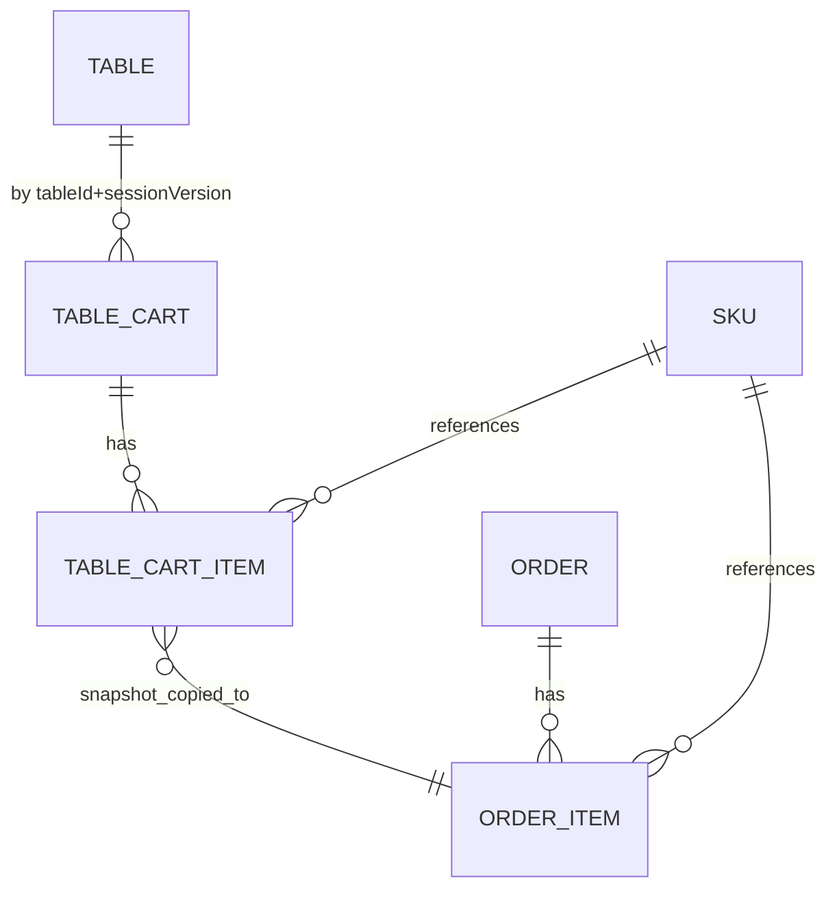
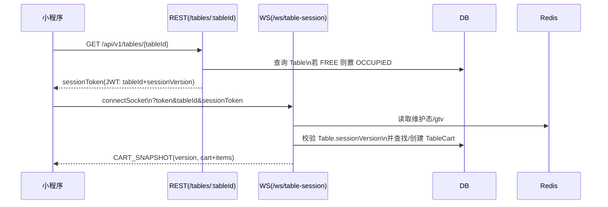
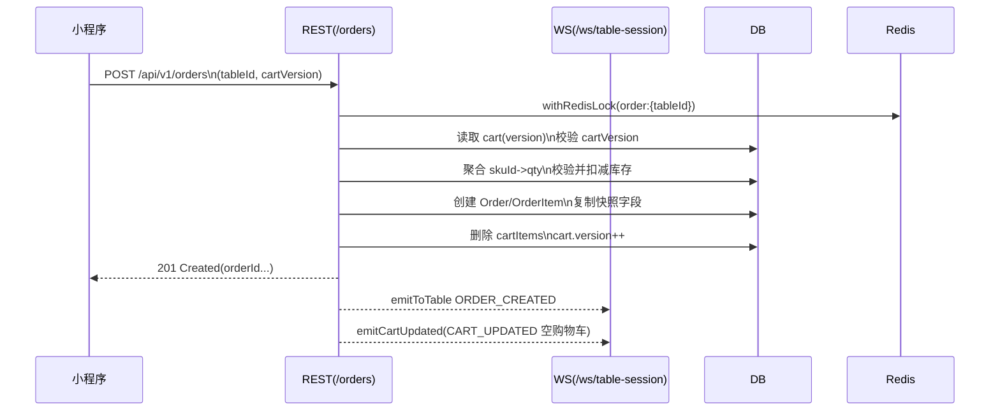
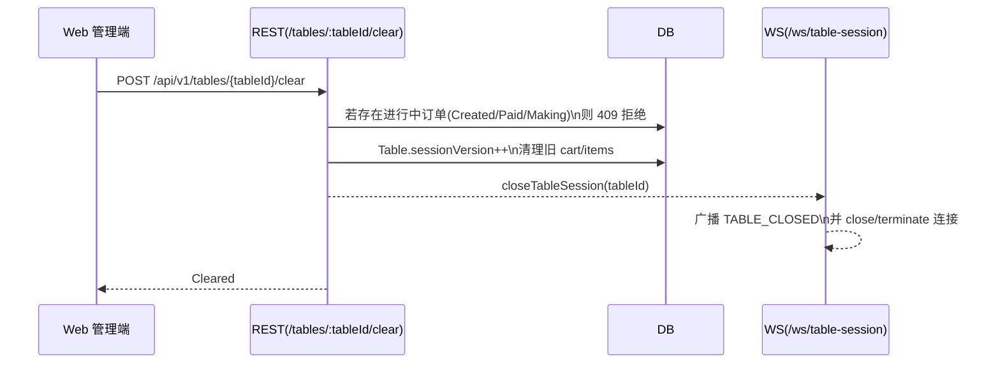
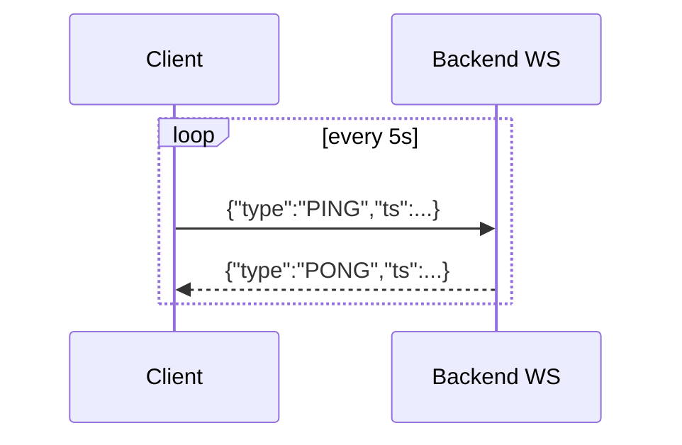

# 7.1 核心实现：桌台协同会话

本文档解释 BiteGo 的“桌台协同会话”在服务端与小程序端的核心实现：它如何建立会话、如何在多用户间同步购物车与订单、如何处理并发一致性、以及前后端交互协议与关键边界。

## 1. 背景与目标

桌台协同会话面向“同一桌多人同时点餐”的场景，目标是：

- 多个用户在同一桌台中共享一个“会话作用域”，可实时看到对方点的菜与数量变化。
- 所有购物车操作具备并发一致性与幂等能力：不同端交替提交操作不产生冲突或重复写入。
- 下单后，同桌所有在线端都能及时同步“订单已创建”以及“购物车已清空/版本推进”。
- 订单的可见性在“本次开台”范围内受控：同桌用户可查看本桌本次会话产生的订单（列表与详情），但不越权访问其他桌或其他会话的订单。

## 2. 核心概念

### 2.1 桌台会话版本（Table.sessionVersion）

桌台会话使用 `Table.sessionVersion` 作为“开台”的版本号。

- 每次清台/强制清台会使 `sessionVersion` 自增，并清理旧会话的数据。
- 订单与购物车都与 `tableId + sessionVersion` 绑定，确保不同开台互不干扰。

参考代码：
- [Table](../projects/backend/src/entities/Table.ts)
- [tables.ts](../projects/backend/src/routes/tables.ts)

### 2.2 会话凭证（sessionToken）

`sessionToken` 是服务端签发的 JWT，用于证明“当前用户正在参与某桌某次会话”。

- 载荷：`{ tableId, sessionVersion }`
- 由 `GET /api/v1/tables/:tableId` 返回给小程序端。
- 用途：
  - 建立桌台 WebSocket 连接 `/ws/table-session`；
  - 获取“本桌订单”（订单列表与详情）的授权凭证（避免同桌用户访问他人订单时 403）。

鉴权与安全边界（sessionToken 签发/校验、订单同桌共享、gtv 全局失效）详见 [7.5-核心实现-鉴权与安全.md](./7.5-核心实现-鉴权与安全.md)。

### 2.3 用户鉴权 token

小程序侧的用户登录 token（`Authorization: Bearer <token>`）用于识别操作者身份（userId/role/nickname/avatarUrl）。

### 2.4 购物车（TableCart / TableCartItem）

- `TableCart`：某桌某次会话下的购物车容器，含 `version` 字段（乐观并发控制）。
- `TableCartItem`：购物车条目。以 `addedBy` 快照字段记录“谁点的”。

参考代码：
- [TableCart](../projects/backend/src/entities/TableCart.ts)
- [TableCartItem](../projects/backend/src/entities/TableCartItem.ts)

### 2.5 订单（Order / OrderItem）

- `Order.tableSessionVersion = Table.sessionVersion`，用于将订单绑定到“本次开台”。
- `Order.userId` 作为支付方/下单人标识（并会在返回 DTO 中补充 payer nickname/avatar）。

参考代码：
- [Order](../projects/backend/src/entities/Order.ts)
- [orders.ts](../projects/backend/src/routes/orders.ts)

### 2.6 数据模型关系图（会话域）



## 3. 架构与组件

### 3.1 服务端组件

- WebSocket：桌台协同会话服务端实现 [tableSession.ts](../projects/backend/src/ws/tableSession.ts)
- REST：
  - 桌台信息与 sessionToken 下发：`GET /api/v1/tables/:tableId` [tables.ts](../projects/backend/src/routes/tables.ts)
  - 订单创建与订单查询：`/api/v1/orders` [orders.ts](../projects/backend/src/routes/orders.ts)

### 3.2 小程序端组件

- 会话状态管理（Zustand Store）：[tableSessionStore.ts](../projects/miniprogram/src/store/tableSessionStore.ts)
- 页面：
  - 点餐页（连接会话、展示菜品与购物车）：[order-meal](../projects/miniprogram/src/pages/order-meal/index.tsx)
  - 结算页（提交订单）：[checkout](../projects/miniprogram/src/pages/checkout/index.tsx)
  - 本桌订单页（列表/详情回源 + WS 补齐）：[table-orders](../projects/miniprogram/src/pages/table-orders/index.tsx)

连接生命周期（减少频繁断连/重连带来的抖动）：

- `acquire()` / `release()` 采用“引用计数 + 延迟断开”：
  - 页面进入时 `acquire()` 增加 hold count 并确保连接建立
  - 页面离开时 `release()` 递减 hold count；当降到 0 时延迟 30 秒再断开（若期间又 acquire 则取消断开）
-  - 参考：[tableSessionStore.ts](../projects/miniprogram/src/store/tableSessionStore.ts#L248-L263)

### 3.3 组件关系图（总览）

```mermaid
flowchart LR
  Mini[小程序\nTaro + Zustand] -->|REST| API[Backend REST\nExpress]
  Mini -->|WebSocket\n/ws/table-session| WS[Backend WS\n(tableSession)]
  Admin[Web 管理端] -->|REST| API
  Admin -->|WebSocket\n/ws/admin-dashboard| AdminWS[Backend WS\n(adminDashboard)]
  API --> DB[(MySQL)]
  WS --> DB
  API --> Redis[(Redis)]
  WS --> Redis
  WS --> Bus[connCountBus\n通知管理端在线数]
  Bus --> AdminWS
```

## 4. 端到端工作流程

本节按“进入桌台 → 协同点餐 → 下单 → 查看本桌订单 → 清台”顺序描述。

### 4.1 进入桌台与会话初始化

1. 小程序进入点餐页，拿到 `tableId`。
2. 调用 `useTableSessionStore.acquire(tableId)`：
   - 确保已登录（得到 user token）。
   - 调 `GET /api/v1/tables/:tableId` 获取 `table.code/sessionVersion/sessionToken`。
   - 用 `token + tableId + sessionToken` 连接 WebSocket：
     - `ws://.../ws/table-session?token=...&tableId=...&sessionToken=...`
3. WebSocket 连接成功后，服务端：
   - 校验 `token` 与 `sessionToken`；
   - 查找（或创建）该桌本次会话的 `TableCart`；
   - 下发 `CART_SNAPSHOT`（包含完整 items 与 cart version）。

实现要点（以当前代码为准）：

- 维护态拦截：维护中返回 `ERROR(code=50300)` 并断开连接：  
  [tableSession.ts](../projects/backend/src/ws/tableSession.ts#L120-L125)
- 用户 token 校验 + 全局 tokenVersion（gtv）校验：  
  [tableSession.ts](../projects/backend/src/ws/tableSession.ts#L131-L150)
- sessionToken 校验：载荷 `{ tableId, sessionVersion }` 必须与 query tableId 相符，且必须等于当前 `Table.sessionVersion`：  
  [tableSession.ts](../projects/backend/src/ws/tableSession.ts#L151-L171)
- 购物车初始化：按 `(tableId, sessionVersion)` 取最新 cart；不存在则创建 `version=1`：  
  [tableSession.ts](../projects/backend/src/ws/tableSession.ts#L183-L211)



### 4.2 协同购物车操作（加菜/改数量/删除）

小程序每次操作会发送一条 WsOp：

```json
{
  "opId": "client_unique_id",
  "opType": "ADD_ITEM",
  "baseVersion": 5,
  "payload": { "skuId": "sku_xxx", "qty": 1 }
}
```

规格选择、PI（Price Item）单价计算、`priceItemKey` 合并规则以及价格/规格快照字段的落库口径详见 [7.2-核心实现-规格、价格和库存模型.md](./7.2-核心实现-规格、价格和库存模型.md)。

补充（当前实现的兼容点）：

- `payload` 中非库存选择字段支持多种历史命名：`nonStockSelectionsByGroupId` / `nonStockSelections` / `selections`（最终归一为 `nonStockSelectionsByGroupId`）：  
  [tableSession.ts](../projects/backend/src/ws/tableSession.ts#L286-L294)
- `qty` 会被强制为 `>=1`，并在写入时按 SKU 库存做 clamp：  
  [tableSession.ts](../projects/backend/src/ws/tableSession.ts#L285)，[tableSession.ts](../projects/backend/src/ws/tableSession.ts#L482-L493)

服务端处理步骤（简化）：

1. 使用 Redis 键 `wsop:${tableId}:${sessionVersion}:${opId}` 实现幂等：同 opId 重复提交不会重复写入。
2. 使用 `baseVersion` 与“连接侧认知的 cartVersion”进行校验；不匹配则返回 `ERROR Version mismatch`。
3. 执行业务操作并持久化：
   - ADD_ITEM / UPDATE_QTY 时会重新校验 SKU 状态与库存，并对数量做 `min(stock, qty)` 限制。
4. `cart.version += 1`，保存 `TableCart`。
5. 查询最新 items，广播 `CART_UPDATED` 到该桌所有在线连接：
   - 同时同步所有连接的 `cartVersion`，确保后续并发校验一致。

```mermaid
flowchart TD
  A[收到消息] --> B{PING?}
  B -->|是| C[返回 PONG]
  B -->|否| D[解析 JSON\nopId/opType/baseVersion/payload]
  D --> E[Redis SET NX\nwsop:{tableId}:{sessionVersion}:{opId}\nEX=300]
  E -->|已存在| F[不重复写入\n直接返回 CART_UPDATED 快照]
  E -->|首次| G{baseVersion == expectedVersion?}
  G -->|否| H[ERROR 40001\nVersion mismatch]
  G -->|是| I[执行 op\nADD_ITEM/UPDATE_QTY/REMOVE_ITEM]
  I --> J[cart.version++\n保存 cart 与 item]
  J --> K[广播 CART_UPDATED\n并同步 peers.cartVersion]
```

### 4.3 下单（checkout → POST /orders）

1. 结算页使用本地 `cartVersion` 调用：
   - `POST /api/v1/orders`，body 仅提交 `tableId + cartVersion + remark/paymentMethod`。
2. 服务端在创建订单前再做一次强校验：
   - 当前桌台存在；
   - 最新 `TableCart.version` 必须等于传入 `cartVersion`；
   - 购物车非空；
   - SKU 均存在且 `ON_SHELF`，库存满足“购物车聚合后 qty”。
3. 服务端生成订单与订单项，并落库“点菜人 addedBy 快照字段”。
4. 服务端清空购物车：
   - 删除 `TableCartItem`；
   - `TableCart.version += 1`（版本推进）。
5. 关键广播（同桌同步）：
   - `ORDER_CREATED`：通知同桌“新增订单”（包含支付方 `payerNickname/payerUserId`，用于前端提示与展示）；
   - `CART_UPDATED`（空 items + 新 version）：通知同桌“购物车已清空”，确保每个在线用户 UI 一致。

实现参考：
- 下单锁：`withRedisLock("order:{tableId}")`（避免并发下单导致竞态）：  
  [orders.ts](../projects/backend/src/routes/orders.ts#L339)
- 版本校验：`cart.version === cartVersion`，不一致返回 `40001 Cart version mismatch`：  
  [orders.ts](../projects/backend/src/routes/orders.ts#L361-L362)
- 聚合扣减库存：按 `skuId` 汇总 qty 后扣减（事务内）：  
  [orders.ts](../projects/backend/src/routes/orders.ts#L400-L405)
- 广播：
  - `ORDER_CREATED`：  
    [orders.ts](../projects/backend/src/routes/orders.ts#L515-L522)
  - `CART_UPDATED` 清空购物车：  
    [orders.ts](../projects/backend/src/routes/orders.ts#L523-L528)



### 4.4 本桌订单（列表/详情回源 + WS 补齐）

本桌订单页同时依赖 REST 回源与 WebSocket 实时补齐：

1. 初始回源：
   - `GET /api/v1/orders?tableId=...&tableSessionVersion=...&sessionToken=...`
   - 再对每个 `orderId` 调 `GET /api/v1/orders/:orderId?sessionToken=...` 拉取详情。
2. WebSocket 实时事件：
   - 收到 `ORDER_CREATED` 后，将 `orderId` 插入本地列表；
   - 若详情缺失，则再按 `orderId` 调详情接口补齐。

订单可见性策略：

- 默认情况下，CUSTOMER 只能查看“自己下的单”；
- 当携带 `tableId + tableSessionVersion + sessionToken` 且 token 校验通过时：
  - 允许查看该桌本次会话的全部订单（列表与详情）。

### 4.5 清台/强制清台（会话关闭）

管理端触发清台后：

- `Table.sessionVersion += 1`
- 清理旧会话的购物车与条目
- 通过 WebSocket 广播 `TABLE_CLOSED` 并断开连接
- 小程序收到后：
  - 标记 `sessionClosedAt/sessionClosedMessage`；
  - 页面弹窗提示并引导返回首页/重新进入。



## 5. 并发一致性与幂等机制

### 5.1 版本控制（baseVersion / cart.version）

- 每次写入都会使 `TableCart.version` 自增。
- 客户端每次操作携带 `baseVersion`：
  - 与服务端“当前期望版本”不一致则拒绝（Version mismatch），防止旧状态覆盖新状态。

当前实现的期望版本计算与错误码：

- `expectedVersion = client.cartVersion ?? cart.version`
- `baseVersion !== expectedVersion` 时返回：`ERROR(code=40001, message='Version mismatch')`  
  [tableSession.ts](../projects/backend/src/ws/tableSession.ts#L276-L279)

### 5.2 幂等（opId + Redis NX）

- 同一 `opId` 在服务端只能成功写入一次。
- 网络重试/弱网重发不会造成重复加菜或重复扣减库存（库存扣减只在下单时发生）。

当前实现细节：

- Redis key：`wsop:${tableId}:${sessionVersion}:${opId}`
- TTL：`EX=300`（5 分钟窗口）
- 若检测到重复 opId：不会重复执行业务逻辑，而是直接返回一次 `CART_UPDATED` 全量快照  
  [tableSession.ts](../projects/backend/src/ws/tableSession.ts#L250-L270)

### 5.3 广播后同步所有连接的版本视图

- 服务端在广播 `CART_UPDATED` 时同步所有连接的 `cartVersion` 认知，避免不同连接持有 stale version 导致误判冲突。

实现参考：[tableSession.ts](../projects/backend/src/ws/tableSession.ts#L539-L546)

## 6. 交互协议（WebSocket 消息类型）

### 6.1 下行（服务端 → 客户端）

- `CART_SNAPSHOT`：连接成功后的全量快照
- `CART_UPDATED`：每次写入后的全量更新
- `USER_JOINED`：新用户加入桌台会话（用于同桌提示“xxx 加入了桌台”，本人可忽略）
- `ORDER_CREATED`：订单创建事件
- `ORDER_STATUS_CHANGED`：订单状态变化（如完成/退款中/退款完成）
- `ORDER_ITEM_SERVED`：上菜进度变化
- `TABLE_CLOSED`：会话关闭
- `PONG`：心跳回应
- `ERROR`：错误消息（含 code/message）

消息来源（以当前实现为准）：

- `CART_SNAPSHOT/CART_UPDATED`：桌台会话 WS（购物车写入与广播）  
  [tableSession.ts](../projects/backend/src/ws/tableSession.ts)
- `USER_JOINED`：桌台会话 WS 在连接建立后广播（含 userId/nickname）  
  [tableSession.ts](../projects/backend/src/ws/tableSession.ts#L212)
- `ORDER_CREATED`：创建订单成功后广播，并同步清空购物车（`CART_UPDATED` items=[]）  
  [orders.ts](../projects/backend/src/routes/orders.ts#L515-L528)
- `ORDER_STATUS_CHANGED`：管理员更新订单状态、上菜导致状态推进、退款流程状态变化时广播  
  [orders.ts](../projects/backend/src/routes/orders.ts#L826)，[orders.ts](../projects/backend/src/routes/orders.ts#L895-L896)
- `ORDER_ITEM_SERVED`：管理员上菜接口成功后广播  
  [orders.ts](../projects/backend/src/routes/orders.ts#L895-L896)
- `TABLE_CLOSED`：管理端清台/强制清台触发关闭会话  
  [tableSession.ts](../projects/backend/src/ws/tableSession.ts#L560-L575)，[tables.ts](../projects/backend/src/routes/tables.ts#L415-L497)

### 6.2 上行（客户端 → 服务端）

- `"PING"` 或 `{ "type": "PING" }`
- `{ "type": "SYNC", "cartVersion"?: number }`：主动请求服务端下发一次 `CART_SNAPSHOT`（弱网/切后台/丢包时用于校准本地视图）
- WsOp（ADD_ITEM/UPDATE_QTY/REMOVE_ITEM）

心跳建议：

- 由于 CDN WebSocket 可能存在 10 秒空闲超时限制，客户端建议按 ≤ 5 秒发送一次 `PING` 保活（小程序当前实现为 5s）。  
  [tableSessionStore.ts](../projects/miniprogram/src/store/tableSessionStore.ts#L229-L235)
- 弱网/切后台恢复时，客户端可基于 `PONG` 回包时间做丢包检测（例如超过 7 秒无回包），触发一次 `SYNC` 或直接重连以回源最新 `CART_SNAPSHOT`。



## 7. 安全与权限

- WebSocket：
  - 用户鉴权依赖用户 token；
  - 会话合法性依赖 sessionToken（绑定 tableId/sessionVersion）。
- REST：
  - 订单列表/详情在 CUSTOMER 侧默认隔离到本人；
  - 携带 `sessionToken` 且校验通过可扩展为“本次开台范围内同桌可见”。

## 8. 常见问题与排查思路

- 同桌用户下单后购物车不清空：检查下单成功后是否广播 `CART_UPDATED`（空 items）到桌台会话。
- 同桌用户看不到他人订单/403：检查是否携带 `sessionToken`，以及 token 的 `tableId/sessionVersion` 是否与订单的 `tableId/tableSessionVersion` 匹配。
- 频繁 Version mismatch：检查是否存在连接侧版本视图不同步（应在广播后同步所有连接的 cartVersion）。
- 控制台报错 `SocketTask.send: fail SocketTask.readyState is not OPEN`：通常为小程序切后台/网络切换导致连接已被系统断开但页面仍在尝试发送；应在发送前检测 readyState，必要时先触发重连/同步快照再重试。
- 若出现“提示已加入购物车但数量未变化”：优先检查客户端是否在发送失败时仍展示成功提示；正确策略应为“自动重连并等待恢复后重试发送”，重试失败再提示用户。
