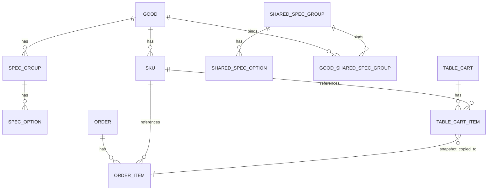
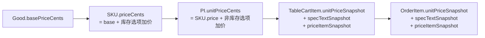
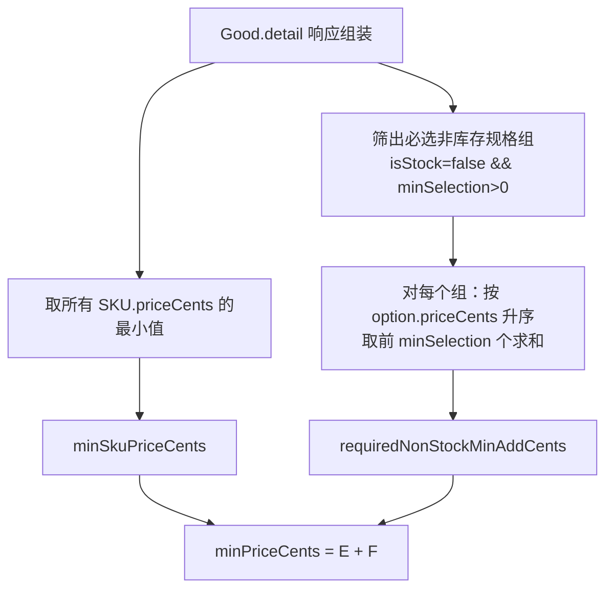
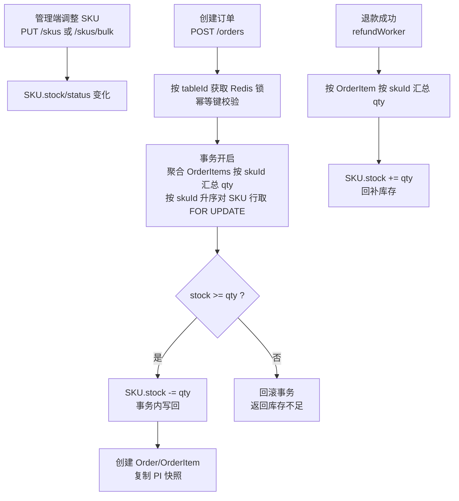
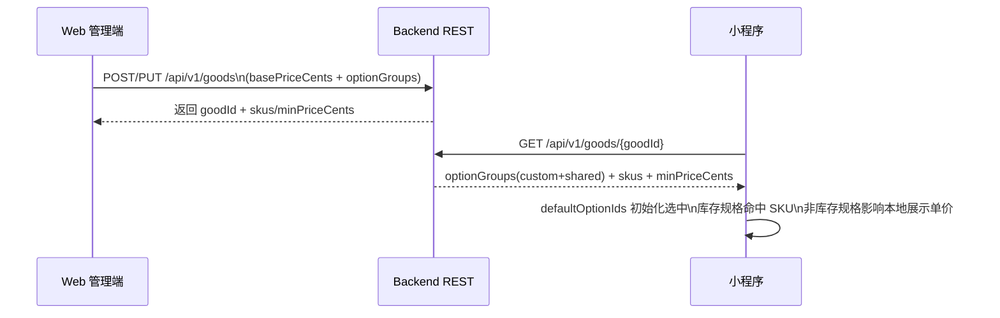
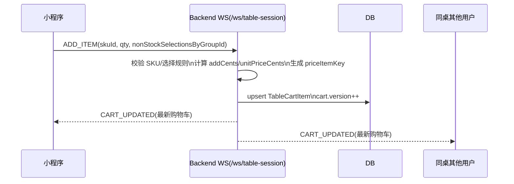
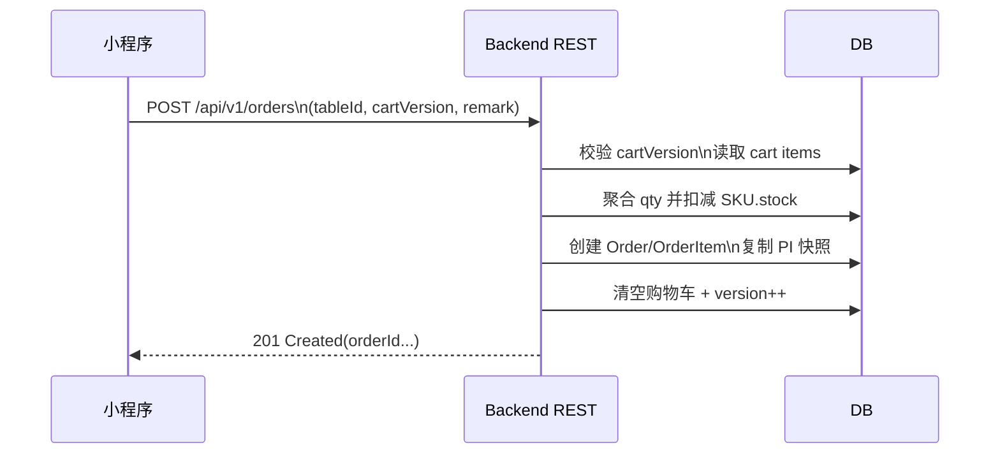

# 7.2 核心实现：规格、价格和库存模型

本文档梳理 BiteGo 在「规格管理、价格控制、库存管理」上的核心模型与端到端流程，覆盖后端（REST/WS/DB）、Web 管理端与小程序端的上下游协作方式，并解释订单关联的 PI（Price Item）是什么、为何需要它以及如何落库。

> 术语说明：本文的金额统一使用“分（cents）”为口径；数据库中以 `bigint` 字段存储并在代码中以 `string/bigint` 处理（避免浮点误差）。对外接口的 `xxxCents` 仍是整数（number/string），用于前端展示与计算。

---

## 1. 领域对象与关系图

### 1.1 核心对象

- **Good（菜品）**：门店售卖的商品主体，包含名称、基础价、状态等。
  - [Good](../projects/backend/src/entities/Good.ts)
- **SKU（库存单位）**：菜品在“库存规格组（isStock=true）”的某一组合下的可售单元，承载库存与 SKU 级价格。
  - [SKU](../projects/backend/src/entities/SKU.ts)
- **SpecGroup / SpecOption（自定义规格组/规格项）**：挂在单个 Good 下的规格定义；通过 `isStock` 区分是否参与 SKU（库存）组合。
  - [SpecGroup](../projects/backend/src/entities/SpecGroup.ts)
  - [SpecOption](../projects/backend/src/entities/SpecOption.ts)
- **SharedSpecGroup / SharedSpecOption（共享规格组/规格项）**：门店级复用的“非库存规格组”，可被多个 Good 关联并在单品上覆写默认选项/禁用选项。
  - [SharedSpecGroup](../projects/backend/src/entities/SharedSpecGroup.ts)
  - [SharedSpecOption](../projects/backend/src/entities/SharedSpecOption.ts)
- **GoodSharedSpecGroup（菜品与共享规格组关联）**：连接表，承载“该菜品引用某共享组时的差异配置”。
  - [GoodSharedSpecGroup](../projects/backend/src/entities/GoodSharedSpecGroup.ts)
- **TableCart / TableCartItem（桌台购物车与条目）**：桌台会话内的购物车；条目落库时包含价格快照与 PI（Price Item）关键字段。
  - [TableCartItem](../projects/backend/src/entities/TableCartItem.ts)
- **Order / OrderItem（订单与明细）**：下单后把购物车条目的“价格/规格选择/添加人”等快照复制到订单明细，保证后续变更不影响已下单数据。
  - [OrderItem](../projects/backend/src/entities/OrderItem.ts)

### 1.2 关系概览（文本版）

- `Good 1 -> N SpecGroup 1 -> N SpecOption`
- `Good 1 -> N SKU`（由 Good 的库存规格组组合生成）
- `SharedSpecGroup 1 -> N SharedSpecOption`
- `Good N <-> N SharedSpecGroup`（经 `GoodSharedSpecGroup` 关联；仅用于“非库存规格”）
- `TableCart 1 -> N TableCartItem`（条目与 `skuId` 关联，并携带“非库存选择 + 单价快照 + PI 标识”）
- `Order 1 -> N OrderItem`（从 TableCartItem 拷贝快照字段）

### 1.3 关系概览（图表）



---

## 2. 规格模型：库存规格 vs 非库存规格

### 2.1 为什么要区分 isStock

系统把规格分为两类，原因是“库存可售性”和“价格组合”需要不同的计算与管理方式：

- **库存规格组（`isStock=true`）**
  - 用于生成 SKU（例如“杯型/容量/冷热”等会影响库存维度的规格）
  - 每个 SKU 持有独立 `stock/status/price`
  - 用户选择后会命中某个 SKU，库存校验与扣减都在 SKU 维度发生
- **非库存规格组（`isStock=false`）**
  - 不生成 SKU（例如“加料/口味/备注”等不做库存拆分的规格）
  - 仅影响最终“下单计价单元（PI）”的单价：`unitPrice = sku.price + nonStockAddPrice`
  - 需要在购物车/订单上记录“用户选择了哪些非库存项”，以保证溯源与审计

自定义规格组字段参考：
- `SpecGroup.isStock`：[SpecGroup](../projects/backend/src/entities/SpecGroup.ts#L31-L36)

### 2.2 共享规格组（Shared Spec Group）是什么

共享规格组是 **门店级复用的非库存规格组**，典型场景是“糖度/温度/加料”等在多个菜品上通用，但又希望：

- 统一维护选项与加价（减少重复配置）
- 在某个菜品上禁用某些选项（例如“热饮不允许去冰”）
- 在某个菜品上覆写默认选项（例如“默认少糖”）

关键点：

- 共享组本质上 **总是非库存**：在 `GET /goods/{goodId}` 的 `optionGroups` 中会被组装为 `isStock=false`、`groupType='shared'`
  - 组装逻辑见：[goods.ts](../projects/backend/src/routes/goods.ts#L382-L493)
- `GoodSharedSpecGroup` 作为关联表，提供：
  - `disabledOptionIds`：该菜品对共享组选项的禁用集合
  - `defaultOptionIds`：该菜品对共享组的默认选项覆写（优先级高于共享组自身默认）
  - 见：[GoodSharedSpecGroup](../projects/backend/src/entities/GoodSharedSpecGroup.ts#L19-L27)

```mermaid
flowchart TD
  A[SharedSpecGroup\n门店级共享非库存规格组] -->|包含| B[SharedSpecOption\n共享规格项]
  C[Good\n菜品] -->|关联| D[GoodSharedSpecGroup\n关联配置]
  D -->|指向| A
  D -->|disabledOptionIds| E[在该菜品下禁用的共享项]
  D -->|defaultOptionIds| F[在该菜品下覆写默认选项]
  G[GET /api/v1/goods/{goodId}] --> H[组装 optionGroups]
  H -->|groupType=shared| A
  H -->|应用 disabled/default 覆写| D
  H --> I[返回给小程序/管理端]
```

---

## 3. SKU 模型：如何由规格生成可售组合

### 3.1 SKU 的核心字段

SKU 表关键字段（简化）：

- `skuId`：业务主键
- `goodId`：所属菜品
- `specCombination`：可读的规格组合文本（小程序用它匹配当前选择命中哪个 SKU）
- `specSignature/specKey`：用于“稳定识别 SKU 组合”的派生字段（便于重建/重定价时对齐）
- `price`：SKU 价格（分）
- `stock`：库存
- `status`：`ON_SHELF/OFF_SHELF`

参考：[SKU](../projects/backend/src/entities/SKU.ts)

### 3.2 SKU 生成算法与约束

SKU 生成只针对 **库存规格组**，核心为：

1. 校验每个组的 `minSelection/maxSelection/isRequired` 合法性
2. 对每个组生成可选组合（单选/多选）
3. 组间做笛卡尔积得到 SKU 集
4. 对每个 SKU：
   - `specText/specCombination`：拼成用户可读文本
   - `specSignature`：将选择序列标准化为 `groupId:sorted(optionIds);...`，无规格为 `default`
   - `specKey`：对 `specSignature` 做稳定 hash
   - `priceCents = basePrice + 选中库存选项加价之和`

实现参考：
- 校验：[SkuGenerator.validateOptionGroups](../projects/backend/src/services/skuGenerator.ts#L31-L59)
- 生成：[SkuGenerator.generate](../projects/backend/src/services/skuGenerator.ts#L61-L137)

```mermaid
flowchart TD
  A[Good.basePriceCents\n+ optionGroups] --> B{筛出库存规格组\nisStock=true}
  B --> C[校验选择规则\nmin/max/isRequired]
  C -->|通过| D[为每个组生成候选选择组合\n(支持多选)]
  D --> E[笛卡尔积生成 SKU 组合集合]
  E --> F[生成 specCombination(可读文本)]
  E --> G[生成 specSignature\n(groupId:sorted(optionIds);...)]
  G --> H[specKey = hash(specSignature)]
  E --> I[priceCents = basePrice + 库存选项加价和]
  F --> J[批量插入/更新 SKU]
  H --> J
  I --> J
  C -->|不通过| X[返回 400]
```

### 3.3 SKU 重建与同步（Good 更新时发生什么）

当管理员更新菜品的 `basePrice/optionGroups` 时，系统要在“不破坏现有库存/上下架状态”的前提下更新 SKU。

核心策略在服务端集中处理：

- **结构变更（needRebuild）**：例如新增/删除库存规格组、改变组的选择范围等，会导致 SKU 集变化；此时删除旧 SKU 并按新组合重新插入。
  - 重建后的 SKU 默认：`stock=0` 且 `status=OFF_SHELF`（避免误上架/误占库存）。
- **非结构变更（sync）**：例如只改了基础价、或只改了某些库存选项加价，但 SKU 组合仍可稳定对齐；此时按 `specSignature` 对齐并批量更新 `price/specKey/specSignature/specCombination` 等派生字段，同时 **保留原 SKU 的 `stock/status`**。
- 同时记录规格变更日志（before/after snapshot）以便审计与排查。

实现参考：
- 变更判定与执行入口：[GoodService.upsertOptionGroupsAndGenerateSkus](../projects/backend/src/services/goodService.ts#L389-L675)
- 同步更新 SKU（不重建时）：[GoodService.syncSkusForGood](../projects/backend/src/services/goodService.ts#L172-L387)
- 规格变更日志模型：[GoodSpecChangeLog](../projects/backend/src/entities/GoodSpecChangeLog.ts)

#### 3.3.1 价格重算口径（SKU.priceCents）

无论是“重建”还是“同步重定价”，SKU 价格口径都一致：

- `SKU.priceCents = Good.basePriceCents + Σ(库存规格组选项的 priceCents)`
- 非库存规格（自定义 `isStock=false` + 共享规格组）不会进入 `SKU.priceCents`，它们只在 PI（Price Item）层叠加为 `unitPriceCents`，见 [4.1 三层价格](#41-三层价格goodbaseprice--skuprice--piunitpricesnapshot)。

生成与重定价使用同一套生成器规则：
- `specSignature` 规范化格式：`groupId:sorted(optionIdsCommaJoined);...`；无库存规格时为 `default`  
  参考：[skuGenerator.ts](../projects/backend/src/services/skuGenerator.ts#L108-L126)

#### 3.3.2 不同更新场景下的策略（决策表）

服务端对“是否需要重建 SKU”与“如何重定价”有一套固定策略，避免管理端自行判断造成口径偏差：

- **提交了 optionGroups（规格结构/加价可能变化）**：统一走 `GoodService.upsertOptionGroupsAndGenerateSkus`
  - 结构变更或 SKU 不存在：重建（删除旧 SKU → 生成新 SKU，默认 `OFF_SHELF/0`）
  - 仅加价/基础价变化：同步重定价（按 `specSignature` 对齐，更新派生字段与价格，保留 `stock/status`）
- **未提交 optionGroups，仅 basePrice 变化**：优先走“delta 平移”优化（直接对该 goodId 下所有 SKU 执行 `price = price + delta`），避免大量按行重算  
  实现参考：[goods.ts](../projects/backend/src/routes/goods.ts#L893-L907)
- **兜底：绝对重定价（修复历史价格不一致）**：当仅 basePrice 变化但发现同步计数为 0，且请求里带了 optionGroups 时，使用 `repriceSkusFromOptionGroupsBySpecText` 按 `specCombination(specText)` 对齐并绝对重算  
  实现参考：[goods.ts](../projects/backend/src/routes/goods.ts#L887-L903)、[goodService.ts](../projects/backend/src/services/goodService.ts#L17-L170)
  - 若发现无法确定性对齐（例如 `specCombination` 重复、或 SKU 集与生成集无法一一对应），会返回 409，提示需要走“重建”路径而不是静默猜测。

#### 3.3.3 连锁共享复制同步中的 SKU 处理

连锁主店把菜品复制同步到子门店时，SKU 的处理需要额外满足“**不影响门店运营**”：

- 子门店不存在该菜品（按模板映射新建）：生成的 SKU 默认 `OFF_SHELF` 且库存 `0`
- 子门店已存在该菜品（按模板映射定位）：对齐并更新 SKU 的派生字段与价格，但 **保留子门店原 SKU 的 `stock/status`**
  - 新增出现的 SKU：默认 `OFF_SHELF` 且库存 `0`
  - 同步后不再存在于组合集合的 SKU：置 `OFF_SHELF`（不清库存）

实现参考：[storeSyncService.ts](../projects/backend/src/services/storeSyncService.ts#L250-L580)

```mermaid
flowchart TD
  A[管理端提交 PUT/POST /api/v1/goods\nbasePrice/optionGroups 变更] --> B[读取旧规格快照 + 旧 SKU]
  B --> C{是否结构变更?\n(影响 SKU 组合集合)}
  C -->|是 needRebuild| D[删除该 goodId 下全部 SKU]
  D --> E[按新库存规格组重建 SKU 集\n库存/上下架重置为默认]
  E --> F[写入规格变更日志\nbefore/after + 操作人]
  C -->|否| G[按 specSignature/specCombination 对齐 SKU]
  G --> H[同步派生字段与价格\nspecKey/specSignature/price]
  H --> F
```

---

## 4. 价格模型：从配置到下单单价（PI）

### 4.1 三层价格：Good.basePrice → SKU.price → PI.unitPriceSnapshot

系统的“最终售卖单价”分三层形成：

1. **菜品基础价（Good.basePrice）**
   - 对应“无规格/默认规格”的价格基准
2. **SKU 价格（SKU.price）**
   - `SKU.price = Good.basePrice + 库存规格组选项加价`
3. **PI 单价（unitPriceSnapshot / unitPriceCents）**
   - `PI.unitPrice = SKU.price + 非库存规格（自定义 + 共享）选项加价`
   - PI 会被落到购物车条目与订单明细快照中，用于：
     - 订单金额计算
     - 后续退款/审计（价格回放）
     - 管理端展示订单明细（单价、规格文本）



### 4.1.1 起售价 minPriceCents 的口径（为何比 SKU 最低价更“贵”）

`minPriceCents` 的目的，是让“菜品列表/卡片的起价展示”尽可能贴近真实下单价格，避免用户点进详情后发现“必选加料/必选口味”导致价格跳变。

口径概括为：

- `minPriceCents = MIN(SKU.priceCents) + SUM(每个必选非库存规格组的最小加价组合)`
- 其中“最小加价组合”指：按该组 `minSelection` 从小到大选出 `minSelection` 个 option 的 `priceCents` 求和



### 4.2 PI（Price Item）是什么

PI（Price Item）可以理解为：**“同一个 SKU 在叠加不同非库存规格选择后形成的最终计价单元”**。

为什么需要 PI：

- 非库存规格不会生成 SKU，但会影响最终价格与规格展示
- 同一 SKU 可能被同一用户以不同非库存选择加入购物车（例如“加珍珠” vs “不加”），它们必须是不同条目
- 同一 SKU + 相同非库存选择则应可合并为同一条目（便于加减数量）

因此系统在购物车层面引入：

- `priceItemKey`：对 `skuId + 非库存选择签名` 的稳定 hash（目前为 v1）
- `priceItemSnapshot`：包含 `skuId/stockSpecSignature/nonStockSelectionsByGroupId/nonStockAddPriceCents/unitPriceCents` 的 JSON 快照

落库字段：
- 购物车条目：[TableCartItem.priceItemKey/priceItemSnapshot](../projects/backend/src/entities/TableCartItem.ts#L35-L43)
- 订单明细：[OrderItem.priceItemKey/priceItemSnapshot](../projects/backend/src/entities/OrderItem.ts#L32-L40)

生成与合并逻辑（关键实现）：
- 计算非库存加价、规格文本、签名与 key，并据此“查找是否可合并条目，否则新建”：  
  [tableSession.ts](../projects/backend/src/ws/tableSession.ts#L337-L443)

```mermaid
flowchart TD
  A[ADD_ITEM\nskuId + qty\n+ nonStockSelectionsByGroupId] --> B[校验 SKU 可售\nON_SHELF && stock>0]
  B --> C[校验非库存选择\nrequired/min/max/disabled]
  C --> D[计算非库存加价和 addCents]
  D --> E[unitPriceCents = sku.price + addCents]
  C --> F[拼接 specTextSnapshot\nsku.specCombination + 非库存片段]
  C --> G[生成 priceItemKey\nhash(skuId + nonStockSelectionSignature)]
  G --> H{是否已有同 key 的 cartItem?}
  H -->|是| I[合并 qty\n并更新快照字段]
  H -->|否| J[新建 TableCartItem\n写入 priceItemSnapshot]
  I --> K[cart.version++\n广播 CART_UPDATED]
  J --> K
```

### 4.2.1 `priceItemSnapshot` 字段定义（v1）

`priceItemSnapshot` 是服务端写入 `TableCartItem/OrderItem` 的 JSON 字符串，用于在“订单快照/审计/退款/回放”场景下完整复原 PI 的计价组成。其 v1 结构在服务端生成：

- [tableSession.ts](../projects/backend/src/ws/tableSession.ts#L395-L407)

v1 字段如下：

- `version: 1`：快照版本号
- `skuId`：SKU 业务 ID
- `goodId`：菜品 ID（冗余字段，便于离线分析与回放）
- `stockSpecSignature`：库存规格选择签名（来自 `SKU.specSignature`），用于在“规格结构变化后”仍可识别该 SKU 的库存规格组合语义
- `nonStockSelectionsByGroupId`：非库存规格选择（包含自定义非库存 + 共享非库存），key 为组 ID（共享组为 `sharedSpecGroupId`），value 为排序后的 optionId 数组
- `nonStockAddPriceCents`：非库存加价和（分）
- `unitPriceCents`：PI 单价（分），等于 `sku.price + nonStockAddPriceCents`

示例（简化）：

```json
{
  "version": 1,
  "skuId": "sku_1121",
  "goodId": "good_abc",
  "stockSpecSignature": "og_size:op_large;og_temp:op_hot",
  "nonStockSelectionsByGroupId": { "ssg_sugar": ["sso_half"] },
  "nonStockAddPriceCents": "100",
  "unitPriceCents": "1900"
}
```

> `priceItemKey` 是对 `skuId + nonStockSelections` 的稳定 hash（v1 为 `sha256("v1|skuId|nonStockSig")` 截断），用于“同一用户同一桌台”维度下合并购物车条目：  
> [tableSession.ts](../projects/backend/src/ws/tableSession.ts#L390-L416)

### 4.2.2 `priceItemSnapshot` 演进策略（v2 兼容设计）

为了支持后续论文/产品迭代中可能出现的“营销优惠、券、会员价、阶梯价、满减、舍入规则”等计价因素，建议将 `priceItemSnapshot` 作为可演进协议，遵循以下原则：

- **向后兼容**：服务端解析时按 `version` 分支处理；缺失 `version` 时视为 v0/v1
- **向前兼容**：客户端展示层只依赖 `unitPriceSnapshot/specTextSnapshot`；对快照字段“只读并透传”，忽略未知字段
- **可解释性优先**：v2 除了 `unitPriceCents`，增加“拆解明细（breakdown）”便于审计与论文写作

建议 v2 在 v1 基础上新增：

- `rawSkuPriceCents`：SKU 原价（分），用于区分“SKU 价”与“非库存加价/优惠”贡献
- `discountCents`：优惠总额（分，>=0）
- `finalUnitPriceCents`：最终单价（分）。同时保留 `unitPriceCents` 作为兼容字段或迁移期别名
- `breakdown[]`：计价分解条目（如 `NON_STOCK_ADD/COUPON/MEMBER_DISCOUNT/ROUNDING`）
- `currency`：币种（默认 `CNY`）

```mermaid
flowchart TD
  A[读取 priceItemSnapshot\nJSON string] --> B{能否解析 JSON?}
  B -->|否| X[视为缺失快照\n仅使用 unitPriceSnapshot/specTextSnapshot 展示]
  B -->|是| C{version 字段}
  C -->|缺失| V1[按 v1 解释\n(兼容历史数据)]
  C -->|1| V1
  C -->|2| V2[按 v2 解释\n支持 breakdown/discount 等]
  V1 --> O[输出统一视图\nskuId + nonStock + unitPriceCents]
  V2 --> O
```

### 4.3 规格文本 specTextSnapshot 的口径

PI 的可读规格文本在服务端统一拼接并写入快照（避免前端与后端口径不一致）：

- 优先包含库存规格文本 `sku.specCombination`（非“默认”）
- 再附加非库存规格“组名:选项名…”片段，片段间以 ` / ` 分隔
- 全部为空时为 `默认`

实现参考：[tableSession.ts](../projects/backend/src/ws/tableSession.ts#L385-L390)

### 4.4 金额字段的输入/输出转换（priceTransform）

为避免在多端出现“元/分混用”与浮点误差，服务端在中间件层统一做金额字段转换：

- 入参：将 `price/basePrice/minPrice/amount/...` 等字段转换为“分（string）”入库/入算
- 出参：同时提供 `xxxCents`（整数）用于前端

实现参考：[priceTransform.ts](../projects/backend/src/middlewares/priceTransform.ts#L1-L60)

---

## 5. 库存模型：不预占、下单扣减、退款回补

### 5.1 库存变更的三类入口

1. **管理端手工调整**（上/下架、设置库存、库存增量）
   - API：`PUT /api/v1/skus/:skuId`、`PUT /api/v1/skus/bulk`
   - 实现：[goods.ts](../projects/backend/src/routes/goods.ts#L914-L1107)
2. **下单扣减库存**（权威扣减点）
   - 订单创建时按 `skuId` 聚合 qty 校验并扣减，保证“多条 PI 指向同一 SKU”也能正确聚合校验
   - 事务内对所有待扣减 SKU 行取悲观写锁（`SELECT ... FOR UPDATE`），按 `skuId` 升序取锁避免交叉死锁；锁内完成校验与 `stock -= qty` 写回
   - 外层另加按 `tableId` 的 Redis 分布式锁串行化同桌请求；行锁串行化跨桌/跨店对同一 SKU 的并发下单
   - 实现：[orders.ts](../projects/backend/src/routes/orders.ts#L171-L206)
3. **退款回补库存**（异步 worker）
   - 退款成功后按订单明细回补 `SKU.stock`，并回滚销量
   - 实现：[refundWorker.ts](../projects/backend/src/workers/refundWorker.ts#L10-L66)



### 5.2 为什么购物车不做库存预占

当前模型采用“购物车不预占、下单扣减”的策略，原因是：

- 同桌协同点餐会产生频繁加减，不预占可避免“长时间占用库存导致其他桌无法购买”
- 预占需要更复杂的超时释放、幂等与一致性机制（尤其在 WebSocket 多连接 + 多实例场景）
- 下单阶段通过事务 + 行级悲观锁做最后校验，能保证一致性

系统的兜底体验依靠三段校验：

- 规格选择阶段：小程序根据 `sku.stock/status` 禁用不可售组合
- 加购阶段：服务端 `ADD_ITEM` 会把 qty clamp 到 `min(stock, qty)`，避免写入超卖数量
- 下单阶段：服务端再次聚合校验，不满足则返回 `Out of stock`

在更上游的列表展示层，`GET /api/v1/goods` 额外返回 `soldOut` 布尔字段：真值定义为"该菜品不存在任何 `status=ON_SHELF && stock>0` 的 SKU"，表示商品仍在架上但全部 SKU 已下架或库存归零。小程序 `GoodItem` 据此将菜品置灰、隐藏一句话描述、在名称右侧以灰色标签标注"已售罄"、拦截点击，并在所属分类内排到最后，避免用户进入规格面板后才发现全部组合不可选。

加购/校验与 clamp 逻辑参考：[tableSession.ts](../projects/backend/src/ws/tableSession.ts#L423-L436)

---

## 6. 端到端流程：上下游如何配合

### 6.1 管理端配置 → 小程序展示/选择

1. Web 管理端配置菜品：
   - 编辑基础价、规格组（自定义库存/非库存）、关联共享规格组、以及 SKU 的库存与上下架
2. 服务端 `GET /api/v1/goods/{goodId}` 返回：
   - `optionGroups`（混合：custom + shared；包含 `isStock/isRequired/minSelection/maxSelection/defaultOptionIds/options[].priceCents`）
   - `skus`（包含 `specCombination/priceCents/stock/status`）
   - `minPriceCents`（用于“起价”展示，包含必选非库存的最低加价估算）
   - 参考：[goods.ts](../projects/backend/src/routes/goods.ts#L445-L501)
3. 小程序点餐页：
   - 根据 `defaultOptionIds` 初始化选中
   - 用库存规格的选择生成 `specText` 并命中 `sku`
   - 非库存规格选择仅影响“加购时提交的 nonStockSelectionsByGroupId”与本地单价展示
   - 参考：[order-meal/index.tsx](../projects/miniprogram/src/pages/order-meal/index.tsx)



### 6.1.1 `optionGroups` 组装与合并口径（custom + shared）

`GET /api/v1/goods/{goodId}` 的 `optionGroups` 并不是简单的单表读取，而是把“菜品自定义规格组（SpecGroup）”与“共享规格组关联（GoodSharedSpecGroup）”合并成一个有序数组返回给前端，用于同一套 UI/协议完成规格选择与加价计算。

关键规则（服务端口径，见 [goods.ts](../projects/backend/src/routes/goods.ts#L354-L493)）：

- **custom 规格组**
  - 数据来源：`spec_groups/spec_options`
  - `groupType='custom'`
  - `isStock` 可为 `true/false`
  - `defaultOptionIds` 来自 `SpecGroup.defaultOptionIds`（排序后下发）
- **shared 规格组**
  - 数据来源：`shared_spec_groups/shared_spec_options` + `good_shared_spec_groups`（关联表）
  - `groupType='shared'`，并带 `sharedSpecGroupId`
  - **强制非库存**：`isStock=false`
  - `sort` 来自关联表 `GoodSharedSpecGroup.sort`（而不是 SharedSpecGroup.sort）
  - 默认选项 `defaultOptionIds`：优先使用关联表的默认覆写（linkDefault），否则回退到共享组默认（groupDefault），并且会过滤掉“已禁用或不存在的 optionId”
  - `isAdmin` 与非管理员返回差异：
    - 管理端（isAdmin=true）会返回 `disabledOptionIds` 与 `linkDefaultOptionIds`，并返回 allOptions（含被禁用的共享项，供编辑态展示）
    - 小程序/普通用户（isAdmin=false）只返回 enabledOptions（过滤掉 disabledOptionIds），避免前端出现不可选项
- **最终顺序**
  - `optionGroups = [...customGroups, ...sharedGroups]`
  - 再统一按 `sort desc`，同 sort 时按 `id` 字典序稳定排序
- **组内选项顺序**
  - `options` 按 `sort desc`，同 sort 时按 `optionId` 字典序

```mermaid
flowchart TD
  A[GET /api/v1/goods/{goodId}] --> B[查询 Good + SKU]
  A --> C[查询自定义规格组 SpecGroup\n(status=ACTIVE)]
  C --> C2[查询 SpecOption\n按 groupId 聚合]
  A --> D[查询共享规格关联 GoodSharedSpecGroup\n按 goodId]
  D --> D2[查询 SharedSpecGroup\n(status=ACTIVE)]
  D --> D3[查询 SharedSpecOption\n(status=ACTIVE)]

  C2 --> E[组装 customGroupDtos\n(groupType=custom)]
  D2 --> F[按 link 组装 sharedGroupDtos\n(groupType=shared,isStock=false)]
  D3 --> F
  F --> F2[过滤 disabledOptionIds\n并计算 effectiveDefaultOptionIds\nlinkDefault 优先]

  E --> G[optionGroups = custom + shared]
  F2 --> G
  G --> H[按 sort desc + id 排序\n组内 options 按 sort desc + optionId]
  H --> I[返回 optionGroups + skus + minPriceCents]

  J{isAdmin?} -->|true| K[shared options 返回 allOptions\n返回 disabledOptionIds/linkDefaultOptionIds]
  J -->|false| L[shared options 仅返回 enabledOptions]
  F --> J
  K --> F2
  L --> F2
```

### 6.1.2 小程序规格禁用与“已售罄”提示（基于可售 SKU 集推导）

为了避免用户选择到“无库存/下架”的库存规格组合，小程序在规格面板中对每个 option 做实时禁用判断，并在点击禁用项时提示“该规格已售罄”。

实现思路（当前代码口径）：

1. 从 `good.skus` 筛出可售组合：`status=ON_SHELF && stock>0`
2. 将每个可售 SKU 的 `specCombination` 反解成“groupId -> optionIds[]”（通过组名/选项名匹配，得到 id）
3. 当用户尝试选择某个 option 时，构造 `nextSelected`，判断它是否是任一可售组合的“子集”（对每个库存规格组：已选 id 必须都包含在该可售组合里）
4. 若不存在任何可售组合能兼容，则该 option 禁用

关键实现：
- 生成可售组合集合 `inStockCombos`：  
  [order-meal/index.tsx](../projects/miniprogram/src/pages/order-meal/index.tsx#L424-L448)
- UI 侧计算 `nextSelected` 并决定 disabled/提示文案：  
  [order-meal/index.tsx](../projects/miniprogram/src/pages/order-meal/index.tsx#L789-L845)

```mermaid
flowchart TD
  A[GoodDetailDTO.skus] --> B[过滤可售 SKU\nON_SHELF && stock>0]
  B --> C[对每个 sku.specCombination\n反解为 optionIdsByGroupId]
  C --> D[inStockCombos[]]

  E[当前已选 selectedOptionIdsByGroupId] --> F[用户点击某个 option]
  F --> G[构造 nextSelected\n(假设选中/取消该 option)]
  D --> H{是否存在某个 combo\n使 nextSelected 为其子集?}
  G --> H
  H -->|是| I[option 可选\nenabled]
  H -->|否| J[option 禁用\n点击提示“该规格已售罄”】【]
```

> 备注：该禁用推导是“库存规格（isStock=true）维度”的可售性推导，非库存规格不参与 SKU 组合，不应在此逻辑下被禁用（它们只影响 PI 加价与 priceItemKey）。

### 6.2 加购（WS）→ 生成 PI → 购物车广播

1. 小程序发起 `ADD_ITEM`：提交 `skuId + qty + nonStockSelectionsByGroupId`
2. 服务端验证非库存选择合法性（必选/多选限制/默认选项兜底）
3. 服务端计算：
   - `addCents`（非库存加价和）
   - `unitPriceCents`（PI 单价）
   - `specTextSnapshot`（统一口径规格文本）
   - `priceItemKey`（用于合并条目）
   - 并将上述快照写入 `TableCartItem`
4. 广播 `CART_UPDATED` 到同桌所有连接，所有端以服务端为准刷新购物车

核心代码：
- 服务端 PI 生成与落库：[tableSession.ts](../projects/backend/src/ws/tableSession.ts#L337-L443)
- 小程序 WS store：`addItem/updateQty/removeItem`：[tableSessionStore.ts](../projects/miniprogram/src/store/tableSessionStore.ts)



### 6.3 下单（REST）→ 扣减库存 → 复制 PI 快照到订单

1. 小程序 `POST /api/v1/orders` 仅提交 `tableId + cartVersion + remark/paymentMethod`
2. 服务端：
   - 校验购物车版本一致
   - 聚合校验库存并扣减
   - 创建 Order/OrderItem，并把 `TableCartItem` 上的 `specTextSnapshot/unitPriceSnapshot/priceItemKey/priceItemSnapshot` 原样复制到 `OrderItem`
   - 参考：[orders.ts](../projects/backend/src/routes/orders.ts#L171-L252)
3. Web 管理端订单详情展示：
   - 使用 `unitPriceSnapshotCents` 与 `specTextSnapshot` 作为最终展示口径
   - 参考：[OrderDetailPage](../projects/web-admin/src/pages/orders/OrderDetailPage.tsx)



---

## 7. 常见问题与排查

### 7.1 为什么改了规格/价格后，历史订单没变化

订单明细使用快照字段（`specTextSnapshot/unitPriceSnapshot/priceItemSnapshot`）保存“下单当时”的 PI 结果，因此后续改价只影响新订单。

### 7.2 为什么同一 SKU 会在购物车出现多行

同一用户对同一 `skuId`，如果非库存选择不同，会生成不同 `priceItemKey`，因此不会合并；这是预期行为。

### 7.3 为什么 `minPriceCents` 可能不等于某个 SKU 的 `priceCents`

`minPriceCents` 在菜品详情返回时会把“必选非库存规格的最低加价”加到 SKU 最小价上，用于 UI “xx 起”的更真实展示，避免必选加料导致的价格跳变。

---

## 8. 相关代码与文档入口

- 后端：
  - 规格/菜品读取与组装：[goods.ts](../projects/backend/src/routes/goods.ts)
  - SKU 生成与同步：[skuGenerator.ts](../projects/backend/src/services/skuGenerator.ts)、[goodService.ts](../projects/backend/src/services/goodService.ts)
  - PI 生成（购物车 WS）：[tableSession.ts](../projects/backend/src/ws/tableSession.ts)
  - 下单扣减库存与订单快照：[orders.ts](../projects/backend/src/routes/orders.ts)
- Web 管理端：
  - 共享规格组编辑：[SpecGroupEditor](../projects/web-admin/src/components/spec-groups/SpecGroupEditor.tsx)
  - SKU 库存/状态批量更新：[GoodEditPage](../projects/web-admin/src/pages/goods/GoodEditPage.tsx)
  - 订单快照展示：[OrderDetailPage](../projects/web-admin/src/pages/orders/OrderDetailPage.tsx)
- 小程序端：
  - 规格选择与 PI 展示：[order-meal/index.tsx](../projects/miniprogram/src/pages/order-meal/index.tsx)
  - 下单与库存二次校验：[checkout/index.tsx](../projects/miniprogram/src/pages/checkout/index.tsx)
  - 桌台会话 store（购物车/订单 WS）：[tableSessionStore.ts](../projects/miniprogram/src/store/tableSessionStore.ts)
  - 库存规格禁用推导（避免选到售罄组合）：[order-meal/index.tsx:L424-L448](../projects/miniprogram/src/pages/order-meal/index.tsx#L424-L448)
  - 规格面板禁用交互与提示文案：[order-meal/index.tsx:L789-L845](../projects/miniprogram/src/pages/order-meal/index.tsx#L789-L845)
