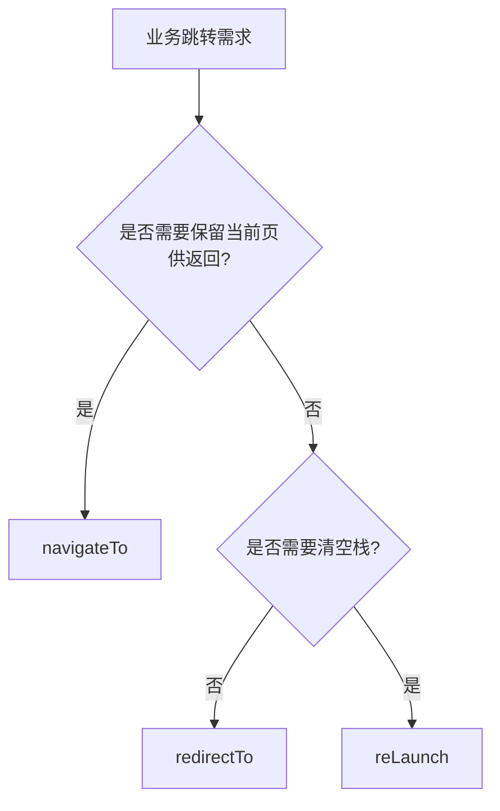

# 7.3 核心实现：小程序端路由管理

本文档系统梳理 BiteGo 小程序端在“页面多、跳转链路复杂、入口多样（扫码/分享/手动输入/业务兜底）”的背景下，如何通过集中式路由工具对页面路径、跳转方式与回退逻辑做统一治理，并给出关键边界处理策略与可复用模式。

***

## 1. 背景与目标

### 1.1 背景问题

在 Taro/微信小程序体系中，路由具备以下约束与复杂性：

- **必须提前注册**：只有在 `app.config.ts`  中注册过的页面才能跳转。
- **栈式导航**：`navigateTo` 会增加页面栈深度，`redirectTo` 会替换当前页，`reLaunch` 会重置整个栈；不恰当的使用会导致“回退不可预期”“栈过深”“无法返回”等体验问题。
- **入口多样**：用户可能从扫码（scene/path）、分享、手动输入 tableId 等路径进入同一业务流程，导致“上一页是否存在/是否预期”不稳定。
- **参数与编码**：query 与 scene 都可能经过二次编码，需要健壮的解析与容错。

### 1.2 目标

路由管理的核心目标：

- 统一维护“页面路径常量”，避免硬编码散落。
- 统一封装跳转方式，减少直接调用 `Taro.navigateTo/redirectTo/reLaunch/navigateBack` 带来的不一致。
- 提供“安全回退”能力：当上一页不存在或不是预期页面时，自动走兜底跳转，避免用户卡死。
- 对扫码/scene 参数做鲁棒解析，保证多入口一致可用。
- 用单元测试覆盖关键路由策略（尤其是回退与边界）。

***

## 2. 路由注册：页面与分包

页面注册位于：

- [app.config.ts](../projects/miniprogram/src/app.config.ts)

当前页面结构：

- 主包 pages：
  - `/pages/index/index`
  - `/pages/order-meal/index`
  - `/pages/checkout/index`
  - `/pages/table-orders/index`
- 分包 subpackages：
  - `subpackages/profile/pages/history-orders/index`
  - `subpackages/profile/pages/order-detail/index`
  - `subpackages/profile/pages/profile-edit/index`

路由工具的 `routes` 常量应与注册表保持一致，并作为唯一可信源对外提供。

***

## 3. 集中式路由工具：router.ts

核心实现集中在：

- [router.ts](../projects/miniprogram/src/utils/router.ts)

### 3.1 路由表（routes）

`routes` 以“语义化 key → 页面路径”的方式集中管理所有页面：

- 好处：
  - 可读性更高（`router.toCheckout` 比 `navigateTo('/pages/checkout/index')` 更清晰）
  - 统一管理路径变更（分包路径、重命名等）

实现参考：[router.ts:L19-L27](../projects/miniprogram/src/utils/router.ts#L19-L27)

### 3.2 Query 序列化与编码

`toQueryString()`：

- 过滤 `undefined/null`
- 对 key/value 统一 `encodeURIComponent`
- 输出 `?k=v&...` 或空字符串

实现参考：[toQueryString](../projects/miniprogram/src/utils/router.ts#L5-L10)

推荐原则：

- 路由参数尽量保持 **短小、可序列化**（string/number/boolean）。
- 不在 query 中塞入大 JSON（避免长度与编码风险）。
- 所有跳转参数都通过 `toQueryString` 统一编码，避免某些页面自行拼接导致差异。

### 3.3 不同跳转方式的规范化封装

`router` 对常用跳转方式做了语义化包装：

- `navigateTo`：打开新页面（默认模式）
  - `toOrderMeal/toCheckout/toTableOrders/toHistoryOrders/toOrderDetail/toProfileEdit`
- `redirectTo`：替换当前页面（用于“不可回退”的流程节点）
  - `replaceToTableOrders`
- `reLaunch`：重置栈（用于“从特殊入口强制重置流程”或“兜底回首页/点餐页”）
  - `toIndex/relaunchOrderMeal`

实现参考：[router.ts:L35-L63](../projects/miniprogram/src/utils/router.ts#L35-L63)



### 3.4 安全回退：router.back({ expect, fallback })

这是路由治理的关键能力，用于解决“上一页不稳定”的现实问题（例如扫码直达、从分享卡片直达、或页面栈被 reLaunch 重置）。

接口形态：

- `router.back(delta)`：简单回退（默认 `delta=1`）
- `router.back({ delta, expect, fallback })`：
  - `expect`：上一页（按 delta 计算）必须匹配的路由路径（支持 string 或数组）
  - `fallback`：不匹配时的兜底跳转（`mode` 支持 `redirectTo/reLaunch/navigateTo`，默认 `redirectTo`）

实现参考：[router.back](../projects/miniprogram/src/utils/router.ts#L64-L85)

#### 3.4.1 回退判定算法

关键点：

- 使用 `Taro.getCurrentPages()` 获取页面栈
- 根据 `delta` 计算“目标上一页”对象
- 使用 `normalizeRoute()` 去掉：
  - 开头 `/`
  - query string
  - 空格
  - 统一比较“纯路径部分”

实现参考：[normalizeRoute](../projects/miniprogram/src/utils/router.ts#L12-L17)

```mermaid
flowchart TD
  A[router.back(options)] --> B{options 是否为 number?}
  B -->|是| C[navigateBack(delta)]
  B -->|否| D[读取 delta/expect]
  D --> E{expect 是否提供?}
  E -->|否| C
  E -->|是| F[pages = getCurrentPages()]
  F --> G[prev = pages[pages.length-(delta+1)]]
  G --> H[prevRoute = normalizeRoute(prev.route)]
  H --> I{prevRoute 是否匹配 expect?}
  I -->|是| C
  I -->|否| J{是否提供 fallback?}
  J -->|否| C
  J -->|是| K[按 mode 执行 fallback\nredirectTo/reLaunch/navigateTo]
```

#### 3.4.2 典型场景：从扫码直达的“返回”

以“下单成功后跳转到桌台订单页”为例：

- 如果用户是“正常路径”（点餐页 → checkout → 桌台订单），返回到点餐页可以 `navigateBack`
- 如果用户是“直达路径”（比如某些流程使用 `reLaunch` 重置了栈，或无上一页），返回则需要 fallback（`reLaunch`/`redirectTo`）

业务代码中典型用法见：

- 下单成功后“替换”到桌台订单页（避免回退到 checkout）：\
  [checkout/index.tsx](../projects/miniprogram/src/pages/checkout/index.tsx#L139-L148)
- 桌台订单页“返回点餐”时，如果上一页不是点餐页，则 `reLaunch` 兜底：\
  [table-orders/index.tsx](../projects/miniprogram/src/pages/table-orders/index.tsx#L254-L265)

***

## 4. 统一获取路由：useAppRouter

在页面组件内统一通过 Hook 获取 router，避免：

- 直接 import `Taro` 并散落调用
- 在测试中难以 mock
- 不同页面混用不同跳转方式

实现参考：

- [useAppRouter.ts](../projects/miniprogram/src/hooks/useAppRouter.ts)

***

## 5. 多入口参数解析：扫码 path / scene → tableId

扫码入口是小程序“路由入口不稳定”的主要来源之一。BiteGo 把扫码解析抽到独立工具：

- [codeParser.ts](../projects/miniprogram/src/utils/codeParser.ts)

### 5.1 解析策略

`extractTableIdFromScanPath(rawPath)` 的策略具备多层容错：

- 同时尝试原始字符串与 `decodeURIComponent` 一次后的字符串
- 如果包含 query：
  - 优先读 `tableId`
  - 其次读 `scene`，对 scene 再 decode，再按 query 解析 tableId
  - 最后尝试正则 `tableId=...`
- 如果不含 query：
  - 直接 regex 抽取 `tableId=...`

实现参考：[extractTableIdFromScanPath](../projects/miniprogram/src/utils/codeParser.ts#L24-L48)

```mermaid
flowchart TD
  A[rawPath] --> B[构造 candidates:\nraw + decode(raw)]
  B --> C{遍历候选 p}
  C --> D{p 含 '?' ?}
  D -->|是| E[parseQueryString]
  E --> F{params.tableId?}
  F -->|是| R[返回 tableId]
  F -->|否| G{params.scene?}
  G -->|是| H[decode(scene)\nparseQueryString(scene)]
  H --> I{sceneParams.tableId?}
  I -->|是| R
  I -->|否| J{regex tableId=... ?}
  J -->|是| R
  D -->|否| K{regex tableId=... ?}
  K -->|是| R
  C --> L[全部失败]
  L --> Z[返回空字符串]
```

### 5.2 页面侧的边界处理

例如点餐页在 `useLoad` 时读取 tableId：

- 从 query `tableId` 读取
- 从 `scene`（扫码）解析
- 失败则回首页并 toast

实现参考：[order-meal/index.tsx](../projects/miniprogram/src/pages/order-meal/index.tsx#L215-L226)

***

## 6. 边界与异常处理清单（论文可引用）

### 6.1 上一页不存在 / 不可预期

- 使用 `router.back({ expect, fallback })`，并选择合理 fallback：
  - 回“流程入口页”：`redirectTo`
  - 重置整个栈：`reLaunch`

### 6.2 参数缺失 / 不可信

示例：点餐页若无法获得 tableId，直接回首页并提示：\
[order-meal/index.tsx](../projects/miniprogram/src/pages/order-meal/index.tsx#L215-L226)

### 6.3 维护态/鉴权异常导致的全局跳转

桌台会话 WS 收到维护态 `ERROR(code=50300)` 时：

- 弹窗提示
- 跳转首页
- 断开会话

实现参考：[tableSessionStore.ts](../projects/miniprogram/src/store/tableSessionStore.ts#L416-L442)

***

## 7. 测试策略：对关键回退逻辑做单测

路由工具的高价值点是“回退兜底”，因此需要用单测保证变更不会破坏边界行为。

当前单测覆盖：

- 期望命中时：走 `navigateBack`
- 期望不命中时：走 fallback（默认 `redirectTo`）

实现参考：[router.test.ts](../projects/miniprogram/src/utils/router.test.ts)

***

## 8. 与其他核心实现的关系

- 桌台协同会话（WS）在维护态/断连时会触发“回首页/重置路由栈”等行为：\
  [7.1-核心实现-桌台协同会话.md](./7.1-核心实现-桌台协同会话.md)
- 点餐页复杂交互（电梯锚定、分类渲染）中也大量依赖“安全跳转与回退兜底”：\
  [7.4-核心实现-小程序端点餐页分类渲染.md](./7.4-核心实现-小程序端点餐页分类渲染.md)

