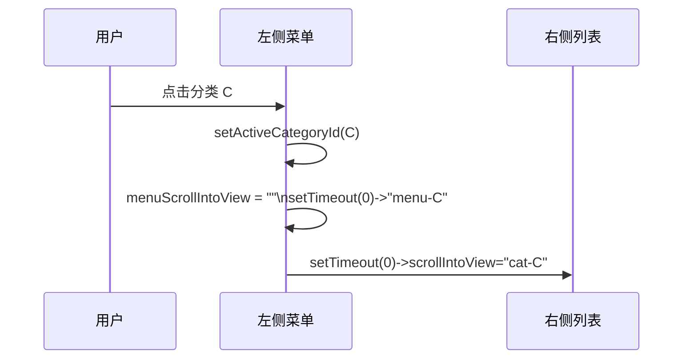
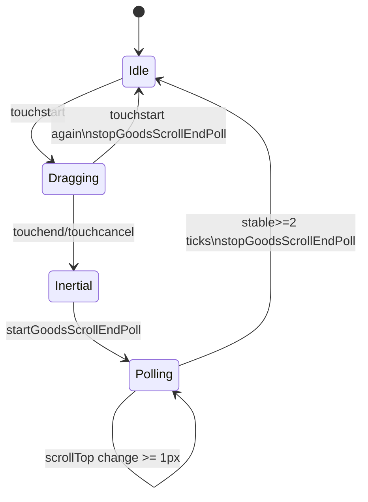

# 7.4 核心实现：小程序端点餐页分类渲染（电梯层锚定）

本文档梳理 BiteGo 小程序端点餐页在“分类渲染 + 电梯式锚定（Scroll Elevator）”上的核心实现：右侧按分类分组渲染菜品列表，左侧分类菜单既能点击跳转到目标分类，也能在用户滚动时自动高亮并跟随滚动到当前分类，从而显著提升“我在哪/我去哪里”的导航体验。

***

## 1. 目标与挑战

### 1.1 产品目标

- **信息组织清晰**：菜品多时仍可快速定位分类。
- **双向联动**：
  - 点击左侧分类 → 右侧滚到对应分类分区；
  - 右侧滚动 → 左侧高亮并自动滚动到当前分类位置。
- **体验稳定**：在不同机型、不同基础库版本下保持稳定的锚定行为。

### 1.2 技术挑战

在微信小程序/Taro 的 `ScrollView` 中实现“电梯锚定”，主要难点是：

- `scrollIntoView` 依赖锚点 id，且对“重复设置同一个 id”有时不触发，需要技巧处理。
- 惯性滚动阶段 `onScroll` 并非所有机型都稳定触发，可能导致“最终停在哪一段”无法被捕捉，从而左侧高亮停留在旧值。
- 右侧分区顶部位置需要从渲染后的真实 DOM 布局测量得到（不同屏幕/字体/安全区会变化）。
- 左侧菜单在分类很多时自身也需要可滚动，并要把高亮项“滚到可见区域”，否则用户看不到当前高亮。

***

## 2. 核心代码入口与结构

### 2.1 主要文件

- 点餐页（分类渲染 + 电梯锚定主逻辑）：\
  [order-meal/index.tsx](../projects/miniprogram/src/pages/order-meal/index.tsx)
- 样式（两列布局、滚动容器、分区样式）：\
  [order-meal/index.scss](../projects/miniprogram/src/pages/order-meal/index.scss)

### 2.2 核心状态与引用（state/ref）

点餐页用“少量 state + 多个 ref”实现“滚动联动的稳定性”：

- `activeCategoryId`：左侧高亮的当前分类（state，触发渲染）
- `activeCategoryIdRef`：当前分类的 ref（避免闭包问题，降低渲染抖动）
- `scrollIntoView`：右侧 `ScrollView` 的锚点目标 id（形如 `cat-${categoryId}`）
- `menuScrollIntoView`：左侧菜单 `ScrollView` 的锚点目标 id（形如 `menu-${categoryId}`）
- `sectionTopsRef`：各分类分区顶部 top 表（用于 scrollTop → 分类命中）
- `goodsScrollTopRef`：右侧当前 scrollTop 的缓存
- `menuScrollTimerRef/menuScrollPendingRef`：左侧菜单自动滚动节流（80ms）
- `goodsScrollEndTimerRef/goodsScrollEndSeqRef`：滚动结束轮询机制（60ms）

定义参考：[order-meal/index.tsx:L42-L57](../projects/miniprogram/src/pages/order-meal/index.tsx#L42-L57)

***

## 3. 分类渲染：从数据到分区列表（右侧）

### 3.1 分组数据 grouped 的构建

点餐页采用“前端一次性拉取商品列表 → 按分类分组渲染”的策略。分组逻辑在 `grouped` 中完成：

- 支持“多分类菜品”：若 `good.categoryIds` 存在，则该菜品会出现在多个分类分区中。
- 分区内排序：
  - 优先使用 `categorySortById[categoryId]`（分类内排序权重，越大越靠前）
  - 其次按 `createdAt`（时间较早靠前）
  - 最后按 `goodId` 稳定排序
- 过滤空分类：无菜品的分类不渲染（避免左侧出现空项、右侧出现空标题）

实现参考：[grouped useMemo](../projects/miniprogram/src/pages/order-meal/index.tsx#L419-L445)

```mermaid
flowchart TD
  A[categories] --> B[遍历 goods\n按 categoryId/categoryIds 聚合]
  C[goods] --> B
  B --> D[对每个分类 goods 排序\nsortById desc -> createdAt asc -> goodId]
  D --> E[过滤 goods 为空的分类]
  E --> F[grouped[]\n= [{category, goods[]}, ...]]
```

### 3.2 分区锚点：cat-${categoryId}

右侧每个分类分区都会渲染为一个带 id 的容器，例如：

- `id="cat-${categoryId}"`
- className 为 `.cat-section`（用于 selectorQuery 批量测量）

实现参考：[右侧分区渲染](../projects/miniprogram/src/pages/order-meal/index.tsx#L748-L780)

***

## 4. 左侧点击跳转：menu → goods scrollIntoView

点击左侧分类项，会同时触发三件事：

1. 更新当前高亮分类（`activeCategoryId` / `activeCategoryIdRef`）
2. 左侧菜单自身滚动，让高亮项进入可视区（`menuScrollIntoView`）
3. 右侧滚动到对应分类分区（`scrollIntoView`）

实现参考：[左侧点击逻辑](../projects/miniprogram/src/pages/order-meal/index.tsx#L730-L738)

### 4.1 让 scrollIntoView “稳定触发”的技巧

在实践中，`ScrollView.scrollIntoView` 对“重复设置同一个 id”可能不触发滚动（尤其是连续点击同一分类）。本项目使用的技巧是：

- 先把 `menuScrollIntoView` 置空
- 再 `setTimeout(0)` 设置为目标 id
- 并通过 `menuScrollPendingRef` 防止过期任务覆盖最新目标

实现参考：[applyMenuScrollIntoView](../projects/miniprogram/src/pages/order-meal/index.tsx#L146-L154)



***

## 5. 右侧滚动锚定：goods scrollTop → activeCategoryId

### 5.1 计算分类分区顶部表 sectionTopsRef

电梯锚定的关键，是把“每个分类分区在滚动容器内的 top”预先算出来。实现方式：

- 在 `grouped` 变化后（意味着 DOM 结构变化），延迟到下一帧：
  - 用 `Taro.createSelectorQuery()` 同时获取：
    - `.goods-scroll` 容器的 `boundingClientRect`
    - 所有 `.cat-section` 的 `boundingClientRect`
  - 将每个分区 top 转换为“相对滚动内容”的 top：
    - `top = sectionRect.top - containerRect.top + currentScrollTop`
  - 排序后写入 `sectionTopsRef.current`
  - 若当前 active 分类失效（例如搜索过滤后分类消失），则切到第一个分类并同步左侧菜单滚动

实现参考：[sectionTopsRef 构建](../projects/miniprogram/src/pages/order-meal/index.tsx#L447-L481)

```mermaid
flowchart TD
  A[grouped 变化] --> B[nextTick + selectorQuery]
  B --> C[获取 containerRect(.goods-scroll)]
  B --> D[获取 sectionRects(.cat-section[])]
  C --> E[containerTop]
  D --> F[对每个 section:\nrelTop = sectionTop - containerTop + scrollTop]
  F --> G[按 relTop 升序排序]
  G --> H[sectionTopsRef = [{categoryId, top}...]]
  H --> I{activeCategoryId 是否仍存在?}
  I -->|否| J[切到第一个分类\n并滚动左侧菜单]
```

### 5.2 命中算法：syncActiveCategoryByScrollTop

当右侧滚动触发 `onScroll` 时，会把 `scrollTop` 交给 `syncActiveCategoryByScrollTop`，其命中逻辑是：

- 遍历 `sectionTopsRef`（已按 top 升序）
- 使用阈值 `threshold=10`：
  - 找到最后一个满足 `sectionTop <= scrollTop + threshold` 的分区作为当前分类
- 只有当命中的分类与 `activeCategoryIdRef` 不同，才会：
  - 更新 `activeCategoryId`
  - 调度左侧菜单自动滚动（节流）

实现参考：[syncActiveCategoryByScrollTop](../projects/miniprogram/src/pages/order-meal/index.tsx#L165-L180)

```mermaid
flowchart TD
  A[onScroll(scrollTop)] --> B[goodsScrollTopRef = scrollTop]
  B --> C{sectionTops 是否为空?}
  C -->|是| Z[return]
  C -->|否| D[threshold=10]
  D --> E[遍历 sectionTops\npicked = last(top <= scrollTop+threshold)]
  E --> F{picked 是否变化?}
  F -->|否| Z
  F -->|是| G[setActiveCategoryId(picked)]
  G --> H[scheduleMenuScrollIntoView(picked)\n80ms 合并]
```

### 5.3 左侧菜单跟随滚动：scheduleMenuScrollIntoView（80ms）

直接在每次 `onScroll` 都更新左侧 `menuScrollIntoView` 会导致高频 setState 与 UI 抖动，因此做了 80ms 合并：

- 连续滚动时不断刷新 timer
- 最终只触发一次 `applyMenuScrollIntoView`

实现参考：[scheduleMenuScrollIntoView](../projects/miniprogram/src/pages/order-meal/index.tsx#L156-L163)

***

## 6. 惯性滚动兜底：滚动结束轮询（scrollOffset poll）

部分机型在惯性滚动阶段 `onScroll` 触发不稳定，可能导致电梯锚定停留在旧分类。本项目采用“滚动结束轮询”兜底：

- `onTouchStart`：停止轮询（用户重新触摸表示新的滚动开始）
- `onTouchEnd/onTouchCancel`：开始轮询
- 轮询逻辑：
  - 每 60ms 用 selectorQuery 获取 `.goods-scroll` 的真实 `scrollTop`
  - 连续 2 次变化 < 1px 认为稳定，停止轮询
  - 每次 tick 都调用 `syncActiveCategoryByScrollTop` 修正锚定

实现参考：

- [startGoodsScrollEndPoll](../projects/miniprogram/src/pages/order-meal/index.tsx#L188-L213)
- 绑定事件：[ScrollView 触摸事件](../projects/miniprogram/src/pages/order-meal/index.tsx#L748-L762)



***

## 7. 边界与工程化注意事项

### 7.1 搜索/过滤导致分类变化

当 keyword 变化、goods 列表变化时：

- `grouped` 可能减少分类数量
- `activeCategoryId` 可能失效

因此在重算 `sectionTopsRef` 后，会检查 active 是否仍存在，不存在则切到第一个分类并滚动左侧菜单以保持一致性。\
实现参考：[order-meal/index.tsx](../projects/miniprogram/src/pages/order-meal/index.tsx#L470-L477)

### 7.2 class/id 的一致性约束

实现依赖以下“选择器契约”，变更时必须同步：

- 右侧滚动容器 class：`.goods-scroll`
- 分区容器 class：`.cat-section`
- 分区 id 前缀：`cat-`
- 左侧菜单锚点 id 前缀：`menu-`

相关样式参考：[index.scss](../projects/miniprogram/src/pages/order-meal/index.scss)

***

## 8. 与其他核心实现的关系

- 规格/价格/库存模型决定了点餐页“规格面板、SKU 命中、单价展示、加购协议”的口径：\
  [7.2-核心实现-规格、价格和库存模型.md](./7.2-核心实现-规格、价格和库存模型.md)
- 路由管理（安全回退、扫码入口）影响点餐页初始化与异常兜底：\
  [7.3-核心实现-小程序端路由管理.md](./7.3-核心实现-小程序端路由管理.md)

