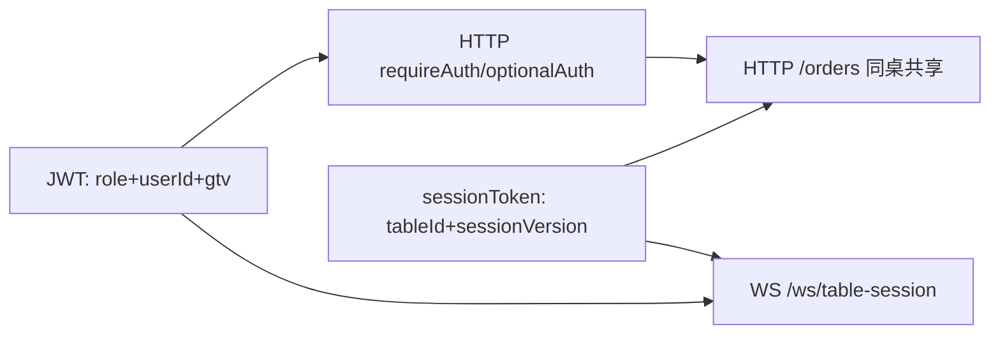
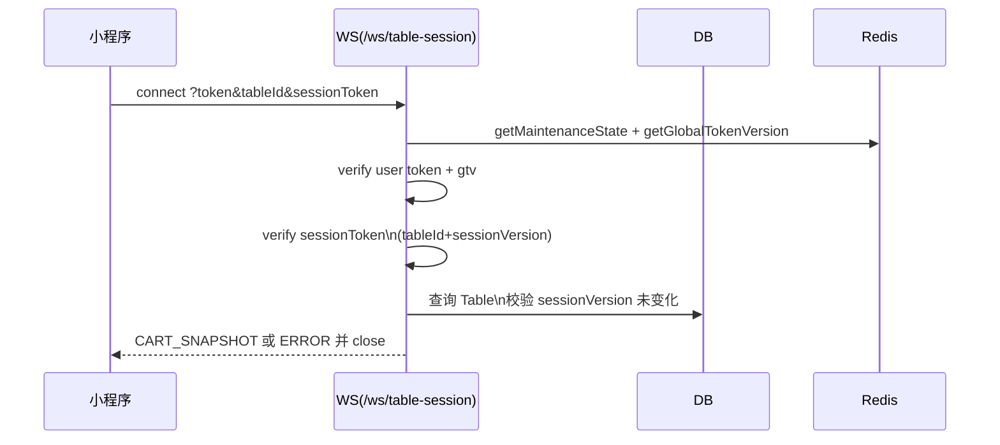
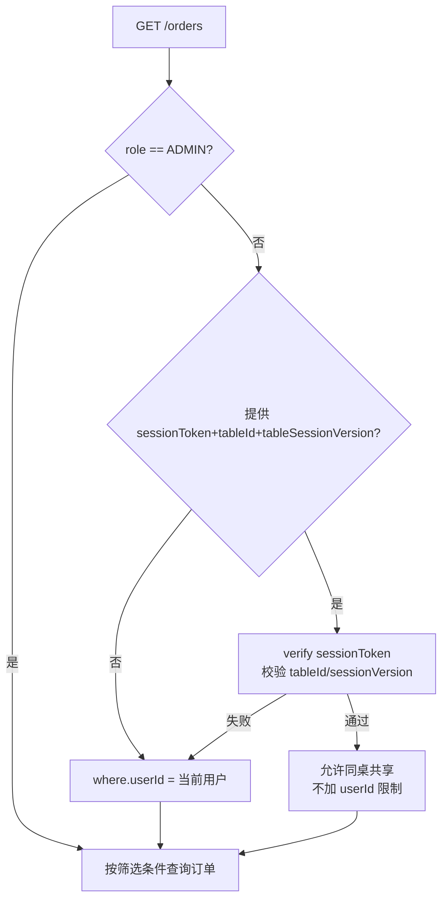
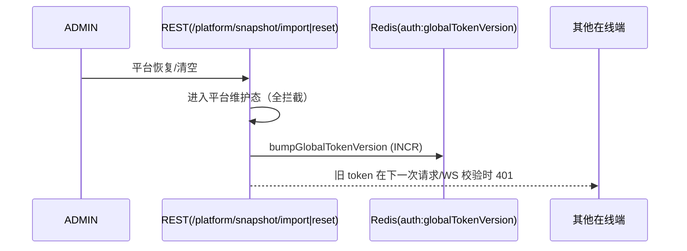

# 7.5 核心实现：鉴权与安全

本文档系统梳理 BiteGo 服务端在“接口鉴权、桌台鉴权、订单鉴权（同桌共享）、token version（gtv）”方面的核心实现与安全边界，并给出端到端流程图与关键代码引用，作为后续维护与毕业论文写作的依据。

---

## 1. 总览：系统身份与鉴权边界

### 1.1 两类身份（角色）

服务端用同一套 JWT 机制同时支持两类主体：

- `ADMIN`：Web 管理端管理员。具备门店配置、菜品/SKU、订单、桌台、导入导出等管理能力。
- `CUSTOMER`：面向点餐端的顾客用户。当前实现支持两种入口：
  - 微信小程序（weapp）：通过微信登录获取 openid（或等价标识）后由服务端签发 token
  - H5（浏览器扫码）：使用本地持久化的随机 `userId` 调用 `POST /api/v1/auth/h5/login` 换取 token（localStorage 被清空则视为新用户）

JWT payload 至少包含 `role/userId`，并可携带 `nickname/avatarUrl` 用于快照字段写入与前端展示（例如“谁添加了这道菜”）。

实现参考：鉴权中间件对 payload 解码：[auth.ts](../projects/backend/src/middlewares/auth.ts#L6-L18)

### 1.2 三条核心鉴权链

系统内存在三条并行但可组合的鉴权链：

1. **接口鉴权（HTTP）**：`Authorization: Bearer <JWT>` → `requireAuth/requireAdmin/optionalAuth`。
2. **桌台会话鉴权（WS）**：用户 JWT + `sessionToken`（绑定 `tableId/sessionVersion`）共同校验，才能建立 `/ws/table-session`。
3. **订单“同桌共享”鉴权（HTTP）**：在 `CUSTOMER` 场景下，默认仅允许查看“本人订单”；若提供 `sessionToken` 且与 `tableId/tableSessionVersion` 匹配，则允许查看“本桌本次开台”范围内的订单。



---

## 2. JWT 设计：payload、过期与错误码

### 2.1 JWT payload 约定

服务端 JWT payload 的关键字段：

- `role`：`ADMIN | CUSTOMER`
- `userId`：业务用户 ID
- `nickname/avatarUrl`：可选，用于写入快照
- `gtv`：全局 token version（详见第 6 节）

签发代码参考：

- 管理端登录与 dev-token：[routes/auth.ts](../projects/backend/src/routes/auth.ts#L15-L95)
- H5 顾客登录（随机 userId）：[routes/auth.ts](../projects/backend/src/routes/auth.ts)
- 小程序微信登录：[routes/wechatAuth.ts](../projects/backend/src/routes/wechatAuth.ts#L125-L137)
- 用户资料更新后重新签发 token：[routes/wechatUser.ts](../projects/backend/src/routes/wechatUser.ts#L135-L150)

### 2.2 过期与通用错误码

- token 缺失或格式非法：`40100 Unauthorized`
- token 过期、签名不合法、或 gtv 不匹配：`40101 Token expired or invalid`
- 非管理员访问管理员接口：`40300 Forbidden`

实现参考：[requireAuth/requireAdmin](../projects/backend/src/middlewares/auth.ts#L36-L86)

---

## 3. HTTP 接口鉴权：requireAuth / optionalAuth / requireAdmin

核心中间件位于：

- [middlewares/auth.ts](../projects/backend/src/middlewares/auth.ts)

### 3.1 requireAuth：强制鉴权

处理流程（要点）：

1. 校验 `Authorization` 必须为 `Bearer <token>`
2. `jwt.verify(token, jwtSecret)`
3. 解码 token 的 `gtv`，并与 `getGlobalTokenVersion()` 当前值比较，不一致则拒绝
4. 解码 `role/userId`，注入 `req.user`

实现参考：[auth.ts](../projects/backend/src/middlewares/auth.ts#L36-L54)

```mermaid
flowchart TD
  A[HTTP Request] --> B{Header Authorization\nBearer token?}
  B -->|否| U[40100 Unauthorized]
  B -->|是| C[jwt.verify]
  C -->|失败| V[40101 Token expired or invalid]
  C -->|成功| D[decode gtv\ngetGlobalTokenVersion]
  D -->|不一致| V
  D -->|一致| E[decode role/userId\nreq.user = user]
  E --> F[next()]
```

### 3.2 optionalAuth：可选鉴权

用于“既支持游客/匿名访问，也支持登录后增强体验”的接口：

- 无 `Authorization`：直接放行
- 有 token：执行与 `requireAuth` 同等的 verify+gtv 校验；失败则返回 401

实现参考：[optionalAuth](../projects/backend/src/middlewares/auth.ts#L57-L77)

### 3.3 requireAdmin：管理员鉴权

基于 `req.user.role === 'ADMIN'` 判定：

- 非 ADMIN：`40300 Forbidden`

实现参考：[requireAdmin](../projects/backend/src/middlewares/auth.ts#L79-L86)

### 3.4 管理端授权：角色层级 + 计算能力位

管理端“是否允许执行某个管理操作”基于**三级角色层级**与一个**按场景计算的能力位**，`req.user.role` 只用于区分“是否为管理端登录主体”（ADMIN/CUSTOMER）。

- **角色层级（rank）**：`SUPER_ADMIN(3) > TENANT_ADMIN(2) > STORE_ADMIN(1)`。高阶角色自动覆盖低阶角色的可执行操作，无需额外展开权限位。
- **共享菜单写权限（canManageSharedCatalog）**：专门用于“连锁/单店共享菜单目录”类资源写操作的能力位；由角色 + 租户类型 + 当前门店是否主店共同计算：
  - 当前上下文为 CHAIN 租户的分店（`tenantType === 'CHAIN' && storeIsPrimary === false`）：一律为假。共享菜单行按 `storeId` 存储，从分店上下文写入会绕过主店→分店的同步日志，造成分店数据偏离主店的权威副本，因此任何角色都需要切换到租户面板或主店上下文后才能写入。
  - 其余情况下：`SUPER_ADMIN` / `TENANT_ADMIN` 为真（包括租户面板与主店上下文）；`STORE_ADMIN` 在 SINGLE 租户或 CHAIN 主店为真；其它情况（如 `STORE_ADMIN` 绑定到 CHAIN 分店）为假。
- 管理端授权范围（平台/租户/门店）与能力位统一来自：
  - `GET /api/v1/admin/me/scopes` 返回 `list`（原始 scope 记录）、`platform`（是否具备平台角色）、`tenants[]`（按租户/门店聚合的 `effectiveRole` 与 `canManageSharedCatalog`）
  - 服务端中间件 `requireAdminContext` 解析 `X-Tenant-Id/X-Store-Id/X-Board` 得到 `req.adminCtx`，其中包含 `adminRole/tenantType/storeIsPrimary/canManageSharedCatalog`
  - 路由层通过 `requireAdminRole('SUPER_ADMIN' | 'TENANT_ADMIN' | 'STORE_ADMIN')` 做角色层级校验；对“共享菜单写”类操作再辅以 `requireCatalogWrite()` 或 `ctx.canManageSharedCatalog` 直接判断

对于作用域授权的授予与撤销，系统采用“至少同级”策略：当调用者的 rank ≥ 目标角色的 rank 时允许，同级之间可以互相授权（例如一个 `SUPER_ADMIN` 可以把另外一个账号也绑定为 `SUPER_ADMIN`），但严格禁止低阶向高阶越权。此外，`STORE_ADMIN` 仅适用于 `CHAIN` 租户的分店：`SINGLE` 租户只有一家门店、由 `TENANT_ADMIN` 一个角色即可覆盖全部职责，因此后端在 `POST /api/v1/admin-scopes`、`POST /api/v1/platform/users`、`POST /api/v1/tenant/admin-users` 等授予路径上，会对 `tenants.type = 'SINGLE'` 的租户拒绝写入 `STORE_ADMIN`（返回 `400 Role not allowed for SINGLE tenant`）；Web 管理端角色选择器也会在选中 `SINGLE` 租户时把 `STORE_ADMIN` 选项置灰并以 Tooltip 说明原因。

商品的“上/下架”与“默认 SKU 切换”是连锁分店店长必备的轻量日常运营能力，因此在 `canManageSharedCatalog === false` 时仍允许 `STORE_ADMIN` 调用 `PUT /goods/:goodId` 修改 `status`/`defaultSkuId` 字段（其它字段仍被拒绝）；该白名单位于 `goods.ts`，和共享菜单写的强分支互补。

实现参考：

- AdminContext 解析 + `requireAdminRole` + `requireCatalogWrite` + `computeCanManageSharedCatalog`：[adminAuthz.ts](../projects/backend/src/middlewares/adminAuthz.ts)

### 3.5 AdminContext 详细校验流程

`requireAdminContext` 中间件对 `X-Tenant-Id`、`X-Store-Id` 和 `X-Board` 头部的校验是多层级的，确保不存在越权风险：

#### 3.5.1 校验规则概览

1. **上下文一致性校验**：
   - 当提供 `X-Store-Id` 时：若提供 `X-Board`，必须为 `store`（即使同时提供 `X-Tenant-Id` 也按 store 视角处理）
   - 当仅提供 `X-Tenant-Id`（且无 `X-Store-Id`）时：若提供 `X-Board`，必须为 `tenant`
   - 不一致时返回 `400 Invalid admin context`

2. **资源存在性校验**：
   - 验证 `X-Store-Id` 对应的门店是否存在且有有效的 `tenantId`
   - 不存在时返回 `404 Store not found`

3. **租户-门店关联校验**：
   - 当同时提供 `X-Tenant-Id` 和 `X-Store-Id` 时，验证门店是否属于指定租户
   - 不匹配时返回 `403 Forbidden`

4. **权限校验**：
   - 基于用户的 `admin_scopes` 验证是否有权限访问指定的租户或门店
   - 对于 `store` 级请求，检查用户是否有该门店的 `STORE_ADMIN` 权限或其租户的 `TENANT_ADMIN` 权限
   - 对于 `tenant` 级请求，检查用户是否有该租户的 `TENANT_ADMIN` 权限
   - 无权限时返回 `403 Forbidden`

#### 3.5.2 SUPER_ADMIN 特殊处理

- 可不带租户/门店上下文（默认为平台视角）
- 但如果指定了上下文，仍需遵循相应规则
- 如果不带上下文，`X-Board` 可省略或为 `platform`（若显式提供且不为 `platform` 则视为无效上下文）

#### 3.5.3 处理流程图

```mermaid
flowchart TD
    A[requireAdminContext] --> B{X-Store-Id\n存在?}
    B -->|是| C[若提供 X-Board 必须为 store\n验证 store 存在\n验证 tenant-store 关联\n验证权限: SUPER_ADMIN/TENANT_ADMIN/STORE_ADMIN]
    B -->|否| D{X-Tenant-Id\n存在?}
    D -->|是| E[若提供 X-Board 必须为 tenant\n验证权限: SUPER_ADMIN/TENANT_ADMIN]
    D -->|否| F{用户是 SUPER_ADMIN\n且 (无 X-Board\n或 X-Board==platform)?}
    F -->|是| G[设置平台视角上下文]
    F -->|否| H[400 Missing admin context]
    C --> I[设置 store 视角上下文]
    E --> J[设置 tenant 视角上下文]
    I --> K[next()]
    J --> K
    G --> K
```

#### 3.5.4 关键代码片段

- AdminContext 类型与角色层级：[adminAuthz.ts:9-27](../projects/backend/src/middlewares/adminAuthz.ts#L9-L27)
- `computeCanManageSharedCatalog`：[adminAuthz.ts:44-55](../projects/backend/src/middlewares/adminAuthz.ts#L44-L55)
- `requireAdminContext`：[adminAuthz.ts:62-200](../projects/backend/src/middlewares/adminAuthz.ts#L62-L200)
- `requireAdminRole` / `requireBoard` / `requireCatalogWrite`：[adminAuthz.ts:211-255](../projects/backend/src/middlewares/adminAuthz.ts#L211-L255)

---

## 4. 桌台鉴权：sessionToken（绑定 tableId/sessionVersion）

### 4.1 sessionToken 的含义

`sessionToken` 是服务端签发的 JWT，用来证明“当前用户正在参与某桌某次开台会话”。其载荷为：

- `{ tableId, sessionVersion }`

它不是用户身份 token，不包含 userId；它的职责是**限定桌台会话的作用域**，从而支持：

- 建立桌台协同 WebSocket 连接 `/ws/table-session`
- 在订单查询中实现“同桌共享”授权（详见第 5 节）

### 4.2 sessionToken 的签发（HTTP）

小程序进入桌台时会调用：

- `GET /api/v1/tables/:tableId`

服务端返回 `sessionToken`：

- [tables.ts](../projects/backend/src/routes/tables.ts#L191-L217)

### 4.3 sessionToken 的校验（WS）

桌台 WebSocket 连接（`/ws/table-session`）要求同时提供：

- 用户 JWT：query `token=...`
- 会话 token：query `sessionToken=...`
- tableId：query `tableId=...`

服务端校验顺序（以当前实现为准）：

1. 维护态拦截（维护中拒绝连接）
2. 校验用户 JWT（含 gtv 校验）
3. 校验 sessionToken（JWT verify + payload tableId/sessionVersion）
4. DB 校验 `Table.sessionVersion === sessionToken.sessionVersion`，否则认为“桌台会话已关闭”

实现参考：[tableSession.ts](../projects/backend/src/ws/tableSession.ts#L85-L139)



### 4.4 桌台重置（reset-session）的安全边界

为优化“二次扫码入桌”的体验，小程序端在“桌台已占用且无同桌在线用户、且无进行中订单”的条件下允许用户触发桌台重置，其服务端接口为：

- `POST /api/v1/tables/:tableId/reset-session`

安全约束（服务端强校验）：

- 必须携带用户 JWT（`requireAuth`）
- 必须满足：
  - 当前桌台无在线 WS 连接（`connCount == 0`）
  - 当前开台版本无进行中订单（`Created/Paid/Making` 数量为 0）
- 成功后等价于一次“清台”：`sessionVersion++`、清理旧会话 cart/items，并关闭该桌的 WS 会话（若存在）

实现参考：[tables.ts](../projects/backend/src/routes/tables.ts#L225-L277)

---

## 5. 订单鉴权：默认隔离 + 同桌共享（sessionToken）

订单资源的访问控制策略是：

- `ADMIN`：可访问任意订单
- `CUSTOMER`：
  - 默认只能访问 `order.userId == 当前 userId` 的订单（本人订单）
  - 若提供 `sessionToken` 且校验通过，可访问“本桌本次开台（tableId + tableSessionVersion）范围内”的订单（同桌共享）

### 5.1 列表接口：GET /orders

核心逻辑：

- 非 ADMIN 时：
  - 若 `sessionToken + tableId + tableSessionVersion` 同时提供，并且：
    - `jwt.verify(sessionToken)` 成功
    - payload `{tableId, sessionVersion}` 与 query `{tableId, tableSessionVersion}` 一致
  - 则允许“同桌会话视角”查看（不加 `where.userId=userId`）
  - 否则强制 `where.userId = 当前 userId`

实现参考：[orders.ts](../projects/backend/src/routes/orders.ts#L59-L70)



### 5.2 详情接口：GET /orders/:orderId

核心逻辑：

- 非 ADMIN 且 `order.userId !== 当前 userId` 时：
  - 必须提供 `sessionToken`
  - 并校验 sessionToken payload 与订单的 `{tableId, tableSessionVersion}` 一致，否则 403

实现参考：[orders.ts](../projects/backend/src/routes/orders.ts#L375-L390)

---

## 6. token version（gtv）：全局失效与一致性控制

### 6.1 gtv 是什么

`gtv`（Global Token Version）是系统维护的“全局 token 版本号”。

- 每个签发的 JWT 都带上当时的 `gtv`
- 每次鉴权时将 token 内 `gtv` 与服务端当前 `gtv` 比较，不一致则拒绝

作用：

- 实现“全局登出/强制失效”
- 在“门店导入/重置”等高风险操作后，使旧 token 全部失效，减少不一致状态与越权风险

### 6.2 gtv 的存储与失效策略

实现位于：

- [tokenVersion.ts](../projects/backend/src/services/tokenVersion.ts)

策略：

- 首选 Redis key：`auth:globalTokenVersion`
- Redis 不可用时回退为进程内 `memGtv`（单实例可用，多实例会弱化为“实例级失效”）

实现参考：[getGlobalTokenVersion/bumpGlobalTokenVersion](../projects/backend/src/services/tokenVersion.ts#L6-L30)

### 6.3 gtv 的校验点

当前实现中，gtv 校验覆盖：

- HTTP：`requireAuth/optionalAuth`
  - [middlewares/auth.ts](../projects/backend/src/middlewares/auth.ts#L36-L54)
- WS：桌台会话 `/ws/table-session`
  - [tableSession.ts](../projects/backend/src/ws/tableSession.ts#L106-L112)
- WS：管理端看板 `/ws/admin-dashboard`
  - [adminDashboard.ts](../projects/backend/src/ws/adminDashboard.ts#L120-L126)

### 6.4 gtv 的递增触发（全局失效点）

当前实现中，以下高风险操作完成后会触发 `bumpGlobalTokenVersion()`：

- 平台级数据恢复/清空（platform snapshot import/reset）：  
  [platformSnapshot.ts](../projects/backend/src/routes/platformSnapshot.ts#L79-L193)



---

## 7. 安全要点与边界说明

### 7.1 “桌台共享订单”策略的边界

同桌共享的安全前提是：

- **sessionToken 只能在“当前桌台当前开台”内有效**（sessionVersion 变化后失效）
- sessionToken 需要通过服务端签名校验，无法伪造
- tableId 本身是随机业务 ID（通过二维码分发），系统默认它具备一定“不可猜测性”

当前实现的共享范围：

- 同一 `tableId + tableSessionVersion` 下的订单列表与详情可共享查看
- 不支持跨桌台、跨开台版本的访问

### 7.2 维护态与异常处理

在平台/租户/门店执行恢复或清空期间，服务端进入对应 scope 的维护态，并在 WS/HTTP 侧返回 `50300`，避免出现“配置中间态”导致的数据不一致：

- 平台维护态：HTTP 全拦截；WS 断开；全局 token 失效（gtv bump）
- 租户/门店维护态：HTTP 仅禁写；WS 断开并拒绝新连；不强制 token 失效（读请求仍可用）

维护态在 WS 的拦截示例：

- [tableSession.ts](../projects/backend/src/ws/tableSession.ts#L88-L93)
- [adminDashboard.ts](../projects/backend/src/ws/adminDashboard.ts#L104-L109)

### 7.3 不在响应/日志中泄露敏感信息

小程序登录相关：

- 微信 `session_key` 仅保存于服务端 Redis（`wxsk:<userId>`），不会返回给客户端  
  [wechatAuth.ts](../projects/backend/src/routes/wechatAuth.ts#L125-L137)

管理员登录相关：

- 密码 hash 使用服务端工具处理；不输出明文密码  
  [routes/auth.ts](../projects/backend/src/routes/auth.ts#L9-L10)

### 7.4 可改进点（论文讨论方向）

- sessionToken 当前只绑定 tableId/sessionVersion，不绑定 userId；这是为了“同桌共享”与“多用户协作”的便利，但也意味着拥有 sessionToken 的任何用户都可视为“同桌成员”。若未来需要更强的成员控制，可考虑：
  - sessionToken 增加 `issuedToUserId` 并引入“桌台成员列表/加入流程”
  - 或在服务端引入一次性 join-code/短期 ticket 机制
- gtv 在 Redis 不可用时回退到 memGtv，会导致多实例情况下“全局失效”语义弱化。若部署为多实例，建议强依赖 Redis 或其他一致性存储。

---

## 8. 相关文档入口

- 桌台协同会话（WS、sessionToken、同桌共享的业务表现）：  
  [7.1-核心实现-桌台协同会话.md](./7.1-核心实现-桌台协同会话.md)
- 规格/价格/库存与 PI 快照（影响订单数据的快照与审计口径）：  
  [7.2-核心实现-规格、价格和库存模型.md](./7.2-核心实现-规格、价格和库存模型.md)
- 小程序端路由（扫码入口、兜底跳转与回退）：  
  [7.3-核心实现-小程序端路由管理.md](./7.3-核心实现-小程序端路由管理.md)
