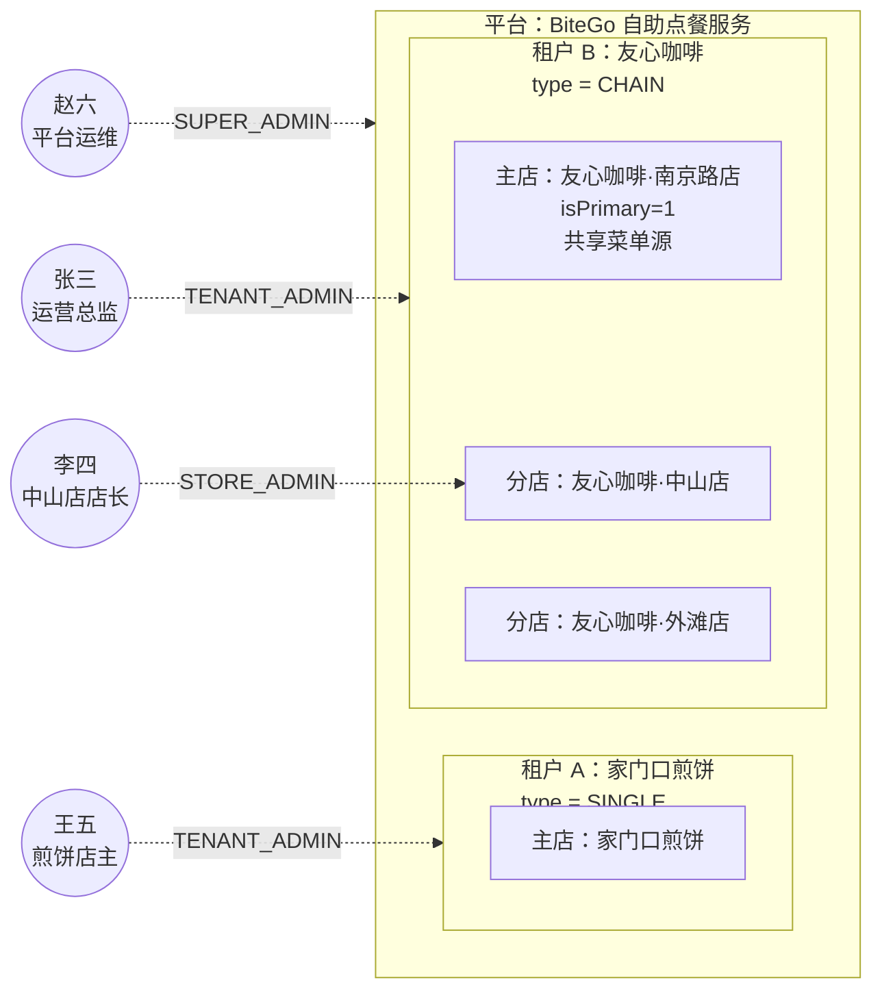
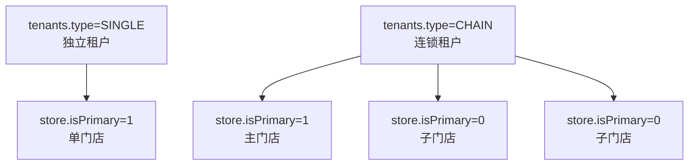

# 7.6 核心实现：平台多租户（SaaS）能力

本文档描述 BiteGo 点点餐从“单店模型”平滑演进到“面向餐饮行业的多租户 SaaS 平台”的总体设计与核心实现策略。目标是在共享基础设施（单数据库、统一服务端与前端工程）的前提下，实现不同租户/门店业务数据的隔离与权限边界，并扩展平台级与连锁级管理能力，同时保证现有单店模式 100% 可运行、现有 API 返回结构不被破坏（仅允许扩展字段）。

---

## 1. 背景与目标

### 1.1 背景

当前实现包含“单店模型”：

- 数据库中大量表已经具备 `storeId` 字段（如 `orders/tables/goods/categories/table_carts` 等），但整体仍以默认门店 `store_default` 为中心，缺少租户（tenant）层抽象与跨门店权限控制。
- Web 管理端默认假设“只有一个门店 + 一个管理员（ADMIN）”。
- 小程序端以“扫码入桌”作为唯一门店上下文入口，首页展示门店信息时默认拿 `stores/current`。

### 1.2 多租户平台目标

将系统升级为 SaaS 平台，支持：

1. 平台超级管理员（SUPER_ADMIN）可管理全平台租户（tenant/store）与用户（普通用户 + 门店管理员），可跨租户访问。
2. 连锁（TENANT_ADMIN）可管理其租户下多个门店；共享基础数据（分类/菜品/规格），但子门店对共享数据只读；门店级数据（SKU 库存/上下架、桌台等）仍按门店隔离。
3. 小程序首页首次访问展示平台信息（BiteGo + 可配置 Logo）；扫码入桌后记住最近一次入桌门店，并在后续展示该门店信息。
4. 小程序历史订单支持跨门店查看，并在列表中标注门店信息与桌台信息。
5. 扫码流程保持不变，服务端可通过 `tableId` 反查 `storeId` 并返回门店信息供小程序展示。

### 1.3 约束与兼容性

- 现有单店模式必须 100% 可运行（对用户透明）。
- 不允许破坏现有 API 返回结构（可新增字段；旧字段语义尽量保持）。
- 单数据库 + `tenantId/storeId` 隔离：所有业务数据必须具备归属字段；禁止跨租户隐式访问。

---

## 2. 概念模型：平台、租户、门店与后台管理用户（示例说明）

本节面向对 SaaS 多租户模型不熟悉的读者，先通过一组具体的虚构示例说明“平台、租户、门店”三层数据隔离模型的含义，以及“后台管理用户”如何与这三层产生关联。后续章节（§3 起）再给出严格的数据模型与接口约定。

### 2.1 三层主体：从“一家店”到“一个平台”

BiteGo 运行在一套部署、一套数据库之上，服务于多个彼此数据隔离的经营主体。为此系统抽象出三层主体：

1. **平台（Platform）**：最顶层，对应整套 BiteGo 服务本身。平台只有一个实例，负责承载所有租户，并提供平台级的品牌展示（小程序首页 Logo/名称）、跨租户的运维能力（数据搬家、维护态广播等）。
2. **租户（Tenant）**：平台的一级业务边界，代表一个“独立经营主体”（SaaS 领域的“客户”）。一个租户的数据与其他租户完全隔离；跨租户的访问只能由平台管理员进行。租户分两类：
    - **SINGLE（独立租户）**：只有一家门店，适合夫妻店、单体餐厅等小微经营者。
    - **CHAIN（连锁租户）**：拥有多家门店，其中一家被指定为“主门店”（`isPrimary = 1`），承载共享菜单/规格；其余为分店，在共享目录基础上按门店维度维护库存与上下架。
3. **门店（Store）**：租户下的经营实体，是订单、桌台、库存、SKU 上下架状态等“运营数据”的最小隔离单元。

这三层是严格包含关系：**平台 ⊇ 租户 ⊇ 门店**。任何业务数据（菜品、订单、桌台、库存）都归属到一个确切的门店（或租户级共享数据归属到一个租户），不存在“游离于租户之外”的数据。

### 2.2 一个具体示例

设平台上同时运行两个租户：

- **租户 A：家门口煎饼**（`type = SINGLE`）。只有一家门店“家门口煎饼”，该门店既是主门店也是唯一门店。
- **租户 B：友心咖啡**（`type = CHAIN`）。旗下有三家门店：
    - 友心咖啡·南京路店（主门店，`isPrimary = 1`，承载共享菜单）
    - 友心咖啡·中山店（分店）
    - 友心咖啡·外滩店（分店）

两家租户共用同一套 BiteGo 服务，但彼此看不到对方的订单、菜品、桌台。租户 B 的三家门店共享同一套菜单基础数据（菜品、分类、规格模板），但每家门店独立维护自己的库存、SKU 上架状态和桌台。中山店缺货下架某 SKU 时，不会影响外滩店的正常售卖。

### 2.3 后台管理用户如何与三层主体关联

系统的所有用户（无论顾客还是管理员）都统一保存在 `users` 表中。顾客身份很简单——以 `userId` 下单、按 `userId` 查订单即可。**难点在于后台管理用户**：同一个自然人可能在多个主体上都担任角色（例如既是平台运维又参与某连锁租户的运营），一个连锁品牌的运营总监需要能访问旗下所有门店。

为此，系统没有把“角色”直接写到 `users` 表上，而是引入一张多对多关联表 **`admin_scopes`（AdminScope）**：每一条记录表示“某个用户（`userId`）在某个主体（租户 `tenantId` 或门店 `storeId`）上担任什么角色（`role`）”。角色只有三种：

| 角色           | 绑定到的主体                                | 适用租户类型                   | 典型职责                                       |
| -------------- | ------------------------------------------- | ------------------------------ | ---------------------------------------------- |
| `SUPER_ADMIN`  | 平台（不指定 `tenantId`/`storeId`）         | —                              | 平台运维、租户开户与回收、数据搬家、维护态广播 |
| `TENANT_ADMIN` | 某个租户（`tenantId` 必填，`storeId` 为空） | `SINGLE` / `CHAIN`             | 管理该租户下所有门店、维护共享菜单与规格       |
| `STORE_ADMIN`  | 某个门店（`storeId` 必填）                  | 仅 `CHAIN` 分店                | 管理该门店的订单、桌台、库存与上下架状态       |

> `STORE_ADMIN` 仅适用于 `CHAIN` 租户的分店。`SINGLE` 租户只有一家门店，租户即门店，由 `TENANT_ADMIN` 一个角色覆盖运营与管理的全部职责；后端 `/api/v1/admin-scopes`、`/api/v1/platform/users`、`/api/v1/tenant/admin-users` 等授予路径在 `tenants.type = 'SINGLE'` 时拒绝写入 `STORE_ADMIN`，Web 管理端角色选择器对 `SINGLE` 租户选项在角色为 `STORE_ADMIN` 时禁用并以 Tooltip 提示。

一个用户可以拥有**多条** `AdminScope` 记录，代表其在不同主体上的多个身份；登录后台管理端后需要先**选板（Board）**——即选择进入“平台管理 / 连锁管理 / 门店管理”中的哪一块，前端据此在后续请求中设置 `X-Board` / `X-Tenant-Id` / `X-Store-Id` 上下文，服务端据此解析出当前生效的作用域与角色、租户类型、`isPrimary`、`canManageSharedCatalog` 等能力位，统一挂到 `req.adminContext` 上供下游路由使用。

沿用 §2.2 的例子，系统可能存在如下后台管理用户：

- **张三：友心咖啡运营总监**。一条 `AdminScope` 记录：`role = TENANT_ADMIN`，`tenantId = 租户B`。张三可以管理南京路店、中山店、外滩店三家门店的所有数据，也能维护共享菜单。
- **李四：友心咖啡·中山店店长**。一条 `AdminScope` 记录：`role = STORE_ADMIN`，`storeId = 中山店`。李四只能操作中山店的订单、桌台、SKU 库存；看不到南京路店和外滩店，也不能改共享菜单（共享菜单在门店维度对他只读）。
- **王五：家门口煎饼店主**。一条 `AdminScope` 记录：`role = TENANT_ADMIN`，`tenantId = 租户A`。租户 A 为 `SINGLE` 租户、仅有一家门店，`TENANT_ADMIN` 即可完成共享菜单维护、订单与桌台管理等全部工作，无需再叠加 `STORE_ADMIN`。
- **赵六：BiteGo 平台运维**。一条 `AdminScope` 记录：`role = SUPER_ADMIN`，不指定租户/门店。赵六可以跨租户查看任意数据、执行平台级数据搬家，但日常并不介入任何租户的具体经营。

三层主体与后台管理用户的关联关系如下图所示：

### 2.4 数据隔离的三条基本规则

基于上述概念模型，系统在所有业务查询/写入路径上强制以下三条规则，§5 将给出中间件层面的落地方案：

1. **门店级数据（订单、桌台、库存、SKU 状态等）按 `storeId` 过滤**。`STORE_ADMIN` 只能在自己关联的 `storeId` 上操作；跨门店访问返回 `403/404`。
2. **租户级共享数据（菜品、分类、规格模板等）按 `tenantId` 过滤**。`TENANT_ADMIN` 只能修改自己租户下的共享数据，修改后由后台 Worker 异步复制到该租户旗下各分店（见 §5）。
3. **平台级数据仅 `SUPER_ADMIN` 可写**。租户与门店对平台级数据（如平台 Branding、维护态开关）只能读或在自身作用域内读。

有了这三层主体 + `AdminScope` 关联表 + 强制过滤的权限校验链，同一套部署就能同时服务任意多的独立餐厅与连锁品牌，而彼此数据互不可见。

---

## 3. 租户/门店模型

### 2.1 概念定义

- **Tenant（租户）**：平台的一级业务边界，代表一个“独立经营主体”或“连锁品牌”。
- **Store（门店）**：租户下的经营实体。单店租户只有一个门店；连锁租户可包含多个门店。

### 2.2 单店与连锁的统一表示

系统约定（与当前代码实现一致）：

- **独立租户（单店）**：`tenants.type = 'SINGLE'`。该租户仅有一个门店，且 `stores.isPrimary = 1`。
- **连锁租户**：`tenants.type = 'CHAIN'`。`stores.isPrimary = 1` 的门店为主门店（CHAIN_PRIMARY），其余门店为子门店（CHAIN_BRANCH）。
- **标识字段说明**：`tenantId` 与 `storeId` 是不同维度的标识符，不应以“是否相等”来判断单店/连锁；只有初始化的默认门店（`store_default`）这条数据恰好相等。
- **单店命名同步**：单店租户“租户即门店”，`tenants.brandName` 与主门店 `stores.name` 概念同一，门店名为权威来源。任一侧通过 `PUT /api/v1/stores/current`、`PUT /api/v1/platform/stores/:storeId`、`PUT /api/v1/tenant/branding`、`PUT /api/v1/platform/tenants/:tenantId` 修改名称时，服务端在同事务内同步另一侧，保证两字段始终一致。

---

## 4. 角色体系与权限边界

### 4.1 角色定义

| 角色         | 说明           | 访问范围                                                              |
| ------------ | -------------- | --------------------------------------------------------------------- |
| SUPER_ADMIN  | 平台超级管理员 | 可管理所有 tenant/store/user；可跨租户访问所有数据                    |
| TENANT_ADMIN | 连锁租户主账号 | 仅可访问其 tenant；可管理 tenant 下所有 store；可维护共享基础数据     |
| STORE_ADMIN  | 门店管理员     | 仅可访问其 store；仅能维护门店级数据（桌台、订单、SKU 库存/上下架等） |
| CUSTOMER     | 顾客（小程序） | 可点餐、查看订单；订单跨门店按用户维度汇总；桌台会话按门店隔离        |

补充说明：

- `CUSTOMER/ADMIN` 是 JWT 身份类型（`/users/me.userType`），仅用于区分“是否为管理端登录主体”；不参与管理端授权判断。
- 管理端授权统一以 `AdminScope`（平台/租户/门店维度）+ 角色层级（SUPER_ADMIN > TENANT_ADMIN > STORE_ADMIN）+ 动态能力位 `canManageSharedCatalog` 为准，前后端均通过 `/api/v1/admin/me/scopes` 获取并据此校验。

### 4.2 Web 管理端”多权限用户”的板块选择

当同一用户具备多重权限（如既是 TENANT_ADMIN 又是某个 store 的 STORE_ADMIN，或 SUPER_ADMIN），进入 Web 管理端后应先选择进入哪个板块：

- 平台管理（SUPER_ADMIN）
- 连锁管理（TENANT_ADMIN）
- 门店管理（STORE_ADMIN）

选择后前端会设定“当前上下文（tenantId/storeId + boardType）”，并在后续 API 请求中显式携带，服务端据此进行鉴权与数据过滤。

---

## 5. 数据隔离方案（单库 + tenantId/storeId）

### 5.1 强制显式数据访问（禁止跨租户隐式访问）

服务端所有“业务查询/写入”必须明确携带并校验 `tenantId/storeId`：

- 对门店级数据：必须按 `storeId` 过滤
- 对租户级共享数据：必须按 `tenantId` 过滤
- 对平台级数据：只允许 SUPER_ADMIN 访问或公开只读（如平台 Branding）

推荐实现方式：

1. 在鉴权中间件之后，统一注入 `req.adminCtx = { adminRole, userId, tenantId, storeId, board, tenantType, storeIsPrimary, canManageSharedCatalog }`。
2. Repository/Service 层禁止直接使用“未过滤的全表查询”；必须从 `req.adminCtx` 取上下文并加 where 条件。
3. 对关键入口加测试（见第 9 节）。

### 5.2 共享基础数据 + 门店级覆写（解决”共享但不共享库存/上下架”）

连锁要求“共享菜品分类/规格/菜品信息，但不共享 SKU 库存/上下架状态”。为兼容现有 API 并降低迁移风险，推荐采用“共享主数据 + 门店覆写”模式：

- 租户共享（tenant scope）：
  - Category（分类定义）
  - Good（菜品主体：名称、描述、图片、基础价、详情 markdown）
  - SpecGroup/SpecOption（自定义规格）
  - SharedSpecGroup/SharedSpecOption（共享非库存规格组）
- 门店覆写（store scope）：
  - Good 在门店维度的状态（ON_SHELF/OFF_SHELF）
  - SKU 在门店维度的库存/状态（stock/status）
  - Table（桌台）与 TableCart（桌台会话）
  - Order（订单）与退款等交易链路

实现结论（当前实现）：复制共享数据到各 store，并用 `templateId` 关联主版本（兼容优先）。

- 每个 store 存一份 `goods/categories/spec_groups`，通过 `sharedKey`/`templateId` 指向主版本
- TENANT_ADMIN 更新共享数据时同步更新 tenant 下所有 store 的副本
- 优点：改动面小；缺点：数据复制与同步成本更高

并按“异步复制同步”实现：

- 由连锁主账号（TENANT_ADMIN）在“主门店（Primary Store）”修改共享数据（分类/菜品/规格/共享非库存规格组等）。
- 服务端将变更记录为“同步任务”，异步将共享数据复制到该 tenant 下的其他门店。
- 同步完成后：
  - 向连锁主账号发送通知（包含成功/失败、影响门店数量、变更摘要）。
  - 向每个被同步的门店发送通知（告诉门店管理员有哪些分类/菜品/规格被同步到本店）。
- 默认值策略（门店级不共享口径）：
  - 被同步到子门店的新菜品：默认下架（`OFF_SHELF`）。
  - 被同步到子门店的新 SKU：默认下架（`OFF_SHELF`）且库存为 `0`。
  - 子门店已有菜品/SKU 的上下架与库存不被同步覆盖（避免影响门店运营）。

#### 5.2.1 异步同步任务与通知（实现细节）

为避免连锁主店更新时阻塞 UI，同时保证所有门店最终一致，复制同步采用“任务队列（DB 表）+ Worker 轮询”的方式：

- 触发：连锁主店在 Web 管理端执行“同步共享数据”动作后，服务端为每个子门店写入一条同步任务（`store_sync_jobs`），状态初始为 `PENDING`。
- 执行：后台 Worker 以固定间隔拉取 `PENDING` 任务并执行，执行中将任务置为 `RUNNING`，成功置为 `SUCCEEDED`，失败置为 `FAILED` 并记录 `errorMessage`。
- 通知：
  - 每个子门店同步完成后写入一条门店级通知（storeId=子门店），告知“分类/规格等同步到本店”的结果摘要。
  - 当某一批次（batchId）下所有门店任务都完成后，再写入一条连锁主店通知（storeId=主门店），告知“全量同步已完成/失败门店数与列表”。

当前实现的最小闭环接口（后端）：

- `POST /api/v1/tenant/sync-shared-catalog`：连锁主店触发一次“共享分类 + 共享规格组 + 菜品（含自定义规格与 SKU）”的复制同步：
  - 子门店新增的菜品默认 `OFF_SHELF`
  - 子门店新增生成的 SKU 默认 `OFF_SHELF` 且库存为 `0`

通知落库与推送复用现有通知中心（`notifications` 表 + 管理端 WS 推送 `NOTIFICATION`），并使用 `tenantId/storeId` 进行作用域隔离与前端筛选展示。

---

## 6. 服务端请求上下文（tenant/store）解析与鉴权

### 6.1 鉴权载荷与上下文（与当前实现一致）

现有 JWT 以 `role/userId/gtv` 为核心，**当前实现不在 JWT payload 中承载 `tenantId/storeId`**。管理端可访问范围与权限由数据库 `admin_scopes` 决定，并在请求期通过 `requireAdminContext` 结合 Header 显式解析出 `req.adminCtx`。

兼容与默认值说明：

- 默认门店 `store_default` 对应一个 `tenants.type='SINGLE'` 的单店租户（`tenantId='store_default'`，`primaryStoreId='store_default'`，`storeId='store_default'`），用于“单店模式”与初始化数据。
- SUPER_ADMIN 在 platform 视角下允许不带 `X-Tenant-Id/X-Store-Id`（服务端会把 `adminCtx.storeId` 置空，并使用 `tenantId='store_default'` 作为内部占位值；不代表业务查询自动回落到默认门店数据）。

### 6.2 Web 管理端上下文传递约定

为避免破坏既有 API 结构，建议采用 Header 传递上下文：

- `X-Tenant-Id: <tenantId>`
- `X-Store-Id: <storeId>`
- `X-Board: platform|tenant|store`（可选，用于审计与 UI 语义）

服务端鉴权策略：

- SUPER_ADMIN：可不带 `X-Tenant-Id/X-Store-Id`，缺省为“平台视角”；若显式携带上下文则按对应规则校验一致性
- TENANT_ADMIN：tenant 视角必须带 `X-Tenant-Id`；store 视角带 `X-Store-Id`（`X-Tenant-Id` 可选，若提供则必须与该门店归属一致）
- STORE_ADMIN：store 视角必须带 `X-Store-Id`（服务端校验该 store 属于其 tenant；`X-Tenant-Id` 可选，若提供则必须一致）

### 6.3 小程序端上下文传递约定

小程序端多数请求以“扫码入桌”作为上下文来源：

- `GET /tables/:tableId` 返回 `storeId/store` 扩展字段（不影响旧字段）
- 后续点餐与桌台会话都以 tableId 或 tableSessionVersion 绑定到门店

历史订单跨门店：

- 订单列表接口在 `CUSTOMER` 场景支持按 userId 跨 store 查询，并在响应中增加 `storeName/storeLogoUrl/storeId` 字段供展示。

---

## 7. 平台与连锁管理能力（产品到接口的映射）

### 7.1 平台管理员（SUPER_ADMIN）

Web 管理端新增平台管理模块（入口板块）：

- 租户管理：新增/删除/查询租户；创建独立租户或连锁租户
- 门店管理：新增/删除/查询门店；查看门店桌台占用概览（占用桌台数/总桌台数）
- 用户管理：新增/删除/查询用户；为用户分配角色与租户/门店范围
- 平台 Branding：配置平台名称/Logo（供小程序首页展示）

### 7.2 连锁主账号（TENANT_ADMIN）

连锁管理模块能力：

- 门店管理：新增/删除/查询 tenant 下的 store
- 共享基础数据维护：分类/菜品/规格（共享非库存规格组）
- 门店搬家：导出/恢复某一子门店（建议复用现有“全店导出/恢复”机制，增加 storeId 维度）
- 品牌设置：品牌名称与品牌 Logo；品牌 Logo 即连锁门店 Logo 的唯一来源（租户 `brandLogoUrl` 更新后服务端级联覆盖全部子门店 `stores.logoUrl`，门店级编辑接口禁止独立修改连锁门店 Logo）
- 门店展示名规则：服务端在门店相关响应中统一返回 `displayName`，连锁租户按 `品牌名(门店名)` 拼装，其他场景等同 `name`；规则实现见 `projects/backend/src/utils/storeName.ts`。

### 7.3 门店管理员（STORE_ADMIN）

门店管理模块能力：

- 桌台、订单、SKU 库存/上下架等门店级能力与单门店模型一致
- 对共享基础数据只读（UI 禁用编辑，服务端也要强校验）

---

## 8. 小程序端多门店展示策略

### 8.1 首页门店信息展示

- 首次进入（无扫码历史）：展示平台信息（BiteGo + Logo，可由平台管理员配置）
- 扫码入桌后：缓存最近一次扫码得到的 `storeId/storeName/storeLogoUrl`，首页门店区域始终展示该门店信息

### 8.2 历史订单跨门店

历史订单列表需展示：

- 门店信息（storeName/Logo）
- 桌台信息（tableCode 或 tableId 兜底）
- 下单人信息与金额、时间等现有字段

---

## 9. 测试与验收策略（多租户最小保障）

为保证“隔离不破坏单店功能”，建议新增以下自动化用例：

1. **隔离测试**：同一 API 在不同 tenant/store 上下文下只能访问各自数据；跨 tenant 访问应 403/404。
2. **角色测试**：SUPER_ADMIN 可跨租户；TENANT_ADMIN 只能访问本 tenant；STORE_ADMIN 只能访问本 store 且不能写共享数据。
3. **单店回退测试**：不带 X-Tenant-Id/X-Store-Id 的调用在单店模式下仍工作，返回结构保持一致。
4. **小程序验收**：首次首页显示平台信息；扫码后首页显示最近门店；历史订单列表按门店聚合展示。

---

## 10. 文档关系

- 鉴权与安全（gtv/sessionToken/订单同桌共享）：[7.5-核心实现-鉴权与安全.md](./7.5-核心实现-鉴权与安全.md)
- 桌台协同会话（WS 协议与恢复策略）：[7.1-核心实现-桌台协同会话.md](./7.1-核心实现-桌台协同会话.md)
- 规格/价格/库存模型（共享规格组与 SKU 口径）：[7.2-核心实现-规格、价格和库存模型.md](./7.2-核心实现-规格、价格和库存模型.md)
