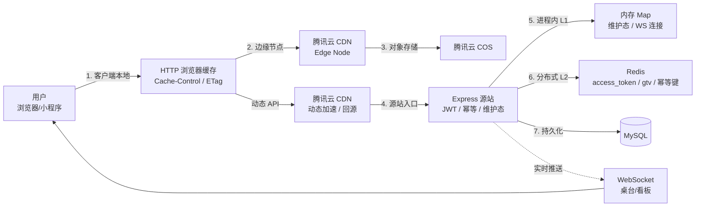
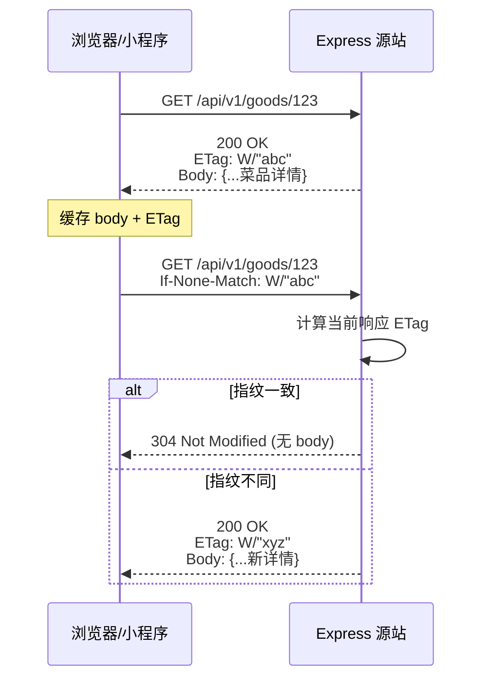
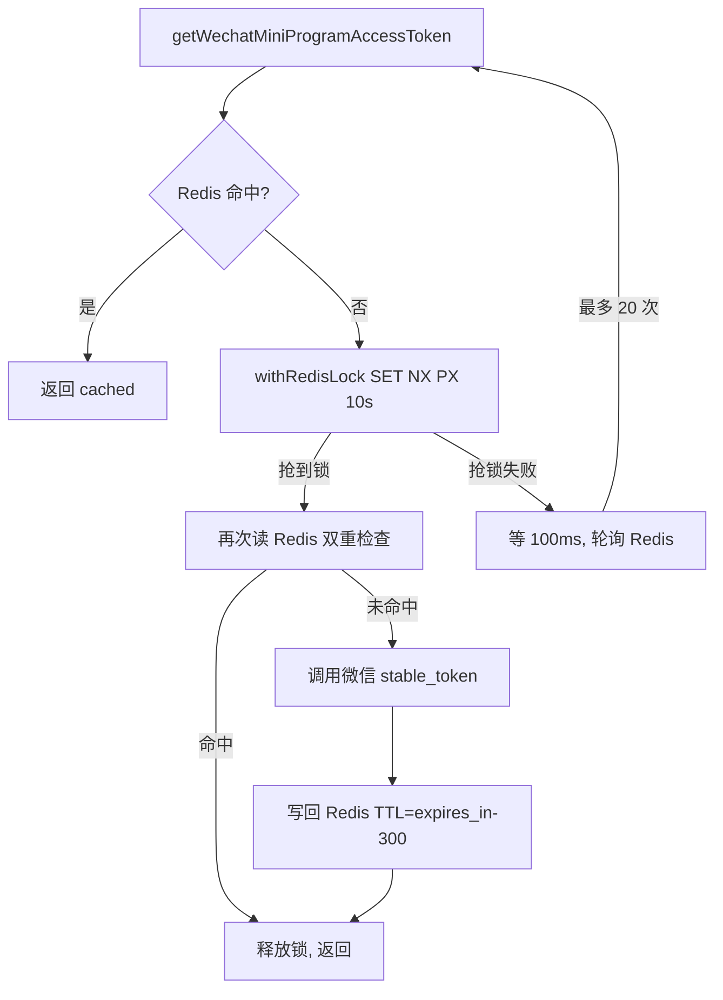
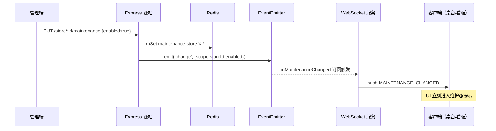
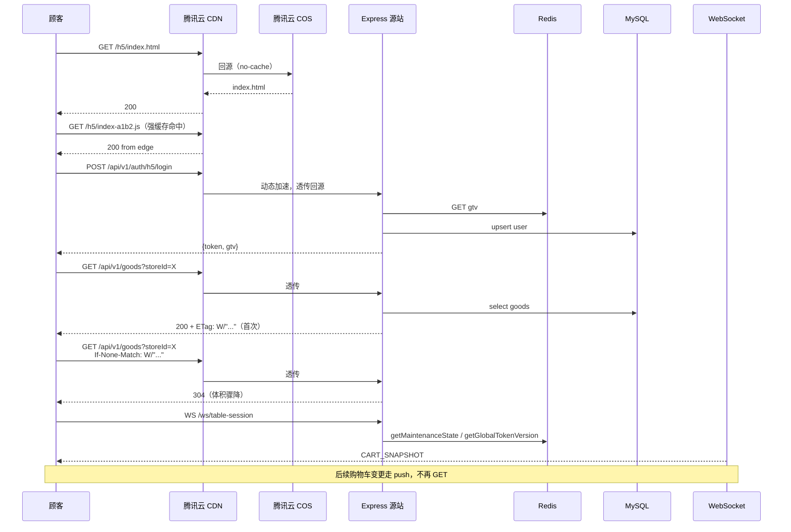

# 7.8 核心实现：缓存策略与实时性

本文档系统梳理 BiteGo 在面向大用户基数的自助点餐场景下，如何通过**分层缓存**（静态缓存、动态缓存、进程内缓存、分布式缓存）降低响应延迟与服务端负载，并说明在引入缓存之后，**动态资源如何保证实时性**（缓存失效、协商缓存、主动推送、版本化失效）的核心机制。文档内容同时用于毕业论文中相应章节的写作依据。

---

## 1. 总览：分层缓存架构

BiteGo 采用“**越靠近用户越厚，越靠近数据越薄**”的分层缓存思想，将缓存从客户端向源站逐级铺开：



各层次的定位与取舍：

| 层次 | 位置 | 作用 | 一致性 | 失效手段 |
|---|---|---|---|---|
| L0 浏览器缓存 | 客户端 | 免发请求 / 减小传输体积 | 弱 | `Cache-Control` TTL、ETag 协商 |
| L1 CDN 边缘缓存 | 腾讯云边缘节点 | 降低回源率、就近加速 | 弱 | TTL + 主动刷新 / 预热 |
| L2 进程内内存缓存 | Node.js 进程 | 纳秒级读、消除 RTT | 进程一致 | 事件驱动清除、TTL |
| L3 Redis 分布式缓存 | 独立 Redis 实例 | 跨进程共享、小对象高频读 | 强（Redis 主） | TTL、显式 `DEL`、版本号递增 |
| L4 实时通道（WS） | Node.js + Redis Pub | **以推代拉**，绕开缓存滞后 | 最终一致 | 事件驱动推送 |

核心原则：

- **对“读远多于写”的数据**（菜品、品牌信息、静态资源）前置到 CDN / 浏览器缓存。
- **对“读多写少但不能陈旧”的数据**（维护态、菜品详情）用协商缓存（ETag）+ 进程内/分布式缓存组合。
- **对“变更需要即时感知”的数据**（桌台购物车、订单状态、维护态切换）走 WebSocket 主动推送。
- **对“昂贵外部调用的结果”**（微信 access_token）用 Redis TTL 缓存并加分布式锁防击穿。

---

## 2. 静态缓存：COS + CDN + 浏览器

### 2.1 部署拓扑

BiteGo 的静态产物挂载在腾讯云对象存储 **COS** 上，外层再套一层腾讯云 **CDN**。三类静态资源都走同一条链路：

- **Web 管理端打包产物**：`projects/web-admin` 的 `yarn build` 产物（`index.html` + 带 hash 的 JS/CSS chunk + 图片）。
- **H5 点餐端打包产物**：`projects/miniprogram` 的 `yarn build:h5` 产物（同样是 Vite/Webpack 产物）。
- **业务图片资源**：用户/管理员上传的菜品图、店铺 logo、桌台二维码等。

参考实现：

- 统一的 COS 上传：[projects/backend/src/qcloud/cos.ts](../projects/backend/src/qcloud/cos.ts)
- 上传入口（鉴权 + 限流 + 图片类型校验）：[projects/backend/src/routes/files.ts](../projects/backend/src/routes/files.ts)

`buildPublicUrl(key)` 在配置了 `QCLOUD_COS_CDN_DOMAIN` 时返回 **CDN 加速域名**，而不是 COS 原始域名。前端所有图片、快照、二维码的访问都会命中 CDN：

```ts
// projects/backend/src/qcloud/cos.ts
export function buildPublicUrl(key: string) {
  const normalizedKey = key.replace(/^\/+/, '')
  if (config.cos.cdnDomain) {
    const base = config.cos.cdnDomain.replace(/\/+$/, '')
    return `${base}/${normalizedKey}` // 命中 CDN
  }
  if (config.cos.bucket && config.cos.region) {
    return `https://${config.cos.bucket}.cos.${config.cos.region}.myqcloud.com/${normalizedKey}`
  }
  return normalizedKey
}
```

### 2.2 Cache-Control 设计：分资源类型

BiteGo 在 COS 上传阶段就为对象打上显式的 `Cache-Control`。这个响应头会被 CDN 回源时保留，并向下游浏览器透传，从而形成一条从“对象存储 → CDN → 浏览器”端到端一致的缓存策略。

三类资源的 TTL 选型：

| 资源类型 | `Cache-Control` | TTL | 设计依据 |
|---|---|---|---|
| 菜品图/店铺 logo/头像（上传） | `public, max-age=31536000` | 1 年 | 文件名含 UUID，内容不可变 |
| 桌台二维码 PNG | `public, max-age=31536000` | 1 年 | 桌台清台只会生成新对象，旧对象 immutable |
| 门店/租户快照 JSON | `public, max-age=60` | 60 秒 | 导出即时消费型，短 TTL 防陈旧 |
| Web/H5 打包产物（带 hash） | `public, max-age=31536000, immutable` | 1 年 | 文件名带 content hash，变更即换名 |
| `index.html` | `no-cache`（CDN 处配置） | 0 | 指向最新 hash 文件，必须回源校验 |

关键代码证据（见 `projects/backend/src/qcloud/cos.ts:42`）：

```ts
CacheControl: params.cacheControl || 'public, max-age=31536000'
```

以及快照导出的短 TTL 覆写（`projects/backend/src/routes/stores.ts:852`）：

```ts
await cosPutObject({ key, body, contentType: 'application/json', cacheControl: 'public, max-age=60' })
```

### 2.3 CDN 边缘节点加速

CDN 层的作用可以拆成两类：

- **静态资源**：利用边缘节点缓存降低回源率。同一城市内多次请求菜品图，只需第一次回源到 COS；后续直接命中边缘节点，RTT 缩短到个位数毫秒。
- **动态 API**：BiteGo 也把服务端 API 挂在 CDN 后。此处 CDN 的主要目的是：
  1. **隐藏源站 IP**，避免源站（轻量云服务器）直接暴露在公网被扫描或 DDoS。
  2. **利用腾讯云的动态加速**（就近接入 + BGP 回源优化），尤其对跨省访问与移动网络有效。
  3. **在 CDN 层做一层 TCP/TLS 连接复用**，减少握手开销。

对于动态 API，CDN 默认不缓存响应（或显式设置 `Cache-Control: no-store` / 短 TTL），由源站控制是否缓存。

### 2.4 免回源的写入策略

一个容易被忽略的细节：BiteGo 的图片上传不走“客户端 → 服务端 → COS”的中转，而是**服务端只负责生成带 UUID 的 key 并代理上传到 COS**，对象的 ETag、Location 作为上传结果返回给前端。这样：

- 源站不保存任何静态文件副本，重启/重建不影响可用性。
- CDN 刷新只需针对 key 刷新边缘节点缓存，不涉及源站。

---

## 3. 动态缓存：协商缓存（ETag）

### 3.1 协商缓存 vs. 强缓存

对于“**每次都要验证，但数据体可能没变**”的 API（典型如菜品详情、分类列表、门店信息），BiteGo 走 **ETag 协商缓存**，而不是强缓存（`max-age`）。原因：

- 这些接口受“管理端编辑”“门店上下架”影响，一旦修改就需要立即生效，强缓存的 TTL 内修改就会失效感知滞后。
- 协商缓存仍然会触达服务端（服务端必须计算出当前资源的指纹），因此业务逻辑仍然执行；但当指纹没变时，服务端只返回 `304 Not Modified`，**不再回写响应体**，大幅降低传输体积。

### 3.2 Express 默认 ETag

BiteGo 的源站是 Express，其 `res.send(buf)` / `res.json(obj)` 默认会根据响应体计算一个**弱 ETag**（`W/"<hash>"`），并在后续命中时返回 `304`。源头查看：`projects/backend/src/app.ts` 没有调用 `app.disable('etag')`，因此 Express 4.x 的默认行为生效。

协商流程：



### 3.3 实战收益与限制

- **收益**：对菜品详情这种平均响应 3~8 KB 的 JSON，304 响应只有几百字节的头部，传输减少 95% 以上；在弱网环境下尤其显著。
- **限制**：
  - 服务端仍需执行查询与序列化才能得出 ETag，**CPU 与数据库压力并未降低**。若需要进一步降压，需要引入“业务层缓存键 → Redis / 内存”再加一层。
  - ETag 依赖响应体字节级一致。若响应中混入“服务器当前时间”“当前登录用户昵称”这类动态字段，会使 ETag 永远不同。BiteGo 的 GET 类读接口严格遵循“**只返回资源本身的字段**”，由中间件在统一包装层加 `success`/`code`/`message`，避免引入不稳定字段。

### 3.4 幂等写入：缓存响应以对抗网络重试

下单接口 `POST /api/v1/orders` 与退款申请接口 `POST /api/v1/orders/:orderId/refunds` 在设计上同样属于“动态缓存”——它们缓存的是**写操作的响应**而非读结果，目的是在重试场景下返回同一份结果，避免重复下单或重复退款。

**服务端**（`projects/backend/src/middlewares/idempotency.ts`）：

- 客户端必须带 `X-Request-Id`；
- 服务端以 `idem:<method>:<path>:<userId>:<requestId>` 为键，把首次响应（状态码 + body）写入 Redis，TTL 300 秒；
- 后续同键命中直接回放缓存结果。

**客户端**（`miniprogram/src/pages/checkout/index.tsx`、`web-admin/src/pages/orders/OrderDetailPage.tsx`）：

幂等仅在"同一个 `X-Request-Id` 到达两次"时生效，因此客户端必须让网络重试复用同一个 id。两端均把 request id 持久到组件级 `ref` 而非每次调用新生成：

- 点击提交时，若 `ref` 为空则生成新的 id；不为空则复用；
- 服务器已返回响应（小程序侧判定为 `ApiRequestError`，Web 管理端侧判定为 `ApiRequestError` 或 `axios` 带 `response` 的错误）时清空 `ref`——此时幂等键已经被写入 Redis，重放已由服务端保证；
- 纯网络错误（超时、离线、TLS 中断等）保留 `ref`，下一次点击复用同一个 id，让服务端在幂等 TTL 内命中缓存返回上一次的真实结果；
- 成功路径在收到 `201 Created` 后立即清空 `ref`，为后续新操作生成新 id。

这使得"幂等中间件 TTL 300 秒"对真实的网络重试场景完整生效；否则若客户端每次点击都 `crypto.randomUUID()` / `genId('req')`，即便服务端已成功落单，重试也会因键不同而旁路幂等缓存，产生重复订单/重复退款。

该机制可以看作一种"**用 Redis 做 HTTP 响应的短期强缓存**"，语义是幂等而非性能，但机制上完全等同于 Redis 缓存命中。

---

## 4. 分布式缓存：Redis 承载的动态数据

### 4.1 缓存对象清单

| 键前缀 | 数据 | TTL | 用途 |
|---|---|---|---|
| `wechat:miniapp:access_token:<appid>` | 微信接口 access_token | `expires_in - 300s` | 屏蔽微信侧 QPS 限制与高延迟 |
| `auth:globalTokenVersion` | 全局 token 版本号 | 永久 | 一键吊销所有下发的 JWT（见 §4.4） |
| `idem:<method>:<path>:<user>:<reqid>` | 接口响应快照 | 300s | 幂等重放 |
| `maintenance:enabled` / `maintenance:message` | 平台维护态 | 永久 | 快速读取 + 跨进程一致 |
| `maintenance:tenant:<id>:*` / `maintenance:store:<id>:*` | 作用域维护态 | 永久 | 同上 |
| `lock:<key>` | 分布式锁 token | TTL ms | 防缓存击穿（见 §4.2） |

对应代码：

- Redis 客户端与分布式锁：[projects/backend/src/redis.ts](../projects/backend/src/redis.ts)
- access_token 缓存：[projects/backend/src/services/wechatAccessToken.ts](../projects/backend/src/services/wechatAccessToken.ts)
- token 全局版本：[projects/backend/src/services/tokenVersion.ts](../projects/backend/src/services/tokenVersion.ts)
- 维护态：[projects/backend/src/services/maintenance.ts](../projects/backend/src/services/maintenance.ts)

### 4.2 缓存击穿防护：Redis 分布式锁 + 双重检查

微信 `access_token` 是典型的**昂贵、全局单值、高频被读**的数据：

- 拿 token 的请求本身要走微信 HTTPS，RTT 200~800 ms；
- 微信侧对 token 拉取有 QPS 限制，过度请求会被风控；
- 所有用户登录、发送订阅消息等都会读取它。

当缓存失效的一瞬间，并发请求可能同时击穿到微信服务。BiteGo 的做法（`wechatAccessToken.ts`）：



关键点：

- **`SET NX PX`**：原子性写入带 TTL 的锁，避免死锁；
- **token 绑定**：锁值为随机 token，释放前先 `GET` 验证再 `DEL`，防止误释放其他进程的锁；
- **双重检查**：抢到锁后再读 Redis，覆盖“锁等待期间其他进程已经写好”的场景；
- **TTL 提前量**：`expires_in - 300`，提前 5 分钟过期，留出刷新窗口，避免边界时刻失效。

### 4.3 多层缓存一致性：L1 内存 + L2 Redis

维护态（`maintenance`）是典型的 L1+L2 组合：

- **L1**：`memEnabled / memMessage / memTenant / memStore`，进程内全局变量，纳秒级访问。
- **L2**：Redis 对应键，跨进程权威源。

读路径：`getRedis().mGet(...)` 失败（Redis 故障）回落到 L1，保证可用性。写路径：**先更新 L1，再写 Redis，同时通过 `EventEmitter` 触发本进程的订阅者（如 WS 推送）**。

```ts
// projects/backend/src/services/maintenance.ts（摘录）
export async function setMaintenanceState(enabled, message) {
  const msg = (message || '').trim() || memMessage
  memEnabled = enabled
  memMessage = msg
  emitChange({ scope: 'platform', enabled, message: msg })  // 触发 WS
  const redis = getRedis()
  await redis.mSet({ [KEY_ENABLED]: enabled ? '1' : '0', [KEY_MESSAGE]: msg })
}
```

需要注意：此处 L1 在**多实例部署**下会出现短暂不一致（进程 A 写入后，进程 B 的 L1 尚未刷新）。这种不一致的容忍度根据业务决定——维护态本身是“**最终一致 + 秒级可感**”，进程 B 下次读取维护态时因为都走 Redis，实际影响可忽略。

### 4.4 版本号失效：全局 token version（gtv）

在“缓存一批分散 token”的场景下，逐一失效成本太高。BiteGo 用**版本号（epoch）机制**实现一键吊销：

- JWT payload 中嵌入 `gtv`（global token version）；
- 服务端在 `requireAuth` 中把 payload 的 `gtv` 与 `Redis: auth:globalTokenVersion` 对比；版本落后即拒绝；
- 触发“平台级恢复/全局登出”等场景时，`INCR auth:globalTokenVersion`，**历史所有 token 瞬时失效**。

这是一种典型的“**缓存标签（cache stampede tag）**”手法：不逐个删，而是让所有旧条目自动被识别为过期。代码：`projects/backend/src/services/tokenVersion.ts`。

---

## 5. 实时性保障：动态资源如何不被缓存“卡住”

缓存能降低延迟，但会引入**陈旧**（staleness）。BiteGo 针对不同资源提供了梯度化的实时性方案：

### 5.1 策略一览

| 资源 | 可容忍延迟 | 实时性手段 |
|---|---|---|
| 菜品图片 / 静态 JS | 分钟～小时级 | CDN TTL + 文件名 hash（变更即换名，无须刷新） |
| 菜品详情、分类列表 | 秒级 | 协商缓存 ETag + 进程内短 TTL（可选） |
| 维护态变更 | < 1 秒 | Redis 写 + EventEmitter + WebSocket 广播 |
| 桌台购物车 / 订单创建 | < 200 ms | WebSocket 推送（`CART_UPDATED` / `ORDER_CREATED`） |
| 全局 token 吊销 | < 1 秒 | gtv 递增（下一次请求即失效） |
| 管理员看板数据 | 秒级 | WebSocket（`/ws/admin-dashboard`） + 轮询兜底 |

### 5.2 变更不变名：文件名哈希化

Web 管理端、H5 端的前端产物打包时由 Vite/Webpack 在 chunk 文件名中注入 content hash（`index-a1b2c3.js`）。一次发布的所有资源是**新路径**，而旧路径的 CDN 边缘缓存可以继续存在，不会造成冲突。真正需要“及时变更”的只有入口 HTML：

- `index.html` 在 CDN 层配置为 `no-cache` 或极短 TTL；
- 浏览器每次加载 HTML 都会回源校验，拿到新的 HTML 里会引用新 hash 的 JS/CSS；
- 新 JS/CSS 对应新路径，天然绕开旧缓存。

这是“**变更不变名就做强缓存，变更就改名**”的业界标准做法，BiteGo 直接沿用。

### 5.3 事件驱动失效与推送：EventBus + WebSocket

对需要**秒级感知**的业务事件（例如门店进入/退出维护态、桌台购物车变更、订单创建），BiteGo 把“缓存失效”和“前端感知”合并成一个事件流：



关键设计点：

- **单一真相源**：Redis 是跨进程的权威值。本地 L1 + EventBus 只服务本进程的订阅者；跨进程的实时性在 BiteGo 当前规模下由**客户端 WebSocket 重连 + 重新拉取**兜底，后续可升级为 Redis Pub/Sub。
- **强写 + 弱读**：写入路径串行更新 L1 + L2 + Bus，保障推送与持久化不分叉；读取路径允许 L2 失败回落到 L1。
- **推送即失效**：客户端收到 `MAINTENANCE_CHANGED` / `CART_UPDATED` 后，直接用推送里的新版本覆盖本地缓存，不再发起二次 GET 确认。

桌台协同的具体协议与并发控制见 [7.1-核心实现-桌台协同会话.md](./7.1-核心实现-桌台协同会话.md)。

### 5.4 乐观并发控制：TableCart.version

购物车是多人高频写的典型场景。BiteGo 给 `TableCart` 加了 `version` 字段，每次变更递增：

- 服务端处理写操作时校验客户端提交的 `version` 是否为最新；
- 不匹配即拒绝并返回最新版本；
- 成功变更后 WebSocket 广播 `CART_UPDATED`，携带新 `version` 与 diff。

这是一种在**无全局锁**的前提下，仍能保证“多人同时点餐不串车”的低开销方案。写入冲突由前端自动重试吸收。

---

## 6. 典型请求路径的端到端还原

以顾客首次扫桌台二维码进入点餐页为例，看缓存分层如何叠加作用：



这条链路体现了本章描述的全部机制：

1. 静态产物走 **CDN + 长 TTL + hash 命名**；
2. 入口 HTML 走 **no-cache 协商**；
3. 动态接口走 **CDN 加速（不缓存） + 协商 ETag**；
4. 源站关键查询通过 **Redis 分布式缓存** 降压（access_token、维护态、gtv）；
5. 状态同步由 **WebSocket** 接管，而非轮询拉取。

---

## 7. 取舍与后续可扩展方向

BiteGo 当前缓存方案在毕业设计规模（单机部署 + 少量门店）下已经够用。放大到真实电商规模时，以下方向是自然的后继项：

- **业务层缓存**：在 Redis 中对“菜品列表 / 分类 / 共享规格组”等读多写少数据做 key-value 缓存，结合 `store:<id>:menu:v<version>` 命名配合版本号失效，可让 ETag 命中前就直接跳过 DB。
- **Redis Pub/Sub**：多实例部署后，维护态、菜品上下架等事件需要跨进程广播。把当前的 `EventEmitter` 替换为 Redis Pub/Sub，就能把实时性推广到整个集群。
- **预热与防雪崩**：对 TTL 到期做**随机抖动**（jitter），避免同批缓存同时失效导致的雪崩；对访问极热的 key 用**逻辑过期**（返回旧值 + 异步刷新）。
- **CDN 精细化配置**：对 API 路径按方法/路径做分区缓存策略；对公开 GET（菜品列表）允许边缘缓存 5 秒，换取 QPS 削峰。
- **Service Worker**：在 H5 点餐端引入 SW 做离线优先，弱网场景下进一步提升体验。

---

## 8. 参考代码索引

| 主题 | 路径 |
|---|---|
| COS 上传与 CDN URL 拼接 | [projects/backend/src/qcloud/cos.ts](../projects/backend/src/qcloud/cos.ts) |
| 文件上传入口 | [projects/backend/src/routes/files.ts](../projects/backend/src/routes/files.ts) |
| 幂等中间件（响应级缓存） | [projects/backend/src/middlewares/idempotency.ts](../projects/backend/src/middlewares/idempotency.ts) |
| Redis 客户端与分布式锁 | [projects/backend/src/redis.ts](../projects/backend/src/redis.ts) |
| 微信 access_token 缓存 | [projects/backend/src/services/wechatAccessToken.ts](../projects/backend/src/services/wechatAccessToken.ts) |
| 全局 token 版本 | [projects/backend/src/services/tokenVersion.ts](../projects/backend/src/services/tokenVersion.ts) |
| 维护态 L1+L2 缓存 | [projects/backend/src/services/maintenance.ts](../projects/backend/src/services/maintenance.ts) |
| 桌台协同 WebSocket | [projects/backend/src/ws/tableSession.ts](../projects/backend/src/ws/tableSession.ts) |
| Express 默认 ETag（无 `app.disable('etag')`） | [projects/backend/src/app.ts](../projects/backend/src/app.ts) |
