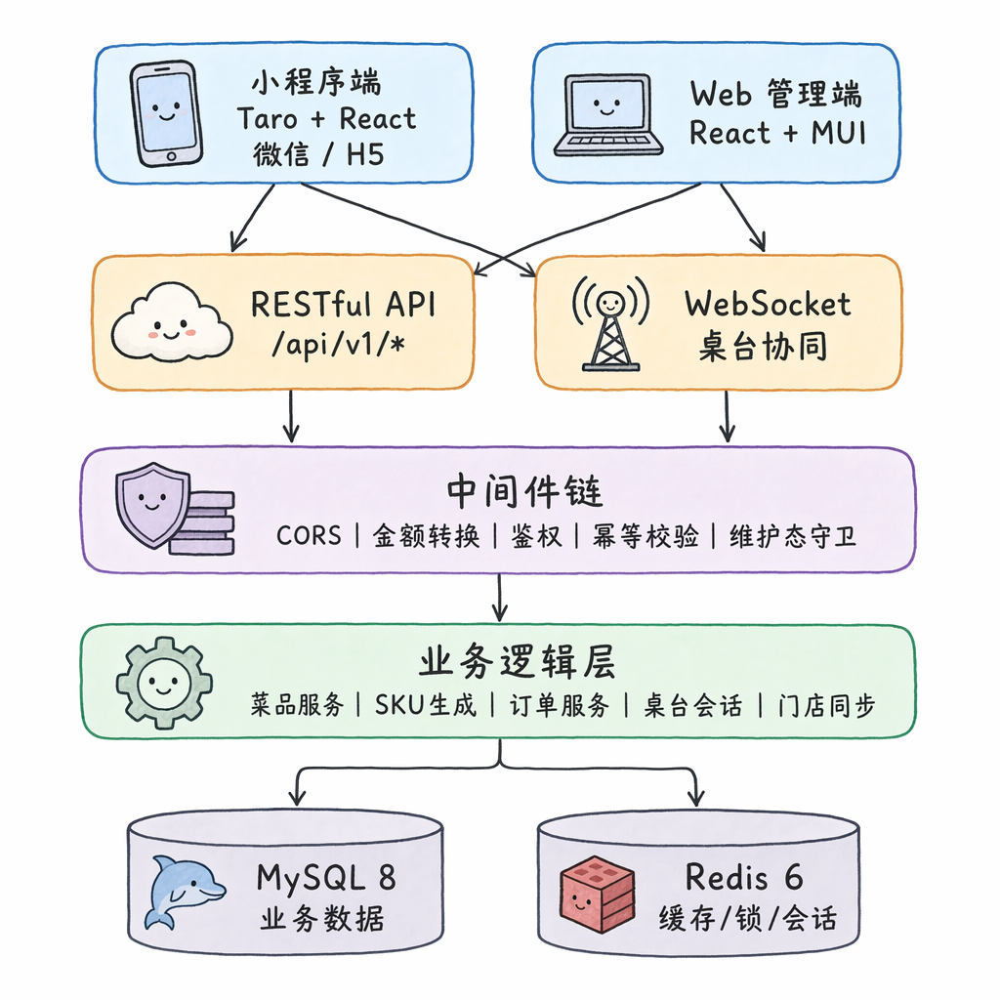

# BiteGo 服务端

> Node.js 20 + Express 4 + TypeORM + MySQL 8 + Redis 6.2 · 提供 REST API、桌台协同 / 看板两路 WebSocket、退款与门店同步两套后台 Worker。

回到顶层 README → [`../../README.md`](../../README.md)

---

## 1. 服务概览

<p align="center">
  
</p>

服务端在 BiteGo 中扮演「业务真相源」的角色：

- **接口形态**：所有 HTTP API 收敛在 `/api/v1/*` 下；两路 WebSocket 端点 `/ws/table-session`（顾客侧桌台协同）与 `/ws/admin-dashboard`（管理端实时看板）。
- **公共中间件链**（顺序固定）：CORS → JSON 解析 → 价格转换（元 → 分）→ 请求日志 → 维护态守卫 → JWT 鉴权 → 幂等键校验 → 管理端上下文解析 → 角色 / 面板 / 共享菜单写权限校验 → 业务处理 → 价格转换（分 → 元）→ 全局错误处理。
- **数据存储分工**：MySQL 承载业务事实（订单、库存、SKU、租户、AdminScope 等可审计可恢复数据）；Redis 承载临时状态（GTV、维护态、幂等键、桌台版本、跨进程 Pub/Sub）；COS 承载图片、二维码与导出快照。
- **后台 Worker**：`refundWorker`（退款审核通过后异步回补库存）、`storeSyncWorker`（连锁主店向分店异步同步共享菜单），与 HTTP 处理共享同一数据库 / Redis，但进程独立。

## 2. 服务端亮点

| 主题                       | 关键实现                                                                                                                                      | 文档                                                          |
| -------------------------- | --------------------------------------------------------------------------------------------------------------------------------------------- | ------------------------------------------------------------- |
| **桌台多人协同**           | `cart.version` 乐观并发 + `wsop:{tableId}:{sessionVersion}:{opId}` 幂等键 + `Table.sessionVersion` 开台版本 + `sessionToken` 会话凭证四层正交 | [`docs/7.1`](../../docs/7.1-核心实现-桌台协同会话.md)         |
| **三层规格 — 价格 — 库存** | 库存规格组笛卡尔积自动 SKU；非库存通过 `priceItemKey = SHA256("v1\|skuId\|nonStockSig")` 在购物车 / 订单中独立计费、合并同款                  | [`docs/7.2`](../../docs/7.2-核心实现-规格、价格和库存模型.md) |
| **下单三层并发兜底**       | 请求级幂等中间件（`X-Request-Id`）→ 桌台级 Redis 分布式锁（`order:{tableId}`）→ SKU 行级悲观锁（按 `skuId` 升序 `SELECT … FOR UPDATE`）       | 见 §5.1 服务端实现                                            |
| **多租户授权**             | `AdminScope` 多对多授权 + 角色 rank 比较 + `canManageSharedCatalog` 计算位；`adminContext` 中间件一次性解析所有权威字段挂到 `req.adminCtx`    | [`docs/7.6`](../../docs/7.6-核心实现-平台多租户.md)           |
| **数据搬家**               | 平台「完全还原」（保留原 ID + DELETE 而非 TRUNCATE 以保事务原子）+ 租户/门店「克隆式」（旧→新 ID 映射 + 桌台二维码事务后异步回写）            | [`docs/7.7`](../../docs/7.7-核心实现-数据导出与恢复.md)       |
| **分层维护态**             | 平台 / 租户 / 门店三级维护态写入 Redis，平台级触发 GTV 递增使所有 JWT 失效；维护态变更经 EventEmitter + Redis Pub/Sub 跨进程广播              | 见 §5.1.7                                                     |
| **GTV 全局令牌版本**       | Redis 单调整数 `auth:globalTokenVersion`，每条 JWT 载荷写入签发瞬间值，比对落后即视为失效；Redis 不可用时退化为进程内存值                     | 见 §5.1.3                                                     |
| **金额单位的中间件级处理** | DB 内部统一以「分」（BIGINT）存储，请求 / 响应两侧由 `priceTransform` 中间件双向归一，杜绝浮点误差                                            | 见 §5.1.1                                                     |

## 3. 快速开始

### 3.1 推荐：在仓库根目录用 Docker Compose 起整套环境

```bash
# 在仓库根目录
docker compose up -d
curl http://localhost:3000/health
```

容器内已附 MySQL 8 + Redis 6.2，启动期由 `TYPEORM_SYNC=true` 自动按实体定义建表。

### 3.2 仅本地起后端

确保 MySQL 与 Redis 已可访问（端口、库名、密码与下方环境变量一致）：

```bash
yarn install
yarn dev   # ts-node-dev watch
```

### 3.3 取一枚开发令牌

```bash
curl -X POST http://localhost:3000/api/v1/auth/dev-token \
  -H "Content-Type: application/json" \
  -d '{"role":"ADMIN"}'
```

返回的 JWT 直接放入 Authorization 头即可调试 `/api/v1/*` 与 WebSocket 端点。

## 4. 环境变量

| 变量                              | 默认                           | 说明                                      |
| --------------------------------- | ------------------------------ | ----------------------------------------- |
| `PORT`                            | `3000`                         | HTTP / WS 监听端口                        |
| `DB_HOST` / `DB_PORT`             | `mysql` / `3306`               | MySQL 连接地址                            |
| `DB_USER` / `DB_PASS` / `DB_NAME` | `bitego` / `bitego` / `bitego` | MySQL 凭据与库名                          |
| `REDIS_HOST` / `REDIS_PORT`       | `redis` / `6379`               | Redis 连接地址                            |
| `JWT_SECRET`                      | —                              | JWT 签名密钥（生产必须显式配置）          |
| `TYPEORM_SYNC`                    | `true`                         | 启动时按实体自动同步表结构（生产建议关）  |
| `TYPEORM_MIGRATIONS_RUN`          | `false`                        | 启动时是否执行 `src/migrations/` 下的迁移 |

完整变量与本地 / 生产差异参见 [`docs/4-服务端技术文档.md`](../../docs/4-服务端技术文档.md)。

## 5. 目录结构

```
src/
├── routes/                # 按资源 + 角色前缀分组（platform* / tenant* / admin* / store* / wechat*）
├── entities/              # TypeORM 实体（共 26 张表）
├── middlewares/
│   ├── auth.ts            # JWT + GTV 校验
│   ├── adminContext.ts    # 解析 X-Tenant-Id / X-Store-Id / X-Board → req.adminCtx
│   ├── idempotency.ts     # Redis-backed，订单等写接口要求 X-Request-Id
│   ├── priceTransform.ts  # 元 ↔ 分 双向转换
│   └── maintenance.ts     # 平台 / 租户 / 门店三级维护态守卫
├── services/              # SKU 生成器、storeSync、maintenance、wechatAccessToken、storeExport
├── workers/               # refundWorker、storeSyncWorker
├── ws/
│   ├── tableSession.ts    # 桌台协同 WebSocket
│   └── adminDashboard.ts  # 管理端看板 WebSocket
├── migrations/            # TypeORM 显式迁移（生产链路使用）
├── db.ts                  # DataSource 配置
└── app.ts                 # Express 应用与中间件链装配
```

## 6. 测试

测试策略以**后端集成测试为主**，每个 `test/*.test.js` 在真实 MySQL + Redis 上起 HTTP+WS Server，由 `withServer(fn)` 在 `finally` 中确保资源释放。

```bash
yarn test                  # 189 个用例，约 69 秒
yarn test:coverage         # c8 覆盖率门禁：行/语句/函数 ≥ 90%
yarn test:inner test/smoke.test.js    # 单文件
yarn lint                  # ESLint，max-warnings=0
yarn lint:fix
yarn format                # Prettier
```

测试运行前后会自动导入 / 恢复一份**全量数据库快照**（参见 `scripts/runTestsWithStoreSnapshot.js`），即便用例污染了本地 MySQL 也会被还原。

### 6.1 常见卡住根因

- **HTTP Server 关闭慢**：Node 原生 fetch 复用 keep-alive，直接 `await server.close()` 会阻塞 ~5s。已在 `withServer` 中先 `closeIdleConnections()`。
- **异常路径未释放**：断言失败 / 抛错后若未 `finally` 关 WebSocket / DataSource / Redis，进程不会退出。
- **遗漏幂等头**：`POST /api/v1/orders` 缺 `X-Request-Id` 直接 400；测试漏配会与未关连接叠加成「卡住」。

## 7. Docker 与生产部署

```bash
# 单容器构建
docker build -t bitego-backend:latest .
docker run --rm -p 3000:3000 -e PORT=3000 bitego-backend:latest

# 仓库根目录一键编排（含 MySQL / Redis）
docker compose up -d
```

健康检查：`GET http://localhost:3000/health`

CI/CD：合入 `main` → GitHub Actions 构建镜像推 TCR → SSH 远程触发 Lighthouse 拉镜像重启容器 → 健康检查失败回滚。完整流水线见 [`docs/8-CI-CD与容器镜像发布.md`](../../docs/8-CI-CD与容器镜像发布.md)。

## 8. 数据库迁移

```bash
yarn build
yarn migrate                                   # 跑 dist/migrations/*

# 生成新迁移（基于实体当前定义 vs 上一次的差异）
yarn typeorm migration:generate -d src/db.ts src/migrations/<name>
```

**迁移落地的常见坑** — 同一表内 camelCase（`imageUrl`）与 snake_case（`default_sku_id`）列名并存，写迁移前务必先 `SHOW COLUMNS FROM …` 核对列名，并对所有标识符加反引号；存在性检查命中零行时打一行 `console.log` 留痕，避免「迁移记录入库但实际无变更」的静默 no-op；MySQL DDL 会触发隐式 COMMIT，不要把"清数据 + 改 schema"放在同一个事务里；`down` 写空操作（`SELECT 1`）而不是假回滚（重新 add 一个默认值列）；新增 migration 必须分别在"从零迁移"与"带旧 schema 迁移"两条路径上验证一次。

## 9. 接口与协议

- API 路径前缀：`/api/v1/`
- 全部响应统一 `{ code, message, data }` 信封
- 上下文头：`X-Tenant-Id` / `X-Store-Id` / `X-Board`
- 写接口幂等头：`X-Request-Id`
- 详细路由清单与字段定义：[`docs/6-接口与数据库设计规范.md`](../../docs/6-接口与数据库设计规范.md)
