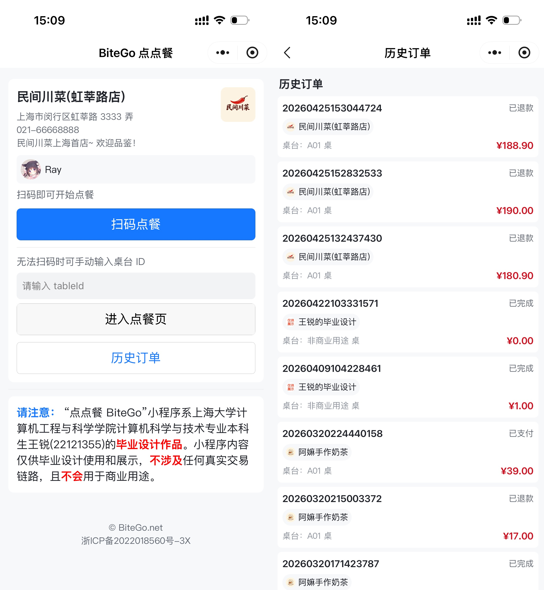
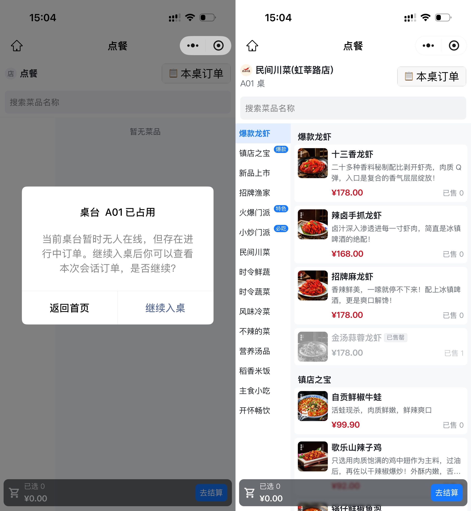
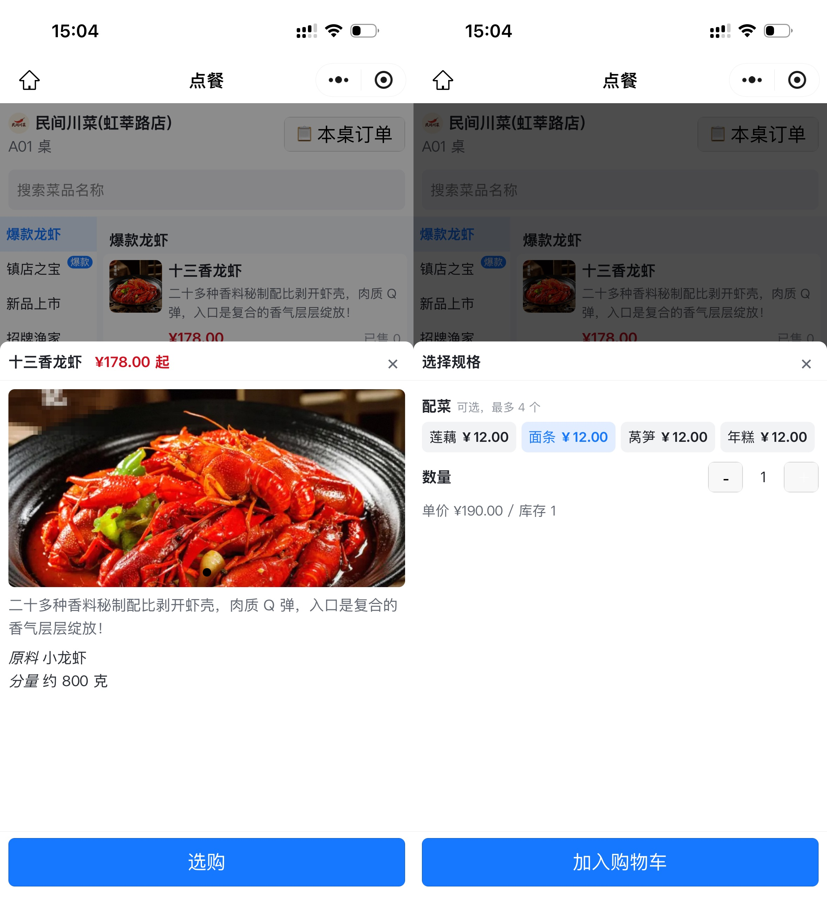
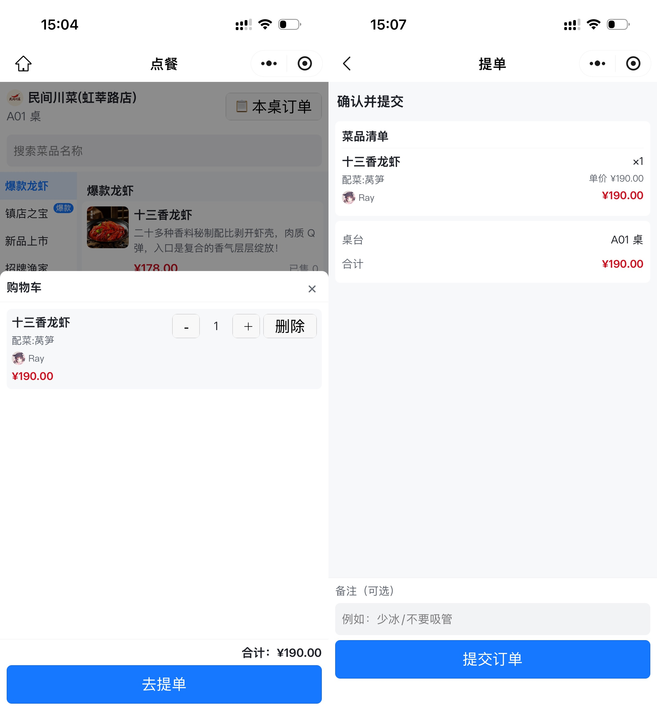
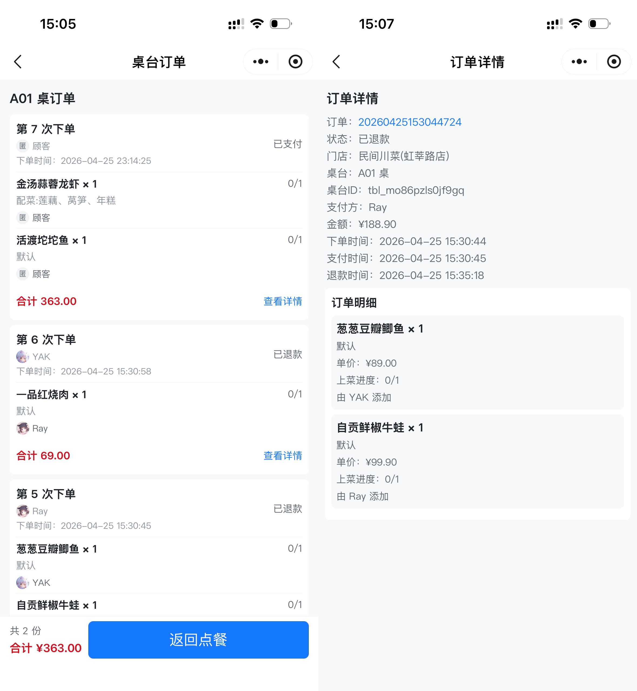

# BiteGo 顾客端（小程序 / H5）

> Taro 4 + React 18 + TypeScript 5 · 一套代码同时编译为微信小程序与 H5；通过 WebSocket 与桌台共享购物车实时协同。

回到顶层 README → [`../../README.md`](../../README.md)

---

## 1. 界面一览

每张图均为左前右后两屏拼接（来自微信开发者工具 iPhone 模拟器），便于在一图之内呈现一段交互。

<table>
  <tr>
    <td align="center" width="33%">
      
      <sub>首页 + 跨桌台历史订单</sub>
    </td>
    <td align="center" width="33%">
      
      <sub>入桌二次确认 + 点餐主页</sub>
    </td>
    <td align="center" width="33%">
      
      <sub>菜品详情 + 规格选择</sub>
    </td>
  </tr>
  <tr>
    <td align="center" width="33%">
      
      <sub>桌台协同购物车 + 提单确认</sub>
    </td>
    <td align="center" width="33%">
      
      <sub>本桌订单 + 订单详情</sub>
    </td>
    <td align="center" width="33%">&nbsp;</td>
  </tr>
</table>

## 2. 顾客端亮点

- **扫码即用，零安装**：扫描贴在桌台上的小程序码或 H5 二维码即可进入点餐页，扫码参数经 `extractTableIdFromScanPath` 三级递进解析（带 query / scene 二次 decode / 正则兜底），覆盖小程序码、分享卡片、H5 外链等多种入口。
- **桌台多人协同**：基于 WebSocket 的共享购物车，乐观 UI 立即响应、同桌成员秒级同步；连接管理用「引用计数 + 30 秒延迟断开」吸收页面间跳转抖动。
- **电梯式分类锚定**：左侧分类菜单 ↔ 右侧菜品瀑布的双向滚动同步，对惯性滚动 / 弱网 / 切后台等场景做了「双渲染 + 80ms 节流 + onTouchEnd 轮询」三项工程兜底。
- **一套代码、两端编译**：`yarn build:weapp` 出微信小程序包，`yarn build:h5` 出浏览器版本（同时是小程序兜底入口与 E2E 测试目标）。
- **主分包结构**：高频场景（首页、点餐页、结算页、桌台订单页）入主包；个人中心、历史订单、信息编辑等低频场景按需载入分包，压缩主包首屏体积。

## 3. 主要功能流程

| 阶段 | 涉及页面                       | 关键能力                                                                        |
| ---- | ------------------------------ | ------------------------------------------------------------------------------- |
| 入桌 | 首页 / 入桌确认                | 扫码解析 → `GET /api/v1/tables/:tableId` → 签发 `sessionToken` → 建立 WebSocket |
| 点餐 | 点餐主页 / 菜品详情 / 规格选择 | 分类电梯锚定 · 三层规格 — 价格模型可视化 · 售罄菜品自动置灰禁用                 |
| 协同 | 桌台共享购物车浮层             | 加购显示「由谁添加」头像 + 昵称；同桌增删改实时同步                             |
| 提单 | 提单确认页                     | 备注输入 · `POST /api/v1/orders` 携 `X-Request-Id` 幂等                         |
| 跟踪 | 本桌订单 / 订单详情 / 历史订单 | 上菜进度 · 状态徽标 · 时间轴 · 跨桌跨店历史                                     |

## 4. 技术栈

| 关注点 | 选型                                       | 备注                                                             |
| ------ | ------------------------------------------ | ---------------------------------------------------------------- |
| 框架   | Taro 4 + React 18 + TypeScript 5           | webpack 5 增量编译 + React Refresh 热更新                        |
| 样式   | Sass（SCSS）                               | 严格 BEM；样式由 Stylelint 校验                                  |
| 状态   | Zustand                                    | `tableSessionStore` 集中管理 socket / 购物车 / 同桌订单 / 维护态 |
| 请求   | `Taro.request` 封装于 `src/api/request.ts` | 统一注入鉴权头、处理 401 / 503                                   |
| 单测   | Vitest（jsdom）                            | 8 文件 / 21 用例                                                 |
| E2E    | Playwright（H5）                           | 先 `build:h5` 再跑用例                                           |

## 5. 快速开始

### 5.1 前置条件

- Node.js v20.18.2、Yarn 4（仓库锁定 `packageManager: yarn@4.13.0`）
- 微信开发者工具（仅在调试微信端时需要）

### 5.2 安装依赖

```bash
cd projects/miniprogram
yarn install
```

### 5.3 配置后端地址

Taro 的 env 文件位于项目根目录 (`.env.development` / `.env.production` / `.env.test`)：

```env
TARO_APP_API_BASE_URL="http://127.0.0.1:3000/api/v1"
TARO_APP_WS_BASE_URL=""
```

- `TARO_APP_API_BASE_URL` — HTTP API 根路径（对齐接口规范）
- `TARO_APP_WS_BASE_URL` — WebSocket 根路径（不含 `/api/v1`）；为空时由 API 地址自动推导，详见 `src/config/env.ts`

生产 API：`https://api.bitego.net/api/v1`

### 5.4 启动开发

```bash
yarn dev:weapp   # 微信小程序：watch 编译 → 微信开发者工具打开本目录
yarn dev:h5      # H5 浏览器：默认 http://127.0.0.1:10086/
```

## 6. 构建

```bash
yarn build:weapp    # 微信小程序包
yarn build:h5       # H5 静态产物（推 COS + CDN）
```

H5 产物在 GitHub Actions 中由 `main` 合并触发，自动上传到 COS 并刷新 CDN。

## 7. 质量门禁

```bash
yarn lint           # ESLint
yarn lint:style     # Stylelint（SCSS / CSS）
yarn test           # Vitest 单测
yarn test:coverage
yarn test:e2e       # 先 build:h5，再启 Playwright
```

## 8. 目录结构

```
src/
├── pages/                        # 主包（高频场景）
│   ├── index/                    # 首页
│   ├── order-meal/               # 点餐主页（左右分栏 + 电梯锚定）
│   ├── checkout/                 # 提单确认
│   └── table-orders/             # 本桌订单
├── subpackages/
│   └── profile/pages/            # 分包：个人中心、历史订单、订单详情、信息编辑
├── components/
│   ├── common/                   # BottomSheet、MarkdownView、Toast 等
│   └── business/                 # 菜品卡片、规格面板、购物车面板等
├── store/
│   └── tableSessionStore.ts      # WebSocket + 购物车 + 同桌订单 + 维护态
├── api/                          # 接口定义与请求封装
├── utils/
│   ├── router.ts                 # 集中式路由表 + 安全回退
│   └── extractTableIdFromScanPath.ts
├── config/env.ts                 # TARO_APP_* 推导
└── app.tsx                       # 全局入口
```

## 9. 桌台会话连接的生命周期

`tableSessionStore` 暴露 `acquire()` / `release()` 两个原语：

1. **acquire** — 页面 `useLoad` 时调用，递增引用计数；首次到 1 时建立 WebSocket。
2. **5 秒一次心跳** — 应用层 `PING`（CDN 通道默认 10s 空闲断开，5s 心跳保连）。
3. **乐观更新** — 用户操作先在本地预测刷新 UI，发送 WsOp 后等 `CART_UPDATED` 广播覆盖。
4. **SYNC 校准** — `SocketTask.readyState` 异常 / PONG 超时即重连，重连后发 `SYNC` 让服务端重下发 `CART_SNAPSHOT`，避免基于旧 `baseVersion` 重放。
5. **release** — 页面卸载时递减引用计数，归零时调度 30 秒后真正断开；窗口期内再次进入页面则取消断开任务，连接直接复用。

详细机制与并发一致性论证见 [`docs/7.1-核心实现-桌台协同会话.md`](../../docs/7.1-核心实现-桌台协同会话.md)。

## 10. 相关文档

- 小程序端 PRD：[`docs/3.2-小程序端产品需求文档.md`](../../docs/3.2-小程序端产品需求文档.md)
- 小程序端前端技术文档：[`docs/5.2-小程序端前端技术文档.md`](../../docs/5.2-小程序端前端技术文档.md)
- 接口与数据库设计规范：[`docs/6-接口与数据库设计规范.md`](../../docs/6-接口与数据库设计规范.md)
- 路由管理实现：[`docs/7.3-核心实现-小程序端路由管理.md`](../../docs/7.3-核心实现-小程序端路由管理.md)
- 分类渲染与电梯锚定：[`docs/7.4-核心实现-小程序端点餐页分类渲染.md`](../../docs/7.4-核心实现-小程序端点餐页分类渲染.md)
