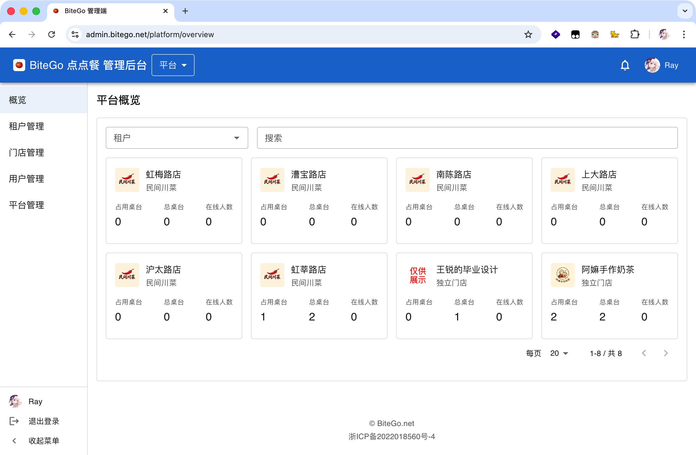
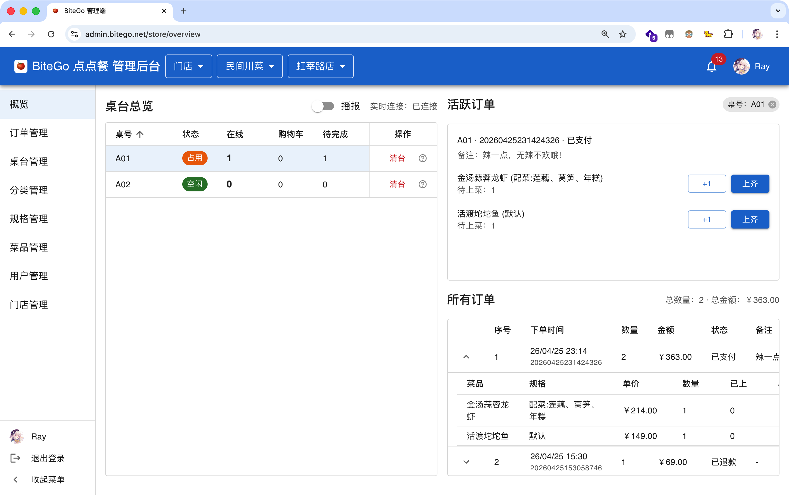
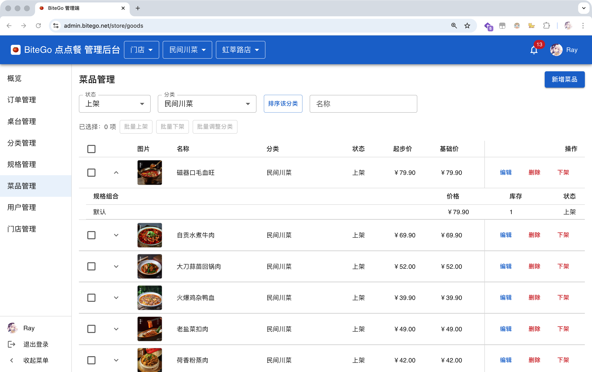
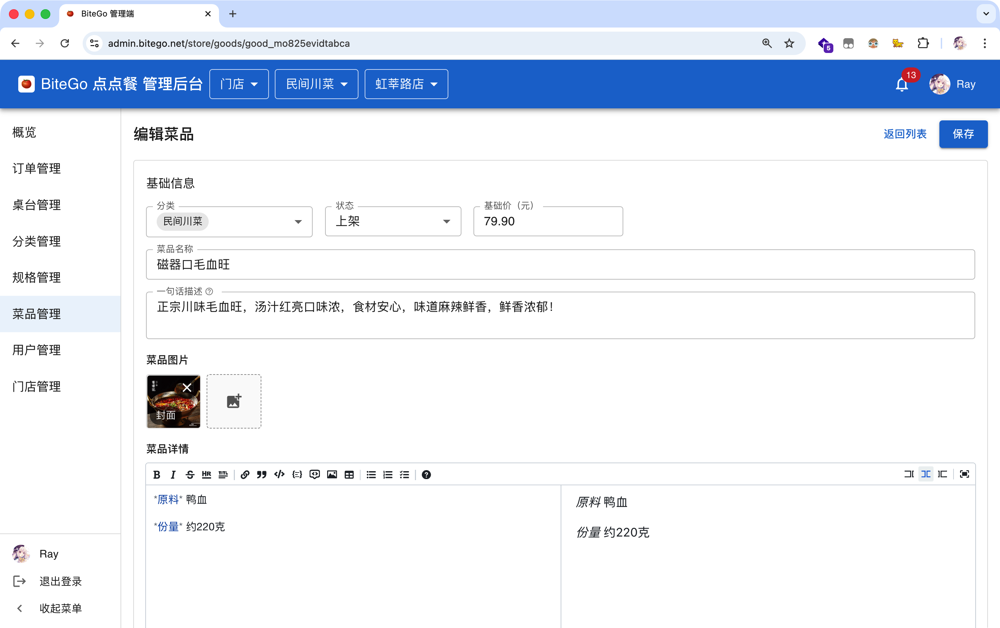
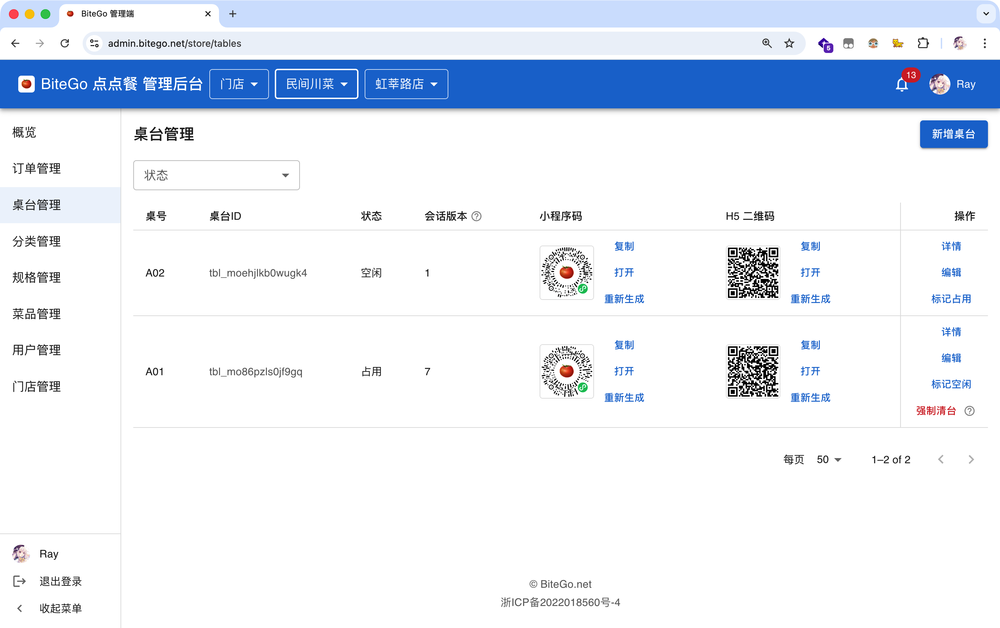
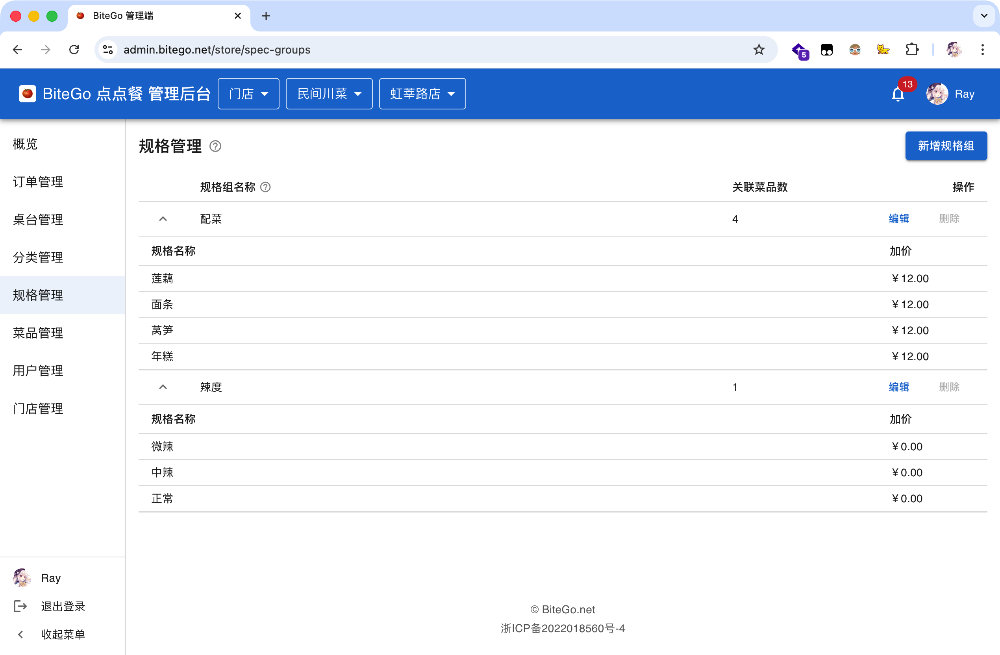

# BiteGo Web 管理端

> React 18 + TypeScript 5 + Vite 5 + Material UI · 平台 / 租户 / 门店三视角动态切换的单页应用，承担 BiteGo 后台运营的全部交互。

回到顶层 README → [`../../README.md`](../../README.md)

---

## 1. 界面一览

<table>
  <tr>
    <td align="center" width="50%">
      
      <sub><b>平台概览</b> · 全平台门店实时运营卡片</sub>
    </td>
    <td align="center" width="50%">
      
      <sub><b>门店概览</b> · 桌台总览 + 活跃订单 + 全量订单</sub>
    </td>
  </tr>
  <tr>
    <td align="center" width="50%">
      
      <sub><b>菜品管理</b> · 列表 + SKU 行展开</sub>
    </td>
    <td align="center" width="50%">
      
      <sub><b>编辑菜品</b> · 基础信息 + Markdown 详情双栏</sub>
    </td>
  </tr>
  <tr>
    <td align="center" width="50%">
      
      <sub><b>桌台管理</b> · 小程序码 + H5 二维码 + 强制清台</sub>
    </td>
    <td align="center" width="50%">
      
      <sub><b>规格管理</b> · 折叠卡片 + 选项加价</sub>
    </td>
  </tr>
</table>

## 2. 三视角动态切换

| 视角     | 角色                                   | 主要面板                                                      |
| -------- | -------------------------------------- | ------------------------------------------------------------- |
| **平台** | `SUPER_ADMIN`                          | 平台概览 / 租户管理 / 跨租户门店管理 / 平台搬家与维护态       |
| **租户** | `TENANT_ADMIN`                         | 连锁概览 / 租户内门店 / 共享菜单维护（仅 `CHAIN` 显示）       |
| **门店** | `STORE_ADMIN` 或 `TENANT_ADMIN`@SINGLE | 门店概览 / 订单 / 桌台 / 分类 / 规格 / 菜品 / 用户 / 门店设置 |

登录后调用 `GET /api/v1/admin/me/scopes` 拉取当前账号所有 `AdminScope`，再以 `getAdminCapabilities({ scopes, tenantId, storeId, tenantType, storeIsPrimary })` 派生出 `role` / `canAccessPlatform / Tenant / Store` / `canManageSharedCatalog` 等能力位，菜单渲染、按钮禁用、路由可见性三处共用同一份计算结果。

## 3. 技术栈

| 关注点     | 选型                                  | 备注                                                                                                               |
| ---------- | ------------------------------------- | ------------------------------------------------------------------------------------------------------------------ |
| 构建       | Vite 5                                | 冷启动 ~1s、热更新毫秒级                                                                                           |
| UI         | Material UI（MUI）                    | DataGrid / Drawer / Dialog 三件套覆盖 90% 后台场景                                                                 |
| 路由       | React Router v6 `createBrowserRouter` | `<RequireAuth />` + `<BasicLayout />` 守卫                                                                         |
| 服务端数据 | TanStack Query                        | `queryKey: ['goods', { board, tenantId, storeId, ...filters }]`，上下文切换时按前缀整体清缓存                      |
| 客户端状态 | Zustand                               | `authStore` / `adminContextStore` / `notificationStore` 各一职                                                     |
| 网络       | Axios                                 | 请求拦截注 `Authorization` + `X-Board` / `X-Tenant-Id` / `X-Store-Id`；响应拦截统一处理 401（登出）/ 503（维护态） |
| 单测       | Vitest + Testing Library              | 20 文件 / 40 用例                                                                                                  |
| E2E        | Playwright (Chromium)                 | `yarn test:e2e`，CI 自动安装 Chromium                                                                              |

## 4. 快速开始

### 4.1 安装依赖

```bash
cd projects/web-admin
yarn install
```

### 4.2 配置后端地址

```bash
export VITE_API_BASE_URL=http://127.0.0.1:3000/api/v1
```

> 生产 API：`https://api.bitego.net/api/v1`

### 4.3 启动开发服务器

```bash
yarn dev   # → http://127.0.0.1:5173/
```

首次进入跳 `/login`，使用后端 `auth/dev-token` 接口取一枚 ADMIN 令牌粘贴即可。

## 5. 构建与部署

```bash
yarn build      # 产物在 dist/
yarn preview    # 本地预览 dist/
```

部署形态：`dist/` 推到腾讯云 COS，再触发 CDN 目录刷新，由 GitHub Actions 自动完成。详见 [`docs/8-CI-CD与容器镜像发布.md`](../../docs/8-CI-CD与容器镜像发布.md)。

## 6. 质量门禁

```bash
yarn typecheck       # tsc --noEmit
yarn lint            # ESLint
yarn test            # Vitest
yarn test:coverage
yarn test:e2e        # Playwright（自动起 dev server）
```

CI 同时跑这三步，全部通过才会进入 CD。

## 7. 目录结构

```
src/
├── api/                        # Axios 客户端 + DTO 类型（types.ts）
├── authz/
│   └── adminAuthz.ts           # 客户端能力计算（与服务端对齐）
├── components/
│   ├── common/                 # 原子组件（按钮、图标、输入封装）
│   └── business/               # 业务组件（SpecGroupEditor / AddMemberDialog / UserDetailDrawer / AdminContextSwitcher）
├── pages/
│   ├── platform/               # 平台视角
│   ├── tenant/                 # 租户视角
│   ├── store/                  # 门店视角
│   ├── dashboard/              # 概览看板
│   └── auth/                   # 登录
├── router/
│   └── index.tsx               # createBrowserRouter + RequireAuth + BasicLayout
├── store/                      # Zustand stores
├── hooks/                      # 自定义 Hook（含 useTableSession / useAdminCapabilities）
└── theme/                      # MUI 主题
```

## 8. 关键功能模块

- **概览看板**：`WS /ws/admin-dashboard` 订阅 `DASHBOARD_OVERVIEW_SNAPSHOT` 与 `TABLE_CONN_COUNTS`，200ms 合并渲染；不可用时降级为 3s `GET /api/v1/dashboard/overview` 轮询。
- **菜品 / 规格 / SKU 编辑**：`SpecGroupEditor` 三档单选区分库存 / 非库存 / 共享非库存规格组；结构性变更触发服务端 SKU 破坏性重建，前端弹二次确认 + 进度条遮罩。
- **多租户上下文切换**：「状态 → 缓存 → 连接 → 路由」四步原子流程，杜绝跨租户数据闪现。
- **通知中心**：顶部铃铛 + 可选语音播报，`NOTIFICATION` 事件按当前面板严格过滤；不可用时降级为 5s 轮询未读数。

详细实现见 [`docs/5.1-Web管理端前端技术文档.md`](../../docs/5.1-Web管理端前端技术文档.md)。

## 9. 接口契约

- 路径前缀：`/api/v1/`
- 上下文头：`X-Tenant-Id` / `X-Store-Id` / `X-Board`
- 全部响应：`{ code, message, data }`
- 完整规范：[`docs/6-接口与数据库设计规范.md`](../../docs/6-接口与数据库设计规范.md)
